[toc]

# 第〇章  考试大纲

主要测查报考者运用语言文字进行思考和交流、迅速准确地理解和把握文字材料内涵的能力。包括

- 根据材料查找主要信息及重要细节；
- 正确理解阅读材料中指定词语、语句的含义；
- 概括归纳阅读材料的中心、主旨；
- 判断新组成的语句与阅读材料原意是否一致；
- 根据上下文内容合理推断阅读材料中的隐含信息；
- 判断作者的态度、意图、倾向、目的；准确、得体地遣词用字等。

# 第一章  片段阅读

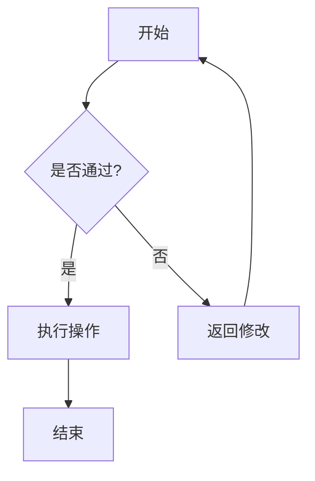

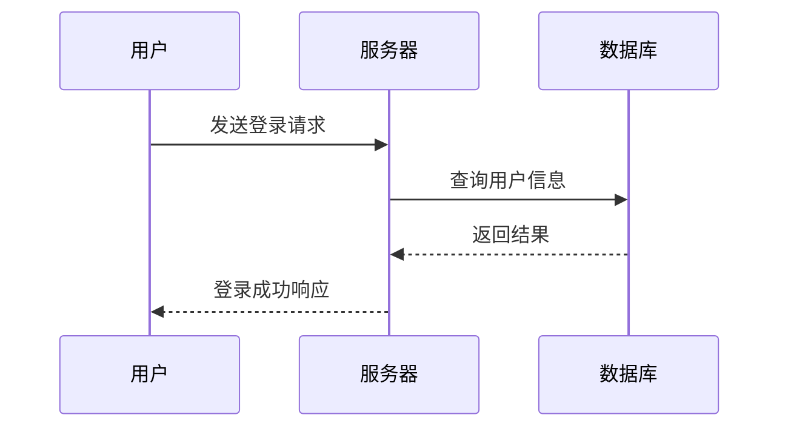

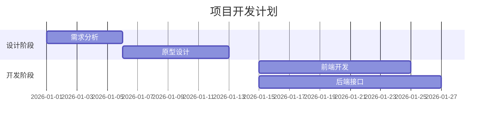

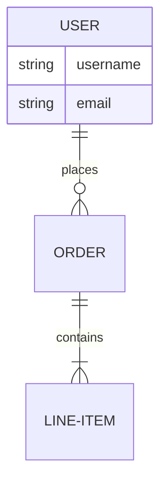

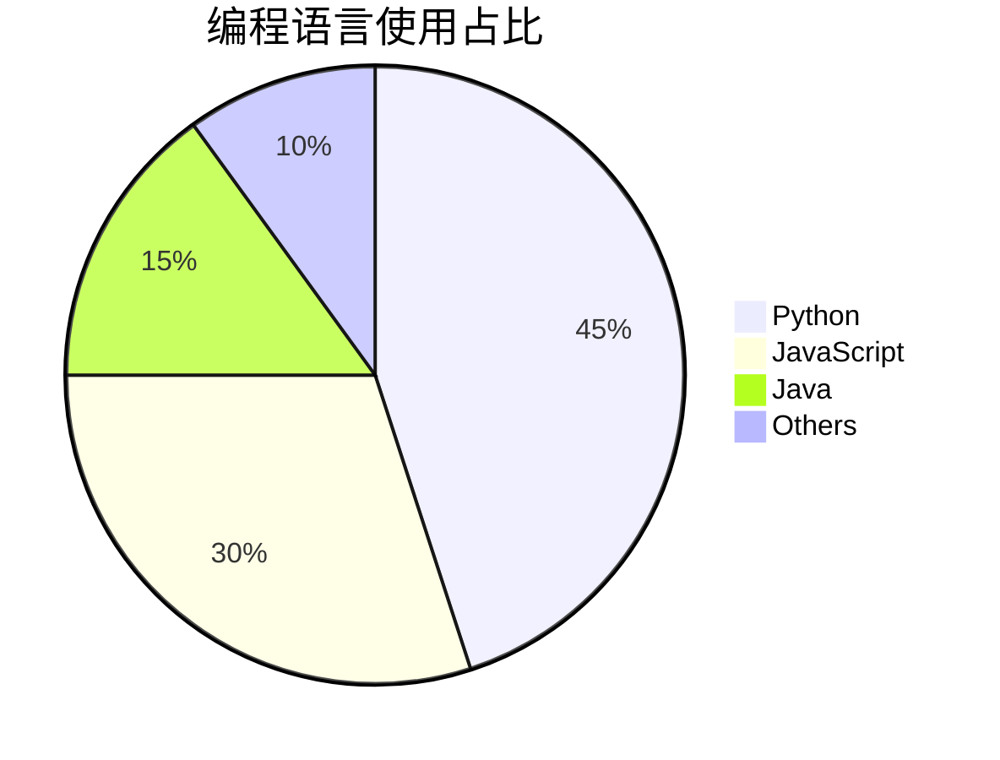

## 第一节  中心理解题

**1.解题顺序**

提问——文段——选项

忠于文段，对比择优——文段选项结合看

**2.提问方式：**

这段文字主要/旨在/重在/意在/想要说明（论述/强调）的是……
这段文字的主旨/主题/观点是……
对这段文字概括最恰当的是……
这段文字表达了作者……
从这段文字中我们可以看出作者的意图/态度是……

**3.解题思路：找重点（中心）**

（1）直接确定重点

- 逻辑层面之关联词：转折、因果、并列、必要条件。关联词可提示重点。 
- 内容层面之主题词（文段的核心话题）。

（2）间接确定重点

可能直接找重点不好判断，可间接确定重点，把非重点排除掉，剩下的就是中心、重点。

### 一、直接确定重点

#### 逻辑层面之关联词

##### （一 ）转折关系

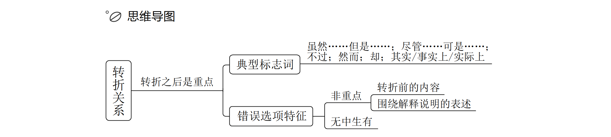

1.标志词

​	虽然……但是……；尽管……可是……；
​	……不过……；……然而……；
​	……却……；
​	其实/事实上/实际上
​	……

2.理论要点：转折之后是重点。

3.技巧点拨

大多数情况下，转折之后的内容，是对转折之前的否定，故把握前后语义相反原则，可快速解题。

适用类型：

① 转折之后的内容较长，不好概括；
② 转折之后的内容相对晦涩，无法理解。

4.转折题目中，四个选项没有单独概括转折之后的内容，此时将转折前后全面概括的选项即为正确答案。

5.正确答案特征：中心句的同义替换。

6.错误选项特征：

- 若选项只出现转折前的内容，一般不是重点。
- 围绕解释说明的表述：如选项对应例子、原因分析，非重点，说得再对也要排除。
- 无中生有：忠于文段，文段未提及的选项不能选。
- 与文意相悖。

##### （二 ）因果关系

1.典型格式：因为……所以……、由于……因此……。“因为”“由于”引导原因，“所以”“因此”引导结论，相当于作者的观点。

2.理论要点：结论是重点。

3.结论的标志词：

（1）所以、因此、因而、故而、故。
（2）于是、可见/看来（相当于“所以/因此”）。

4.变形考法：如前文有一大段内容，最后出现“对此/简言之”，对前文进行总结，与“因此/所以”的功能一样。
（1）指代词（指代总结）：在这种情况下、对此、有鉴于此（“鉴”即借鉴，往往前文有问题、失败的教训，有鉴于此，我们应该如何做）。
（2）总之、可以说、简而言之、换言之、换句话说等。出现在结尾相当于在概括、总结，有同学写英语作文时会用“in a word”“in another word”。

> 若尾句出现结论词，大部分情况下是对前文的总结，尾句通常为文段的中心句。

5.结论句出现在文段开头/中间，之后仍有其他语句：

（1）之后的语句是进一步解释说明，解释说明不重要，此时中心句仍为结论句。
（2）之后又出现并列、因果、转折，需结合多种关联词共同分析。

6.选项新宠——因果结构。

（1）文段结构：结论+原因解释/原因分析+结论。
（2）正确选项设置：为什么、为何、何以……；解释/揭示/阐述……的原因/缘由。

7.因果常考结构：

（1）引入+尾句得出结论。
（2）引入+结论+解释说明：解释说明不重要，结论是重点。
（3）引入+结论+转折+（解释说明）：重点在转折。
（4）引入+结论+同时：将前后的内容全面概括。

8.粉笔提示：

（1）引入、解释说明（例子、原因）部分可略读。
（2）引入/解释说明中的关联词不重要。

#### 内容层面之主题词

1.主题词的定义：文段围绕的核心话题，文段要围绕其展开。

2.判断方法：

（1）中心句围绕的核心话题，一般前有引入或后有解释说明；

（2）每句话都围绕的相同话题。

3.解题方法：正确答案需包含文段主题词。

4.主题词变形

（1）内容同义替换；

（2）形象表达加工。

##### （三）必要条件关系

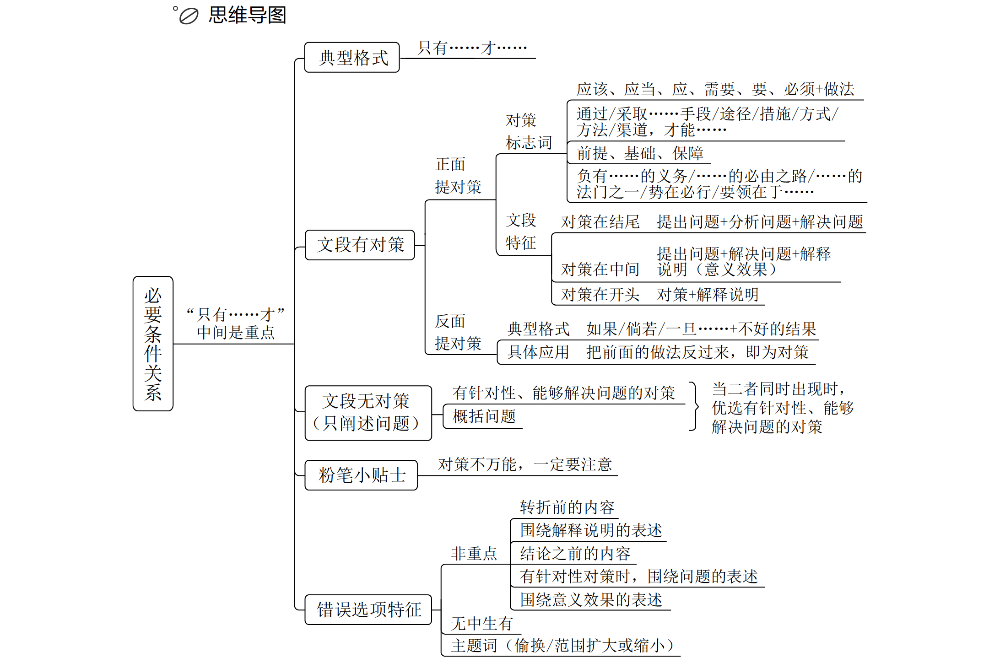

1.典型格式：只有 A 才 B。

2.解题方法：

（1）必要条件是重点；

（2）必要条件即“只有”和“才”之间的部分。

3.对策常考，很重要

> 1.对策标志词：
>
> （1）应该、应当、应、需要、要、必须 + 做法
>
> （2）通过 / 采取……手段 / 途径 / 措施 / 方式 / 方法 / 渠道，才能……
>
> （3）前提、基础、保障
>
> （4）负有……的义务 /……的必由之路 /……的法门之一 /势在必行/要领在于……
>
> 2.文段特征：
>
> （1）对策在结尾：提出问题+分析问题+解决问题；
>
> （2）对策在中间：提出问题+解决问题+解释说明（意义效果）；
>
> （3）对策在开头：对策+解释说明。
>
> 问题标志词：挑战、瓶颈、软肋、难题、滞后、不足、缺陷、风险等

4.反面提对策

（1）典型格式：如果 / 倘若 / 一旦……+ 不好的结果；

（2）具体应用：把前面的做法反过来，即为对策。

5.文段无对策，只阐述问题

（1）选项特征：

- 有针对性、能够解决问题的对策；
- 概括问题。

（2）干扰项往往是无效对策：

- 主题词错误。
- 对策解决不了问题。

##### （四）并列关系

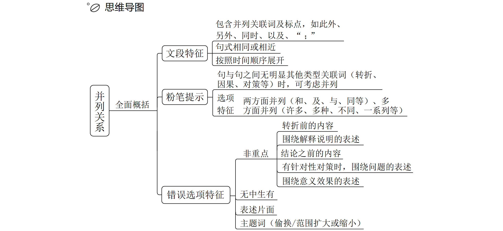

1.文段特征：

（1）出现典型的并列关联词，要足够敏感：此外、另外、同时、以及、也、还、“；”；

（2）句式相同或相近：领导人讲话常用到句式一致、排比句式；

（3）按照时间顺序展开。

2.解题方法：全面概括。

3.文段特征：

（1）包含并列关联词及标点，如此外、另外、同时、以及、“ ；”

（2）句式相同或相近

（3）按照时间顺序展开

4.错误选项特征：

（1）主题词错误的选项；

（2）表述片面的选项。

5.选项特征

（1）正确答案形象化表达；

对正确答案进行加工，选项可能会出现比喻、拟人、网络词汇等。

6.特殊情况分析

（1）句与句之间无明显其他类型关联词（转折、因果、对策等）时，可考虑并列

（2）选项特征：两方面并列（和、及、与、同等）、多方面并列（许多、多种、不同、一系列等）

### 二、间接确定重点

1.解题策略：

如果中心句明确，后文的解释说明可以略读，找准中心句，同义替换，锁定答案；
如果只看中心句很纠结，如纠结 选项，往后看解释说明，解释说明论证。

（1）从读题的角度：分述句部分可快速阅读（分述句里的关联词不重要）；

（2）从选项排除的角度：围绕分述句的选项是干扰项，要排除。

2.分述句特征：

（1）举例说明：“比如”“例如”“……就是例证”等例子表述。例子不重要，应找例子之前的观点；

（2）数据资料：数字、数据、资料相当于例子，起论证作用；

（3）多角度论述：

- 并列分述：观点后出现并列论述；

  文段提出观点之后可以进行原因解释（如“读书很重要，读书可以提升修养，对工作也很有帮助”），还可以从个人的角度、企业的角度、国家的角度展开说明；

- 正反论证：对前文观点进行正反两方面的解释；

（4）背景铺垫（开头）：近年来、随着、历史上、在……的进程中……；

（5）定义介绍：是、就是、——、内涵……；

（6）现状描述：当下、目前、现如今、取得……成就/成绩；

（7）问题引入：负面表述、消极现象等不好的内容。

## 第二节  细节判断题

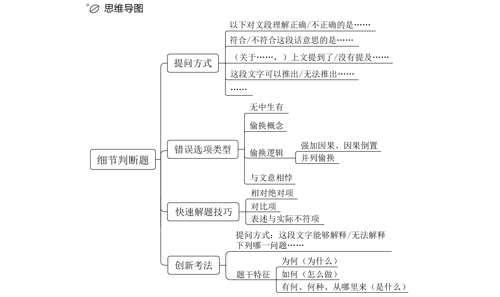

1.提问方式

以下对文段理解正确/不正确的是……
符合/不符合这段话意思的是……
（关于……，）上文提到了/没有提及……
这段文字可以推出/无法推出……
……

2.做题顺序建议：

（1）从文段特征看：

- 文段晦涩难懂：建议先看选项，再回到文段做比；
- 对文段通俗易懂：可以先读文段，再看选项。

（2）从选项特征看：

- 选项特征明显，可以先从选项入手，定位选项的关键词去对比。
- 易定位特征：
  - “三字一号”：数字、名字、字母、标点符号；
  - 核心名词：
    孤雌生殖或依赖雌性特有化学信号；
    使用超材料能够反弹雷达波。

3.错误选项类型：

（1）无中生有；

（2）偷换概念；

（3）偷换逻辑（强加因果/因果倒置、并列偷换）。

- 文段：A 同时 B  选项：因为 A 所以 B；
- 文段：A 导致 B  选项：B 导致 A；
- 文段：A 与 B 同样重要  选项：A 是主体/ B 是核心。

（4）与文意相悖。

4.快速解题技巧

选非题，优先验证绝对项、对比项、与实际不符项；
选是题，优先验证相对温和的表述。

（1）相对绝对项

- 绝对表述：一定、必定、都、最、唯一、决定、永远等；
- 相对表述：可能、也许、往往、大概、……之一等。

（2）对比项

标志词：A高于/优于B；利大于弊；A比B更……

（3）表述与实际不符项

举个小例：小张自认为腿长，二舅腿特长。

5.细节判断题—创新考法：

（1）提问方式：这段文字能够解释/无法解释下列哪一问题……

（2）题干特征：

- 为何（为什么）；
- 如何（怎么做）；
- 有何、何种、从哪里来（是什么）。

# 第二章  语句表达

## 第一节  接语选择题

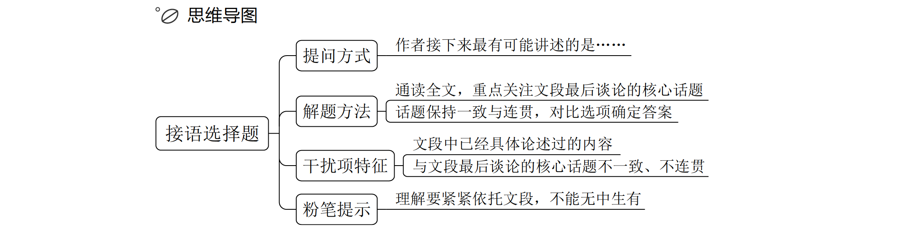

【提问方式】
作者接下来最有可能讲述的是……
解题方法：
1.通读全文，重点关注文段最后谈论的核心话题
2.话题保持一致与连贯，对比选项确定答案
干扰项特征：
1.文段中已经具体论述过的内容
2.与文段最后谈论的核心话题不一致、不连贯

## 第二节  语句填空题

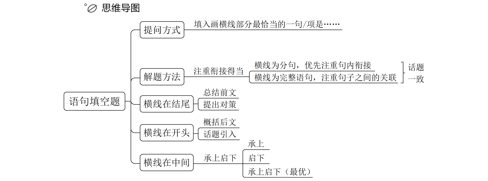

【提问方式】
填入画横线部分最恰当的一句 / 项是……
解题方法：
注重衔接得当：
（1）横线为分句，优先注重句内衔接
（2）横线为完整语句，注重句子之间的关联
横线在结尾：
1. 总结前文
2. 提出对策

横线在开头：
1. 概括后文
2. 话题引入

横线在中间：承上启下

## 第三节  语句排序题

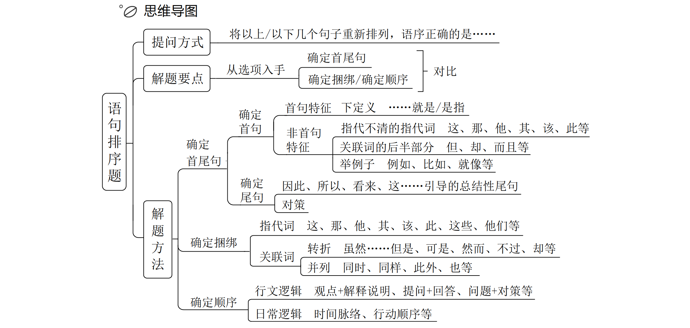

【提问方式】
将以上 / 以下几个句子重新排列，语序正确的是……
解题方法：
1.根据选项提示，对比后确定首尾句
2.确定捆绑 / 确定顺序
3.验证（只验证你基本锁定的答案，而非全部选项）

### 一、确定首尾句

#### （一）首句特征一下定义（……就是/是指）

#### （二）非首句特征（指代不清的指代词、关联词的后半部分、举例子）

#### （三）尾句特征（总结性尾句、对策类尾句）

### 二、确定捆绑

#### （一）指代词捆绑

#### （二）关联词捆绑

### 三、确定顺序

#### （一 ）行文逻辑

#### （二）日常逻辑

# 第三章  逻辑填空

## 第一节 词的辨析

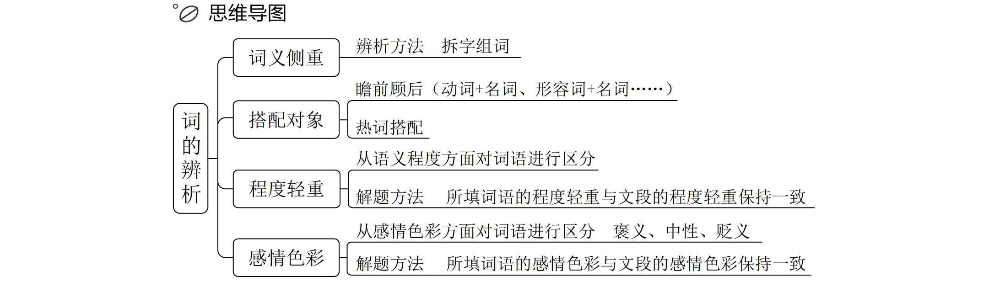

### 一、词义侧重

辨析方法：

（1）用不一样的字组词；

（2）整词进行固定搭配。

### 二、搭配对象

解题方法：

（1）瞻前顾后（动词+名词、形容词+名词……）

（2）热词搭配

### 三、程度轻重

从语义程度方面对词语进行区分

解题方法：所填词语的程度轻重与文段的程度轻重保持一致

### 四、感情色彩

从感情色彩方面对词语进行区分
解题方法：

1.褒义、中性、贬义

2.所填词语的感情色彩与文段的感情色彩保持一致

## 第二节  语境分析

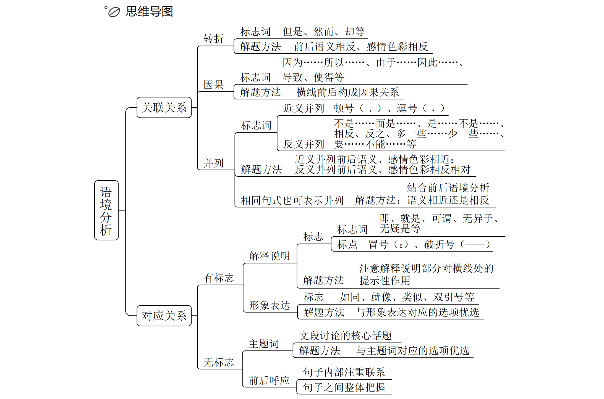

### 一、关联关系

#### （一）转折关系

标志词：但是、然而、却等
解题方法：前后语义相反，感情色彩相反

#### （二）因果关系

标志词：因为……所以……、由于……因此……、导致、使得等
解题方法：横线前后构成因果关系

#### （三）并列关系

解题方法：

1.近义并列：顿号（、）、逗号（，）
解题方法：近义并列前后语义、感情色彩相近

2.反义并列：不是……而是……、是……不是……、相反、反之、多一些……少
一些……、要……不能……等
解题方法：反义并列前后语义、感情色彩相反相对

3.相同句式也可表示并列，要结合前后语境分析语义是相近还是相反

### 二、对应关系

#### （一）有标志对应

1.解释说明
标志词：即、就是、可谓、无异于、无疑是等
标点：冒号（：）、破折号（——）
解题方法：注意解释说明部分对横线处的提示性作用

2.形象表达
标志：如同、就像、类似、双引号等
解题方法：与形象表达对应的选项优选

#### （二）无标志对应

1.主题词
文段讨论的核心话题
解题方法：与主题词对应的选项优选

2.前后呼应
句子内部注重联系
句子之间整体把握
