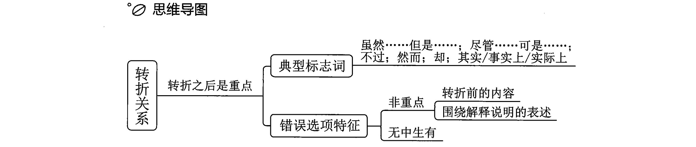
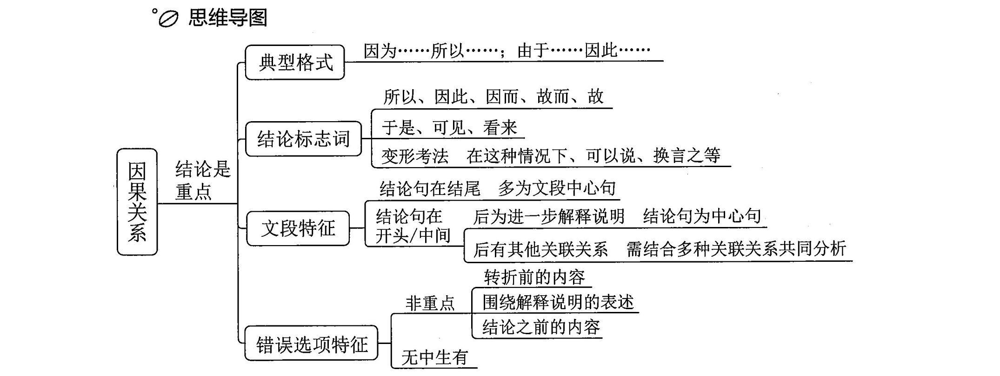

# 第一章  片段阅读

备考三点提示：

1.阅读理解是根本，不要过分迷恋技巧；
2.听课刷题重质量，不要单纯追求数量；
3.速度正确率兼顾，不要过分追求难题。

听课提醒：

1.提前预习，听课更有针对性；
2.明确重点，掌握思维和方法；

## 第一节  中心理解题

**1.解题顺序**

提问——文段——选项

忠于文段，对比择优——文段选项结合看

**2.提问方式：**

这段文字主要/旨在/重在/意在/想要说明（论述/强调）的是……
这段文字的主旨/主题/观点是……
对这段文字概括最恰当的是……
这段文字表达了作者……
从这段文字中我们可以看出作者的意图/态度是……

**3.解题思路：找重点（中心）**

（1）直接确定重点

- 逻辑层面之关联词：转折、因果、并列、必要条件。关联词可提示重点。 

- 内容层面之主题词（文段的核心话题）。

（2）间接确定重点

可能直接找重点不好判断，可间接确定重点，把非重点排除掉，剩下的就是中心、重点。

### 一、逻辑层面之关联词 

#### 1.转折关系：

1.标志词

​	虽然……但是……；尽管……可是……；
​	……不过……；……然而……；
​	……却……；
​	其实/事实上/实际上
​	……

2.理论要点：转折之后是重点。

3.技巧点拨

大多数情况下，转折之后的内容，是对转折之前的否定，故把握前后语义相反原则，可快速解题。

适用类型：

① 转折之后的内容较长，不好概括；
② 转折之后的内容相对晦涩，无法理解。

4.转折题目中，四个选项没有单独概括转折之后的内容，此时将转折前后全面概括的选项即为正确答案。

5.正确答案特征：中心句的同义替换。

6.错误选项特征：

- 若选项只出现转折前的内容，一般不是重点。

- 围绕解释说明的表述：如选项对应例子、原因分析，非重点，说得再对也要排除。

- 无中生有：忠于文段，文段未提及的选项不能选。

- 与文意相悖。

#### 2.因果关系

1.典型格式：因为……所以……、由于……因此……。“因为”“由于”引导原因，“所以”“因此”引导结论，相当于作者的观点。

2.理论要点：结论是重点。

3.结论的标志词：

（1）所以、因此、因而、故而、故。
（2）于是、可见/看来（相当于“所以/因此”）。

4.变形考法：如前文有一大段内容，最后出现“对此/简言之”，对前文进行总结，与“因此/所以”的功能一样。
（1）指代词（指代总结）：在这种情况下、对此、有鉴于此（“鉴”即借鉴，往往前文有问题、失败的教训，有鉴于此，我们应该如何做）。
（2）总之、可以说、简而言之、换言之、换句话说等。出现在结尾相当于在概括、总结，有同学写英语作文时会用“in a word”“in another word”。

> 若尾句出现结论词，大部分情况下是对前文的总结，尾句通常为文段的中心句。

5.结论句出现在文段开头/中间，之后仍有其他语句：

（1）之后的语句是进一步解释说明，解释说明不重要，此时中心句仍为结论句。
（2）之后又出现并列、因果、转折，需结合多种关联词共同分析。

6.选项新宠——因果结构。

（1）文段结构：结论+原因解释/原因分析+结论。
（2）正确选项设置：为什么、为何、何以……；解释/揭示/阐述……的原因/缘由。

7.因果常考结构：

（1）引入+尾句得出结论。
（2）引入+结论+解释说明：解释说明不重要，结论是重点。
（3）引入+结论+转折+（解释说明）：重点在转折。
（4）引入+结论+同时：将前后的内容全面概括。

8.粉笔提示：

（1）引入、解释说明（例子、原因）部分可略读。
（2）引入/解释说明中的关联词不重要。

# 精讲精炼-言语2_笔记
-- 以下为AI生成的文稿笔记内容 --
### 一、课程介绍
#### 1.课程基本信息
本课程为精讲精练阶段言语模块的第二节课。建议保持听课连贯性，若未参与前序课程，需及时补课以确保学习效果。
### 二、中心理解题解题思路
00:31
#### 1.直接确定重点
中心理解题解题步骤如下：
- 审读题干明确题型
- 分析文段定位重点或中心
- 通过逻辑关联词（如转折、因果）或内容主题词直接确定核心内容
##### 1) 逻辑层面关联词
00:53
直接确定重点的两种方法：
- 逻辑关联词：转折关系（如“但是”）、因果关系（如“因此”）
- 主题词：文段的核心话题
#### 2.间接确定重点
01:15
当直接判断重点困难时，可采用排除非重点内容的方式定位中心。
##### 1) 排除非重点方法
01:22
排除非重点的典型结构：
- 开头为背景引入（非重点）
- 中间出现不确定句子
- 结尾出现举例说明（非重点）结论：中间部分通常为文段重点
### 三、本节课学习重点
01:54
#### 1.主题词应用
本节课程重点内容：
- 主题词的解题应用
- 必要条件关系的关联词与重点定位
- 对策提出的标志词与文段特征
### 四、主题词详解
02:27
#### 1.主题词定义
主题词指文段的核心话题，贯穿全文论述内容，其作用类似于“C位”（中心位置）。
#### 2.主题词判断方法
03:20
主题词判断需结合文段结构：
- 有中心句：中心句的核心话题即为主题词
- 无中心句：高频出现的名词性话题通常为主题词
##### 1) 中心句核心话题
03:40
中心句定位示例：
- 背景引入（非重点）
- 转折后提出问题（非重点）
- “需要”引导对策（重点）
- 举例说明（非重点）结论：中心句核心话题为“集体经济组织”
##### 2) 高频相同话题
06:06
并列文段主题词判断：
- 高频重复的名词（如“乡愁”）
- 代词指代需结合前文（如“她”指代“姑娘”）注意事项：非重点部分的高频词（如举例中的词汇）不可直接作为主题词
### 五、例题解析
10:41
#### 1.例题:2024国考村落题
10:47
解题步骤：
- 首段引入“村落”话题，说明其历史信息隐含性
- “必须”引导对策，强调“田野调查”为核心方式
- 排除未提及“田野调查”的选项（A、B、C）关键点：
- 程度词“最重要”突出“田野调查”的优先级
- “艺术乡建”中的“乡”即指“村落”，与主题词一致
#### 2.例题:2025广西水墨题
17:59
- 文段开头引出水墨话题，通过定义方式强调其作为重要象征的独特性。
- 话题转向当代水墨，指出其与传统绘画的区别在于更贴近时代特征。
- 核心话题最终聚焦于当代水墨艺术家，后文围绕其创作特点展开：
    - 注重反映当下人的生存状态
    - 作品形成独特表现方式
- 选项分析：
    - 正确选项C精准对应"当代水墨艺术家"主题词
    - 干扰项排除依据：
        - A项讨论传统与当代水墨差异（未涉及艺术家）
        - B项强调水墨本身地位（偏离核心话题）
        - D项描述水墨艺术特征（未关联人物主体）
#### 3.例题:2025国考定向能武器题
20:35
|   |   |   |
|---|---|---|
|要素|内容要点|关联分析|
|定义引入|定向能武器的基本概念|开篇明确讨论对象|
|应用场景|针对低空无人机蜂群的拦截|重点说明其应对目标特征|
|技术优势|通过协同配合形成拦截网|对比普通防空系统缺陷|
|实战效果|快速杀伤无人机蜂群|代词"其"始终指向核心目标|
|选项验证|B项"无人机蜂群"为唯一精准匹配主题词|A项范围过宽，C/D项缺失关键要素|
#### 4.例题:2025浙江孤独症题
24:44
- 研究背景：孤独症儿童排斥眼神接触的特征可作为预判指标。
- 技术手段：采用眼动追踪技术对幼儿群体进行观测实验，量化社交线索遗漏程度。
- 应用价值：
    - 实现孤独症早期诊断
    - 评估病情严重程度
    - 为及时干预提供依据
- 选项筛选：
    - C项完整涵盖"眼动追踪技术"与"孤独症幼儿"双主题词
    - 典型干扰项特征：
        - A/B项缺失技术要素
        - D项"量化观察"脱离孤独症诊断语境
#### 5.例题:2025四川书信题
28:26
- 核心关系：书信与历史人物的双重关联性
    - 情感载体：反映人物个性特征与情感世界
    - 史料价值：呈现比官方史籍更真实的生命状态
- 文段结构：
    - 首句通过"最能"强调书信的史料独特性
    - 后续通过"并且""透过"多维度补充论证
- 选项匹配：
    - C项"历史人物"精准对应代词指向
    - 干扰项通病：将"历史人物"泛化为"历史"概念
#### 6.例题:2025江苏蛭石题
31:46
- 基础属性：蛭石因保温性能成为建筑优选材料，微观结构经高温处理后形成保温空间。
- 核心优势（"更重要的是"转折强调）：
    - 生态友好：生产污染极小
    - 循环利用：废弃后可回收
    - 符合建筑领域可持续发展理念
- 标题选择标准：
    - D项"绿色节能"完整涵盖保温（节能）与环保（绿色）双重特性
    - 典型错误标题：
        - B/C项用"神奇""真面貌"等模糊表述偏离实质
        - A项仅反映次要特征
#### 7.例题:2025安徽四时观念题
38:25
- 历史早期季节体系的发展演变与农事周期之间存在紧密关联
- 殷商及其以前的二时观念围绕种植素薯等农作物的农事活动产生
- 殷商以来冬小麦的推广种植推动了先秦时期四时观念的萌生和演进
- 四时观念的产生基于对既有二时观念的细化
- 冬小麦的推广种植及其在农业生产中的重要地位成为细化二时观念为四时观念的契机
- 选项分析：
    - A项未提及四时观念或冬小麦，排除
    - B项仅提及先秦四时观念，未涉及冬小麦，片面
    - C项仅提及冬小麦推广种植，未涉及四时观念，片面
    - D项同时涵盖四时观念与冬小麦推广种植，符合文段核心
#### 8.例题:2025浙江体育文化题
44:44
- 体育文化是我国传统文化的重要组成部分
- 数字科技为体育文化传承发展提供新平台
    - 数字设备应用于体育赛事，通过云数据平台宣传，丰富赛事文化内涵
    - 数字体育通过技术创新推出数字化体育文化产品，普及体育运动
- 选项分析：
    - A项（数字技术赋能体育文化繁荣）同时涵盖数字技术与体育文化，全面
    - B项（数字体育推动体育产业发展）混淆"体育文化"与"体育产业"，排除
    - C项（体育文化普及全民体育运动）未提及数字技术，片面
    - D项（数字技术助力体育传播）未体现"文化"核心，排除
- 关键辨析：
    - 体育文化与体育产业分属文化、经济领域，不可等同
    - 传承发展强调时间延续，传播侧重空间扩散，概念差异需注意
### 六、主题词变形
01:00:06
#### 1.内容同义替换
01:00:12
- 主题词判断方法：文段有中心句时需把握核心话题，无中心句时需抓取高频出现的相同话题，部分题目可能通过代词指代主题词。
- 干扰选项特征：正确答案需包含文段主题词，干扰选项通常通过偷换主题词或扩大/缩小范围设置陷阱；若文段含两个主题词，干扰选项会呈现片面表述。
#### 2.形象表达加工
01:00:50
- 主题词数量规律：文段通常围绕1-2个主题词展开，三个及以上主题词概率较低，因话题分散不符合考试或实际工作场景需求。
- 解题口诀：单一主题词需找准，双主题词需概括全面，例如体育文化与数字技术题目需同时涵盖两个主题词。
### 七、必要条件关系
01:02:36
#### 1.典型格式
- 必要条件引导词：“只有A才B”为言语考查重点，重点位于“只有”与“才”之间的部分（即A部分）。
- 省略变形：若省略“只有”，如“经历风雨方能见彩虹”，“方”等同于“才”，重点仍在前半部分（风雨）。
#### 2.例题:2025安徽上门经济题
01:04:26
- 解题步骤：
    - 选项对比：选项结构一致时，对比差异部分（如“规范有序”“并非只有红利”等）。
    - 文段分析：开头引入上门经济现象，转折后指出问题（维权难等），尾句通过“只有立规矩方能行稳致远”强调规范引导为核心对策。
    - 干扰项排除：B项对应问题非重点，C项为背景引入，D项表述宽泛未聚焦“规范”。
- 考点总结：必要条件句（只有才）引导文段重点，但真题中此类直接考点出现频率较低。
### 八、对策标志词
01:07:38
#### 1.情态动词类
- 标志词类型：“应该”“应当”“必须”“需要”等情态动词后接具体做法，如“要多读书”即对策表述。
- 功能类比：类似英语中“should/must”，强调必要性。
#### 2.手段途径类
01:09:59
- 标志词类型：“通过…手段/途径/措施”结构，如“通过听课刷题提升”，重点在“通过”后的方法。
#### 3.前提基础类
01:10:50
- 标志词类型：“前提”“基础”“保障”等词，如“努力是成功的前提”等价于“必须努力”。
#### 4.变形表达类
01:11:07
- 变形标志词：
    - “负有…义务”（如赡养父母义务）
    - “必由之路”（如发展是成功的必由之路）
    - “法门之一”（如听课刷题为成功法门）
    - “势在必行”“要领在于”（如因地制宜为村改居要领）
### 九、对策标志词
01:14:41
#### 1.对策行文脉络
01:14:44
##### 1) 提出问题分析问题解决问题
01:14:50
- 行文重点：“解决问题”部分为对策核心，前序问题提出与分析仅为铺垫，非选项重点。
##### 2) 提出问题解决问题解释说明
01:15:20
第二种类型是开头提出问题，中间给出解决问题的对策，接着进行解释说明或阐述对策带来的意义、效果、作用。重点在于解决问题的对策部分。例如：
- 当前公务员考试难度增加
- 应对策略包括听课、刷题、做好总结
- 阐述上岸后的优势（稳定工作、专业发挥、解决婚恋问题）后文的意义阐述仅用于加强前文对策的论证。若选项同时包含对策和意义概括，优先选择全面表述；若选项仅针对意义效果，则优选对策表述。
##### 3) 对策解释说明
01:17:24
第三种类型是开门见山提出对策，后文进行解释说明。核心内容为前文的对策部分。
#### 2.问题标志词
01:17:49
问题标志词通常表现为消极负面现象，例如：
- 挑战、瓶颈、软肋、难题
- 发展滞后、不足、缺陷、风险、麻烦此类表述用于明确文段提出的问题。
### 十、例题:青铜器研究对策题
01:19:06
#### 1.文段结构分析
01:19:11
解题步骤：
- 结合选项定位主题（青铜器）
- 略读无关引入部分（前三行未提及主题）
- 锁定对策句（尾句“需要运用多种研究方法”）干扰项分析：
- A项“研究领域广阔”（描述现状）
- C项“有益于”（强调作用）
- D项“重要价值”（强调价值）正确答案B项（“需要进一步研究”为对策表述）。
#### 2.解题思路
01:20:35
关键逻辑：
- 选项与文段主题一致性（青铜器）
- 尾句“需要”引导对策为重心
- 排除非对策选项（A、C、D均未涉及具体行动）
### 十一、例题:动物园管理对策题
01:29:56
解题要点：
- 尾句“亟待破译”提示对策紧迫性
- C项“有益于”侧重作用而非对策
- 需区分“挖掘”（行为）与“有益于”（结果）的表述差异
#### 1.文段结构分析
01:30:47
动物园的发展转型折射出人类对动物关系认知的变化。初始阶段动物园以满足人类好奇心为主要目的，随着生态意识增强，现代动物园更强调回归原生态环境，建立以动物为主体的家园模式。文段尾句通过"这意味着"进行总结，并提出管理理念转变的对策：取消动物表演、改善生存条件，实现动物尊严与自由的生活。
#### 2.解题思路
01:32:31
|   |   |   |
|---|---|---|
|选项|匹配分析|排除依据|
|A.经营管理理念转变|精准对应尾句对策|唯一提及"管理"核心话题|
|B.兼顾经济社会效益|偏离文段主旨|未体现动物主体性|
|C.了解大众消费心理|方向性错误|仍延续"以人为本"思路|
|D.生命教育园地|概念偷换|文段未出现相关表述|
解题关键：通过排除法锁定A项，重点把握"从满足人类需求到保障动物权益"的认知转变过程，尾段对策中"管理理念转变"为核心得分点。
### 十二、中心理解题变形问法
01:35:29
#### 1.展览前言主题
01:35:31
展览前言的核心功能是概括展示内容，其主题必须与正文保持高度一致性。在解题时，应将此类问法视为中心理解题的变体，直接提取文段核心观点作为答案。
#### 2.论文摘要标题
01:36:22
论文摘要的本质是研究内容的浓缩呈现，标题必须准确反映摘要的核心论点。解题时需注意：标题与摘要的匹配度是判断选项正确性的首要标准。
### 十三、例题:智慧治理技术融合题
01:37:01
#### 1.文段结构分析
01:37:34
- 背景引入：智慧治理时代的技术基础（大数据/物联网/云计算）
- 问题呈现：治理效率低下、安全隐患等现实困境
- 原因分析：理论认识不足/技术依赖过度等深层因素
- 对策提出：实现技术赋能向技术融合的范式转变
重点提示：尾句"需要"引导的对策中，"融合"出现三次形成高频词，"从...到..."句式强调转变后的新形态。
#### 2.解题思路
01:38:45
|   |   |   |
|---|---|---|
|选项特征|典型错误|正解要点|
|A.技术融合|完全匹配尾句重点|精准抓住"理念/过程/目标"三重融合|
|C.技术赋能|偷换核心概念|忽视"转变"的指向性|
|B/D项|聚焦问题非对策|偏离"需要"引导的解决方案|
核心技巧：遇到"从A到B转变"句式时，必须锁定B作为论述重点，命题常在前半部分设置干扰项。
### 十四、例题:胜诉权益兑现题
01:41:51
#### 1.文段结构分析
01:42:08
- 重要性阐述：胜诉权益兑现是司法公正的最终保障
- 价值论证：自动履职率提升的双重效益（减少执行程序/防止权力滥用）
- 对策体系：
    - 正向激励机制建设
    - 案件督促机制完善
    - 失信惩戒机制强化
    结构特征：采用"总-分-总"框架，尾段通过三个"建立"形成对策群，共同服务于提升自动履职率的核心目标。
#### 2.解题思路
01:43:27
|   |   |   |
|---|---|---|
|选项维度|关键区分|解题依据|
|D.途径（对策）|完全覆盖文段措施|对应三个机制建设|
|A.价值/B.意义/C.作用|均属非对策表述|未触及具体实施方案|
|主题词匹配|"自动履职率"贯穿始终|对策最终目标明确|
特别提醒："建立机制"与"提升履职率"是手段与目的的关系，D项"途径"即对策的同义转换，此为命题设置的常见逻辑。
### 十五、例题:技能人才激励题
01:45:59
第六题为二四年国考真题。文段指出成功上岸需具备以下条件：
- 听课
- 刷题
- 总结复盘
#### 1.文段结构分析
01:46:20
文段结构可分为四部分：
- 话题引入：强调激励对人才成长的重要性
- 问题阐述：指出技能人才面临社会认可度低、上升空间有限等问题，导致年轻人不愿进工厂、企业出现技工荒，阻碍制造业高质量发展
- 对策提出：通过政策激励措施（如用人单位对高技能人才的激励办法）构建完善培养体系
- 意义总结：政策实施后技能人才上升空间、渠道、评价机制及待遇水平均得到改善
#### 2.解题思路
01:48:40
- 核心话题：政策激励的作用
- 正确选项特征：需包含"政策激励"且主体为政府（非企业）
- 干扰项排除依据：
    - B、D项未提及"激励"
    - C项错误将政策主体表述为企业
- 易错点提醒：
    - 选项均含"人才"时需进一步锁定政策激励这一核心话题
    - 避免主观修改选项内容
### 十六、例题:户外旅行野生动物题
01:51:19
第七题需在B、D两项间进行选择。
#### 1.文段结构分析
01:51:43
文段结构包含：
- 背景引入：户外旅行活动日益丰富
- 对策建议：
    - 选择科学论证的路线（对应D项）
    - 与野生动物保持距离（对应B项）
- 干扰项分析：A、C项仅为客观事实描述，非文段强调重点
#### 2.解题思路
01:53:01
- 解题关键：通过后文解释说明判断重点
    - 尾句详细论述野生动物携带病原体及生态价值
    - 未提及科学论证路线的具体标准
- 反推验证：若选D项，后文应围绕"科学论证路线"展开而非野生动物
- 易错点提醒：避免因对策表述顺序误判重要性
### 十七、选项设计提示
01:56:20
#### 1.文段选项结合看
01:56:42
|   |   |   |
|---|---|---|
|真题示例|正确选项特征|干扰项设置规律|
|二五年江苏题|同时包含传承人和口述调查|仅含单一话题|
|二五年安徽题|同时包含冬小麦和40|仅含单一要素|
|二五年浙江题|同时包含数字技术和体育文化|缺失核心话题|
- 考场应用：当选项纠结时，可观察其他选项是否呈现单一话题片面性特征
- 注意事项：此方法仅作为辅助验证手段，仍需以文段分析为基础
### 十八、例题:文博展陈技术题
02:02:08
第八题考查文博展陈技术相关内容。
#### 1.文段结构分析
02:02:23
- 文段开头指出传统文博展览方式受限于传播力、影响力提升，难以满足个性化需求，属于问题描述。
- 中间部分提出对策，强调应善用人工智能、虚拟现实等先进技术推动文博展陈数字化、沉浸式转化。
- 后文举例说明，如近期成立的联盟平台通过新技术打破时空壁垒，以数字化方式让展品走进大众，核心仍围绕新技术的作用展开。
#### 2.解题思路
02:03:56
- 文段结构为“问题-对策-例证”，对策核心是采用新技术，选项需匹配该话题。
- A项“善用新技术”直接对应文段对策，为正确答案。
- 排除其他选项依据：
    - B项“活化老文物”未提及技术；
    - C项“新媒体”与“新技术”概念不同（新媒体指平台，新技术指人工智能等技术）；
    - D项“新视角”与技术创新无关。
- 拓展多空间虽未直接提及，但通过新技术解决空间限制属合理推导。
### 十九、例题:数字经济法律协同题
02:05:43
第九题考查数字经济时代法律协同治理问题。
#### 1.文段结构分析
02:06:20
- 背景引入：数字经济时代用工关系特征凸显劳动力资源配置问题。
- 对策提出：需从协同治理角度考虑劳动者权益保护，强调法律体系协同。
- 对比分析：
    - 劳动法：兜底保障（末端解决）；
    - 其他市场经济法律：源头治理（前端解决）。
- 尾句总结：源头治理与兜底保障结合是保障劳动者权益的关键。
#### 2.解题思路
02:08:26
- 文段核心为“法律协同”，C项“加强法律体系协同”完全匹配。
- 排除其他选项依据：
    - A项仅说明法律间关系，未提协同对策及劳动保障主题；
    - B项“思路亟待更新”未明确具体方法；
    - D项强调权益维护对数字经济的促进作用，偏离法律协同重点。
### 二十、例题:儿童友好城市建设题
02:12:16
第十题讨论儿童友好城市建设措施。
#### 1.文段结构分析
02:12:31
- 对策总述：应从小处入手，量身打造儿童宜居、宜游、宜学的软硬环境。
- 例证支持：
    - 开设儿童友好公交专线；
    - 改善路线安全性；
    - 因地制宜进行适儿化改造。
- 尾句强调：设身处地以儿童视角设计方能实现目标。
#### 2.解题思路
02:13:42
- 文段重点为“如何建设”（how），排除A、C项（“为何”引导原因分析）。
- B项“怎样体现儿童友好”概括文段对策，正确；D项仅强调“硬环境”，片面。
- 干扰项特征：A项虽含“量身打造”，但“为何”偏离对策导向。
### 二十一、思维导图总结
02:17:26
#### 1.必要条件关系
02:17:31
- 真题中必要条件关系通常通过提出对策并统一替换正确答案来考察
- 文段重点通常表现为正面提出对策
#### 2.对策标志词
02:18:09
- 典型格式为“只有a才b”，重点在“只有”和“才”中间
- 常见对策标志词包括：
    - 应该、应当、需要、应、需、要
    - 通过采取手段、途径、措施、方式、方法、渠道
    - 前提、基础、保障
    - 负有义务、必由之路、法门之 - 势在必行、要领在于
#### 3.文段特征
02:19:36
- 对策在结尾：开头提出问题，中间分析问题，结尾解决问题
- 对策在中间：前边提问题或背景，中间给对策，后边解释说明或阐述意义
- 对策在开头：开门见山提对策，后边做解释说明
- 主题词把握方法：
    - 文段有重点时，中心句核心话题即主题词
    - 文段无重点时，高频出现的话题即主题词
### 二十二、出门测
02:21:30
#### 1.例题:国潮服饰科技题
02:21:34
- 文段核心强调科技对国潮服饰的作用
- 主题词为“科技”，选项锁定提到科技的A项
- B、C、D项均未提及科技，排除
#### 2.例题:领导干部网络民意题
02:24:52
- 文段重点为发挥互联网作用了解民意
- 主题词为“互联网”和“民意”，选项锁定同时提及两者的A项
- B项缺少“民意”，C、D项缺少“互联网”，排除
- B项“互联网发挥着重要作用”仅为阐述作用，非对策，排除
# 精讲精炼-言语3_笔记
-- 以下为AI生成的文稿笔记内容 --
### 一、学习重点内容
01:00
本节课重点内容包括：
- 反面提对策的判断方法
- 文段无对策时的解题技巧
- 并列关系文段的特征分析
题目难度分布：三分之二为基础题，三分之一为高难度题。高难度题需标记时间节点，优先跟进直播节奏，课后复盘。
听课建议：
- 避免过度纠结单题，以免遗漏后续考点
- 适应授课节奏，直播中优先掌握核心内容
### 二、反面提对策
03:36
#### 1.反面提对策的判定方法
03:40
反面提对策的格式特征：
- 前文提出问题
- 后文通过“如果/倘若/一旦+错误做法+负面结果”结构强调对策示例：
    - 错误表述：“不提升阅读理解能力会导致做错题”
    - 正面对策：需提升阅读理解能力
##### 1) 例题:反面提对策
05:32
例题1（2024年浙江真题）：
- 文段结构：
    - 问题描述：珊瑚礁因海水温度上升白化死亡
    - 反面对策：“不大幅减少温室气体排放将导致珊瑚礁全部死亡”
- 正确选项（C项）：
    - 核心对策：减少温室气体排放（“刻不容缓”体现紧迫性）
    - 干扰项分析：
        - A、B项仅描述问题且偏离主题词“珊瑚礁”
        - D项未体现对策
        例题2（2025年国考真题）：
- 文段结构：
    - 反面论述：“沉迷琐事缺乏大局观会导致事务主义”
    - 引用领导人观点：需从理论高度看问题
- 正确选项（B项）：
    - 核心对策：坚持理论高度（概括“大局观/原则高度”等关键词）
    - 干扰项排除依据：
        - A项“工作方案”为具体事务，非理论高度
        - C项“总结经验”与文段“轻视理论”矛盾
        - D项“学习”未针对性解决问题
#### 2.文段无对策
15:28
解题逻辑：
- 文段特征：仅描述问题（如“大量吃蒜的危害”）
- 选项优先级：
    - 最优解：针对性对策（如“吃蒜需适度”）
    - 次优解：问题概括（无对策时选择）
    - 排除项：
        - 主题词偏离（如“多吃生姜”）
        - 加剧问题（如“配烧烤吃蒜”）
##### 1) 文段无对策选项特征
19:10
当文段仅阐述问题而未提出对策时，选项特征可分为两类：
- 针对性解决方案：需同时满足两个条件：
    - 主题一致性：选项核心话题必须与文段完全匹配
    - 问题解决有效性：方案需能实际解决文段所述问题（如例中4D选项因无法解决问题被排除）
- 文段内容概括：若无有效对策选项，则选择对文段问题的准确总结
干扰选项设置规律：
- 主题偏离型：核心话题与文段不符（如例中C选项）
- 无效对策型：方案无法解决文段问题（如例中D选项）
##### 2) 例题:文段无对策
20:57
题目分析流程：
- 问题定位：题干要求选择针对知识产权侵权问题的有效应对方法
- 文段重点提取：
    - 核心问题出现在"然而"之后，聚焦行政执法层面的两大困境：
        - 管辖区域限制导致跨区域执法困难
        - 跨区域调查取证影响执法效率
- 选项匹配：
    - D选项："全链条办案+上下联动+区域协作"直接解决区域限制问题
    - 排除依据：
|   |   |
|---|---|
|错误选项|排除原因|
|A（技术支撑）|文段未涉及技术问题|
|B（立法机制）|与执法问题不匹配|
|C（沟通机制）|未解决跨区域执法核心矛盾|
解题关键：
- 转折层级判断："然而"优先级高于"虽然但是"，引导核心问题
- 对策针对性：必须直接解决跨区域执法障碍这一根本矛盾
### 三、并列关系
43:01
第七题分析如下：
- 文段开头指出科创企业存在两方面问题：
    - 轻资产、高风险，缺乏担保资金和抵押物，与传统银行信贷模式不匹配
    - 研发资金投入大、技术转化周期长
- 随后提出银行存在的问题：依赖传统信贷模式，对科创企业存在不敢贷、不愿贷现象
- 尾句揭示实践中的核心问题：金融机构对知识产权质押融资应用存在阻碍，现有产品以短期为主，缺乏针对科创企业的中长期贷款产品
- 选项分析：
    - C项“缺少适合科创企业的金融产品”精准概括尾句问题，为正确答案
    - A、B项仅片面提及科创企业自身问题，未涉及产品缺失
    - D项“金融机构信心不足”仅对应“不敢贷、不愿贷”，未涵盖核心的产品缺失问题
    第八题解析如下：
- 文段结构：
    - 开头引入市场交易与自由贸易（非重点）
    - 转折后聚焦贸易保护主义的两方面问题：
        - 保护低效率产业，导致信号失真、资源扭曲
        - 对上下游产业产生连锁负面影响
- 选项排除依据：
    - B项“贸易保护主义得以实现的手段”与文段批判态度矛盾
    - C项“二者区别”需并列结构，但文段仅单方面批判贸易保护主义
    - D项“资源最佳配置方式”偏离核心主题词“贸易保护主义”
    - A项“贸易保护主义带来的问题”准确概括转折后内容
    必要条件关系解题逻辑总结：
- 对策类题目两大类型：
    - 文段含对策（正面/反面提出）→ 直接匹配对策表述
    - 文段仅提出问题→ 优先选针对性对策，次选问题概括
- 对策干扰项特征：
    - 主题词与文段不符
    - 反推对策与文段无逻辑关联（如文段未提“监管”，选项却出现“加强监管”）
- 不可选对策的三种情况：
    - 提问方式明确要求“找问题”
    - 对策主题词错误
    - 对策无法通过文段问题反推得出
#### 1.并列关系思维导图
58:06
第四种常考关联词为并列关系。并列关系与转折、因果、必要条件关系的区别在于：转折关系重点在转折后，因果关系重点在结论，必要条件关系重点在对策。
##### 1) 并列关系的特点
58:26
并列关系的核心特点是文段内容均重要，需进行全面概括和把握。
##### 2) 并列关系的文段特征
58:47
并列关系的文段特征主要包括以下三种形式：
- 典型并列关联词：此外、另外、同时、以及、也包括、还等词语，以及分号连接的并列结构。
- 句式相同或相近：通过排比句式或句式一致的表述引导并列，常见于规范文章和申论材料中。
- 时间顺序展开：按朝代或时间顺序（如唐代、宋代、元代等）呈现的并列结构，通常无典型关联词提示。
##### 3) 并列关系的做题方法
01:03:28
并列关系题目的解题步骤：
- 抓准主题词：明确文段核心话题。
- 概括内容共性：全面概括并列的多个方面内容。
- 选项对比择优：优先选择表述全面且准确的选项，若选项均为概括性表述，则选择与文段匹配度更高的选项。
干扰选项的常见特征：
- 表述片面：仅包含并列内容中的一个分句。
- 主题词错误：选项主题与文段核心话题不符。
##### 4) 干扰选项的特征
01:05:53
并列关系题目中干扰选项的典型设置方式：
- 片面表述：仅体现并列内容中的部分信息。
- 主题偏离：选项主题与文段核心话题不一致。
#### 2.应用案例
01:06:47
##### 1) 例题:并列结构
例题分析：文段通过转折引出老年助餐行业经营困难的问题，后文通过“此外”“最后”连接三个并列对策：
- 政策支持：加大支持力度并提高政策精准度。
- 市场机制：充分发挥市场机制作用。
- 多元主体参与：从老年人需求和运营实际出发引导更多主体参与。
正确选项特征：
- 全面概括：如“多措并举推广老年助餐服务”体现多个对策。
- 主题匹配：选项核心与文段“推广老年助餐服务”一致。
干扰选项特征：
- 偏离重点：如仅描述问题（经营困境）或片面对策（提高盈利能力）。
- 缺乏概括性：未体现多个并列对策。
##### 2) 例题:超大规模市场作用
01:23:38
- 文段开头指出我国在经济快速发展过程中培育形成了全球少有的超大规模内需市场
- 超大规模经济体与小规模经济体相比具有锚定作用
- 改革开放以来我国成功应对危机的关键因素在于超大规模内需市场的支撑
- 并列结构“另外”后文强调超大规模市场可增强内部稳定性
    - 局部冲击不会引发全国性共振效应
    - 部分行业或区域困境不会影响宏观经济总体稳定
- 解题核心：排除未提及“超大规模”的选项A、B
- 选项C“有助于我国经济保持稳定”精准对应文段论述范围
- 选项D“助力全球经济”属于范围扩大错误
- 文段重点始终围绕超大规模市场对我国经济的作用展开
##### 3) 例题:标题填入
01:26:49
- 文段为并列结构，通过“还”连接最高人民法院两项工作
    - 第一项：系统化梳理生效裁判，提炼规则形成权威裁判要旨体系
        - 高频词“裁判”为核心话题
    - 第二项：出台法律适用分歧解决机制，统一裁判标准
        - 直接解决裁判分歧问题
        - 最终目标为维护司法公平（防止正义打折扣）
- 排除错误选项依据：
    - B项“执法水平”混淆司法与执法概念
    - C项“良法善治”范围过大，未聚焦裁判主题
    - D项“消除同案不同判”缺乏对策且“迫在眉睫”无依据
- 正确选项A“统一裁判尺度，维护社会公平”完整涵盖两项工作共性
    - “统一”体现于裁判要旨体系构建与分歧解决机制
    - “公平”对应防止司法正义打折扣的最终效果
##### 4) 例题:影视作品生命力来源
01:33:34
|   |   |   |   |
|---|---|---|---|
|分析维度|核心内容|行为本质|作用效果|
|社会文化传承|经典作品承载文化价值|对经典重复呈现|延续文化并强化文化认同|
|影视文化发展|原版魅力随时间褪色|用新技术/美学重新阐释经典|赋予经典作品新生命力|
- 文段重点为后文并列结构，非首句引入内容
- 并列两部分共性：均围绕“翻拍经典”行为展开
    - 选项D“翻拍经典”为同义替换表述
- 错误选项排除依据：
    - A项“生命力”仅对应创新发展部分，片面
    - B项“态度”偏离行为做法主题
    - C项“关系”未体现翻拍行为，仅抓取文化关键词
- 翻拍意义双重性：
    - 时间维度：传承历史文化
    - 发展维度：推动内容创新
##### 5) 例题:制造业发展与生态治理
01:41:51
第五题为2025年江苏新题，文段通过分号连接并列结构，需进行概括。主题词为制造业，具体表现为：
- 高端装备制造业
- 智能设备制造业
- 高耗能制造业
- 制造业企业的节能降耗与治污投入
正确选项需全面概括制造业发展的三个方向：
- 高端化（对应高端装备制造业）
- 智能化（对应智能设备制造业）
- 绿色化（对应高耗能企业的节能治污措施）
干扰项排除依据：
- 主题词错误（选项B、D未提及制造业）
- 表述片面（选项A仅强调领跑作用，未涵盖智能化与绿色化）
考场技巧：对于并列结构题目，若直接概括困难，可采用反向排除法，优先排除主题词错误或表述片面的选项。
##### 6) 例题:主题词错误
01:45:42
例题分析如下：
- 文段内容：公务员考试人数增多且难度提高，为并列关系。
- 干扰项特征：
    - 片面表述（选项A仅提人数，选项B仅提难度）
    - 主题词错误（选项C误将“公务员考试”替换为“高考”）
- 正确答案：选项D以“时代特征”概括两方面内容，符合并列结构要求。
核心方法：通过排除片面及主题词错误选项，锁定唯一合理答案。
##### 7) 例题:世风日下心理错觉
01:47:17
第六题为2024年联考真题，文段结构为总分式并列，分述当前与过去两种现象：
|   |   |   |   |
|---|---|---|---|
|时间维度|现象描述|偏见类型|结论|
|当前|人类偏好负面信息，媒体选择性暴露负面内容|有偏见的暴露效应|认为当前道德水平较低|
|过去|回忆时负面事件易被遗忘，大脑机制作用|有偏见的记忆效应|认为过去道德水平较高|
选项分析：
- 片面选项：
    - 选项B（仅对应过去心理机制）
    - 选项D（仅对应当前媒体传播）
- 错误选项：选项C将“偏见效应”曲解为确定性结论，与文段主观认知表述矛盾。
- 正确答案：选项A中“世风日下”精准概括当前与过去的对比，“心理错觉”匹配文段“偏见效应”的核心观点。
重难点：
- 并列结构识别（“又”提示前后并列）
- 偏见效应的主观性（非客观事实，排除绝对化表述）
- 高频成语积累（“世风日下”=当前风气不如过去）
##### 8) 例题:形象化表达
01:57:41
- 出题人可能对正确答案进行形象化表达的加工，包括使用比喻、拟人或网络词汇。
- 真题中形象化表达案例：
    - 高技能人才前沿技术应用论的下接者
    - 文艺是时代前进的号角
    - 良法善治的实现需要道德保驾护航
    - 抗压从余调的断舍离开始
    - 科技赋能让文物重新活起来
    - 雨声是最佳的催眠曲
    - 蜜蜂为何单恋一枝花
    - 科学之光变量思维
- 解题提示：若选项中出现双引号等形象化表达，不可直接排除，需对比其他选项的片面性或与文段相悖性后择优选择。
##### 9) 例题:怀旧心理认知变化
02:00:04
- 文段结构：按时间顺序（17世纪至现代）展开，并列论述学界对怀旧心理的认知变迁。
- 学界观点变化：
    - 17世纪至20世纪中叶：怀旧被视为思乡病的负面体验。
    - 20世纪末：西方学者区分怀旧与思乡病，定义为正面情绪。
    - 现代心理学：怀旧兼具正面情绪与喜忧参半特性。
- 选项分析：
    - 正确选项A：概括学界认知随时间的变化过程。
    - 错误选项B：未体现学界观点，且“追求怀旧”与文段矛盾。
    - 错误选项C：仅描述现代心理学结论，忽略时间变迁。
    - 错误选项D：仅对应第一分句的思乡病，片面。
#### 3.拓展
02:05:28
- 无标志词并列的识别：若文段无转折、因果等关联词，可优先考虑并列结构。
- 并列选项特征：
    - 两方面并列：常用“和”“及”“与”“同”等连接词概括。
    - 多方面并列：使用“许多”“多种”“一系列”或“多措并举”等概括性表述。
#### 4.应用案例
02:07:24
##### 1) 例题:自然界六边形稳定
- 文段共性：火山裂缝、海龟背甲、雪花冰晶均呈现六边形稳定结构。
- 核心结论：六边形是自然界常见的稳定形态。
##### 2) 例题:免疫系统抵御病菌
02:08:21
- 文段结构：围绕免疫系统三大防线展开并列说明：
    - 皮肤黏膜（第一道防线）。
    - 巨噬细胞（第二道防线）。
    - 白细胞（第三道防线）。
- 选项分析：
    - 正确选项B：概括三大防线的共同作用——如何抵御病菌。
    - 错误选项A/C/D：均仅提及单一防线，片面。
##### 3) 例题:目录链介绍
02:10:24
- 选项提示：选项均为“X及Y”结构，提示文段为两方面并列。
- 文段分析：
    - 技术依托：目录链基于区块链技术搭建，实现数据共享与流程上链。
    - 应用价值：通过技术手段实现数据资源目录的全面管理与监控。
- 正确选项D：技术依托及应用价值与文段一一对应。
##### 4) 例题:典籍版本资源范畴与文化价值
02:15:28
第十题为2015年省考真题，主要考查典籍版本资源的范畴与文化价值。解题步骤如下：
- 选项分析：四个选项均为两方面的并列结构，需分别对比前后部分。
- 前半部分对应：文段指出"典籍版本资源有多种形式，均可纳入资源范畴"，重点强调资源范畴的广泛性，而非形式类型或文献属性。
- 后半部分对比：文段通过"是中华文明的活化石""中国文化影响世界的实证者"等表述，突出典籍版本的文化价值，而非历史意蕴。
- 干扰项排除：
    - C项"形式类型"仅对应文段首句，忽略"资源范畴"的核心落脚点。
    - D项"历史意蕴"仅涵盖"中国历史的见证人"，未包含"文化影响世界"的表述，概括片面。
### 四、并列关系思维导图总结
02:19:18
#### 1.并列关系的标志词
02:19:28
并列关系的识别特征包括：
- 关联词与标点：如"同时""此外""另外""以及""还有""也""还"及分号。
- 句式一致性：分句结构相同。
- 时间顺序展开：按时间轴分述不同阶段。
- 多角度论述：无显性标志时，同一话题从不同维度展开。
#### 2.选项特征：两方面的并列
02:20:31
正确选项特征：
- 两方面的并列常用"与""及"连接。
- 多方面并列可能使用"许多""多种""不同""一系列"等概括词。
#### 3.干扰选项的特征
02:20:40
并列关系中的干扰项常见错误类型：
- 表述片面：仅对应文段部分内容。
- 主题词错误：偏离核心论述对象。
#### 4.反向排除法
02:20:53
解题技巧：
- 通过排除片面选项（如仅对应一个分句）或主题词错误选项，锁定正确答案。
#### 5.根据选项特征反推文段结构
02:21:20
专业晦涩文段的应对策略：
- 若选项均为"A与B"结构，可反推文段为两方面并列，通过定位对比判断。
### 五、做题
02:22:26
例题1解析：
- 文段结构：背景引入（老年人技术适应）→问题（技术演进导致新落伍者）→对策（公共服务需包容普惠）。
- 正确选项C："针对老年人等群体提供人性化服务"匹配对策，且"等群体"涵盖文段提及的年轻人。
- 干扰项排除：
    - B、D项仅描述问题，非重点。
    - A项"资源和技术"与文段"抛开技术不谈"矛盾。
    例题2解析：
- 文段特征：并列数据（降水量年内分配、年纪变化、南北差异）→结论（水资源供需矛盾）。
- 正确选项D："水资源分布失衡且供需矛盾突出"全面概括自然与人为因素。
- 干扰项排除：
    - A、B项分别仅对应年纪变化或年内分配，片面。
    - C项未提及南方数据，覆盖不全。
# 精讲精炼-言语4_笔记
-- 以下为AI生成的文稿笔记内容 --
### 一、精讲精炼言语四
#### 1.课程介绍
00:19
本节课程为精讲精练言语第四课，主要内容包括中心理解题的分述句特征和细节判断题两个部分。前三次课程已讲解中心理解题的考点，重点分析了文段中的关联词和主题词对把握重点的作用。
#### 2.中心理解题解题思路
00:59
##### 1) 直接确定重点
01:02
中心理解题的解题思路分为两个角度：
- 直接确定重点：通过逻辑上的关联词和内容上的主题词定位核心内容。
- 主题词把握01:32
若直接确定重点存在困难，可采用间接确定重点的方式。
##### 2) 间接确定重点
01:41
间接确定重点通过排除文段中的非重点内容，剩余部分即为中心。
#### 3.分述句特征
02:01
非重点句子的特征包括：
- 论证内容：出现在观点后的例证、数据或引用资料。
- 多角度论述：通过原因解释、正反论证或不同主体（个人、企业、国家）展开的并列分述。
- 引入铺垫：文段开头的背景交代或定义说明。
##### 1) 举例说明
02:45
例证类型包括“比如”“例如”等表述，其作用为论证前文观点，需定位例子前的核心句。
##### 2) 数据资料
03:10
数据或资料引用的作用与例证类似，均属论证部分，非重点内容。
##### 3) 多角度论述
03:29
多角度论述可能包括：
- 原因解释（如“因为”引导的内容）。
- 正反论证（通过对比强化观点）。
- 并列分述（从不同主体或层面展开说明）。
##### 4) 引入铺垫
05:36
文段开头的非重点内容通常为背景（如“随着”“近年来”）或定义说明，作用为引入核心观点。
#### 4.例题解析
06:10
##### 1) 例题一#扶贫科技牌
06:17
例题一结构分析：
- 开头：“啃下扶贫硬骨头需打好科技牌”为对策，即中心句。
- 后文：“因为”引导原因解释，“比如”举例说明，均属分述部分。
- 结论：文段为总分结构，重点在首句。
##### 2) 例题二#背景对策分析
07:00
例题二结构分析：
- 开头：“近年来”为背景引入，非重点。
- 中间：“应该”引导对策，即中心句。
- 后文：“因为”引导原因分析，非重点。
- 结论：文段为分总分结构，重点在中间对策句。
##### 3) 粉笔提示
08:26
解题提示：
- 分述句可快速阅读，重点在于定位中心句。
- 分述句中的关联词不重要，需避免干扰。
- 选项排除时，仅围绕分述句的表述为干扰项。
#### 5.真题演练
10:29
##### 1) 例题三#非遗新技术
11:01
例题三解析：
- 中心句：首句“非遗需拥抱新技术焕发生机”。
- 分述部分：“互联网+VR”及“例如”后内容均为举例论证。
- 正确选项：C项“新技术赋能非遗焕发生机”精准匹配中心句。
- 干扰项分析：
    - A项“数字技术”范围缩小。
    - B项“桥梁”表述绝对化。
    - D项未提及“新技术”主题词。
##### 2) 例题四#画舞融合
14:36
例题四解析：
- 中心句：首尾均强调“绘画与舞蹈融合”。
- 分述部分：“比如”后举例及总结均属论证。
- 正确选项：D项“画与舞的跨界融合”涵盖双主题词。
- 干扰项分析：
    - A、C项仅对应例子局部内容。
    - B项未提及核心主题词。
##### 3) 例题五#精神谱系特征
17:22
中国共产党人精神谱系的特征需结合文段分析。文段首句指出该谱系基于对社会现实的把握和社会历史的总结，从客观现实和人民群众的实践中阐发。后文通过延安精神（实事求是、探索真理）、改革开放精神（开拓创新、勇于担当）、新时代北斗精神（自主创新、追求卓越）三个例子论证核心观点。
选项分析：
- A项（党性与人民性统一）：未提及党性，排除。
- C项（民族性与世界性统一）：未强调世界性，排除。
- B项（现实性与理想性统一）：后文例子强调主观能动性而非理想性，排除。
- D项（现实性与主观能动性统一）：与文段核心观点及例子匹配，正确。
##### 4) 例题六#敦煌文化
21:45
敦煌文化的核心特征是多文明交融的结果。首句指出敦煌以中华传统文明为根基，吸纳其他地域和民族文明成果。后文按时间顺序举例：
- 公元前2000年：四大文化开发敦煌；
- 前121年：汉武帝时期中西交流；
- 前1年：中原文化与西域、中亚文化共同构成敦煌文化土壤。选项分析：
- A项（传承中华传统文化精华）：片面，忽略其他文明影响。
- B项（了解异域文明的窗口）：仅强调窗口作用，未体现交融结果。
- C项（多种文明交流融汇）：与文段总分结构及例子完全匹配，正确。
- D项（与时俱进的文化基因）：文段强调空间交融而非时间延续。
##### 5) 例题七#自动驾驶物流
27:30
江苏自动驾驶技术对物流运输产业的作用为核心观点。文段为总分结构：
- 总述：自动驾驶是重塑物流运输产业的重要载体；
- 分例：
    - 智慧重型卡车；
    - 港口自动驾驶集装箱卡车；
    - 物流园区与制造业间的自动驾驶物流车。选项分析：
- A项（自动驾驶应用场景广阔）：缺少物流运输产业主题词，排除。
- B项（物流车应用智能技术）：未明确提及自动驾驶，排除。
- C项（自动驾驶推动江苏物流运输业发展升级）：涵盖主题词且匹配观点，正确。
- D项（物流车技术提升）：偏离核心话题。
##### 6) 例题八#服从规范研究
31:00
汉代烹饪技艺与饮食文化交流的关系为文段重点。首句引入饮食文化繁荣背景，后文聚焦烹饪技艺：
- 中原与周边民族饮食文化交流推动新烹饪方法（如羌煮貊炙）；
- 引用《释名》说明烹饪方法细节。选项分析：
- A项（社会发展推动饮食文化）：未提及烹饪技艺，排除。
- B项（羌煮貊炙的细节）：为例证非重点，排除。
- C项（中原吸收其他烹饪方法）：缺少文化交流关键词，排除。
- D项（烹饪技艺与民族文化交融）：与文段总分结构及例子完全匹配，正确。
##### 7) 例题九#合唱艺术发展
37:33
- 中心理解题解题步骤：先读文段定位中心句，再对比选项排除干扰项。
- 文段结构分析：
    - 引入部分：提出农业农村作为生态系统重要环节的背景。
    - 对策部分：强调生态建设需科学规划（核心观点），并通过荒山沙漠治理案例展开说明。
    - 举例部分：以长江、黄河流域为例论证生态建设主战场的重要性（非重点）。
- 选项对比：
    - 正确选项C：直接对应科学规划的核心对策。
    - 干扰项分析：
        - A项“任重道远”：偏离对策导向，仅反映首句引入内容。
        - B项“统筹发展”：扩大话题范围，文段未涉及农业与生态的双向协调。
        - D项“找准着力点”：表述模糊，未明确科学规划的具体要求。
##### 8) 例题十#阿尔茨海默病研究
43:45
|   |   |   |
|---|---|---|
|结构要素|内容要点|功能分析|
|实验结论|群体任务中个体易受他人影响，进而无胁迫服从规范|观点引出（递进后为重点）|
|原因分析|服从行为源于对离群恐惧（动物实验佐证）|论证观点（非重点）|
|选项辨析|||
|- C项正确性|精准对应“服从规范”结论，“往往”增强严谨性|直接匹配核心|
|- A项偏差|“受他人影响”范围过广，未体现规范服从的必然性|扩大外延|
|- B/D项排除依据|分别对应举例（挪威大鼠）与未提及的“技术形式转变”|偏离主题|
#### 6.分述句特征总结
59:55
通过十道题目训练可掌握间接确定重点的思维方法。考场上直接确定重点的概率较低，通常需通过排除非重点内容逐步锁定中心句。例如：
- 背景引入或开头部分通常不重要
- 举例说明（如“因为”“比如”等标志词）属于非重点内容
- 通过排除非重点可定位中心句位置
##### 1) 论证类分述句
01:01:09
分述句（非重点内容）主要分为论证类和引入类。论证类分述句用于支持中心观点，具体包括：
- 举例说明：标志词如“例如”“有的地方”“人名/地名/作品引用”
- 原因解释：标志词如“因为”“由于”“理由是”
- 数据资料：表现为数字、百分比或统计资料
- 正反论证：从正反两方面解释观点
- 并列分述：通过“一方面…另一方面…”或不同主体角度展开解题技巧：
- 中心句明确时，论证部分可略读
- 中心句模糊时，需通过论证内容反推重点
##### 2) 引入类分述句
01:08:08
引入类分述句常见于文段开头，作用为引出核心话题，具体形式包括：
- 背景铺垫：标志词如“近年来”“随着”“在…进程中”
- 定义介绍：通过“是指”“破折号”或“内涵是”下定义
- 现状描述：标志词如“当下”“目前”“取得…成就”
- 问题引入：负面表述如“瓶颈”“挑战”“差距”解题技巧：
- 引入内容本身不重要，需关注引出的话题
- 中心句可能省略核心话题，需结合前文背景判断
#### 7.细节判断题
01:14:40
##### 1) 题型介绍
01:24:05
细节判断题在国省考中属于必考题型，题量通常为2至4道。该题型因耗时较长且正确率较低易引发考生抵触心理，但作为基础题型需重点掌握。提问方式需重点关注，具体分为以下两类：
- 正向提问：要求选择与文段理解正确、符合文意或可推出的选项
- 反向提问：要求选择与文段理解不正确、不符合文意或无法推出的选项
##### 2) 提问方式分析
01:25:05
细节题与中心理解题的提问方式存在本质差异：
- 细节题特征：
    - 判断选项与文段细节的匹配性（如"正确/不正确""符合/不符合文意"）
    - 包含推导类提问（如"可以得知/无法得知"）
- 中心理解题特征：
    - 要求概括文段主旨（如"主要说明""作者观点"）
    - 包含标题提炼类提问审题时需特别注意提问中的否定词，避免因误判提问方向失分。
### 二、细节判断题
01:26:27
#### 1.提问方式
##### 1) 细节判断题提问方式
01:26:29
审题时需圈出提问中的否定词，避免因误选反向答案导致失分。
#### 2.做题顺序建议
01:26:48
做题顺序应根据文段与选项特征动态调整：
- 文段晦涩难懂时优先阅读选项
- 文段通俗易懂时优先通读文段
##### 1) 文段特征分析
01:27:11
细节题文段可分为两类：
- 专业晦涩型：多涉及生物学、天文学等前沿领域，建议采用选项优先策略
- 通俗易懂型：多讨论社会热点，建议采用文段优先策略
##### 2) 选项特征分析
01:27:59
短选项（如四字选项）可直接定位关键词比对，提升解题效率。
#### 3.易定位特征
01:28:31
易定位选项特征包括数字、专有名词、特殊符号等显著标识。
##### 1) 三字一号定位法
01:28:59
优先定位含数字、人名、外文字母或标点符号的选项，例如：
- 数字："2023年研究成果"
- 专名："爱因斯坦相对论"
- 符号："《人类简史》"
##### 2) 核心名词定位
01:30:14
专业术语类选项应定位核心名词，如：
- "估词升值依赖化学信号"中的"估词升值"
- "超材料反弹雷达波"中的"超材料"
#### 4.错误选项类型
01:31:02
常见干扰项类型包括：
- 无中生有
- 偷换概念
- 偷换逻辑
- 与文意相悖
##### 1) 偷换概念
01:31:21
概念偷换表现为：
- 直接替换（如将"A研究"改为"B研究"）
- 概念混搭（如将"甲考上公务员，乙考上研究生"改为"乙考上公务员，甲考上研究生"）
##### 2) 偷换逻辑
01:31:59
逻辑错误主要类型：
|   |   |   |
|---|---|---|
|文段逻辑|错误选项|错误类型|
|A同时B|因为A所以B|强加因果|
|A导致B|B导致A|因果倒置|
|A与B并列|A为主B为辅|并列偷换|
##### 3) 与文意相悖
01:33:27
选项与作者态度明显矛盾（如文段赞成而选项反对）应直接排除。
#### 5.对比择优思维
01:34:11
正确选项通过比较得出：
- 选错题时优先排除逻辑错误明显的选项
- 选题时选择与文段匹配度更高的选项
#### 6.快速解题技巧
01:35:23
解题时需注意：
- 绝对化表述（如"所有""完全"）通常为错误选项
- 部分正确选项可能因缺少限定词（如"主要""部分"）成为干扰项
##### 1) 相对绝对项
01:35:38
范围限定词缺失示例：文段提及"主要粮食品种充足"，选项扩大为"所有粮食品种充足"应排除。
##### 2) 表述不符项
01:36:32
时态错误示例：文段说明"正在构建体系"，选项表述为"已构建体系"属于典型错误。
#### 7.创新考法
01:38:02
新题型解题策略：
- 对比选项差异（如左右触须、自己人/外来者分类）
- 根据差异点定位文段对应内容
##### 1) 解释类提问方式
01:38:10
创新题型示例：要求选择"与文段不符"的选项，需特别注意提问方向。
##### 2) 题干特征分析
01:38:39
选项分组对比法：将选项按特征（如左右触须）分类后定位，可提升解题效率。
### 三、例题讲解
01:41:18
#### 1.例题:安徽细节判断题
- 题目要求选择与原文不相符的选项
- 选项A：我国图书市场长期处于薄利状态，原文明确提到"长期以来，我国图书市场是在薄利状态下运转"，因此A项正确
- 选项C：图书市场中出现的低折扣不一定给读者带来实惠，原文指出"网络书店的低折扣是否真的给读者带来实惠是值得商榷的"，与C项表述一致
- 排除A、C后需重点对比B、D选项
#### 2.例题:内蒙古蜜蜂行为题
01:42:19
- 选项D存在逻辑错误：将"读者对低折扣的期待"表述为"图书市场价格调控失灵的主因"，而原文中价格调控失灵是原因而非结果
- 因果倒置：选项D中"价格调控失灵"作为结果，原文中作为原因
- 选项B：珍贵图书的价格发展具有特殊性，虽未直接提及但符合逻辑
#### 3.例题:浙江图书市场题
01:44:05
|   |   |   |
|---|---|---|
|选项|原文对应关系|判断依据|
|B项|珍贵图书价格特殊性|通过普通图书薄利规律反推|
|D项|价格调控失灵主因|原文因果关系与选项相反|
|C项|网络书店低折扣影响|明确对应"值得商榷"表述|
#### 4.例题:四川微塑料污染题
01:46:30
- 价格调控失灵本质：指图书定价机制缺乏有效监管
- 错误归因：选项D将责任归咎于读者期待，与监管缺位的实际情况不符
- 对比结论：B项表述合理，D项存在根本性逻辑错误
#### 5.例题:黑龙江粟米种植题
01:48:31
- 选项D错误最明显：将"道路交通"表述为主要原因，而原文明确"非洲和亚洲田间的风才是主要原因"
- 选项A、C：均对应"微塑料无处不在""影响南极洲"等全球性描述
- 选项B："引发健康忧虑"对应原文"刺激肺组织导致疾病"的医学影响
#### 6.例题:江西冰冻圈影响题
01:51:16
- 快速解题方法：
    - 绝对表述：如"一定""唯一"等优先验证
    - 相对表述：如"可能""往往"更符合常规表达
    - 对比表述：无原文依据的对比属于无关信息
    - 事实错误：与常识相悖的表述可直接排除
#### 7.例题:内蒙古物业改革题
01:54:17
- 解题策略：
    - 选错误项：优先验证绝对化、对比性表述
    - 选正确项：优先验证包含"可能""之一"等限定词的选项
    - 注意事项：绝对表述不一定全错，需结合具体语境判断
#### 8.例题:内蒙古垂花门特征题
01:56:34
- 选项d中“最早的食宿方式”属于绝对化表述，文段仅提到古人曾使用石板烧烤法，未提及“最早”。
- 选项a正确：先秦时期指秦朝之前，文段中孟子提到的“粟米之征”证明先秦时期已存在粟米征税。
- 选项b正确：文段明确“至秦汉时期，粟是种植最多的谷物”，可推导其数量超过其他谷物。
- 选项c正确：文段“唐宋时期中国南方也提倡种粟”中“也”字隐含北方同样种粟，且“千年历史”可通过唐宋至今时间跨度推导。
#### 9.例题:国考氦3储量题
01:59:21
|   |   |   |
|---|---|---|
|选项|文段对应分析|结论|
|a|未提及“中低纬度”限定|排除|
|d|未对比极地与高山冰冻圈融化速度|排除|
|b|文段仅比喻极地温度“像遥控器控制恒定温度”，未提“决定”|表述绝对|
|c|文段指出北极浮冰加速消融导致地球变暖，浮冰属冰冻圈一部分|符合文意|
#### 10.例题:国考熔盐堆原理题
02:02:18
- 选项a错误：文段“当业主炒掉物业不再具备新闻价值”为假设，非既定事实。
- 选项c错误：文段未否定政府介入物业管理，实际案例表明政府可干预。
- 选项d错误：文段强调“外部调节机制”，与选项“内部”矛盾。
- 选项b正确：文段“厘清和完善微观治理机制”即“改革”的具体表现。
### 四、出门测
02:06:16
#### 1.例题:河南小镇意义题
- 小镇是城乡间的重要纽带，文段通过对比城市与农村特点，强调小镇的桥梁作用。
- 选项a“消除城乡差距”表述绝对，文段未支持此结论。
- 选项b、c均偏离主题：b未提“小镇”，c遗漏“城市”维度。
- 选项d正确：紧扣“小镇在城乡间的角色”这一主题。
#### 2.例题:国考织纹螺毒素题
02:08:50
|     |                     |     |
| --- | ------------------- | --- |
| 选项  | 文段对应分析              | 结论  |
| a   | 未解释河豚毒素毒性更强的具体原因    | 未提及 |
| b   | 明确毒素来源于织纹螺摄食行为      | 排除  |
| c   | 详述毒素通过阻断钠离子通道致麻痹    | 排除  |
| d   | 尾句“所以”直接解释食用织纹螺致死原因 | 排除  |
|     |                     |     |
|     |                     |     |
|     |                     |     |
|     |                     |     |
|     |                     |     |
# 精讲精炼-言语5_笔记
-- 以下为AI生成的文稿笔记内容 --
### 一、接语选择题
02:13
#### 1.接语选择题的理论要点
02:16
##### 1) 提问方式
02:17
- 接语选择题的提问方式包括询问作者接下来最可能讲述的内容或文章开头引言最可能介绍的内容。
- 开头引言的作用是引出文段话题，为下文做铺垫。
- 接语选择题与中心理解题的区别在于前者关注下文内容，后者侧重概括上文内容。
##### 2) 理论要点
03:23
- 解题方法需通读全文并把握核心话题，避免仅依赖尾句判断。
- 核心话题可能出现的位置：
    - 尾句重点：尾句直接承接下文话题。
    - 非尾句重点：尾句为解释说明（如举例、分析），核心话题在前文。
- 干扰选项特征：
    - 已论述内容：前文详细提及的选项需排除。
    - 话题不一致：与文段核心话题无关的选项无效。
##### 3) 干扰项特征
05:56
##### 4) 应用案例
06:19
- 例题:学习态度影响结论
- 文段重点在转折后强调“学习方法有问题”，下文应围绕学习方法展开。
- 可能的下文内容：
    - 具体分析学习方法的问题。
    - 提出解决学习方法问题的对策。
- 选项对比：若选项A提及“小李的学习方法问题”，选项B提出“解决小张学习方法问题的对策”，则优先选择对策类选项B。
- 例题:判断文章内容07:28
- 文段结构：开头提出“找对象问题”，后文分析“年龄大、多次受伤”等原因。
- 下文逻辑：应针对问题原因给出解决对策，而非继续分析原因。
- 例题:提出问题后分析问题07:58
- 例题:渗透能介绍08:44
- 文段话题：渗透能及其回收技术。
- 尾句问题：高盐浓度制约技术应用，下文应围绕回收对策展开。
- 选项分析：
    - A项（分离膜性能下降）：前文已提及，排除。
    - B项（与其他能源区别）、D项（开发利用前景）：未涉及“回收”话题，排除。
    - C项（新材料解决回收问题）：符合对策要求，正确。
- 例题:电动垂直起降航空器介绍12:22
- 文段话题转换：从“航空器”转向“低空经济”。
- 下文核心：应围绕低空经济展开，排除仅提及航空器的选项（A、B、C）。
- D项（政府支持保障）：符合“低空经济”话题，正确。
- 例题:快递过度包装续写内容15:16
- 文段重点：快递过度包装的深层次原因是行业内部管理问题。
- 选项分类：
    - 对策类（A、B）：A项“快递企业解决”符合话题；B项“执法规范”偏离核心。
    - 问题类（C、D）：未提及“快递行业”，排除。
- 干扰项辨析：D项“消费理念助长商家行为”与前文“归咎卖家不成立”矛盾。
- 例题:肺鱼介绍20:08
第四题为2023年国考真题，题目要求判断下文最可能介绍的内容。文段开头引入肺鱼概念，描述其特殊生理结构及石壳性摄食能力。随后文段转向介绍泥盆纪早期的奇异鱼，指出其具备典型肺鱼特征。尾句通过对比强调杨氏鱼的系统发育位置较奇异鱼更为原始，是研究肺鱼的关键。
核心分析：
- 文段话题从肺鱼过渡到奇异鱼，最终落脚于杨氏鱼。
- 选项B（动物特征）和C（肺鱼）偏离核心话题。
- 选项A（杨氏鱼最新研究成果）与尾句“研究关键”直接对应。
- 选项D（杨氏鱼与其他泥盆纪物种区别）在文中无依据。
结论：下文应围绕杨氏鱼的研究成果展开，正确答案为A。
- 例题:冻胀丘介绍23:01
第五题为2025年国考真题，要求推断下文对青藏高原冻土问题的论述方向。文段通过三层递进说明冻胀丘的形成机制及其连锁反应：
- 水分迁移冻结形成冻胀丘，破坏土壤结构与植物根系，导致草地荒漠化。
- 冻土消融引发地表塌陷，加剧植被与土壤退化。
- 冻土解冻后摩擦力降低，斜坡流动进一步破坏植被与土壤。
选项对比：
|   |   |
|---|---|
|选项|匹配性分析|
|A. 冻胀丘对高原生态系统的危害|范围过宽，未聚焦荒漠化|
|B. 冻土区草地生态恢复技术|未提及荒漠化核心问题|
|C. 冻土区自身形成原因|偏离文段问题导向|
|D. 荒漠化防治措施|直接针对核心问题，且提供对策|
结论：正确答案为D，聚焦冻土引发的荒漠化及防治。
- 例题:无痛分娩普及过程27:33
第六题为2024年省考真题，需根据文段推断下文内容。文段通过转折结构强调无痛分娩技术在国内普及率低的双重原因：
- 心理因素：早期对麻醉技术安全性的担忧（现已缓解）。
- 现实障碍：麻醉师短缺、定价政策滞后导致服务供给不足。尾句转折指出，即便在东部一线城市，无痛分娩服务仍稀缺，中西部情况更严峻。
关键排除：
- 选项A（推广进程）与文段“未普及”矛盾。
- 选项B（西方国家经验）无原文依据。
- 选项D（公众态度转变）仅对应非重点前文。
优选逻辑：
- 选项C（具体困难）需优先展开，如麻醉师短缺的量化数据或政策滞后细节。
- 若无C，对策类选项（如资源调配方案）亦可接受，但需基于具体困难分析。
结论：正确答案为C，需补充无痛分娩普及受阻的详细现实原因。
- 例题:中国文明起源引言35:33
第七题考察文章引言部分的选择题。文章讨论中国文明起源，开头指出过去20多年考古发现展示早期中国文明丰富多样的发展模式，存在密切互动圈，形成相对独立完整的体系。随后出现转折，指出中原中心论升级版华夏边缘论存在偏颇，与真实历史不符。尾句强调应从更大范围互动考察中国文明形成过程。
解题关键点：
- 重点在尾句：应关注"应该"之后提出的正确对策，即从互动角度考察文明形成
- 错误选项分析：
    - B项"中原中心论"是前文错误观点
    - C项"考古发现"对应转折前非重点内容
    - D项"地理环境"偏离"互动"核心
- 正确选项A：唯一提及"互动"角度
#### 2.接语选择题思维导图
46:32
##### 1) 提问方式与关注点
46:35
接语选择题需注意：
- 提问方式差异：
    - "接下来最有可能讲"与"最不可能讲"需明确区分
    - 文章开头引言与摘要功能不同：引言引入话题，摘要概括全文
- 解题要点：
    - 不能仅看尾句
    - 需通读全文把握核心话题
##### 2) 核心话题的识别方法
47:37
识别核心话题方法：
- 关注新引入话题：后文出现的新话题通常为重点
- 与中心理解题关联：基础不牢会导致接语题失误
- 话题层级判断：当出现A→B→C递进时，最终话题C最核心
##### 3) 干扰选项特征
48:50
干扰选项两大特征：
- 前文已详细论述的内容
- 与核心话题不一致的选项
##### 4) 解题策略与注意事项
49:02
解题策略：
- 优先关注新话题
- 尾句提示：若提出宏观问题，下文可能具体展开或给出对策
- 避免主观臆断：严格依据文段内容
##### 5) 最不可能讲述内容的判断
49:59
判断"最不可能讲"内容的方法：
- 排除可能讲述的选项
- 选择前文已详细论述的选项
- 特殊情况处理：当同时存在问题和对策选项时，优先选问题具体展开的选项
### 二、语句填空题
51:08
语句填空题难度较高，需提前预习并集中精力解题。题目通常在文段中挖掉一个句子，要求选择最恰当的一项填入横线处。解题时需避免仅凭语感选择，应注重逻辑衔接和内容连贯。
解题要点包含两方面：
- 逻辑衔接：横线部分需与前后文逻辑关系一致
- 内容连贯：横线部分需与上下文话题保持一致
横线位置分为两种情况：
- 横线为分句：优先关注句内衔接，如例题中横线需与后文“时代风貌”“时代风气”呼应，锁定“时代”话题
- 横线为完整语句：需把握句子间关联
此外需注意话题一致性原则，横线位置可能出现在文段开头、中间或结尾。
#### 1.横线在结尾
55:25
横线在结尾时通常有两种作用：
- 总结前文：如分总结构，需概括前文核心内容
- 提出对策：如前文为问题描述，横线可能给出解决方案
此类题目与中心理解题相似，若掌握文段主旨则较易解答。
##### 1) 例题1：哈勃常数与宇宙年龄
56:22
横线位于尾句，需总结前文逻辑关系。前文指出哈勃常数数值与宇宙年龄成反比，横线处应体现“数值增大导致年龄减小”，故正确答案为“宇宙年龄更年轻”。
##### 2) 例题2：博物馆研学
57:37
横线处需针对前文提出对策。前文强调博物馆研学的核心是通过文物学习文化，因此横线应体现“以文物为载体”的研究方向，排除未提及“文物”的干扰项。
##### 3) 例题3：观察“中等收入陷阱”
01:00:01
横线需总结前文对中等收入陷阱的讨论。前文批评静态观察的局限性，强调需动态评估发展潜力，因此正确答案为“用发展的眼光观察陷阱”，排除无关经济学方法论的选项。
##### 4) 例题4：记忆名字与识别人脸
01:05:27
横线需呼应前文对比结论。前文通过“简而言之”总结指出记忆名字比识别人脸更复杂，因此正确答案应体现“名字记忆难度更高”，排除强调“整体过程复杂”或“面部特征关联”的干扰项。
#### 2.横线在开头
01:18:43
##### 1) 例题2：郑和大航海的作用
01:18:50
- 解题核心：把握文段核心话题并保持一致。
- 文段分析：
    - 开头指出郑和大航海发生时中国军事科技实力遥遥领先，舰队规模远超途经国家和地区。
    - 转折后强调郑和船队坚持共享太平之福、敦睦邦交、强不凌弱的原则，奉行和平政策，未进行掠夺、侵略或殖民。
- 选项排除：
    - A项（中外交流的积极作用）未体现和平核心，排除。
    - B项（为中国创造稳定国际环境）偏离文段强调的和平共处主题，排除。
    - D项（构建海洋命运共同体）需预设“海洋命运共同体”概念，文段未提及，排除。
- 正确答案：C项（中华民族和平基因的例证）精准概括转折后内容，且“最好例证”为合理表述，非绝对化错误。
##### 2) 例题3：新就业形态的作用
01:24:38
- 文段核心：新就业形态对创造就业机会的作用。
- 关键信息：
    - 新业态通过技术融合、新模式引入，促进新岗位涌现，释放就业需求。
    - 既提供高技能岗位，又带动传统产业转型，再造低技能岗位。
- 选项分析：
    - B项（区域劳动资源互补）与就业无直接关联，排除。
    - C项（高技能劳动力供给）片面忽略传统岗位，排除。
    - D项（缓解重点群体压力）文段未界定“重点群体”，排除。
- 正确答案：A项（吸纳就业的蓄水池）契合文段“创造就业机会”主题，且为规范表述（如真题例句佐证）。
##### 3) 例题4：社火活动的起源与演变
01:32:15
- 文段逻辑：
    - 社火源于古人对土地与火的崇拜，后演变为民间活动。
    - 《礼记》提及“祀以为社”，引出祭祀风俗主题。
- 选项筛选：
    - B项（农业文明民俗基础）、D项（土地为本理念）均未提及“火”，排除。
    - A项（对社与火的情感）无法直接演变为活动，排除。
- 正确答案：C项（祭祀社与火的风俗）既涵盖核心话题，又与后文“演变成活动”衔接合理。
- 考点提示：横线后指代词（如“这”）需与所填内容严格对应。
##### 4) 理论要点：横线在开头的作用
01:40:17
横线在开头可能起两种作用：一是作为文段的总括句或总起句，概括后文内容；二是作为话题引入，引出讨论主题。判断依据如下：
- 后文为并列展开时，横线处应为总括句。例如横线后列举"长相不符合审美""身高不符合要求"等并列原因时，横线处应填写"我们不能在一起"这类总结性表述。
- 后文出现转折时，横线处多为引入句。例如横线后出现"但是我们不合适"等转折表述时，横线处应填写"你是一个好人"这类引入性表述。
##### 5) 例题5：人形机器人产业的发展优势
01:42:08
题目分析需关注冒号后内容的三方面优势：
- 技术优势：我国在相关技术领域积累深厚，技术实力居世界领先地位
- 供给优势：制造业门类齐全、产业体系完整，具备强大制造潜力
- 需求优势：存在大规模、多层次、多需求的市场环境
选项筛选要点：
- 排除C、D项：冒号后强调现有优势而非对策（C）或作用（D）
- A项"有望迎来高速发展"侧重未来预期，与"现阶段"时间表述不符
- B项"具有先天优势"准确对应冒号后三方面现有优势，为正确答案
##### 6) 例题6：古村落更新改造的对策
01:47:49
解题核心在于对策与后文的一致性：
- 文段核心对策：通过深入研究历史沿革，提取精华、去芜存菁
- 正确选项特征：需体现"取舍"关系，与"去芜存菁"形成对应
选项分析：
|   |   |   |
|---|---|---|
|选项|匹配度分析|排除依据|
|A.辩证处理取与舍的关系|完全匹配"提取精华、去芜存菁"|无|
|B.将保护与开发结合|未体现"取舍"关系|偏离核心对策|
|C.正确对待继承与创新的关系|强调联系而非取舍|对策不符|
|D.把传统与现代统一起来|强调统一而非取舍|对策不符|
##### 7) 例题7：信息化发展对社会交往的影响
01:52:03
解题需把握文段重点层次：
- 背景陈述：信息化发展扩大社会交往范围（现代）
- 对比内容：传统社会交往局限熟人范围（非重点）
- 核心要求：提出更高伦理道德要求（重点）
选项筛选要点：
- A项：仅对比传统与现代差异，未涉及"要求"
- B项：片面强调"守信"，忽略其他道德要求
- C项：准确对应尾句"更高道德自律、宽容尊重"要求
- D项：误将未实现的"社会公德"表述为既定事实
##### 8) 例题8：尊师重教的名言警句填空
01:57:37
第四题为2024年广东真题，考查名言警句填空与文学素养的结合。解题关键在于确保选项与后文"尊师重教"主题一致。
选项分析：
- B项"国将兴必贵师而重傅"：直接体现尊师重教，与后文"营造尊师重教氛围"完全契合。
- C项"桃李不言下自成蹊"：强调人格感召力，与主题无关。
- A项"经师易得人师难得"：侧重教师类型对比，未体现尊重。
- D项"师也者，教之以事而喻诸德也"：仅说明教师职责，未涉及尊师。
素材积累渠道：
- 学习强国APP中"学习金句"和"引经据典"板块收录领导人引用名言，可能成为真题考点。
- 重要讲话/重要文章板块提供最新政策解读，同时适用于言语理解与政治理论备考。
#### 3.横线在中间
02:05:04
横线在中间需同时承接上文与引出下文，核心功能为逻辑衔接。
##### 1) 把握好主题词
02:05:12
解题需确保选项与上下文主题词完全一致，避免话题偏移。
##### 2) 对比择优的思维
02:05:23
选项优先级排序：既能承上又能启下＞仅承上或仅启下。
##### 3) 例题1: 戴口罩人脸识别技术
02:05:44
|   |   |   |
|---|---|---|
|选项|衔接分析|错误类型|
|B项"该技术"|精准指代"遮挡条件下的人脸识别"|无|
|D项"人脸识别"|扩大范围至所有场景|主题词泛化|
解题要点：
- 后文"以往技术基础"要求前文必须提及具体技术基础。
- 代词"该"的指代作用是解题关键。
##### 4) 例题2: 枯木与宋代审美文化
02:07:37
双主题词锁定法：
- 显性主题词：枯木（四个选项均含）。
- 隐性主题词：审美（仅C项"审美意象"直接体现）。
干扰项排除依据：
- A项"情思意蕴"、B项"创作情感"、D项"思想文化内涵"均未直接关联审美。
##### 5) 例题3: 赖床与节能机制
02:10:20
|   |   |   |   |
|---|---|---|---|
|选项|承上功能|启下功能|错误分析|
|A项"祖先保命本领"|否定"懒"的归因|衔接"基因节能机制"|无|
|B项"苏醒过程"|偏离"赖床"主题|无关温度影响|话题偏离|
|C项"耐心等待"|提出对策|后文非对策导向|逻辑断裂|
|D项"适应温差"|混淆"被窝内外"与"室内外"|未体现祖先经验|概念偷换|
核心考点：
- 转折关系：前文"归因于懒"→后文"实为进化机制"。
- 形象化表达："保命本领"需结合祖先生存背景理解。
##### 6) 例题4: 数字技术与文化产业
02:16:11
横线出现在文段中间，需分析前后文内容。文段开头提到智能计算机技术成为开启数字文化产业未来畅想的金钥匙，后文指出传统文化产业发展的原动力在数字化转型期转变为数字化之手，文化产业消费市场由数字平台承接管理。横线前后均围绕数字技术与文化产业的关系展开。
横线后文提到“同样的逻辑亦能解释文化产业的持续数字化”，表明前后逻辑一致。前文核心话题为：
- 文化产业
- 智能数字技术
选项分析：
- C项同时包含智能数字技术与文化产业，符合文段核心话题。
- A项仅提及数字技术平台，未涉及文化产业。
- D项强调有形与无形的手的作用，与文段仅提及“无形的手”矛盾，且未涉及文化产业。
- B项“技术创新”范围过大，文段明确指向智能数字技术。
解题关键：
- 前后逻辑一致，横线需延续数字技术赋能文化产业的主题。
- 前文探讨文化产业动力来源，横线应体现智能数字技术成为文化产业新动力。
##### 7) 例题5: 工业品下乡与消费者需求
02:20:12
横线需衔接前后文逻辑。前文指出工业品下乡不应是积压品或质次价廉商品，后文举例说明企业通过设计改进满足农村需求。横线需体现：
- 高品质工业品（与前文“劣质商品”对比）。
- 满足农村实际需求（与后文案例呼应）。
选项分析：
- B项“满足实际需求才是硬道理”同时涵盖高质量与需求满足，最契合。
- A项“深入调研”仅体现需求了解，未涉及满足与品质。
- C项“激发企业积极性”偏离农村消费者需求核心。
- D项“政策落脚点”与后文案例无直接关联。
#### 4.语句填空题思维导图
02:23:35
语句填空题解题核心为理解文段逻辑与衔接关系：
- 横线位置决定功能：
    - 结尾：总结前文或提出对策。
    - 开头：概括后文或引入话题。
    - 中间：承上启下。
- 关键原则：
    - 话题一致性。
    - 逻辑连贯性（如并列、因果、转折）。
    提升方向：
- 强化文段理解能力。
- 掌握出题思维，避免依赖单一技巧。
### 三、出门测
02:25:54
#### 1.例题1：银河系考古研究的关键
#### 2.例题解析：获取恒星信息的方法和途径
02:26:56
文段重点为“获取银河系中恒星位置、运动等信息的关键性”。下文应围绕恒星信息获取方法展开：
- A项“方法和途径”直接对应尾句核心。
- B项“星系考古学”与D项“银河系”均未提及恒星，偏离主题。
- C项“宇宙起源意义”与文段“恒星信息”无直接关联。
#### 3.例题解析：不谋全局者，不足谋一域
02:29:51
横线需体现全局观念，与前文“全面覆盖”、后文“全国一盘棋”呼应：
- B项强调全局与局部关系，唯一契合。
- A项“实干兴邦”侧重行动，无关全局。
- C项“与时俱进”强调变化应对。
- D项“坚持行动”与大局观无关。
申论应用：此观点可作为“系统性思维”的论证素材。
#### 4.申论素材积累：系统全局角度
02:32:10
解决问题的核心方法论：
- 系统观念：所有工作开展需坚持系统性思维，强化全局意识。
- 全国一盘棋思想：具体实践中应统筹兼顾局部与整体利益，实现"既为一域增光，又为全局添彩"。
- 经典论述引用："不谋全局者不足谋一域"（B项）高度概括全局观的重要性。
备考建议：
- 重点积累：文段末句可作为申论通用素材，适用于强调系统性、全局性的论述场景。
- 难点提示：部分题目选项涉及深层逻辑关联，需通过回放反复理解。
激励性结语：
"志不求易者成，事不避难者进"强调攻坚克难的态度，与"坚持终将美好"形成备考精神内核的闭环表达。
# 精讲精练-言语6_笔记
-- 以下为AI生成的文稿笔记内容 --
### 一、课程介绍
#### 1.课程概述
本节课程为精讲精练言语第六节课，授课时长为两小时。语句排序题为本次课程核心内容，需结合预习材料理解其解题逻辑。
#### 2.学习重点
00:21
- 语句排序题在真题中通常考查两道，题量虽小但区分度高。
- 核心解题方法包括：
    - 确定首尾句
    - 识别捆绑集团
    - 判断句子顺序
- 解题需结合文段线索与选项逻辑，避免依赖语感。
### 二、语句排序题解题方法
01:01
#### 1.提问方式
题型特征为文段标有序号且选项为乱序排列。
#### 2.解题思维
01:20
- 错误方法：自行排列句子后匹配选项，效率低下。
- 正确步骤：
    - 从选项入手，对比验证可能性。
    - 排除法优先，结合首尾句、捆绑集团等逻辑线索。
    - 避免纯语感判断，需分析句间逻辑连贯性。
- 验证原则：
    - 单一角度确定的答案需验证逻辑一致性。
    - 多角度排除的答案可省略验证以节省时间。
#### 3.验证方法
03:04
- 验证重点为选项内句子的逻辑连贯性，非语感顺滑度。
- 出题趋势：句子可能来自文章不同段落，逻辑衔接比语感更重要。
### 三、确定首尾句方法
08:06
#### 1.下定义首句
08:14
##### 1) 下定义首句的特点
08:24
下定义句式（如“XX是指/就是XX”）常为首句，用于引出话题。
##### 2) 下定义首句的判断方法
08:47
- 形式辅助：需结合内容判断，非所有下定义句子均需前置。
- 例题分析：
    - 首句应为“科举是考试制度”（下定义），次句论述其影响。
##### 3) 例题1：2025广西地球科学排序题
09:42
- 首句对比：第六句“地球科学是理论性、应用性强的自然科学”（下定义）优于第一句“地球科学作用巨大”（具体阐述）。
- 顺序逻辑：第六句提及“理论性、应用性”，后续应先理论（第五句）后应用（第三句），锁定选项A。
#### 2.非首句特征
12:11
##### 1) 指代不清的指代词
12:24
指代不明的代词（如“它”“这”）不可为首句，需前文明确指代对象。
##### 2) 关联词后半部分
13:35
关联词后半部分（如“然而”“也”）需前文铺垫，不可独立为首句。
##### 3) 举例子的表述
14:10
举例标志词（如“例如”“比如”）需前文存在观点，不可直接开头。
##### 4) 例题1：非首句特征的应用
15:03
- 第二题为2024年山东真题，解题需从选项入手判断首句。
- 首句排除依据：
    - 第三句提及权威杂志发布新类固醇研究，无指代成分，符合首句特征。
    - 第四句含指代词"并非如此"，需前文提供参照，故排除。
    - 第六句含指代词"这片失落的世界的发现"，需前文明确发现对象，故排除。
- 剩余选项分析：
    - A项（三六相连）：第三句与第六句均围绕新发现展开，话题一致；第六句"原生类固醇分子"与第一句"这类分子"形成指代衔接。
    - C项（三一相连）：第三句未提及"分子"，与第一句"这类分子"无指代关系，衔接不当。
- 转折逻辑验证：第四句"事实并非如此"需前文提出相反观点，第二句"原始分子无法存活"与之构成转折，故二四衔接合理。第五句内容与第四句无逻辑关联。
- 题目设计背景：原文段落经删减导致语感不畅，但逻辑衔接（指代与转折）仍支持A项为正确答案。
#### 3.尾句特征
28:55
##### 1) 例题3：关节病理改变与软骨钙化
##### 2) 尾句类型：总结性/对策性
29:25
- 尾句的两种典型类型：
    - 总结性句子：标志词包括"因此""所以""看来""于是"等结论引导词，或指代词"这"总结前文。
    - 对策性表述：标志词如"应该""需要""应有之义""必由之路"等，常见于问题分析后的解决方案。
- 实例分析：
    - 第一句与第四句对比：需结合上下文判断总结或对策的完整性，优先选择逻辑闭环的表述作为尾句。
##### 3) 例题4：摊贩经营与城市治理
30:40
第四句话通过转折指出城市运行需要合理秩序，并列举经营占道、噪声扰民、环境污染等问题。随后提出引导小商小贩依法依规经营是城市治理精细化的应有之义，即对策。正常逻辑应先提出问题再给出对策，因此第四句话更适合作为尾句。该例题节选自后续题目中的两个句子。
##### 4) 例题5：荒漠化治理与乡村旅游
31:35
解题步骤：
- 首句对比：四句话均可能作为首句，但需结合尾句判断。
- 尾句分析：
    - 第 - 四句讨论荒漠化问题（分布与危害）。
    - 第五句提出防沙治沙对策（提高站位、增强使命感）。
    - 结论：问题在前，对策在后，排除A、B选项。
- 剩余选项对比：
    - C、D选项中，第三句（分布）应在第四句（危害）之前，锁定D。
- 补充角度：
    - 第 - 五句均围绕防沙治沙工作，话题衔接紧密。
    - 逻辑上应先引入荒漠化话题（第 - 四句），再讨论治理（第 - 二句），仅D选项满足。
    第五题解题思路：
- 首句判断：
    - 第二句（文旅融合意义）与第四句（文化属性强调）对比，“更好”为递进标志，第二句在前，排除C、D。
- 剩余选项对比：
    - A、B选项中，第五句（问题：发展不均衡）应在第一句（对策：升级需求）之前，锁定B。
- 尾句验证：
    - 第六句（对策：凸显文化属性）与第四句（意义：文化属性作用）衔接，对策在前，意义在后，进一步验证B。
### 四、确定捆绑集团方法
40:49
#### 1.指代词捆绑
指代词捆绑规则：
- 常见代词：这、那、该、其中、这些、它们（需指代多个对象）。
- 解题应用：
    - 例1：第三句“该学堂”需前文提及“学堂”，故第 - 三句捆绑，选B。
    - 例2：第六句“这些因素”指代前文多个对象（嘈杂声音、有毒气味等），与第二句“他们”衔接，排除A（第四句“它”仅指代单一对象）。
### 五、例题解析
45:28
#### 1.例题:2024山东真题
解题关键：
- 首句选择：第四句界定“历史元年”（坐标原点），第一句“原先”需参照此原点，故第四句在前。
- 指代词衔接：
    - 第一句“固定理解模式”与第六句“这一模式”捆绑。
    - 第五句“文学图示”与第三句“这种文学图示”捆绑。
- 尾句判断：第二句“总之”为结论词，适合结尾，锁定D。易错点：避免先入为主认为第一句适合首句，需明确“原先”的参照系为第四句的“历史元年”。
#### 2.例题:2025国考真题
49:58
- 对比选项判断首句二和三，首句三在初期电工产品对绝缘要求不高，首句二随着稳定性要求提高绝缘材料从大类中分离，时间逻辑应为三在前二在后
- 排除选项a和b后，通过指代词"这样一来"捆绑一和四，一提出绝缘结构需特定形式适应需要，四承接一说明多功能绝缘结构得到开发
- 尾句对比：一为未完成表述，四为结论性表述，符合尾句特征
- 补充验证角度：三五相连仅能排除b选项，六一连结需结合其他线索综合判断
#### 3.例题:2025天津真题
55:39
- 首句一和二均无明显特征，优先通过重复关键词"潜在靶点"定位四和六
- 六为定义性表述（称...为潜在靶点），四为原因解释（之所以称...），顺序应为六在前四在后，排除选项a和d
- 五中"这样的药物"需前文提及药物，一含"找到药物"表述，故一五相连更合理
- 逻辑层级：潜在靶点（六四）应在真正靶点（五）之前论述
### 六、语句排序题解题方法
59:17
#### 1.确定首尾句
59:23
##### 1) 非首句特征
59:28
#### 2.确定捆绑集团
01:00:34
关联词捆绑需结合选项对比验证，配套关联词（如虽然...但是）中间可能存在过渡句
##### 1) 关联词捆绑
01:00:43
|   |   |   |
|---|---|---|
|关联词类型|解题要点|示例|
|转折|前后话题一致语义相反|五（监管力度加强）与一（监管覆盖面有限）构成转折|
|递进|话题一致且程度加深|三与六（含"甚至"）需判断语义层级|
|并列|形式或语义并列特征|四（含"同时"）需匹配并列内容|
- 转折关系应用：第五题中"然而"连接六（未发现规律）与二（多样性保证稳定性）
- 并列标志验证：第五题"也"字表明三（朝廷藏书）与一（私家藏书）为平行例证
#### 3.确定顺序
01:20:04
##### 1) 行文逻辑
01:20:11
- 语句排序题中常见的行文逻辑包括观点加解释说明，解释说明可通过举例、列数据、分析原因、正反论证、并列分述等形式呈现。
- 观点与举例的先后顺序：观点在前，举例在后。例如"同学腿长"为观点，"张二狗腿长 - 8米"为举例，二者需紧密衔接。
##### 2) 日常逻辑
01:21:39
- 问题解决型逻辑结构：先提出问题，后给出回答或对策。例如第六句提出"哲学何为"的问题，第二句通过定义哲学进行回答，二者构成完整逻辑链条。
- 话题衔接原则：第四句通过"金"引出"铜"，并指出古籍中"铜"可能指代其他物质，而第 - 二句讨论的"自然铜"实为中药材，故四应在一二之前。
- 概念引出顺序：第五句由"自然铜"引出"黄铁矿"，第三句具体说明黄铁矿属性，第六句补充描述其颜色特征，形成五→三→六的合理顺序。
### 七、例题解析
01:27:51
#### 1.例题:药物靶点排序
01:27:52
|   |   |   |
|---|---|---|
|解题要点|具体分析|错误规避|
|首句陷阱|名言警句不一定为首句，需结合上下文判断|避免仅凭"领导指出"等字眼直接确定首句|
|关联词定位|"特别是"作为递进标志，其前句需包含"行政执法与刑事司法"相同话题|第二句"加强衔接"与第四句构成递进关系|
|概念定义顺序|第六句定义"前端""后端"，第三句阐述二者关系，需遵循先定义后分析的逻辑|不可仅凭相同词汇强行捆绑|
|对策位置|第三句"才能"引导的对策应作为文段结论，置于分析之后|注意对策句与论述部分的逻辑层次|
#### 2.例题:生物多样性排序
01:37:46
第三题解题步骤如下：
- 首句对比：句⑤提出对策（实践表明统筹兼顾是关键），句⑥提出问题（摊贩管理是必答题）。提出问题应优先于对策，因此⑥为首句，排除A、B选项。
- 尾句对比：句①描述问题（摊贩经营乱象），句④提出对策（依法依规经营）。对策适合作为结尾，因此④为尾句，锁定D选项。
- 补充验证：若按①③⑤顺序，①引出问题，③寻求解决方案，⑤总结对策，逻辑连贯；②补充背景（城市发展历程），④最终对策，符合总分总结构。
日常逻辑排序技巧：
- 时间顺序：可通过具体年份、朝代或时间副词（过去/现在/将来）判断，需确保话题一致性。
- 行动发展顺序：如“从小处看”与“往大处说”，“从”引导起始，“往”引导延伸，顺序不可颠倒。
- 组队逻辑：先整体后局部（如先组建舰队，再增加画师），宏观到微观为常见顺序。
#### 3.例题:侨姓士族排序
01:44:21
第四题解题步骤如下：
- 首句对比：句③（20世纪70年代首次重建温度曲线）与句⑥（现代定量重建暖季温度）。首次重建优先于再重建，因此③为首句，排除B、C选项。
- 话题衔接：句⑥引出“暖季温度变化序列”，句⑤进一步说明其研究价值，⑥⑤需紧密衔接，锁定D选项。
- 干扰项排除：句②④虽引入荔枝分布话题，但与其他句子无直接逻辑关联，无法作为排序依据。
#### 4.例题:字体演变排序
01:52:45
第六题解题步骤如下：
- 首句对比：句⑥总述汉字五种字体（最早为篆书），句③专述隶书起源。总起句优先于分述，因此⑥为首句，排除B、D选项。
- 逻辑衔接：句①“篆书书写如画画”对应⑥“篆书象形意味强”，⑥①需捆绑；随后③引出隶变，⑤②④依次介绍草书、楷书、行书，符合时间顺序。
- 干扰项验证：若按②④顺序（楷书先行书后），虽局部成立，但无法替代整体脉络。
语句排序题通用方法：
- 首尾句判定：优先选择下定义或总起句，排除指代不清、关联词后半部分或单独举例的选项。
- 捆绑技巧：利用指代词（如“这”）或关联词（如“甚至”）确定句子间逻辑。
- 顺序逻辑：观点→解释、问题→对策、时间/行动发展先后为高频考点。
- 提升方向：强化考点敏感度（标记题目考点）、培养规范语感（按正确答案逆向梳理逻辑）。
### 八、出门考
01:56:05
#### 1.例题:海绵药物排序
01:56:13
- 首句选择依据：①句通过下定义引出海绵话题，⑤句具体阐述海绵生存特性，①更适合作为首句，排除C、D选项
- 关键线索：⑥句提及"分离得到阿糖腺苷"，②句描述"成功上市"，存在时间先后关系，故⑥应在②前
- 话题衔接逻辑：①⑤完整论述海绵特性后，③句转入海绵提取物话题，符合论述层次递进原则
- 正确选项：通过首句筛选及⑥②顺序可锁定A选项
#### 2.例题:留守儿童排序
02:01:01
- 首句判定标准：③句引出农村留守儿童主题，①句展开论述该群体现状，③应为首句，排除C、D选项
- 转折关系识别：①句"虽然"与④句"但是"构成完整转折逻辑，需保持相邻关系
- 时间状语排序：④句"长期以来"与②句"长此以往"存在时间先后关系，④应置于②前
- 话题转换分析：①讨论农村留守儿童，②转向城市留守儿童，直接衔接存在逻辑断层
- 解题技巧：通过首句排除、转折捆绑及时序关系可确定A选项为正确答案
# 精讲精炼-言语7_笔记
-- 以下为AI生成的文稿笔记内容 --
### 一、课程介绍
#### 1.教师介绍
精讲精练言语第七节课主讲人为老郭。课程进行过程中直播听课人数逐渐减少属正常现象，建议后续学员通过回放保持学习连贯性。
### 二、逻辑填空概述
00:20
#### 1.逻辑填空重要性
00:24
第三章逻辑填空难度较前两章有所提升。省考及国考中逻辑填空题量占比最大，例如40道言语题中占20道，30道言语题中至少占10道。该题型需重点掌握，后续将用三节课系统讲解。
#### 2.逻辑填空难点分析
00:47
逻辑填空难点主要体现在两方面：
- 依赖语感解题易导致正确率不稳定，需通过分析文段逻辑线索提升准确性。
- 词汇量不足直接影响解题效果，需系统积累高频实词与成语。
### 三、常见问题及解决方法
02:15
#### 1.语感不靠谱问题
02:21
针对语感偏差问题需注意：
- 语感可作为辅助预判工具，但正确率低于80%时需结合文段逻辑分析。
- 多空题目需综合各空线索，避免单空解题风险。
- 对比择优思维是关键，正确答案需与文段线索高度匹配。若答案与语感冲突，应以规范语感为准并修正个人偏差。
#### 2.词语积累问题
05:10
词汇积累可通过以下途径：
- 粉笔块链小程序：重点利用“高频成语”与“必背实词”板块。
- 官媒规范文章：如人民网、光明网评论板块及学习强国APP，真题常源于此类文本。
- 刷题中积累易错词：包括陌生词及误用词（如“首当其冲”正确含义为“最先受冲击”）。
### 四、词语辨析方法
09:36
逻辑填空需结合文段线索与选项匹配。词语辨析涵盖四方面：词义侧重、固定搭配、程度轻重、感情色彩。省考中固定搭配考评最高，其他角度多与其他考点结合考查。
#### 1.词义侧重
11:22
近义词辨析方法：
- 拆字组词法：如“心酸”（心理酸楚）与“辛酸”（生活辛苦），通过不同字义区分侧重点。
- 整词搭配法：如“索然”（索然无味）强调无趣，“泰然”（泰然自若）强调镇定，需结合固定搭配判断。
### 五、例题讲解
15:15
#### 1.例题:陕西逻辑填空
15:19
- 第一空：横线搭配“雨量”，选项“充足”“充沛”“丰沛”均符合语义，而“充实”通常搭配抽象概念（如“内心充实”），排除D项。
- 第二空：横线搭配“制作工艺”，“复原工艺”符合语义，“修复”通常搭配具体物件（如“修复工件”），排除C项。
- 第三空：横线搭配“传统射箭运动”，后文“重新焕发光彩”提示需体现兴盛之意，“复兴”包含“恢复”与“兴盛”双重语义，比“恢复”更贴切，排除A项。
#### 2.例题:重庆逻辑填空
19:14
- 第二空优先排除：“精湛”形容技艺水平，“精辟”形容观点言论，均与“人岗匹配”搭配不当，排除B、D项。
- 第一空对比：
    - 求全责备：强调对人或事要求完美，与后文“人尽其才”矛盾。
    - 洗垢求瘢：强调挑剔错误，需后文呼应“包容心态”，但文段无此逻辑，排除C项。
- 精准匹配：强调方向与效果准确（如“精准扶贫”），优于“精确”（多用于计算数据）。
#### 3.例题:四川逻辑填空
24:45
- 搭配原则：需同时关注横线前后名词与动词/形容词的搭配关系。
- 真题解析：
    - 打破垄断：“打破”强调过程，“破除”程度过重（需完全去除），排除“破除”。
    - 深刻改变：与“量子计算促进发展”语义一致，“支持”多搭配外力推动（如“大力支持”），排除。
    - 微弱沙沙声：“娇弱”形容形态（如“娇小”），与声音不搭，排除。
- 热点词搭配：
    - 政策原词优先：如“创新驱动”“凝聚共识”“京津冀协同发展”为固定表述，不可替换。
    - 锚定：高频考点，需结合政治语境积累。
- 多空题策略：若某空选项明显错误（如“切换”搭配不当），可直接排除对应选项。
#### 4.例题:天津逻辑填空
35:53
- 题目背景：2005年省考真题，考察逻辑填空。
- 第一空选项分析：
    - 规划：适用于事前行为，与文段描述的现状不符。
    - 共享：与后文“不平衡分布”矛盾，排除。
    - 储备/配置：均能体现当前资源分布状态。
- 第二空选项分析：
    - 淡化：与“数字鸿沟”搭配不当。
    - 弥合：意为填补缝合，与“数字鸿沟”搭配恰当。
- 综合判断：锁定资源配置与弥合数字鸿沟（4D选项）。
- 易错点强调：
    - 规划仅适用于未发生事件，排除A项。
    - 共享需后接解决方案（如“应实现共享”），与现状描述矛盾。
    - 跨越鸿沟仅绕过问题，弥合更符合消除鸿沟的语境。
#### 5.例题:重庆光学系统
41:41
|   |   |   |   |
|---|---|---|---|
|空位|关键要求|选项分析|排除依据|
|第一空|搭配“稳定性”|维持/确保/保持：均符合持续稳定的要求；确认：仅认定，无持续意义|确认与语境不符|
|第二空|匠人与仪器关系|配合：强调二者协作；制作/组合：偏离装配调试的核心需求|制作/组合与文段目标不匹配|
- 正确答案：2B（确保稳定性+配合精密仪器）。
- 易混淆点：
    - 确认仅完成核实，确保包含持续保证。
    - 制作/组合误解题意，实际需匠人与仪器协同工作。
#### 6.例题:浙江消费观念
45:17
- 第一空选项分析：
    - 勤俭：描述行为，与“观念”搭配不当，排除D项。
    - 务实/成熟/理性：均可能符合消费观念描述。
- 第二空选项分析：
    - 显示/符合/契合：物美价廉商品与消费趋势需体现一致性，契合更精准。
- 第三空选项分析：
    - 建构：搭配体系或理念，与“用户粘性”不匹配，排除A项。
    - 提升：需原有基础，量贩零食为新兴模式，无历史用户粘性。
    - 换取：通过价格优势获取新用户粘性，符合语境。
- 综合判断：锁定理性观念+契合趋势+换取粘性（C选项）。
- 考点强调：
    - 提升与换取的区别在于是否存在原有基础。
    - 量贩零食作为新兴模式，需通过低价策略换取初始用户粘性。
#### 7.例题:国考国家公园
52:09
- 第一个空考察搭配关系：横线前为“大幅度”，后接“效能”，需选择合适动词。“发挥”与“大幅度”搭配不当，常见搭配为“充分发挥”或“超常发挥”。“改善”通常搭配“现状”或“生活”，与“效能”不匹配。“增强”和“提升”均可搭配“效能”。
- 第二个空考察成语搭配对象：横线需形容“区域”情况。“听之任之”搭配对象为人或政府，表示放任不管；“无人问津”搭配对象为地点或事物，表示无人过问。结合语境，“无人问津”更恰当。
- 综合选项：第一空选“提升”，第二空选“无人问津”，锁定答案D。
### 六、成语辨析方法
54:42
#### 1.真题例句积累法
##### 1) 无人问津搭配对象
54:49
- 真题例句分析：2023年山东真题中，“文献躺在收藏机构角落无人问津”，“无人问津”搭配对象为文献或场所，强调无人过问。
##### 2) 听之任之搭配对象
55:51
- 人民网例句分析：“监管部门不能听之任之”，“听之任之”搭配对象为人或政府部门，表示放任不管。
##### 3) 鞭长莫及含义解析
56:14
- 模考例句分析：“偏远农村食品安全监管鞭长莫及”，“鞭长莫及”强调因距离远而力不能及，与“分布分散”构成对应。
##### 4) 爱莫能助用法分析
56:57
- 例句分析：“咖啡因爱莫能助”采用拟人手法，“爱莫能助”强调无法提供帮助，与前文“能帮助”形成转折。
#### 2.例题:古典音乐欣赏题
57:59
- 第一个空考察词语搭配：横线后接“规矩”，“众所周知”和“约定俗成”均适用；“一丝不苟”和“郑重其事”形容态度，排除。
- 第二个空考察词语适用场景：横线需形容“欣赏音乐表演”，“全神贯注”涵盖听与看，“目不转睛”仅强调视觉，排除。
- 第三个空验证逻辑：“看似正确的方式”与“聆听”搭配合理，锁定答案D。
#### 3.例题:恐龙足迹保存题
01:01:59
- 第一个空考察动词搭配：横线需描述“踩踏物质”状态，“淹没”通常搭配水或声音，排除；“遮盖”“掩盖”“掩埋”均适用。
- 第二个空考察语义匹配：足迹变形导致“难以识别”，“甄别”强调区分真伪优劣，排除；“采集”“识别”可选。
- 第三个空考察条件描述：“不多不少刚刚好”对应“严苛”，“刁钻”强调角度奇特，排除。
#### 4.例题:党员干部作风题
01:05:01
- 第一个空考察场景匹配：“月黑风高无人见”对应“自欺欺人”，“欲盖弥彰”需暴露更明显，“别有用心”不限定场景。
- 第二个空考察心理描述：“富贵险中求”体现“侥幸心理”，“激进”强调急于变革，“赌徒心理”包含输赢两面，不精准。
#### 5.例题:新质生产力题
01:09:59
法不责众观点存在认知误区，犯罪行为的判定不应以参与人数为标准。
真题解题要点：
- 排除选项A的依据：文段未提及"月黑风高无人见"导致真相暴露的内容
- 解题关键：需把握文段与总书记讲话精神的关联性
- 重点积累表述：
    - "心有所畏，方能言有所戒，行有所止"
    - 反腐败"无禁区、全覆盖、零容忍"三原则
    - 党纪国法明令禁止的规范表述
    易混淆成语辨析：
|   |   |   |
|---|---|---|
|成语|语义特征|使用场景|
|骇人听闻|指真实发生的恶劣事件|已实施的违法行为|
|耸人听闻|指夸大或虚构的传闻|谣言传播等场景|
重要排比句式积累：
- "四不能"要求：
    - 不可在自欺欺人中凌乱心智
    - 不可在花言巧语中迷失方向
    - 不可存侥幸心理铤而走险
    - 不可持法不责众观念肆意妄为
    真题关联性：2023年事业单位联考与2025年省考出现相同文段素材，正确答案为B选项。
#### 6.例题:数字乡村建设题
01:13:59
新质生产力培育机制：
- 双轮驱动：需协调政府有形之手与市场无形之手
- 选项排除依据：
    - "系统/有序"强调流程步骤，与文段"结合"要求不符
    - "联合/共同"更符合协同发力的语境
    解题要点：
- 第一空筛选：排除BC选项（系统/有序）
- 第二空分析："羁绊/束缚"均含阻碍义，需结合下文判断
- 第三空确定：
    - "顺畅"符合"打通堵点"的因果逻辑
    - 排除"竞相"（含竞争义，与语境不符）
    重点搭配积累：
- "打通梗阻"（对应障碍清除）
- "畅通循环"（要素流动效果）
概念辨析：
- "系统培育"特指分阶段、按步骤的体系化建设
- 新质生产力为当前政策热点，需重点关注
#### 7.例题:博物馆资源题
01:18:48
#### 8.例题:现代化发展题
01:25:05
第十题考察三个空，通过第二个空入手较容易。第一个空"精准及时全面分类"均可选，需结合第二个空判断。第二个空考查"教育、医疗、农技等优质资源"的搭配，根据上下文应选择"下沉到村"，体现资源下放至基层的含义。"配置""分发""引入"等词无法准确表达此意。第三个空考查"提升效能"的固定搭配。综合三个空：
- 第一个空：强调服务信息需针对性发放，应选"精准下发到户"
- 第二个空：体现优质资源从城市向农村转移的过程，应选"下沉到村"
- 第三个空：固定搭配"提升效能"在真题中考查频率较高
#### 9.例题:双碳目标题
01:31:08
第十一题考查两个空，建议从第二个空入手。第二个空描述博物馆典籍珍宝的数量特征：
- 排除项："凤毛麟角""寥若星辰"强调数量稀少
- 待选项："浩如烟海""车载斗量"均表示数量众多
第一个空需与"自身资源"搭配：
- 盘活资源：符合"藏品推介"让资源走出去的语境
- 发掘资源：适用于未被发现的文物，与博物馆现有藏品不符
浩如烟海的搭配对象：
- 不仅限于书籍文献
- 可搭配文化遗产、文物典籍、研究成果等
### 七、热点词汇积累
01:36:20
#### 1.资源下沉概念
第十二题考查两个空。第一个空修饰"艰巨性和复杂性"：
- 排除项："无与伦比"搭配积极对象；"无以复加"表示已达极点
- 正确项："前所未有"表示历史未遇；"异乎寻常"也可选
第二个空考查"坚持稳中求进"等表述体现的：
- 历史耐心：强调长期持续的稳健态度
- 主动：与后文"循序渐进"等表述不符
#### 2.历史耐心内涵
01:39:25
历史耐心的内涵包括：
- 时间维度：贯穿过去、现在、未来的持续耐心
- 品质要求：
    - 从容自信（"稳坐钓鱼台"）
    - 坚韧意志（"千磨万击还坚劲"）
    - 踏实稳健（"千里之行始于足下"）
- 行为特征：科学谋划、积极作为、顺势而为
第十三题考查"双碳目标"相关表述：
- 第一个空排除"符合"（静态状态），选择"顺应/适应"（动态趋势）
- 第二个空需重点掌握"锚定目标"的规范表述
#### 3.锚定目标定义
01:43:16
- 锚定目标指在实现目标过程中先设立标准，通过持续优化调整最终达成目标。
- 常见出处：
    - "锚定2035年建成文化强国的战略目标"
    - "锚定命运共同体的目标"
    - "锚定实现第二个百年奋斗目标"
- 与"实现"的区别：锚定强调坚持过程优化，而实现仅强调结果达成。
### 八、逻辑填空解题技巧
01:44:56
#### 1.锚定目标概念解析
"实现"与"锚定"的规范搭配差异：锚定双碳目标为更规范的表达，需重点积累。
#### 2.规范搭配积累
01:45:14
##### 1) 习近平讲话引用
01:45:20
规范搭配示例："锚定双碳目标，建设美丽中国"出自政策文件，需作为固定表达掌握。
##### 2) 学术文献规范表达
01:45:44
#### 3.程度轻重辨析
01:46:01
##### 1) 缺陷缺点瑕疵对比
01:46:03
|   |   |   |
|---|---|---|
|词语|程度|示例|
|缺陷|最重|生理功能不完整|
|缺点|中等|性格或行为不足|
|瑕疵|最轻|微小不完美|
##### 2) 截然相反大相径庭对比
01:46:50
|   |   |   |
|---|---|---|
|词语|程度|适用场景|
|截然相反|完全对立|性质完全冲突（如人→猪）|
|大相径庭|差异显著|普通区别（如买家秀vs卖家秀）|
##### 3) 例题:党纪党规改革
01:47:33
- 递进关系提示词："更、甚至、乃至"提示语义相近但程度加重。
- 例题解析：
    - 前空需与"错误"构成递进，锁定偏差（程度轻于错误）
    - 分歧需多观点支撑，排除
#### 4.递进关系提示词
01:48:51
##### 1) 更甚至乃至用法
01:48:54
- 递进标志词："更"要求前后语义相关且后重前轻
- 例题应用：
    - "不认真学习"→"明知故犯"（程度递进）
    - 排除"敷衍了事"（与"不认真学习"同义）
##### 2) 例题:引诗叙事研究
01:49:25
- 消极语境判断：
    - "被忽视"→"轻描淡写"（程度轻）
    - 排除"熟视无睹"（与"忽视"同义）
- 双重否定表肯定："不是随意而为"暗示规范性
#### 5.感情色彩判断
01:50:59
##### 1) 褒义中性贬义区分
01:51:01
- 束之高阁（中性）：搁置不用
- 弃如敝屣（贬义）：彻底抛弃
##### 2) 例题:少儿影视作品
01:51:44
- 形象化表达："一纸空文"呼应文件载体特性
- 并列对应："置于脑后"→"束之高阁"
##### 3) 消极语境判断技巧
01:53:39
- 转折逻辑：前贬后褒→"不是随意而为"需填负面词
- 干扰项设置：拆字组词（如"率性而为"仿"随意而为"）
#### 6.固定搭配积累
01:54:49
##### 1) 筚路蓝缕用法
01:54:56
昭示为中性词，意为清楚显示，适用范围广（非仅帝王使用）
##### 2) 例题:全面小康建设
01:55:38
- 程度匹配："连根拔起"需搭配毁灭性动词（如"摧毁"）
- 排除项："扫荡"多用于军事场景
#### 7.解题思维总结
01:57:45
##### 1) 词义侧重方法
01:57:56
地震破坏性描述需匹配"连根拔起"的彻底性，排除"动摇"（程度不足）
##### 2) 搭配对象判断
01:58:36
“连根拔起”程度过重，仅表示松动。第一空排除后需关注第二空。老唐山人因看到旧照片而泣不成声，横线处需体现“看到照片触发情感”，需在选项a与b中选择更匹配的词汇。
##### 3) 程度轻重把握
01:59:13
“睹物思情”指因实物触发情感，与文段情境匹配。“望梅止渴”强调空想安慰，与实物照片矛盾。“人非物换”侧重失落感，未突出情感触发。“沧海桑田”仅强调世事变迁，与语境不符。综合两空分析，b项最恰当。
### 九、真题实战演练
02:00:20
#### 1.例题:史书记载偏差
02:00:22
史书记载偏差可能源于三方面：
- 主观因素：随意取舍、心存故意
- 客观因素：记忆有误第一空需涵盖主客观情况，排除仅体现主观的“掩盖”“虚构”。第二空“降低”与“可能”搭配合理，排除程度过重的“规避”“杜绝”。最终锁定d项。
#### 2.例题:少数民族技艺传承
02:02:16
“规避”“杜绝”与“降低”对比：
- 程度差异：前两者程度过重，无法完全消除造假可能
- 搭配合理性：“降低”更符合科学检验的局限性
#### 3.例题:先秦儒学文献
02:03:07
感情色彩分类：
- 褒义词：成果、蔚然成风
- 中性词：结果、大行其道、不胜枚举
- 贬义词：后果、罄竹难书解题需保持词语色彩与文段一致。
#### 4.例题:技术公司治理
02:05:35
第一空需褒义词，排除贬义“推波助澜”。第二空“塑造”强调形象创建，优于“渲染”（搭配气氛）或“凸显”（需先存在后强化）。a项符合双重语境。
#### 5.例题:改革系统集成
02:08:15
第二空需消极词，“加剧”匹配“垄断”负面语境。第一空“嵌入”体现深度整合。接驳”指无缝衔接，与语境不符。a项为最优解。
### 十、课程总结提升
02:10:00
#### 1.思维导图回顾
02:10:03
第二空需消极词，“各行其是”契合“不合作”语境。第一空“挺进”强调克服困难，优于普通动作词“进入”“步入”。d项双空均匹配。
#### 2.备考心态建议
02:11:12
#### 3.课后练习布置
02:12:36
##### 1) 例题1：改革深水区的挑战
02:12:38
“深水区”象征改革难度，“挺进”突出主动克服阻力。“迈进”虽具积极性，但不及“挺进”精准。d项完整呼应文段逻辑。
##### 2) 例题2：文献展览的困境
02:13:50
正确答案应积累词语用法以纠正语感。本题考察三个填空，解题时可从横线所在句子入手。
第一空考查"文献"的搭配：
- 无人问津（正确）
- 不见天日（正确）
- 暗无天日（错误，形容社会环境）
- 置之不理（错误，需搭配"人"作主语）
第二空考查消极语义：
- 收效甚微需搭配不尽人意（表不满意）
- 称心如意（表满意，感情色彩不符）
- 差强人意（高频易错，指大体满意，程度弱于称心如意）
词语辨析四角度：
- 词义侧重：拆字组词法/整体搭配法
- 搭配对象：瞻前顾后定位搭配主体
- 程度轻重 - 感情色彩
##### 3) 例题3：中国全面小康的征程
02:23:04
第一空考查创业征程的固定搭配：
- 筚路蓝缕（专指创业艰辛）
- 餐风露宿（形容旅途/野外艰苦）
- 栉风沐雨（泛指奔波劳碌）
- 艰苦卓绝（强调极端艰苦）
第二空考查襟怀的形容词搭配：
|   |   |   |   |
|---|---|---|---|
|选项|词性|适用场景|匹配度|
|开放|形容词|胸怀宽广|★★★★★|
|开拓|动词|市场/进取|✗|
|开明|形容词|思想开明|★★|
|开朗|形容词|性格开朗|✗|
重点提示：
- 筚路蓝缕为真题高频考点（如2025年"科学家创业环境"例句）
- 开放襟怀体现"拥抱世界"的语义
##### 4) 例题4：少数民族传统技艺的挑战
02:26:58
解题关键：第二空冲击（程度最重）排除情感类词汇：
- 遗憾（主观情绪）
- 牵绊（情感束缚）
- 疑惑（认知状态）
第三空挑战与文段逻辑对应：
- 前文"流失严重""人才断层"为具体表现
- 后文"困难问题"需用中性词概括
易错点辨析：
- 媒介非核心干扰项（第二空已锁定冲击）
- 挑战属于客观描述词（非褒义）
# 精讲精炼-言语8_笔记
-- 以下为AI生成的文稿笔记内容 --
### 一、逻辑填空题概述
逻辑填空题是精讲精练言语课程的第八节课重点内容，本节课将集中攻克逻辑填空题的解题技巧。
#### 1.逻辑填空题难度
00:09
逻辑填空题在省考和国考中属于难度最高的题型之一，正确率较低属于正常现象。后续三节课将分别讲解不同考点，建议保持空杯心态以高效吸收知识。
#### 2.空杯心态
00:41
空杯心态指学习时摒弃既往做题经验，以平和稳定的状态专注掌握当前考点和题目。课堂重点包括：
- 从文段中提取解题线索
- 分析横线前后的逻辑关系
- 系统梳理题目涉及的词语
### 二、语境分析方法
01:24
本节课重点讲解语境分析，核心内容分为两部分：
- 关联关系的应用（转折、因果、并列）
- 有标志对应的解释说明
#### 1.关联关系
02:16
语境分析需从上下文寻找线索，主要分为两类：
- 关联关系（转折、因果、并列）
- 对应关系（有标志对应、无标志对应）
##### 1) 转折关系
03:01
- 转折标志词03:04
典型转折词包括：但是、可是、不过、然而、却、其实、事实上、实际上。特殊结构如“看似…实则…”也提示语义相反。
- 转折理论要点03:36
解题时需把握转折前后语义或感情色彩相反。例题中“长得很相似”对应转折后“大相径庭”（表示不同），排除“毫无二致”（表示一致）。感情色彩需根据文段具体判断。
- 例题:2021联考03:51
例题解析：
- 横线前“看似简单”对应转折后“内涵很深”，语义相反锁定“包罗万象”
- 排除项分析：
    - 自成一体（强调体系独立）
    - 各有千秋（需至少两个主体）
- 第二空验证：“品质参差不齐”匹配“鱼龙混杂”，排除“粗制滥造”“滥竽充数”（仅限负面对象）
- 例题:2024浙江05:07
真题对比分析：
|   |   |   |   |
|---|---|---|---|
|成语|含义|搭配对象|真题例句|
|鱼目混珠|以假乱真|假货、次品|2018辽宁（假货仿冒品填“鱼目混珠”）|
|鱼龙混杂|好坏混杂|人或物|2019联考（图书领域用“鱼龙混杂”）|
|泥沙俱下|好坏并存（≈鱼龙混杂）|信息、生态等|2022国考（网络评论生态“泥沙俱下”）|
重点提示：“良莠不齐”“龙蛇混杂”与“鱼龙混杂”同义，真题中均可搭配人或物。
- 例题:2024江苏12:40
例题解析：
- 第一空：“却”提示转折，“寸草不生”与后文矛盾，“人迹罕至”更契合极地特征
- 第二空：“令人心驰神往”强调向往（与“心旷神怡”“赏心悦目”区别）
- 排除项分析：
    - 冰冻三尺（强调问题长期积累，与文段无关）
    - 与世隔绝（程度过重）
    - 怦然心动（需现场触发）
- 例题:2025广东19:01
第三题为单空成语填空题，解题关键在于文段中的线索提示。题目描述浪费与消费仅一字之差，但含义存在显著差异。转折词“却”提示横线处需体现“差别大”。选项分析如下：
- D项“求同存异”：含“求同”义，与转折逻辑矛盾，排除。
- B项“南辕北辙”：通常描述单一主体的行动与目的相反，而文段涉及“浪费”“消费”两个对象，排除。
- A项“截然相反”与C项“大相径庭”：前者强调完全对立，后者仅强调差异大。后文“反对浪费≠反对健康消费”说明二者非完全对立，锁定C项。
##### 2) 因果关系
21:47
因果关系为逻辑填空高频考点，需重点掌握其标志词及解题逻辑。
- 因果标志词22:00
常见因果标志词包括：
- 原因提示词：因为、由于
- 结论提示词：所以、因此、从而、导致、使得解题时需通过标志词定位因果关系，确保选项与逻辑链一致。
- 因果理论要点22:43
解题需避免主观臆断，应基于常规逻辑推导。例如：
- 例句“小张认真听课→____”中，“成功上岸”为合理结果，而非无关联想（如“失恋”）。
- 重点把握前因后果的必然关联性，排除非直接推论选项。
- 例题:2025国考23:56
题目含三空，解题策略如下：
- 第三空：后文“升温气化→爆炸”提示需控制恒温条件，排除“压力”“热量”“季节”。
- 第一空：后文“氢分子易从缝隙逃逸”强调密封性要求，锁定A项。
- 第二空：“逃逸”可形容气体逸出，需积累规范用法（如“火星离子逃逸”）。最终锁定A项，密封性与恒温条件存在内在关联。
- 例题:2025国考228:58
三空题目解题步骤：
- 第三空：前文“盲目推广”与后文“不适合当地”对应“水土不服”，排除“功亏一篑”“物极必反”“弄巧成拙”。
- 第一空：“不可将借鉴当作____”需填消极词，“照搬”较“效仿”更贴切。
- 成语辨析：
    - 水土不服：强调外部环境不适应，适用范围广（如政策、制度）。
    - 削足适履：强调人为强制改变，主体常为执行者（如政府）。真题例句佐证“水土不服”为正确答案。
- 例题:2025河南40:04
- 第三题考察成语辨析，需从第二空入手，因前文出现结论词"使得"，构成因果关系。
- 遗传学空白和古生物证据缺乏导致理论存在缺陷，"力薄才疏"（形容谦虚表达）和"厚积薄发"（积极语境）均不符合文段消极语境。
- "捉襟见肘"可形容资源短缺或能力不足，适用范围广，与文段"证据缺乏"形成准确对应；"力不从心"侧重自身能力问题，排除。
- 第一空对比："完美无缺"的"缺"与后文"缺乏"直接对应，优于"无可挑剔"（强调无指摘）。
- 例题:2025国考348:29
- 第四题第一空排除"认可"，因文段强调竞争而非获得认可，"主动"为规范表述（如"赢得历史主动"）。
- 第二空需结合前文比喻："十个指头弹钢琴"指统筹兼顾，"一味自加压力"导致力量分配失衡，"左支右绌"（力量不足难以兼顾）最契合。
- 干扰项分析：
    - "拖泥带水"侧重主观拖延，与力量分配无关；
    - "进退维谷"强调两难困境，偏离文意；
    - "手忙脚乱"虽可表忙乱，但第一空"认可"错误。
- 高频考点提示："左支右绌"在2017年、2023年、2025年国考中重复出现，需重点掌握。
##### 3) 并列关系
55:47
并列关系是省考近年考察重点，考点呈现多元化特征。从类型角度可分为：
- 近义并列：通过顿号连接两个词或逗号连接四字成语，前后语义相近
- 反义并列：通过"不是...而是"等结构体现语义对立
### 三、课程导入
56:07
#### 1.关联关系并列
56:22
##### 1) 近义并列
56:33
近义并列的特征：
- 连接方式：顿号连接词语或逗号连接成语
- 语义关系：前后成分语义相近
- 修辞作用：可起到强调效果，如"踏石留印，抓铁有痕"体现作风建设决心
- 例题:政企良性互动56:54
2021年北京真题分析：
- 题干关键："靶向发力"需选择语义相近的并列项
- 选项辨析：
    - 对症开方：体现针对性（正确）
    - 因地制宜：强调地域差异（不符语境）
- 解题要点：把握并列成分的语义一致性
##### 2) 反义并列
58:13
反义并列的特征：
- 典型标志："不是...而是"、"要...不能"等结构
- 语义要求：前后成分需构成对立关系
- 考查重点：准确识别语义对立项
- 例题:原则问题58:31
2020年国考真题解析：
- 逻辑关系："鲜明坚定"需选择反义词"含糊"
- 干扰项排除：
    - 退缩：词性不符（动词vs形容词）
    - 解题关键：兼顾语义对立与词性匹配
#### 2.例题解析
01:01:14
##### 1) 例题:临事能断本领
01:01:48
2015年国考双空题解析：
- 第一空考点：
    - 并列识别："等待观望"与"犹豫不决"近义关系
    - 排除依据："见风使舵"不符犹豫语义
- 第二空考点：
    - 刚愎自用：准确匹配"我行我素"的固执语义
    - 干扰项辨析：
        - 泥古不化：强调守旧（不符）
        - 听之任之：主体错位（非自我行为）
##### 2) 例题:岩石分类
01:07:01
2015年浙江真题解析：
|   |   |   |
|---|---|---|
|解题维度|分析要点|选项匹配|
|第一空|岩石外观差异性|大相径庭（正确）|
|第二空|表象普通性|平淡无奇（正确）|
|干扰项|千篇一律（矛盾前文）|默默无闻（适用对象错误）|
##### 3) 例题:新质生产力
01:10:48
- 题目正确率为62%，符合国考难度标准，四个选项均有选择分布，其中选项D选择率较高。
- 第一个空需结合后文递进关系分析：递进后文强调“简单复制一种模式”，因此横线处应排除直接体现复制含义的选项。
    - 照猫画虎（模仿复制）和拾人牙慧（抄袭语言）均与递进后文语义重复，故排除A、C项。
- 第二个空需与“考虑周全”构成并列关系：谋定后动的“谋”对应考虑谋划，且“后动”强调行动逻辑，比集思广益（收集众人意见）更契合文段主体行为。
- 综合第一空语境：“各地纷纷布局”需搭配多主体行为词汇，一哄而上（多对象同时行动）优于随波逐流（单主体行为）。
- 递进关系核心原则：前轻后重，横线处语义需弱于后文“简单复制”。
#### 3.新质生产力拓展
01:17:35
##### 1) 新质生产力概念
01:17:43
- 定义：创新起主导作用，摆脱传统增长模式，具备高科技、高效能、高质量特征，符合新发展理念的先进生产力形态。
- 形成条件：
    - 技术革命性突破
    - 生产要素创新性配置
    - 产业深度转型升级
- 核心特点：创新为本质，质优为关键，可简化为“创新+质量”双要素。
##### 2) 产业发展案例
01:19:37
- 传统产业：“老树发新芽”比喻转型升级，如制造业智能化改造。
- 新兴产业：“开辟新赛道”指突破性技术领域，如新能源、人工智能。
- 未来产业：“勇闯无人区”强调前沿探索，如量子计算、基因编辑。
- 案例积累价值：排比句式与形象化表达可作为申论素材，如“老树发新芽”适用于传统产业革新主题。
### 四、进阶例题解析
01:30:53
以下三道题均考查经济并列关系，第四题为2024年国考真题。
#### 1.例题:经济金融风险
01:31:04
- 题目类型：单空成语填空题，需从文段中寻找线索。
- 解题关键：横线处成语需与"抓早抓小"构成近义并列，同时与后文"避免重大风险和危机"形成对应，应体现"小"的含义。
- 正确选项分析：
    - C项"见微知著"：通过细微苗头预知发展趋势，既与"抓早抓小"并列，又与避免重大风险形成逻辑对应。
- 错误选项排除：
    - A项"对症下药"：针对问题症结采取措施，不体现"早"或"小"。
    - B项"审时度势"：观察形势变化，不特指早期发现。
    - D项"当机立断"：强调果断决策，逻辑顺序应置于"抓早抓小"之后。
- 古文佐证："祸及使作当度其萌"中"萌"字与"见微知著"的"微"形成语义呼应，强化正确选项的合理性。
#### 2.例题:新物种发现
01:35:20
- 题目特征：通过"并非...而是..."构成反义并列结构，横线处需与"意外之喜"形成语义对立。
- 核心考点：
    - 前文"与其说找到新物种，不如说碰到新物种"暗示横线处应体现"寻找"含义。
    - D项"按图索骥"：按线索寻找，既与"意外之喜"对立，又与"找到新物种"呼应。
- 错误选项分析：
    - A项"守株待兔"：被动等待，虽含意外性但缺失"寻找"要素。
    - B项"刻舟求剑"：强调固守教条，与题意无关。
    - C项"照本宣科"：机械执行，反义应为生动灵活。
#### 3.例题:民主政治发展
01:39:06
|   |   |   |   |
|---|---|---|---|
|题空|逻辑关系|正确选项|排除依据|
|第一空|与"削弱"并列，与"扩大"反义|缩小|B项"忽视"、C项"抛弃"程度过重|
|第二空|与"领导核心作用"反义|群龙无首|D项"分崩离析"仅强调分裂，不体现领导缺失|
补充说明：
- B项"党同伐异"：指拉帮结派打击异己，不符合政治语境。
- C项"各自为政"：虽含不配合之意，但第一空"抛弃"程度过重。
#### 4.例题:防沉迷机制
01:43:09
- 三空题型解题策略：优先从第三空突破，"诚心正意"需与横线处构成反义。
- 第三空解析：
    - D项"虚与委蛇"：虚假敷衍，与"诚心正意"形成精准对立。
    - 排除项：
        - A项"口是心非"：仅限言语层面，不涉及行为落实。
        - B项"漫不经心"：反义为专注认真。
        - C项"虚张声势"：反义为务实低调。
- 第二空验证："种种办法"对应"全面"清理，排除"严厉/彻底"等程度性表述。
- 第一空佐证："漏洞"强调机制自身缺陷，比"干扰"更契合"绕开机制"的语境。
### 五、课程介绍
01:49:02
#### 1.题目梳理方法
01:49:03
梳理题目时应优先积累正确答案而非过度关注干扰选项。过度关注干扰选项会导致错误选项印象加深，后续仍可能重复选择错误答案。正确答案代表真实考点，例如第三空应优先关注"虚与委蛇"，该词强调虚情假意的行为。
#### 2.正确答案积累
01:50:16
干扰项与平台管控相关时，平台代表外部干扰因素，可作为排除依据。系统清理和整治体现措施多样性及执行步骤的条理性。综合三个空的分析可锁定正确答案为4D选项。
### 六、例题解析
01:51:12
#### 1.例题7#2024国考
01:51:15
##### 1) 解题思路
01:52:09
解题核心在于把握文段逻辑关系：
- 顿号连接提示需寻找并列关系线索
- "绝不能"表明前后语义相反，前文强调探索创新，横线处应体现不探索不创新
- 刻舟求剑和画地为牢符合语义要求
- 坐井观天强调眼界狭窄，望梅止渴强调空想安慰，均不符合语境
第二空解题要点：
- 敢为人先适用于未知领域
- 大展拳脚适用于已知领域
##### 2) 选项分析
01:54:47
|   |   |   |
|---|---|---|
|选项|语义特征|适用性分析|
|刻舟求剑|墨守成规不创新|符合第一空要求|
|坐井观天|目光短浅|与探索创新不构成反义|
|望梅止渴|空想安慰|与文段主题无关|
|敢为人先|开拓未知领域|完美匹配第二空|
命题趋势：
- 整体理解优于局部对应
- 语义分析重于形式匹配
#### 2.例题8#2025国考
01:59:25
##### 1) 并列关系分析
02:00:16
解题关键在于识别并列结构：
- 相同句式"对敌方...对敌方..."构成严格并列
- 横线处需与心知肚明形成同义对应
- 洞若观火准确体现透彻了解敌方现状
##### 2) 成语辨析
02:03:10
|   |   |   |   |
|---|---|---|---|
|成语|核心语义|搭配对象|真题考点|
|洞若观火|观察透彻清晰|客观事物/他人|正确选项|
|防患未然|预防未来风险|未发生事件|时态错误|
|胸有成竹|自信把握|自身能力|对象错误|
|未卜先知|预知未来|超现实范畴|语义过度|
易混词辨析：
- 洞若观火强调清楚认知
- 隔岸观火强调袖手旁观
- 以邻为壑强调转嫁灾祸
#### 3.例题9#2024国考
02:07:07
通过例题可拓展并列关系的考查形式，并列关系可能考查前后内容的一一对应。
##### 1) 成语填空
02:07:18
- 2024年浙江考题：文字很少对应包罗万象，看似简单对应内涵很深，体现前后一一对应关系。
- 2020年考题：边缘型状态人群的自我认知呈现两种相反状态，充满力量对应虚弱无力，非常自信对应非常自卑，全能存在对应一无是处，构成反义并列。
- 2025年云南考题：发现新物种的方式分为“找到”与“碰到”，按图索骥对应找到物种，意外之喜对应碰到新物种。
- 2025年事业单位考题：改革落实需平衡时效性，只争朝夕对应慢不得（紧迫性），久久为功对应急不得（持续性）。
##### 2) 近义词辨析
02:09:44
- 久久为功强调长期坚持，与“急不得”形成对应；只争朝夕强调紧迫性，与“慢不得”形成对应。
- 并列关系解题核心在于识别语义一致或相反的对应内容，近义并列与反义并列需通过上下文判断。
#### 4.例题10#2023浙江
02:13:27
- 两全其美需满足双向作用条件（如影视剧与景区互惠），名利双收更精准对应人气（名）与收入（利）的单向结果。
##### 1) 并列对应关系
02:14:18
- 解释说明标志词（如“可谓”“无异于”）提示横线内容需与前后分句形成对应。
    - 例题1：“大海捞针”形象对应“十亿分之一细胞中寻找循环肿瘤细胞”的难度。
    - 例题2：“扬汤止沸”准确描述仅解决局部问题（货车司机环节）而无法根治市场链条问题的局限性。
    - 例题3：“舍本逐末”强调忽视品质（本）而专注营销（末）的主次颠倒，排除因果逻辑的“因小失大”及方法错误的“缘木求鱼”。
### 七、语境分析
02:19:25
- 因果逻辑与并列逻辑的区分是解题关键，因小失大强调因果，舍本逐末强调并列主次。
#### 1.关联关系
02:19:40
- 行动与目的相反适用“南辕北辙”，方法错误适用“缘木求鱼”，需根据文段侧重点选择。
#### 2.对应关系
02:20:57
- 解释说明类题目需通过标志词（冒号、破折号等）定位提示信息，如“烟灭如草蛇灰线”对应痕迹浅，横线需填“清晰”以体现痕迹深。
##### 1) 解释说明
02:21:19
- 营销与品质的关系：营销非根本错误，但过度侧重营销忽视品质即“舍本逐末”，需结合文段主次逻辑判断。
##### 2) 并列对应
02:24:40
- 第二个空解题关键：后文提示"雌性作为选择者凭借性审美选择配偶"，对应吸引力而非攻击性，因此排除攻击性选项。
- 第五题第一空分析：扫描二维码获取信息应选用详尽便捷，因"持续实时"强调同步性，与扫码行为不匹配。
- 第五题第二空分析：食品信息展示应选用一目了然，因"一举两得"需满足双重收益条件，与文意不符。
- 第六题解题核心：卷帙浩繁专指书籍篇幅长，与"一本很厚的书"直接对应；其他选项（汗牛充栋/浩如烟海）均描述数量多，博大精深侧重内容深度而非篇幅。
### 八、出门考
02:29:26
#### 1.出门考1#2025四川
02:29:31
- 解题逻辑：第二空"因此必须因地制宜"对应前文"各地情况差异大"，橘生淮南则为橘典故直接体现地域适应性差异。
- 第一空验证：削足适履指生搬硬套，与"技术包打天下"形成因果关系，准确解释后文问题根源。
- 错误选项排除：固步自封强调保守不创新，与文段技术适配语境无关；循序渐进/实事求是未针对地域差异核心问题。
#### 2.出门考2#2024国考
02:34:05
|   |   |   |
|---|---|---|
|解题维度|关键分析|错误选项排除依据|
|第一空对应关系|前文"使用数据库+存入数据"平行结构，对应使用者/贡献者双重身份|维护者（维修职能）/推广者（宣传职能）与数据存入行为无关|
|第二空词语搭配|可靠记录载体为固定搭配|坚定（修饰意志）与载体无关联性|
|第三空验证标准|"依赖进行"需前两空无逻辑矛盾|即使"稳定"可搭配，因第一空错误仍需排除|
### 九、课程总结
02:40:00
#### 1.复习建议
02:40:02
单空题目难度较高，需逐步练习。基础薄弱者可重复听课巩固。拓展内容较多，需重点掌握。坚持学习终将取得成果。
# 精讲精炼-言语9_笔记
-- 以下为AI生成的文稿笔记内容 --
### 一、课程介绍
#### 1.课程概述
精讲精练言语第九次课为言语课程第一阶段最后一节课。逻辑填空题为本次课程主要内容，题目难度较高，需保持稳定心态。
#### 2.学习重点
00:24
本节课重点内容包括：
- 有标志对应当中的形象表达：需掌握标志提示并结合题目运用，形象表达为近年省考高频考点
- 无标志对应：需理解分类并通过题目实践
### 二、有标志对应形象表达
01:11
#### 1.形象表达标志
01:16
形象表达常见于比喻、拟人等修辞手法，其标志包括：
- 比喻标志词：如同、有如、就像、类似、有异曲同工之妙
- 拟人标志词：前文为物，后文出现人的动作或状态（如“西化不善于”“更擅长”）形象表达需与喻体特征对应，例如“人生如戏”中横线需匹配“戏”的特征（如“演技”）。
#### 2.形象表达应用
02:12
形象表达解题关键：
- 双引号提示：如“航道网”“导航”需与“小船”“随波逐流”构成对应
- 拟人手法识别：前文为物，后文出现人的行为（如“更擅长”）形象表达词语需与喻体特征严格对应，例如“制度如红线”中“贯穿”匹配红线作用，而非前文“种子”的“根植”。
#### 3.例题:2021国考真题
04:14
例题解析：
- 题目：将制度“如红线一般__于工作中”
- 关键点：比喻“制度如红线”，横线需匹配红线作用（贯穿）
- 干扰项排除：“根植”对应前文“种子”比喻，但需独立匹配当前喻体
#### 4.例题:2021联考真题
05:41
例题解析：
- 题目：细胞注射“犹如小船放回航道”，需填“无导航”后果
- 关键点：双引号提示形象表达（“航道网”“导航”），随波逐流为字面义匹配
- 干扰项排除：“版本还原”无形象对应性
### 三、例题讲解
07:01
#### 1.例题:2023吉林真题
07:04
例题解析（三空题）：
- 第一空：比喻“红色基因如红线”，需匹配红线作用（纵贯历史）
- 第二空：顿号并列“永不变色”，强调传承（薪火相传）
- 第三空：形象表达“根脉生发新枝叶”，排除“土壤”因“大展宏图”不符传承逻辑
#### 2.例题:2024江西真题
10:41
例题解析（三空题）：
- 第一空：转折逻辑“却无法察觉”，排除“不声不响”（需同义非转折）
- 第二空：比喻“唾液如鸡尾酒”，调配较“混合”更精准（职业“调酒师”佐证）
- 第三空：免疫系统持续工作，惊扰较“启动/触发/唤醒”更符合语境
#### 3.例题:2025国考真题
16:19
- 题目类型：逻辑填空单空题，考察成语在具体语境中的准确运用
- 解题关键：
    - 双引号提示：横线处词语需体现形象化表达
    - 文段核心：火箭通过主动滚动调整抵消高空风干扰，体现“顺势化解”策略
- 选项分析：
    - 以柔克刚：准确匹配“主动调整、旋转抵消”的太极式化解手法，“克”对应“抵抗/抵消”
    - 以虚为实：与文段无关联，排除
    - 以退为进：强调“后退再进攻”，与“主动调整”矛盾，排除
    - 以守为攻：落脚点为“进攻”，文段仅强调“抵消影响”，排除
- 干扰项设置：原文“太极高手”提示被删除，需通过“抵抗干扰”“主动滚动”等动作推导核心逻辑
#### 4.例题:2024黑龙江真题
23:48
|   |   |   |
|---|---|---|
|关键词|文段对应内容|选项匹配逻辑|
|牛鼻子|比喻战略管理体系的关键作用|纲举目张：抓住关键带动全局|
|标本兼治|强调“标”“本”两方面治理|文段仅强调抓关键，排除|
|立竿见影|侧重见效速度|与“关键性”无关，排除|
|高屋建瓴|形容全局洞察力|未体现“关键”含义，排除|
- 核心考点：“纲举目张”需掌握双重含义（文章条理/抓住关键），与“牛鼻子”构成形象对应
#### 5.例题:2024国考真题
28:48
- 双空题解题步骤：
    - 第一空：
        - 终局性：唯一匹配“最后一道防线”的表述，“终局”直接对应“最后”
        - 其他选项（强制性/预防性/指导性）均无法体现“最终性”
    - 第二空：
        - 可触及：与“零距离”双引号构成形象化呼应，强调司法贴近群众
        - “可见可感”仅押韵，无逻辑关联
- 易错点：
    - 感官词干扰：需结合语境而非单纯押韵判断
    - 终局性为法律术语，需积累专业表述
#### 6.例题:2025江苏真题
40:31
第七题考察三个填空。第一空需填入与"不同环节前后印证"并列的词语，强调环节间的严密性。环环相扣和严丝合缝均符合语境，而一以贯之强调思想贯穿始终，滴水不漏侧重周密性，均与前后验证无关。第二空需与"无中生有"并列，体现骗保行为，以假乱真比急功近利更准确。第三空需体现"聚焦"的观察含义，火眼金睛强调识别真假，优于明察秋毫的洞察力表述。
#### 7.例题:2025天津真题
45:50
第八题需根据"制服"动作选择闽江特点。桀骜不驯与制服构成形象对应，其他选项不符：
- 波涛壮阔：强调气势，无关制服
- 势不可挡：侧重势头，与制服无直接关联
- 一泻千里：描述流速快，与泛滥无关第二空描述工程布局，巧夺天工适用于人工精巧，但需结合第一空排除。
#### 8.例题:2024四川真题
50:06
规范文章阅读中高频词语需重点掌握：
- 革故鼎新：破除旧制，建立新规
- 桀骜不驯：形容难以管控的河流（如闽江）
- 星罗棋布：形容分布密集
- 门类齐全：指产业完整
- 坐享其成：不劳而获
- 凝聚：常搭配智慧、汗水等抽象概念
### 四、规范文章阅读
52:54
#### 1.总书记讲话分析
### 五、课程介绍
54:16
#### 1.无标志对应解题方法
54:22
##### 1) 主题词对应法
54:25
无标志题目可通过主题词定位核心话题。主题词是文段核心，能辅助排除干扰项。例如选项均合理时，优先选择与主题词匹配度更高的表述。
##### 2) 例题:2023国考真题
55:47
2023年国考真题题干强调气象监测预报预警的准确性是防灾减灾的关键。“有的放矢”强调精准性和针对性，与“报的准”语义匹配度更高；“全力以赴”仅强调尽力程度，与题干核心话题关联性较弱。
##### 3) 例题:2023山东真题
56:56
2023年山东真题需通过第二空解题。文段核心话题为“怪诞”，选项分析如下：
- “奇幻诡谲”（C项）准确体现离奇怪异特征，与“荒诞夸饰”“六朝志怪小说罕见”等提示直接对应。
- A项“入木三分”形容深刻，B项“力透纸背”强调力度，D项“大笔如椽”侧重文笔雄健，均与“怪诞”无关。
#### 2.前后呼应解题方法
59:05
##### 1) 句子内部联系
59:16
2023年国考真题需从第二空切入。题干强调“务求实效”，横线处需体现“虚功”特征（重形式轻实质）。排除A项“阳奉阴违”（表里不一）和B项“哗众取宠”（浮夸吸引关注），C项“花拳绣腿”与D项“华而不实”均符合要求。
##### 2) 句子整体把握
59:46
第一空需与“关注点”构成反义。“忽视”直接对应“不关注”，而“淡化”多用于具体事物（如色斑、细纹），与语境不符。
##### 3) 例题:2021广西真题
01:00:13
##### 4) 例题:2024国考真题
01:00:36
2024年浙江真题需结合“汉语溯源”核心话题解题：
- 第二空排除C项“踪迹”与D项“脉络”，锁定“根源”或“源头”。
- 第一空“探究”更契合溯源行为，“体会”偏主观感受。
- 第三空“抽丝剥茧”（层层深入）与后文“层层深入”形成并列，A项“寻踪觅源”因语序矛盾排除。
#### 3.综合例题讲解
01:01:41
##### 1) 例题:2025国考真题
01:01:47
##### 2) 例题:2025浙江真题
01:05:13
2025年浙江真题需分析“防空导弹”的困境：
- 第一空排除A项“腹背受敌”（受夹击）与B项“鞭长莫及”（距离远），C项“捉襟见肘”与D项“孤掌难鸣”语义相近。
- 第二空“单打独斗”与“攥指成拳”（合力）构成反义，D项两空均体现孤立无援状态，且“孤掌难鸣”与“攥指成拳”形成形象对应。
##### 3) 例题:2024山东真题
01:09:35
##### 4) 例题:2025江苏真题
01:12:39
2025年浙江真题第五题分析如下：
- 题目类型：单空题，横线位于文段末尾
- 解题关键：前文强调评论工作者需紧贴文艺实际，避免的做法应与"实"相对，即"虚"
- 选项分析：
    - 凌空蹈虚：意为不切实际，与文段"避免脱离实际"的要求完全匹配
    - 虚有其表：仅指空有外表，未体现"脱离实际"的核心语义
    - 言不及义：指说话空洞，与"结合实际"无直接关联
    - 人云亦云：强调缺乏主见，非文段讨论重点
- 高频考点：凌空蹈虚为近年高频词汇，2023年省考及2025年真题均出现
##### 5) 例题:2024国考真题
01:16:17
|   |   |   |   |
|---|---|---|---|
|选项|第一空语义|第二空搭配|匹配度分析|
|A.贯通|连接接通|流光溢彩|均不符合"变化"主题及历史搭配|
|B.延展|空间延伸|流光溢彩|未体现"变迁"核心语义|
|C.演变|渐进变化|波澜壮阔|第一空变化强度弱于D项|
|D.嬗变|彻底变革|波澜壮阔|最佳选项，完全契合"发展变迁史"语境|
- 重点词汇：
    - 嬗变：指根本性变革，区别于渐进式演变
    - 波澜壮阔：专用于描述宏大历史进程的规范表达
##### 6) 例题:2025国考真题
01:21:36
##### 7) 例题:2025浙江真题
01:31:41
本题考查两个填空。第一个空需结合前文"民营企业遇到困难和问题"的语境，横线处应表达"解决问题"的含义。
选项分析：
- 雪中送炭：强调危急时刻提供帮助，与文段要求的"及时解决常规问题"不符
- 保驾护航：可保留
- 嘘寒问暖：仅表示言语关怀，不涉及实际解决问题
- 排忧解难：准确对应"解决企业困难"的核心语义
第二个空需与"不予保护"构成并列，应体现"不作为"含义：
- 置若罔闻/熟视无睹/充耳不闻：均符合"忽视正当要求"的语义
- 退避三舍：强调主动回避冲突，与语境不符
最终选择：D项（排忧解难+置若罔闻）
##### 8) 例题:2025江苏真题
01:36:41
解题方法：无标志对应需关注前后内容呼应。
例题1（2021省考）：
- 关键提示：后文"网上观影不具备"说明院线优势具有不可替代性
- 排除项：遥遥领先仅强调竞争力，不体现独特性
例题2（2025江苏真题）：
|   |   |   |
|---|---|---|
|填空|解题依据|选项分析|
|第一空（企业淘汰）|"被淘汰"结果提示|大浪淘沙（竞争筛选）/百舸争流（仅竞争）|
|第二空（出版社发展）|技术迭代过程|推陈出新（更新换代）/独辟蹊径（需对比语境）|
易错点：
- 独辟蹊径需存在对比参照（如其他行业传统做法）
- 白云苍狗（杜甫诗典）指世事无常，与淘汰无关
##### 9) 例题:2025国考真题
01:43:46
三空题型解题要点：
- 第一空（手枪特征）：
    - 排除首当其冲（指首先受灾）
    - 不可或缺/必不可少均符合"军队必备装备"语义
- 第二空（弹匣手枪出现）：
    - 应运而生：精准匹配"技术突破后产生"
    - 排除横空出世（需无预兆突然出现）
    - 初露锋芒/大放异彩需以存在为前提
- 第三空验证：
    - 崭露头角：与"技术优势"形成合理搭配
    - 对比项：声名鹊起（知名度）、后来居上（反超）、脱颖而出（才能显露）
    正确答案：A项（应运而生+崭露头角）
##### 10) 例题:2024国考真题
01:47:34
- "后来居上"属于中性词，例如赛跑中原本落后者反超的情况
- 逻辑填空题需从文段中寻找逻辑线索，不能仅凭词语搭配直觉判断
- 载人航天工程具有以下特征：
    - 系统最复杂
    - 科技最密集（由后文"众多科学领域""诸多工程技术"推导）
    - 创新最活跃
- "集大成者"强调集中体现，与"密集"的语义契合度高于"广泛"
- 第二空"涵盖"表示包含，与文意完全匹配
- 第三空选项分析：
    - "当之无愧"：符合"集大成者"的称号
    - "众望所归"：用于形容威望（排除）
    - "独占鳌头"：强调排名首位（排除）
    - "不折不扣"为中性词，可用于正反语境
### 六、逻辑填空解题技巧
01:51:12
#### 1.例题:国考逻辑填空
##### 1) 选项解析
01:51:18
- 短文本题需聚焦句子内部逻辑线索，无需过度延伸
- "科技密集型"为规范表述，符合产业分类术语标准
#### 2.例题:山东逻辑填空
01:51:50
##### 1) 题干分析
##### 2) 选项解析
01:52:13
|   |   |   |   |
|---|---|---|---|
|选项|语义重点|匹配度分析|结论|
|数典忘祖|忘本行为|直接对应"丢老祖宗"|最佳匹配|
|见异思迁|情感变化|仅体现"喜新"|排除|
|喜新厌旧|情感倾向|不涉及根本|排除|
|崇洋媚外|文化倾向|偏离核心|排除|
- 第一空"坚守"体现坚决态度，与"绝不能抛弃"形成对应
- 理论创新需保持马克思主义文脉与传统文化根脉
#### 3.例题:天津逻辑填空
01:55:15
##### 1) 题干分析
##### 2) 选项解析
01:55:54
- 问题表现：
    - 长期执政形成的思维惯性
    - 行为惰性客观存在
    - 老观念/套路/办法容易相沿成习
- 对策要求：
    - 与时俱进（对应"新时代""现代化"）
    - 确保适应新时代要求
- 选项对比：
    - 相沿成习：强调习惯形成过程
    - 积重难返：侧重不良习惯难以改变
    - 画地为牢：指限定范围
    - 因循守旧：描述保守态度
#### 4.例题:浙江逻辑填空
02:00:47
##### 1) 题干分析
##### 2) 选项解析
02:01:16
|   |   |   |
|---|---|---|
|对比维度|人工摸排|大数据应用|
|效率特征|滞后性|主动性|
|覆盖范围|有限|应救尽救|
|响应速度|延迟|应救急救|
- 第二空"全方位"与"多元帮扶"形成最佳对应
- 其他选项分析：
    - 一揽子：适用于政策方案（搭配不符）
    - 一站式：强调服务集中（语义偏差）
    - 全天候：指时间连续性（不合语境）
#### 5.例题:黑龙江逻辑填空
02:09:36
##### 1) 题干分析
第八题为2015年省考真题，考察三个填空。第一空描述近年来太空领域的发展态势，备选词包括“龙争虎斗”“风起云涌”“如火如荼”“变幻莫测”。
##### 2) 选项解析
02:10:05
- 第一空解题线索：后文提到“美国、法国成立太空部队，中国、美国发射火星探测器”，并指出“与冷战期间的美苏太空竞争相比，当前竞赛呈现三大特点”。关键提示为“冷战期间已有太空竞争，当前再次出现”，因此“卷土重来”最符合语境。
- 排除选项分析：
    - 箭在弦上：强调情势紧迫，与文段无关。
    - 愈演愈烈：仅强调程度加重，无法体现“再次出现”。
    - 死灰复燃：专指负面势力重新活动，太空竞争非恶势力。
- 第二空验证：冷战期间（二战后）美苏已有太空竞赛，苏联解体后竞赛再现，“卷土重来”准确呼应历史背景。
- 其他词汇用法：
    - 风起云涌：描述新事物或力量相继兴起，需搭配具体领域动态。
    - 如火如荼：规范用法为“活动开展得如火如荼”，直接搭配领域不恰当。
- 第三空选项：“冲击秩序”为规范搭配，需积累。
解题核心：
- 关联历史线索：冷战背景提示“再次出现”语义。
- 词语差异：
    - 卷土重来：强调事件重现。
    - 愈演愈烈：强调程度加剧。
#### 6.例题:福建逻辑填空
02:22:18
##### 1) 题干分析
##### 2) 选项解析
02:23:26
- 第一空解题线索：后文“作者与读者大量互动”提示需选体现双向互动的词语，“接力赛”符合积极协作关系，排除“对抗”“擂台”“淘汰”等对抗性词汇。
- 第二空验证：“读者反馈增强创作参与性”与“接力赛”中双方协作逻辑一致。
关键点：
- 语境对应：后文分句直接解释填空语义。
- 词语搭配：“接力赛”为唯一体现互动的选项。
#### 7.例题:联考逻辑填空
02:24:44
##### 1) 题干分析
##### 2) 选项解析
02:25:46
逻辑填空题解题步骤：
- 第一空分析：选项“成见”“偏见”“误读”“误解”均可作为备选，需结合后续语境进一步判断。
- 第二空关键提示：题干将“友谊和爱”比喻为“黑夜中的明灯”，明确提示需选择体现“指引”作用的词语。
    - 推动/促进/带动：均无法准确体现“明灯”的指引功能。
    - 引领：唯一符合比喻逻辑的选项。
- 锁定答案：通过形象表达分析，直接排除干扰项，确定正确答案为2B。
#### 8.言语备考建议
02:27:05
##### 1) 掌握方法
备考三阶段核心要求：
- 理论内化：
    - 基础薄弱者需反复学习精讲课程，重点掌握思维导图框架与考点对应方法。
    - 检验标准：
        - 能独立默写知识框架；
        - 刷题时快速识别考点。
- 避免误区：
    - 初期不盲目追求刷题量，以夯实基础为核心目标。
##### 2) 刷题训练
02:29:24
分阶段刷题策略：
|   |   |   |   |
|---|---|---|---|
|阶段|刷题类型|推荐资源|注意事项|
|专项突破|按题型（如逻辑填空）|粉笔APP题库（分题型层级）、专项题集纸质版|每日15题，注重薄弱题型强化|
|套卷模拟|完整套卷|粉笔会员每日演练、行测5000题基础部分|避免过度刷高难度进阶题|
##### 3) 做好总结
02:32:30
复盘重点与标准：
- 目标题目：
    - 错题/纠结题/超时题（用时＞1分钟）。
- 分析维度：
    - 错题：总结考点陷阱（如中心理解题的结构误判）、干扰项设计逻辑；
    - 纠结题：对比解题思路差异，修正思维路径；
    - 超时题：提炼快速解题技巧（如关键词定位法）。
- 周期总结：
    - 每两个月按题型分类错题，归纳共性特征（如高频陷阱选项、文段结构规律）。
- 正确率参考：
    - 国省考标准：难题正确率≥55%，简单题≤70%。
    - 备考心态：正确率呈螺旋式上升，避免因单套题波动焦虑。
    备考终极建议：坚持长期规划，结合方法训练、刷题实践与深度复盘，逐步提升应试能力。