# 第〇章  考试大纲

图形推理：每道题给出一套或两套图形，要求报考者通过观察分析找出图形排列的规律，选出符合规律的一项。 

定义判断：每道题先对相关概念进行定义，然后分别列出四种情况，要求报考者严格依据定义选出一个最符合或最不符合该定义的答案。 

类比推理：给出一组相关的词，要求通过观察分析，在备选答案中找出一组与之在逻辑关系上最为贴近或相似的词。 

逻辑判断：每道题给出一段陈述，这段陈述被假设是正确的，不容置疑的。要求报考者根据这段陈述，运用一定的逻辑推论，选择一个最恰当的答案。

# 第一章  图形推理

图形推理的出题形式

一组图：

（1）从左往右看
（2）跳着看

两组图：

左边三幅图，右边三幅图，左边找到规律，右边应用规律。

九宫格：

先横着看，再竖着看，最后“米”字看。

分组分类：

每3幅图分成两组，有共同的规律。

六面体：

空间类：六面体、截面图、三视图、立体拼合、多面体折叠

图形推理学习的重点：

一、图形推理的考点

1.位置规律 
2.样式规律 
3.属性规律
4.数量规律 
5.空间类（六面体、截面图、三视图）

二、如何快速定位到某个考点

识别图形特征

## 第一节  位置规律

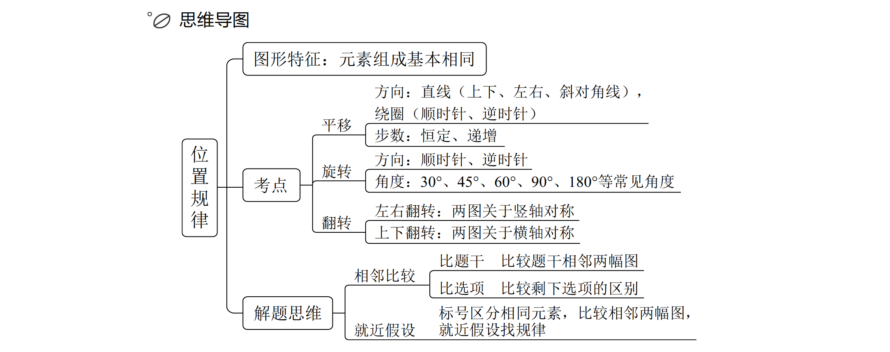

图形特征：元素组成基本相同。

一、位置类识别特征：元素组成相同
二、位置类考点：
1.平移——谁明显先看谁、内外转圈、多胞胎识别、看半圈或一圈，换方向
2.翻转——左右翻转、上下翻转
3.旋转——方向+角度
三、重要思维：多个元素分开看、对比选项找差异

### 一、平移

1.方向：

（1）直线：上下、左右、斜对角线。
（2）绕圈：顺时针（钟表走的方向）、逆时针（与钟表走的方向相反）。

2.步数：

（1）恒定：如依次走1步，1、1、1；依次走2步，2、2、2。
（2）递增：等差递增，

3.宫格类题目

（1）平移类题目以宫格类题目居多（9宫格、16宫格、25宫格、蜂窝格等）

（2）解题技巧：看中间、判方向

① 绕圈走：中间黑块数量相同，优先考虑内外圈分开看

② 走直线：中间黑块数量不同，优先考虑上下/左右

a.横行黑块数量相同→左右走
b.竖列黑块数量相同→上下走
c. 走到头移动路径

- 循环走

- 反弹走

4.特殊路径——换方向

（1）先向左走1步，再向下走2步；
（2）先向左下走1步，再向右下走1步。

### 二、旋转

1.方向：顺、逆时针

2.常见角度：30°、45°、60°、90°、180°等

### 三、翻转

1.左右翻转：左右对称。

2.上下翻转：上下对称。

## 第二节  样式规律

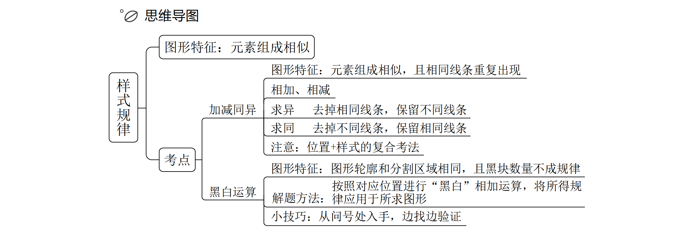

### 一、加减同异

### 二、黑白运算

## 第三节  属性规律

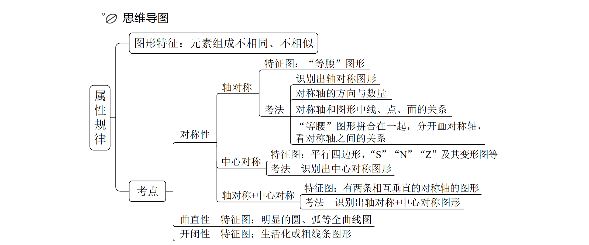

### 一、对称性

### 二、曲直性

### 三、开闭性

## 第四节  数量规律

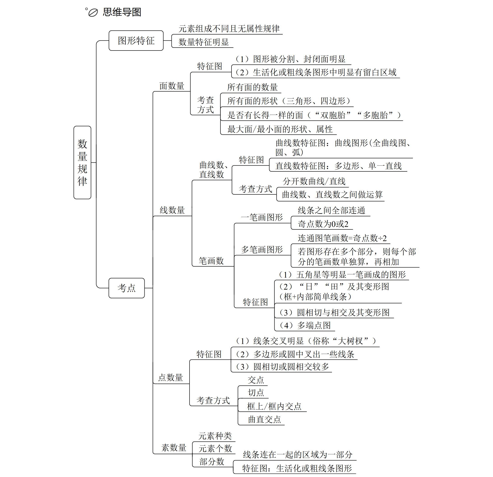

### 一、面数量

### 二、线数量

### 三、点数量

### 四、素数量

## 第五节  空间类

### 一、六面体

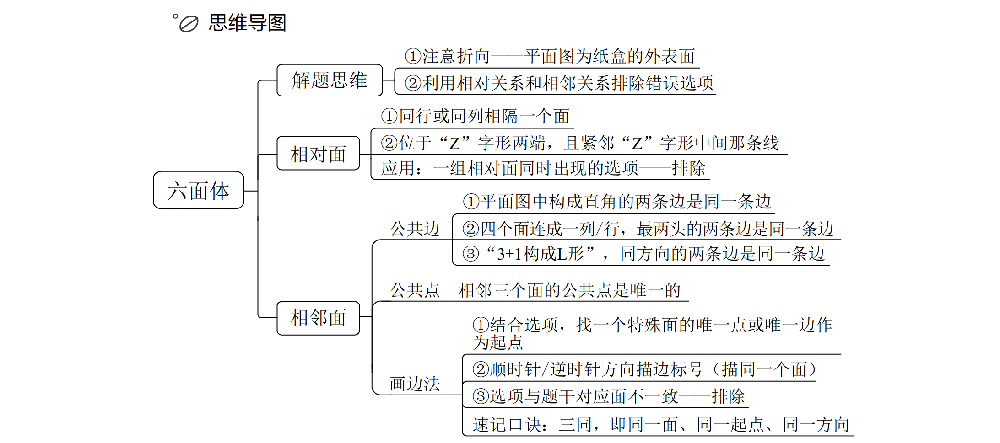

### 二、截面图

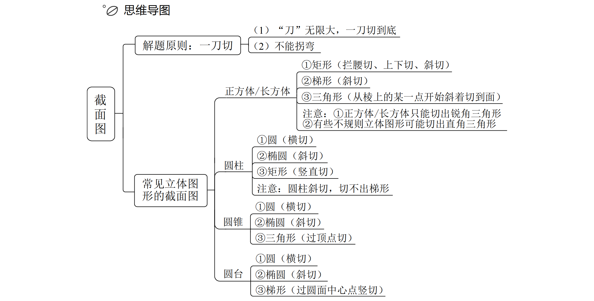

### 三、三视图

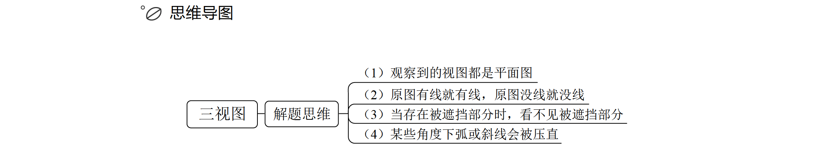

# 第二章  类比推理

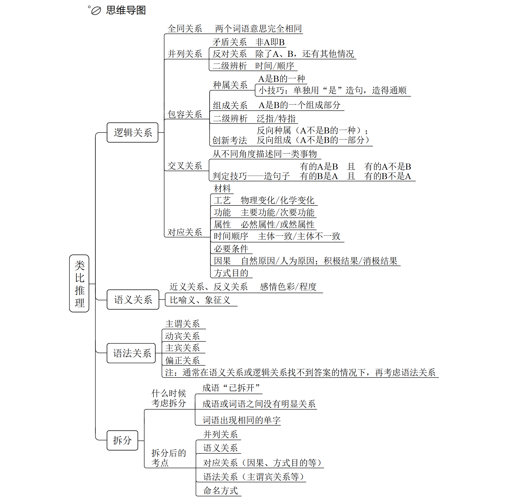

重难点：

1.不靠感觉，靠考点；建立出题人的思维体系

2.学会对比择优，从不严谨到严谨

常见题型：

1.两词型——A：B

2.三词型——A：B：C

3.填空型——A 对于（ ）相当于（ ）对于 B

## 第一节  逻辑关系

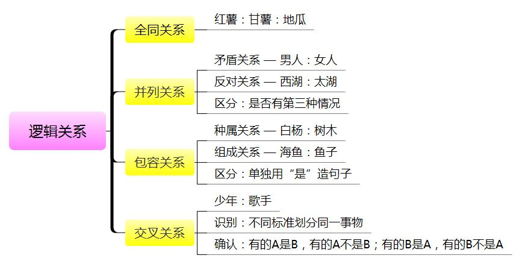

### 一、全同关系

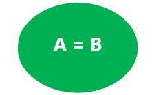

全同关系：两个词语意思完全相同

> 例：
>
> 老鼠∶耗子	西红柿∶番茄	上海∶沪
>
> 刘彻∶汉武帝（2021重庆）
> 赵匡胤∶宋太祖（2021重庆）
> 合肥∶庐州（2021重庆）
> 南京∶建业（2021重庆）
> 桂∶广西（2021山东）
> 杜鹃花∶映山红（2021山东）
> 荷花∶芙蕖（2019四川）
> 地瓜∶甘薯（2019四川）
> 牵牛花∶喇叭花（2020联考）
> 乞巧节∶七夕节（2020联考）
> 苦瓜∶凉瓜（2016四川）
> 矮瓜∶茄子（2016四川）
> 纸鸢∶风筝（2015吉林）
> 芝麻∶脂麻（2015吉林）
> 五行∶木火土金水（2015陕西）
> 五味∶酸苦甘辛咸（2015陕西）
>
> 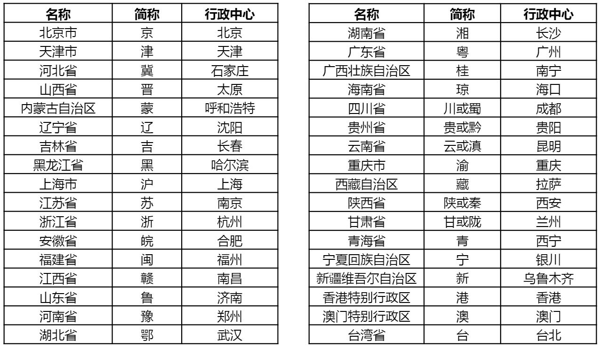

### 二、并列关系

1.两个词是同一个级别的，则是并列关系。

（1）矛盾关系：是指只有对立的两种情况，不存在第三种情况，二者是非此即彼的关系（没有第三种情况）。

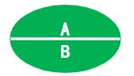

> 例：男人：女人 	盈 利 ：非盈利
>
> 常见矛盾关系：
>
> 生∶死 	男∶女 	白天∶黑夜 	A∶非A
> 阴∶阳 	阴刻∶阳刻 	软实力∶硬实力 	软件∶硬件
> 曲∶直 	动∶静 	静态博弈∶动态博弈
> 主要矛盾∶次要矛盾 	实体经济∶虚拟经济
> 精神文明∶物质文明 	固有属性∶偶有属性
> 物理变化∶化学变化 	社会现象∶自然现象
> 本能行为∶学习行为 	纯种繁育∶杂交繁育
> 唯物主义∶唯心主义 	黑色金属∶有色金属

（2）反对关系：是指在所列的两种情况之外，还存在其他情况，二者不是非此即彼的关系（有第三种情况）。

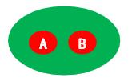

> 例：苹果：西瓜 	狮子 ：老虎

（3）功能类似，则是并列关系。

（4）并列关系常考二级辨析：

- 看顺序

  > 三皇五帝始，尧舜禹相传
  > 夏商与西周，东周分两段
  > 春秋和战国，一统秦两汉
  > 三分魏蜀吴，两晋前后延
  > 南北朝并立，隋唐五代传
  > 宋元明清后，皇朝至此完
  > 氢氦锂铍硼，碳氮氧氟氖
  > 钠镁铝硅磷，硫氯氩钾钙
  > 八卦：乾、坤、震、巽、坎、离、艮、兑（顺序不唯一）
  > 十天干：甲、乙、丙、丁、戊、己、庚、辛、壬、癸
  > 十二地支：子、丑、寅、卯、辰、巳、午、未、申、酉、戌、亥
  > 十二生肖：鼠、牛、虎、兔、龙、蛇、马、羊、猴、鸡、狗、猪
  > 立春、雨水、惊蛰、春分、清明、谷雨
  > 立夏、小满、芒种、夏至、小暑、大暑
  > 立秋、处暑、白露、秋分、寒露、霜降
  > 立冬、小雪、大雪、冬至、小寒、大寒

- 命名方式

  > 常见命名方式小结
  >
  > 原材料：高粱酒、葡萄酒、西瓜汁
  > 功能：办公椅、舞蹈扇、热水器
  > 形状：条形柜、圈椅
  > 属性：方便面、臭豆腐
  > 动力：风车、电动车、自行车
  > 人物：东坡肉、五柳鱼

### 三、包容关系

1 .种属关系：A 是 B 的一种。

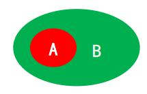

> 例：玫瑰：植物

种属关系常考二级辨析：特指/泛指。
反向种属：侄子和叔叔的关系，不是并列关系

> 常见的不是鱼的类型：
> ①八爪鱼（章鱼）——软体动物；
> ②鳄鱼——爬行动物；
> ③鲸鱼、海豚——哺乳动物；
> ④娃娃鱼（大鲵）——两栖动物

2 .组成关系：A 是 B 的一个组成部分。

> 例：硬盘：电脑

区分：具有包容关系的词语，若能单独用“是”造句子且造得通顺，则词语间为种属关系

### 四、交叉关系

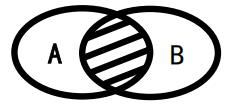

1.题干特征：从不同角度描述同一类事物

2.判定技巧——造句子

有的A 是 B 且 有 的 A 不是B
有的B 是 A 且 有 的 B 不是A

> 例：青年:教师

3.交叉关系常见二级辨析：命名方式

> 团扇∶羽毛扇∶舞蹈扇（2018联考）
> 圈椅∶实木椅∶办公椅（2018联考）
> 推理漫画∶连环漫画（2018吉林）
> 馆藏文物∶史前文物（2018吉林）
> 川菜∶素菜∶热菜（2017天津）
> 壁画∶山水画（2015吉林）
> 旱田作物∶高产作物（2018江苏）
> 哺乳动物∶陆生动物（2016山东）
> 内陆湖∶淡水湖（2019国考）
> 教师∶陕西人（2017陕西）
> 诗人∶教授（2017江苏）
> 专家∶官员（2015江苏）

### 五、对应关系

高频对应关系：
1.材料 

> 面粉：面包

2.工艺 

> 白醋 发酵
>
> 工艺二级辨析
>
> 区分标准：有无新物质生成
>
> 涉及物理变化的工艺：印刷、捆扎、打磨、雕琢、剪裁、织造等
> 涉及化学变化的工艺：燃烧、氧化、发酵、酿造、冶炼等

3.功能

> 钢笔 书写
>
> 常考二级辨析：主要、次要

4.属性 

出现带“性”“式”“化”的词语，优先考虑属性

> 钻石：坚硬
>
> 常考二级辨析：必然、或然

5.时间顺序

常考二级辨析：主体能否一致 请假∶批准

> 构思：写作：发表	 请假∶批准

6.必要条件

> 上网：网购

7.因果

常考二级辨析：

（1）原因：自然/人工。
（2）结果：积极/消极。

8.方式目的

常考二级辨析：方式对错、目的能否达到

出现国家、政府的做法，考方式目的概率大

> 
>
> 灾害预警∶减少损失
> 提取指纹∶收集罪证
> 党纪教育∶正风肃纪
>
> 撒网：捕鱼

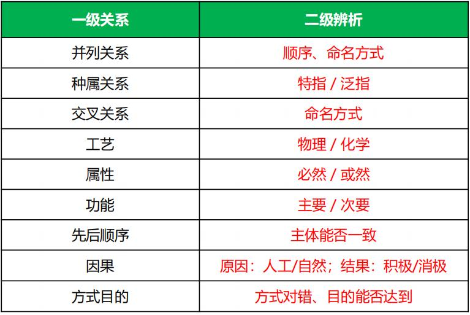

## 第二节  语义关系

### 一、近义关系、反义关系

1 .近义关系：词语意思相近
例：表扬：赞扬 百折不挠：坚韧不拔
2 .反义关系：词语意思相反
例：忧伤：喜悦 了如指掌：一窍不通

### 二、比喻义、象征义

1 .比喻义：用跟甲事物有某种相似之处的乙事物来说明甲事物
例：月亮：小船
2 .象征义：借助某物的具体形象，以表现某种抽象的概念、思想和情感
例：仙鹤：长寿

## 第三节  语法关系

通常在语义关系或逻辑关系找不到答案的情况下，再考虑语法关系
1.主谓关系
例：学生：学 习 医 生 ：治疗
2.动宾关系
例：观看：演 出 消 除 ：矛盾
3.主宾关系
例：农民：水 稻 士 兵 ：敌情
4.偏正关系
例：晴朗：天 气 飞 快 ：奔跑

## 第四节  拆分

什么时候考虑拆分？
( 1 ) 成 语 “已拆开” 例：南征：北战
( 2 ) 成语或词语之间没有明显关系 例：左顾右盼：上蹿下跳
( 3 ) 词语出现相同的单字 例：甘 ：甘甜：甘愿
拆分后的考点：
(1 ) 并列关系
(2 ) 语义关系
(3 ) 对应关系(因果、方式目的等)
( 4 ) 语法关系(主谓宾关系等)
(5 ) 命名方式

# 第三章  定义判断

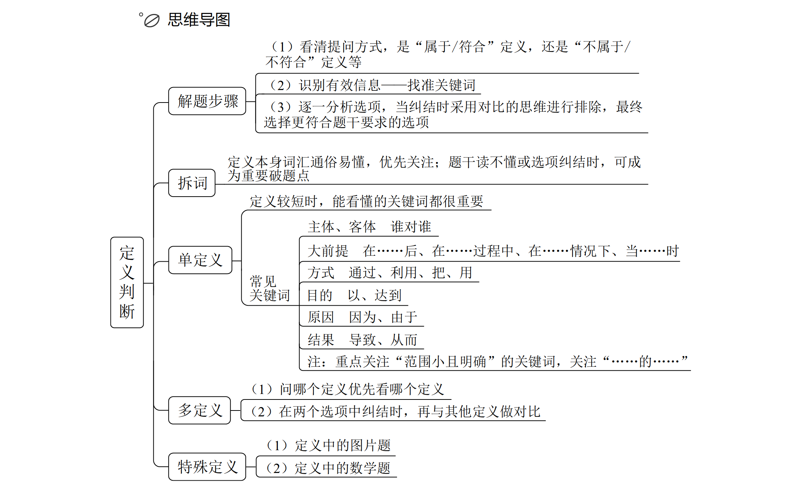

解题步骤：

1.看提问：看清“属于 / 符合”、“不属于 / 不符合”；

2.看题干：识别有效信息；找准关键词、关键句；

3.看选项：纠结时选项**对比择优**；

4.对比择优，接受不完美。

## 第一节  拆词

1.原理：定义词汇本身就是关键词，可以提前预判。

2.运用：

（1）定义本身词汇通俗易懂，可以拆分后，直接看选项；

> 体验营销、异地就医、换城消费。

（2）拆词后担心理解有偏差，优先关注定义本身的同义替换。

## 第二节  单定义

### 一、简单句

1.题目特征：题干只有 1 个定义。

2.解题思路：

定义较短时，能看懂的关键词都很重要；

### 二、句式结构之“主体、客体”

关注主体、客体的种类和数量，主体、客体错误的选项一定不符合定义。

注：需特别注意**带修饰词**的主体、客体

> 常考主客体：
>
> 1.行政机关：各级政府（国务院……街道办/乡镇政府、公安等）；
> 2.权力机关：全国人大、地方人大；
> 3.司法机关：法院、检察院；
> 4.事业单位：学校、医院、科研所、广播新闻出版等；
> 5.社会组织：商会（浙商会）、协会（消费者协会）。

### 三、句式结构之“大前提、方式目的、原因结果、句号与补充说明”

- 前提：当……时 / 在……之前/后
- 方式：通过 / 利用……
- 目的：以 / 以达到……
- 原因：因为 / 由于……
- 结果：导致 / 从而 / 使得……

注：重点关注“范围小且明确”的关键词，关注“……的……”

## 第三节  多定义

1.题目特征：题干只有 2 个及以上定义。

2.解题思路：

（1）问哪个定义优先看哪个定义；

（2）读不懂目标定义或纠结选项，借助其他定义解题。

## 第四节  特殊定义

特殊定义判断题的类型：

1.图片类：看具体对图形描述的句子。

2.数学类：看公式找到答案就停止，不需要对比择优。如“$1 + 1 =2$，不需要对比择优”。

# 第四章  逻辑判断

## 第一节  翻译推理

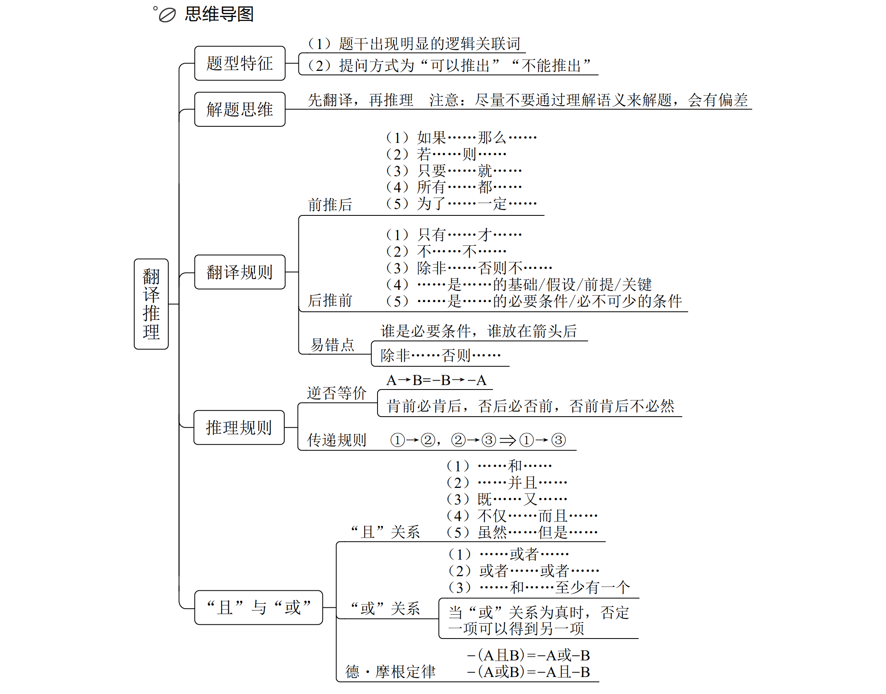

### 一、翻译规则之“前推后”

### 二、推理规则之“逆否等价”

### 三、翻译规则之“后推前”

### 四、翻译规则之“且”与 “或”

### 五、推理规则之“否一推一”

### 六、推理规则之“德 •摩根定律”

## 第二节  组合排列

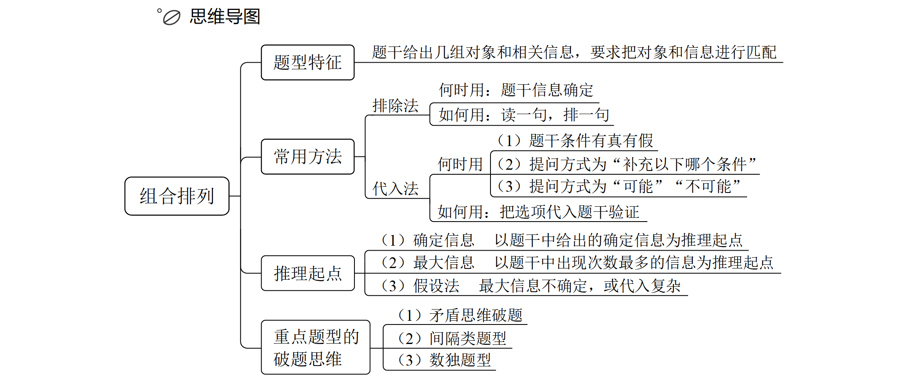

### 一、排除法与代入法

### 二、推理起点

### 三、重点题型的破题思维

## 第三节  逻辑论证

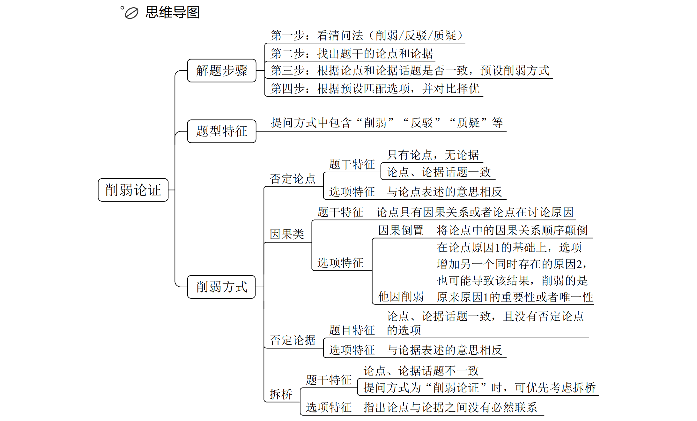

#### 论证的基础知识

1.论点：结论性的观点（观点、态度、结论）；

2.论据：理由、依据（证明论点成立的原因、例子）；

3.论证：论点与论据之间的联系。

> 做题时以论点为核心。
>
> 题目一定有论点（必然的），给出结论和观点才可以证明或削弱它，很多题目只有论点没有论据，所以论据是可能有也可能没有（不确定），一般题干不会直接告诉论点和论据关系的，需要自己分析，甚至作为选项出现。做题时优先找论点，找到论点之后试着找论据，有论据分析论点和论据的关系，没有直接以论点为核心做题即可。

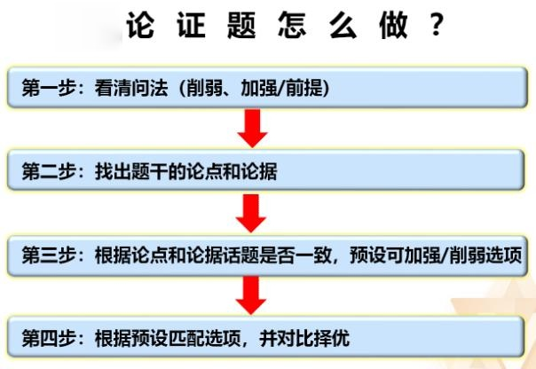

#### 找论点与论据

1.典型提示词：

（1）论点提示词：“所以、结论是、这表明/说明/意味着、由此推出、据此认为”后往往跟结论性的话。

（2）论据提示词：由于、**因为**、鉴于、根据，

> 特别强调“因为”，注意区分“**因为**”和“**因此**”，**“因此”后跟的是结论，“因为”后跟的是理由**。

（3）论据常见形式：原因、数据、事例、**实验**或调查内容等。

> 特别注意实验，有的题非常长，前面是很复杂的实验最终得出结论，实验有的时候不太好读懂，记住**结论是重要的**，实验是论据，是用来证明结论的，所以实验类题目实验能读懂最好，读不懂以论点为核心。比如写毕业论文是看参考文献，最难的一般都是前面的研究方法和研究过程，简单的一般是结论性的表达。

2.首尾句原则：一般情况下行文脉络是总分、分总、总分总，所以第一句话和最后一句话从概率来看更容易作为总结性的语言，

3.结合提问方式，问啥找啥：

找论点：

1.结合提问方式

2.关键词：因此、所以、认为、由此推出、据此可知等

3.首尾句原则

找论据：

1.关键词：由于、因为、理由是、根据等

2.就近原则：如果文段有论据，一般紧挨着论点

#### 论证题解题步骤：

第一步：看清问法(削弱/反驳/质疑，加强/支持、前提/假设)
第二步：找出题干的论点和论据
第三步：根据论点和论据话题是否一致，预设削弱/加强方式
第四步：根据预设匹配选项，并对比择优

### 一、削弱之否定论点（考频最高、最常见）

1.题干特征：

（1）只有论点，无论据
（2） 论点、论据话题一致

2.选项特征：与论点表述的意思相反

3.解题步骤：找出论点 $\to$ 预设答案 $\to$ 对比选项

（1）找出论点和论据进行分析。

（2）预设答案：发现只有论点、论点和论据话题一致时，此时把论点否掉，去选项里找答案，哪个答案是否掉的论点，哪个答案就当选（ 题干特征符合否论点特征时，提前知道否论点的答案长什么样，然后去选项里找）。

（3）对比选项。

> 是不是否定论点取决于这个选项能不能让论点不成立
>
> 整体强于部分，举例子可以削弱，力度不如整体削弱强
>
> 无关选项不能选
>
> 话题不一致、主体不一致、不明确选项都称之为无关选项
>
> 论点有比较，正确答案有比较；论点无比较，正确答案无比较。
>
> 正确答案特征：往往包含论点关键词或做同义替换
>
> 越接近论点越好
>
> 特殊题型：论点出现“那么……就……”，是翻译推理的内容。如果一道题的论点可以翻译成“A→B”，问“质疑”，答案大概率是“A且-B”，因为“A→B”的矛盾是“A且-B”，所以对于“A→B”最直接的否定就是“A且-B”
>
> 择优比较——越接近论点越好；整体＞部分；必然＞可能。
>
> 选项不一定都是最完美或者清晰的，考场上可以根据排除法
>
> 正确答案往往会和论点的程度词相对照。
>
> 对于“A导致B”的削弱。
> （1）A不导致B。
> （2）C 导致 A 和 B。
> （3）因果倒置（B导致A）。
> （4）他因削弱（C和A同时导致B）。
>
> 论点为A导致B，特殊的削弱形式
> ——C导致A且B，说明A与B之间没有因果关系
>
> 论点：为了提高个人幸福感，在购物时，应该给别人花更多的钱
> D.与他人关系好的人往往更加幸福，且更愿意在购物时为他人花更多的钱
>
> 论点：地球转速放缓导致强震多发
> D.地核的轻微变化，导致地球的转速放缓，也导致全球范围内的强震多发
>
> 论点：脂肪含量过少的人，死亡风险会增高
> C.脂肪含量过少和死亡风险高都是由疾病带来的，疾病是二者的共同原因
>
> 论点：心血管紧张会导致内部器官温度上升
> D.温度升高先后导致心血管紧张和内部器官温度上升
>
> 

1.只有论点或论点论据话题一致：优先考虑否论点。
2.正确答案往往与论点中关键词一致或同义替换。
3.注意论点和选项中的特殊词：比较词、程度词。
4.特殊的论点形式：
①论点为A→B，否论点A且-B。
②论点为A导致B，否论点C导致A和B。
5.解题步骤：找到论点→想出削弱→对比选项。
6.注意因果关系和翻译推理是不一样的。

### 二、削弱之因果倒置和他因削弱

#### 因果倒置：原因和结果说反了

1.题干特征

（1）论点：1 导致 2

（2）因果倒置削弱：2 导致 1

2.选项特征：因果同时出现且时间顺序颠倒。

3.为什么因果倒置能削弱：

> 因果倒置就是原因和结果说反了，如“A 导致 B”，按照发生的时间顺序，一定是 A（因）在前，B（果）在后，如果说“B 导致 A”，是 B 在前，A 在后，时间顺序发生颠倒了，说明原本的因果关系就不可能成立了，则因果倒置是对于原来的因果关系的否定，说原来的因果关系错了，对论点有直接的削弱作用。

4.一般情况下，出现因果倒置的选项，优选。

5.注意：条件关系（前推后、后推前等）和因果关系不是一回事，是两个不同的关系。

> 论点中有因果关系，选项中同时出现因和果的关键词，要看时间先后，时间先后颠倒则是因果倒置。
>
> 因果倒置什么时候考虑：
>
> 1.论点为因果类论点。
> 2.选项中同时出现因果两个关键词，此时看时间顺序是否颠倒，如果时间先后顺序颠倒则是因果倒置，如果时间先后顺序一致则是加强论点。

#### 他因削弱：

承认结果，同一个主体、同时存在、两种及以上可能的原因
若论点是其中一种原因，则可用另一种原因进行削弱

他因的本质：干扰因素——用于削弱论点原因与结果之间的唯一关系
他因的特点：同一主体、同一时间、不同原因

> 他因的本质：干扰因素——用于削弱论点原因与结果之间的唯一关系。他因可以削弱论点，但是力度较弱，因为只是对于论点的干扰，是可能性的削弱，力度没有因果倒置强。
>
> 他因削弱的要求：承认结果，同一个主体、同时存在、两种及以上可能的原因，这样才能相互干扰，如果不是同一主体、同时存在的原因，相互无法干扰。
>
> 他因的特点：同一主体、同一时间、不同原因。
>
> 当选项中出现了时间，尤其是和题干时间一致，重点考虑是不是他因削弱。

#### 特殊提问：不能削弱

1.不用预设，选项可能有多种加强/削弱方法，结合排除思维解题。
2.不能加强——排除加强选项，削弱与无关均可。
3.不能削弱——排除削弱选项，加强与无关均可。

> 当选项主体与论点主体为并列或者交叉关系，是无关项。

### 三、削弱之否定论据

题目特征：论点、论据话题一致，且没有否定论点的选项
选项特征：与论据表述的意思相反

1.题干中有“双方互怼”，经常采用否定论据来削弱
2.题干有论据且找不到否论点和拆桥
3.选项特征：与论据表述的意思相反

选项特征：反着论据表述。

### 四、削弱之拆桥

什么是拆桥？
说论点与论据之间没有必然联系

1.什么是拆桥：断开论据和论点之间的关系。论证三要素包括论点、论据、论证，有否定论点、否定论据，自然也有否定论证（说明论点、论据之间没有关系）。

什么时候考虑拆桥？

题干特征：
（ 1 ） 论点、论据话题不一致
（ 2 ） 提问方式为“削弱论证”时，可优先考虑拆桥
选项特征：指出论点与论据之间没有必然联系

选项特征：
包含论点和论据中的关键词，并否定论点和论据之间的必然联系

否定论点和拆桥不是一回事，否定论点是证明论点不对，拆桥是证明论据得不出论点，并没有否定掉论点，所以否定论点＞拆桥（目前没考过二者的力度比较），否定论据是证明论据不对，未提及论点，所以拆桥＞否定论据，即“否定论点＞拆桥＞否定论据”。

选项特征：一般情况下，会包含论点、论据的关键词，并断开二者之间的必然联系。

1.什么是拆桥：断开论据和论点之间的关系。论证三要素包括论点、论据、论证，有否定论点、否定论据，自然也有否定论证（说明论点、论据之间没有关系）。

2.否定论点和拆桥不是一回事，否定论点是证明论点不对，拆桥是证明论据得不出论点，并没有否定掉论点，所以否定论点＞拆桥（目前没考过二者的力度比较），否定论据是证明论据不对，未提及论点，所以拆桥＞否定论据，即“否定论点＞拆桥＞否定论据”。

3.选项特征：一般情况下，会包含论点、论据的关键词，并断开二者之间的
必然联系。

6.何时拆桥：

（1）论点、论据话题不一致，削弱优先考虑拆桥。

（2）特殊问法：问法为“削弱/质疑论证”，现在考得少，只有一种特殊情况下是有意义的，即选项中既有否定论点又有拆桥，按理来讲，否定论点＞拆桥＞否定论据，但问“削弱论证”时，优选拆桥，因为拆桥是对论证的削弱，其他时候否定论点的力度最强。看问法做预设不严谨，有时问“削弱论证”，但选项中只有否定论点；有时问“削弱观点”，但选项中只有拆桥，所以除了特殊情况以外，当成普通问法处理即可。

什么时候论点与论据不一致？

论点、论据明显话题不一致时，削弱优先考虑拆桥。分不清论点、论据话题是否一致时，优先考虑否定论点，没有答案，可以考虑拆桥。

一定要用方法预设，带着预设匹配选项

论点中有因果关系时，他因是对论点的削弱。

论点与论据话题不一致如何做题？
削弱：优先拆桥
论点为整体、论据为部分：

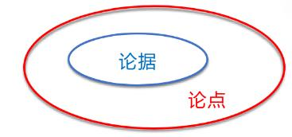

拆桥——部分≠整体/其他部分不一样

“时髦”拆桥
论据：某物质中的一些元素有效 论点：某物质有效
削弱：某物质内该元素含量极少 / 要吃极多

> 例：论据：槲皮素能治幽门螺杆菌
> 论点：吃洋葱能治幽门螺杆菌
> B.实验中用的槲皮素与洋葱这种天然食物中的槲皮素浓度存在较大差异
>
> 例：论据：丙烯酰胺属于2A级致癌物
> 论点：大蒜炝锅致癌
> D.丙烯酰胺致癌临界点为短时间内使用炝锅蒜32.7公斤

实验/调查类题目常考拆桥方式——被试/被调查者不具代表性

拆桥小结：
1.何时拆桥：
（1）论点、论据明显话题不一致时，削弱优先考虑拆桥。
（2）没有否定论点时，可以考虑拆桥。
（3）问“削弱论证”时，只有这种情况下，拆桥优于否定论点，其他情况均是否定论点的力度更强。
2.拆桥有多种表述形式，需记住拆桥不能否定论点，但可以否定论据和论点之间的关系。

## 加强类

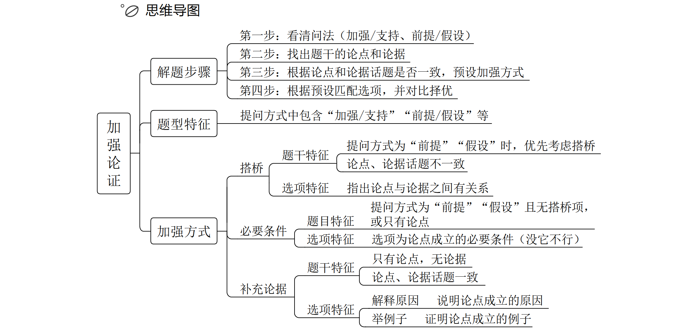

加强类常见提问方式：

1.问“加强/支持/赞同/证明”，为加强题目。

2.问“前提/假设/必要条件/加强论证”，也为加强题目。问“削弱论证”，直接考虑拆桥不靠谱，问“加强论证”，直接考虑搭桥也不靠谱，但问“前提/假设”，非常喜欢考搭桥，所以拆桥没有明确的特殊问法，预设拆桥要看论点、论据是不是明显话题不一致，或者是不是没有否定论点的选项，而预设搭桥可以看问法，问“前提/假设”时，加强优先考虑搭桥。

3.问“不能加强”，不能直接找削弱项，无关项、削弱项均无法加强，二者同时出现，优选削弱项，但这样考查的概率很小。

### 五、加强之搭桥（力度最强）

题干特征：
（1 ）提问方式为"前提”“假设”时，优先考虑搭桥
（2 ）论点、论据话题不一致
选项特征：指出论点与论据之间有关系

加强之搭桥：力度最强，因为没有直接加强论点。
1.什么是拆桥：拆桥是证明论点、论据之间没有必然联系；搭桥是证明论点、
论据之间有联系。

2.论据推出论点的过程为搭桥，所以搭桥方向应该为“论据→论点”，有
不止一个选项同时提到论点、论据不同的关键词时，需要关注搭桥方向，择优选
择“论据→论点”的选项；只有一个选项同时提到论点、论据不同的关键词时，
说明没有考查搭桥方向，可以直接选择，考试中考查搭桥方向的题目很少，考查
单一搭桥的题目更多。拆桥没有方向，断开论据、论点之间的联系即可。

3.何时搭桥：

（1）问“前提、假设”，加强优先考虑搭桥。
（2）普通问法，问“加强、支持”，论点、论据话题不一致，加强优先考虑搭桥。

4.选项特征：

同时包含论点和论据中的关键词，并肯定论点和论据之间的关系

5.解题思维：找论点→找论据→去同存异→对比选项

找到论点、论据的关键词，去同存异，正确答案会同时包含论点、论据不同的关键词。

搭桥不需要读懂题，找到论点、论据不同的关键词即可。

搭桥考查1道题，90%以上都是问“前提/假设”，以论点为核心，去掉论点、论据相同词，保留不同词语找答案。

翻译类“搭桥”题
问：前提、假设、必要条件、加强论证

例1：
论据：甲→乙+乙→丙
论点：甲→丙
箭头前一致，补——论据词→论点词
例2：
论据：甲→乙+丙→甲
论点：丙→乙
箭头后一致，补——论点词→论据词

论点、论据均有翻译词解题思路：
1.翻译题干论点、论据
2.箭头前一致，论据词→论点词；箭头后一致，论点词→论据词

翻译类“搭桥”：
1.问“前提/假设/必要条件/加强论证”，尤其是“前提/假设”，且论点、论
据都涉及翻译，需要穿串，从论据中加一句话让论点成立。

### 六、加强之必要条件

题目特征：提问方式为“前提”“假设”且无搭桥项，或只有论点
选项特征：选项为论点成立的必要条件（没它不行）

必要条件：选项为论点成立的必要条件（没它不行）
提问方式为前提、假设，且无搭桥选项

2.必要条件：让论点成立的必要条件，没它不行，没有这个选项论点就无法
成立，这个选项叫作必要条件的选项。

5.考虑必要条件：
（1）问法为“前提、假设”。
（2）无搭桥选项：
①只有论点。
②论点和论据话题一致（没有不同点，没有办法建立不同联系）。
③没有搭桥选项。

6.答疑：

（1）必要条件主要针对论点，搭桥看论点和论据不同。
（2）考虑必要条件，此时预设答案时有意识想没有这个选项行不行，没有这个条件不行就是必要条件，没有这个条件也行就不是必要条件，排除。
（3）问“前提、假设”且没有搭桥项，只需要记住一种特殊题型，考试最喜欢考方式+目的的论点，无论加强还是削弱，要么方式可行，要么效果有效。其他题当成普通加强题做即可。
（4）总结：遇到前提、假设，优先考虑搭桥，没有搭桥，看论点是否为方式+目的，方式+目的直接考虑方式可行、效果有效，如果不是方式+目的，就当成普通加强题做就行。

### 七、加强之补充论据

题干特征：
(1 )只有论点，无论据
( 2 ) 论点、论据话题一致
选项特征：
解释原因—— 说明论点成立的原因
举例子一证明论点成立的例子

1.解释原因：说明论点成立的原因——整体上解释
2.举例支持：证明论点成立的例子——部分上证明

6.考虑原因解释和举例子：只有论点或论点和论据话题一致，优先考虑原因
解释和举例子。建议如果一道题问“前提、假设”优先考虑搭桥，其次考虑必要
条件；问“加强/支持”优先考虑补充论据，其次再考虑会不会有搭桥和必要条
件。问“前提”的题90%都是考搭桥，问“加强/支持”的题90%都是考补充论据。

7.答疑：
（1）力度：搭桥与必要条件是一致的＞原因解释＞举例子，考试中主要考
原因解释和举例子的力度比较，但是不好区分，只要记住区分方法是整体强于部
分即可。
（2）原因解释和举例子适用于所有的加强题，所有的论点形式都适用。
（3）区分举例子和无关项：
②总结：论点主语与选项主语是包容关系/全同关系。

> 比如“吃药可以治疗心脏病人的心脏问题”，主体是人。A项“某个人通过药治好了病”，“某个人”和“人”是包容关系，选项和论点主体为包容关系
> 且论点主体大，选项主体小，是举例子；B项“药在猴子实验当中成功了”，“猴
> 子”和“人”是并列关系，是无关项；C 项“药可以治所有动物的心脏问题”，
> “动物”比“人”的主体还大，也是包容关系，可以，因为所有动物都这样，人
> 一定也可以这样。
>
> A项论点为人，选项为
> 黄种人，是例子；B 项论点为人，选项为动物，选项更大，一般是解释；C 项论
> 点是人，选项也是人，全同关系一般也是解释。此时C项＞B项＞A项。B项比C
> 项范围大，但是由于论点是人，跟论点一模一样一定是最好的，都和论点不一样
> 的时候再比较大小。

③论点和选项主体之间是并列关系时，是无关/类比。

> 比如论点是人，下面说猴子，后面加一句话猴子与人相似，类比于无关的区别就是后面加一句话，二者相似，无论是无关还是类比都不能选。

### 特殊提问：不能加强

## 第四节  原因解释

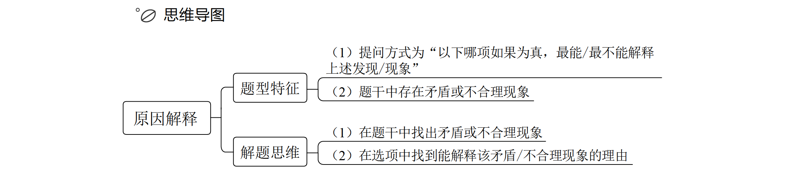

## 第五节  日常结论

dhjffdsmkf