[toc]

# 基础理论篇

重点掌握：

1.各要素规律包含哪些主要具体考法；
2.各要素规律考察出题人选择哪些主要图形特点，暨哪些图形特点适配提示该要素规律；
3.各要素规律之间如何选择，暨判断出题人想考察规律方向。

## 第一讲  线专题重点规律理论 

### （一）常规曲线直线（重要程度：★★）

**图形特点**：纯直曲图形、简笔画实物图形、单区域纯封闭图形

#### 1.曲直定性

#### 2.曲直数量（和、差、单独数）

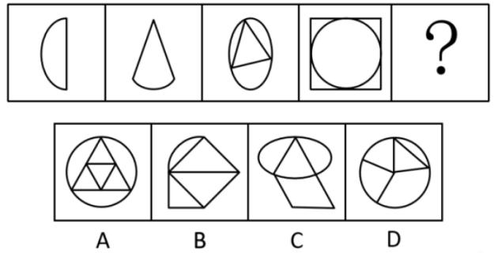

#### 3.曲直位置（分离、向交、相切）

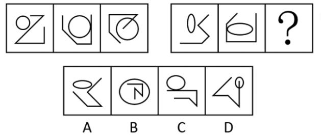

### （二）特殊线（重要程度：★★）

#### 1.平行线

图形特点：轮廓自带平行线；N字型、Z字型、工字型、H字型；相似图形
主要考法：平行线组数、平行线方向

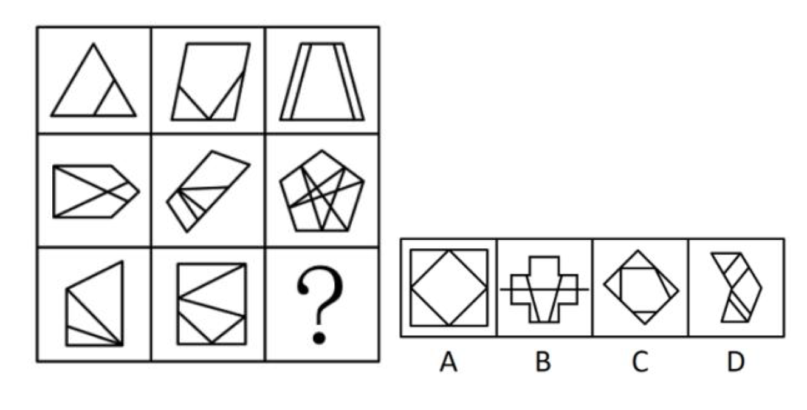

2.延伸线

图形特点：所有图形为单区域轮廓加外部线条组合
主要考法：延伸位置、延伸线数量、延伸线自身线段数量、轮廓线与延伸线关系

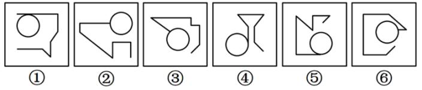

3.横竖线

图形特点：文字、十字型
主要考法：横竖线数量关系

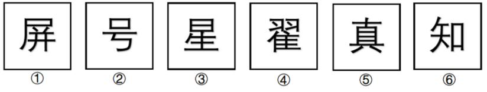

### （三）对称（重要程度：★★★★★）

图形特点：所有图形规则
主要考法：对称方式、对称轴数量、对称轴方向、轴线关系、轴过要素、轴两侧形状

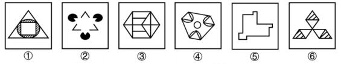

### （四）一笔画（重要程度：★★★★★）

图形特点：出头色彩、“点连接”图形、典型图形修正、外轮廓相同、多部分、不规则内外图形

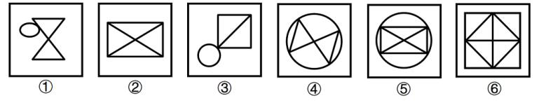

## 第二讲  点（角）、面专题重点规律理论

### （一）常规交点（重要程度：★）

图形特点：出头色彩、单区域图形
主要考法：数量关系

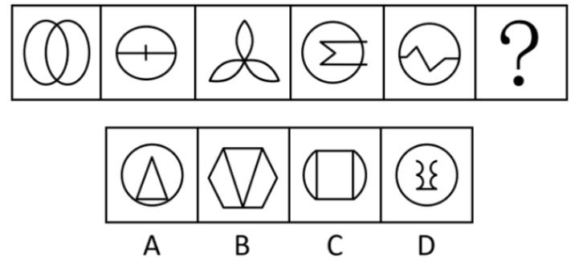

### （二）特殊交点（重要程度：★★）

1.曲直交点

图形特点：所有图形均包含圆或类圆曲线
主要考法：数量关系

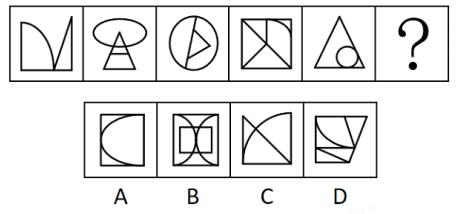

2.轮廓交点

图形特点：所有图形均外轮廓都是圆且纯封闭
主要考法：轮廓上交点数量

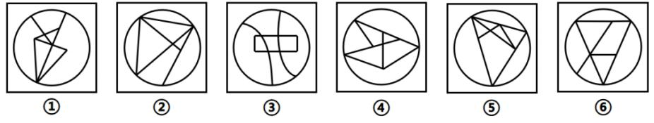

3.圆内交点

图形特点：所有图形均包含一个圆形轮廓且存在线条贯穿圆内外
主要考法：圆内交点数量

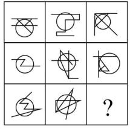

4.切点

图形特点：所有图形均包含圆或类圆曲线
主要考法：切点数量，切圆数量

### （三）直角（重要程度：★★）

图形特点：直角轮廓、工字型、十字型、H型、图形修正
主要考法：直角数量、直角位置

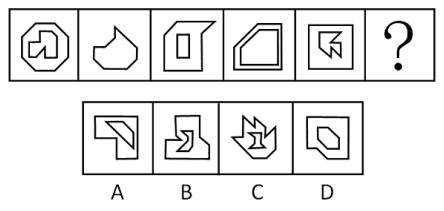

### （四）空间数量（重要程度：★★★）

图形特点：纯封闭图形、非纯封闭图形（实物简笔画）、所有图形均包含一个圆形轮廓且存在线条贯穿圆内外
主要考法：空间数量、三角形数量、圆内空间

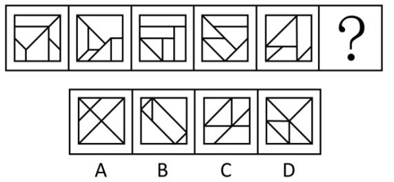

### （五）空间形状（重要程度：★★★★）

图形特点：所有图形纯封闭且空间数量基本一致、特殊形状、阴影、重合
主要考法：形状大小、相似、对称、轮廓形状、阴影形状、重合空间形状

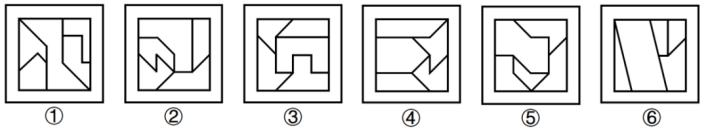

### （六）空间位置（重要程度：★★★★）

图形特点：所有图形纯封闭、空间数量（2/3）、特殊形状
主要考法：连接方式、对接、“三不沾”、连接面数量

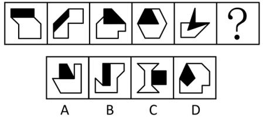

### （七）空间面积（重要程度：★★）

图形特点：阴影图形且形状为等边三角形、扇形、宫格
主要考法：面积定量、面积占比

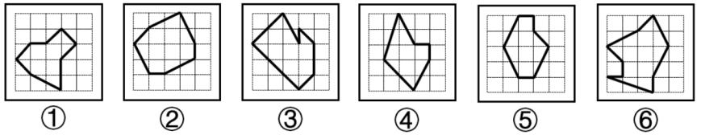

## 第三讲  元素专题重点规律理论

### （一）元素基础考法（重要程度：★★★★）

图形特点：图形分离、相同元素（空间）形状
主要考法：元素种类、元素数量、元素传递、相同元素、元素转换、部分数量

### （二）元素移动（重要程度：★★★★★）

图形特点：所有图形轮廓相同且元素数量基本一致且元素数量远小于轮廓格子数量
主要考法：平移、旋转、翻转

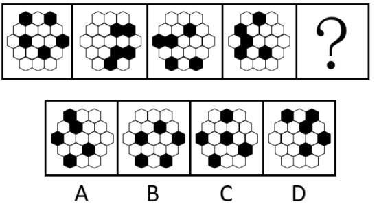

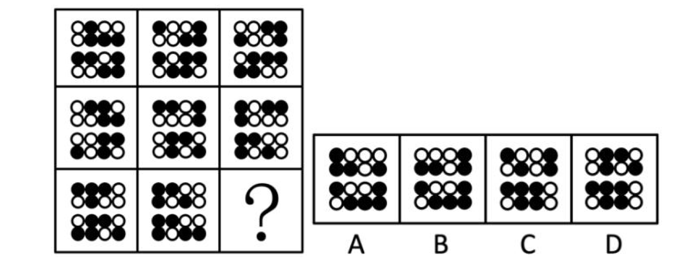

### 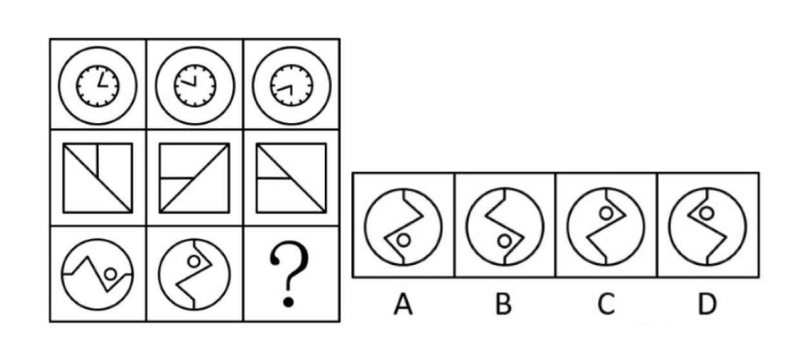（三）元素叠加（重要程度：★★★★)

图形特点：图形相似且无轮廓且图形间区域元素减少、所有图形轮廓相同且元素数量居多且元素数量不一致
主要考法：同异叠加、黑白叠加

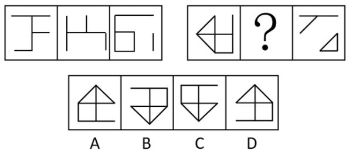

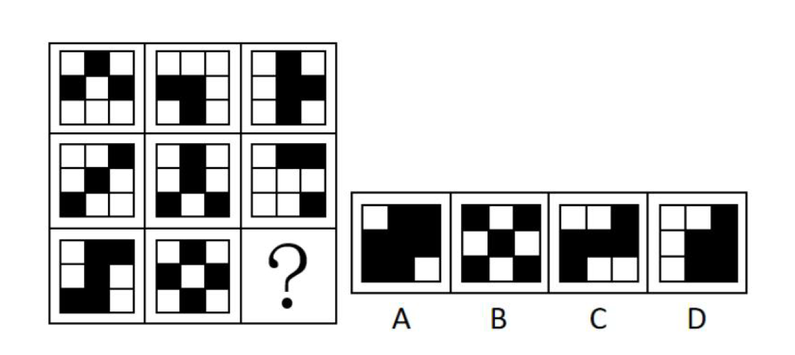

### （四）黑白元素（重要程度：★★★★）

图形特点：所有图形轮廓相同（5*5格子及以上）且元素数量居多且元素数量不一致

1.黑白分割

图形特点：阴影呈现定格状

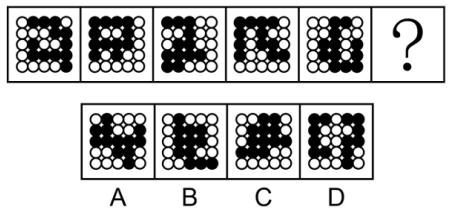

2.一笔画

图形特点：阴影多呈现Y型、T型、X型

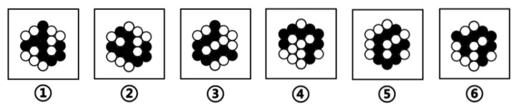

3.黑白对称

图形特点：所有图形黑格或白格分布规则

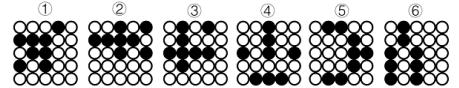

4.位置传递

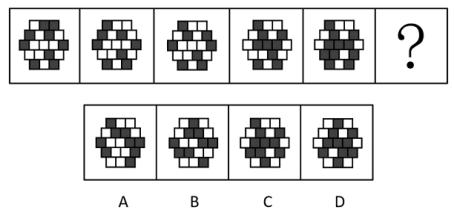

5.连接方式

图形特点：阴影位置存在明显点连接

### （五）特殊元素（重要程度：★）

1.功能元素（黑点、小圆圈）

主要考法：标记要素（数量、形状、位置）

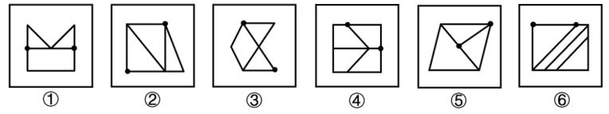

2.数字字母

主要考法：种类、空间、曲直、位置关系

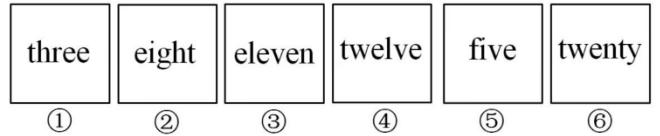

3.文字

主要考法：空间、部分数量

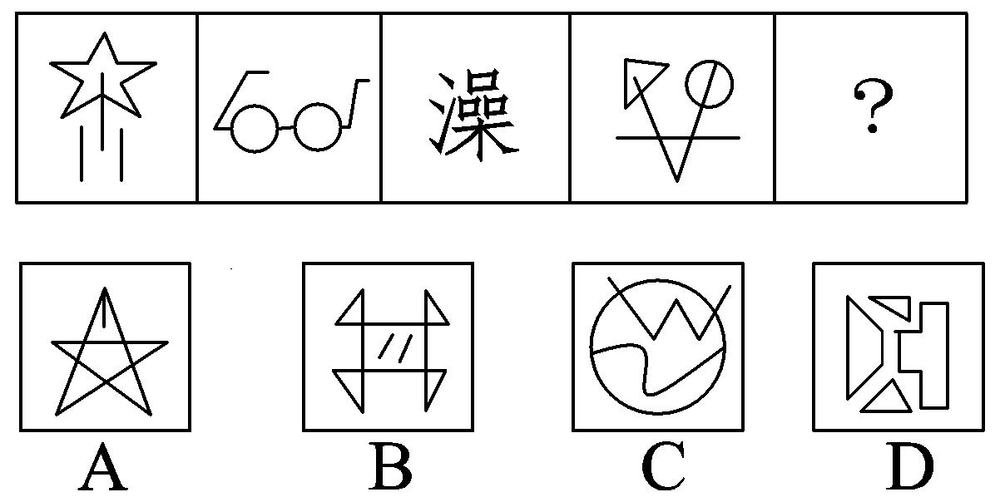

4.Logo

主要考法：空间、部分数量、种类、对称

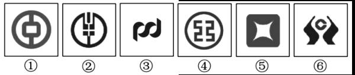