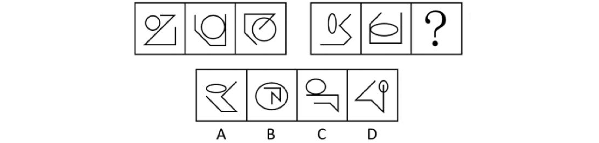
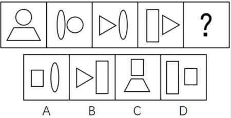
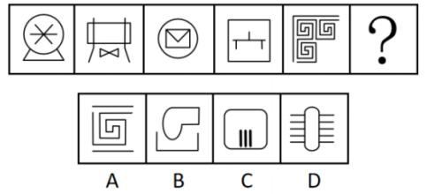
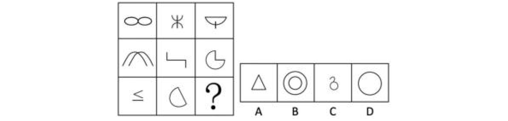
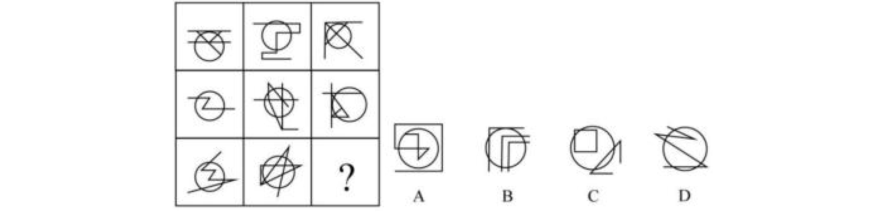

[toc]

# 第一篇  基础理论

重点掌握：

1.各要素规律包含哪些主要具体考法；
2.各要素规律考察出题人选择哪些主要图形特点，暨哪些图形特点适配提示该要素规律；
3.各要素规律之间如何选择，暨判断出题人想考察规律方向。

> 逻辑体现：共性思维 —— 观察**已知图形的共性**以及**典型的局部特点**。

## 第一讲  线专题重点规律理论 

### （一）常规曲线直线（重要程度：★★）

**图形特点**：纯直曲图形、简笔画实物图形（生活化图形）、单区域纯封闭图形。

> 均为典型的局部特点。

**1.曲直定性**

> 第一直观：对称，不符合整体规律，思考线规律;
>
> 定性：
> 定量：不考虑 —— 多数图形线不规则
>
> ①③⑥，②④⑤

**2.曲直数量**（和、差、单独数）

> 
>
> D

**3.曲直位置**（分离、向交、相切）

> 
>
> D

### （二）特殊线（重要程度：★★）

**1.平行线**

图形特点：轮廓自带平行线；N字型、Z字型、工字型、H字型；相似图形

主要考法：平行线组数、平行线方向

> D

**2.延伸线**

图形特点：所有图形为单区域轮廓加外部线条组合
主要考法：延伸位置、延伸线数量、延伸线自身线段数量、轮廓线与延伸线关系

> ②③⑥，①④⑤

**3.横竖线**

图形特点：文字、十字型
主要考法：横竖线数量关系

> 数横竖线数量
>
> ①②⑥，③④⑤

### （三）对称（重要程度：★★★★★）

图形特点：所有图形规则
主要考法：对称方式、对称轴数量、对称轴方向、轴线关系、轴过要素、轴两侧形状

> 3 + 3
>
> 对称方式、对称轴数量、对称轴方向 | 轴线关系、轴过要素、轴两侧形状

> ①⑤⑥，②③④

> 最大面对称
>
> D

> 轴过要素
>
> ①②⑤，③④⑥

### （四）一笔画（重要程度：★★★★★）

图形特点：出头色彩、“点连接”图形、典型图形修正、外轮廓相同、多部分、不规则内外图形

> 吹：
> 捏：优先“捏”外轮廓。

## 第二讲  点（角）、面专题重点规律理论

### （一）常规交点（重要程度：★）

图形特点：出头色彩、单区域图形
主要考法：数量关系

### （二）特殊交点（重要程度：★★）

1.曲直交点

图形特点：所有图形均包含圆或类圆曲线
主要考法：数量关系

2.轮廓交点

图形特点：所有图形均外轮廓都是圆且纯封闭
主要考法：轮廓上交点数量

3.圆内交点

图形特点：所有图形均包含一个圆形轮廓且存在线条贯穿圆内外
主要考法：圆内交点数量

4.切点

图形特点：所有图形均包含圆或类圆曲线
主要考法：切点数量，切圆数量

### （三）直角（重要程度：★★）

图形特点：直角轮廓、工字型、十字型、H型、图形修正
主要考法：直角数量、直角位置

### （四）空间数量（重要程度：★★★）

图形特点：纯封闭图形、非纯封闭图形（实物简笔画）、所有图形均包含一个圆形轮廓且存在线条贯穿圆内外
主要考法：空间数量、三角形数量、圆内空间

### （五）空间形状（重要程度：★★★★）

图形特点：所有图形纯封闭且空间数量基本一致、特殊形状、阴影、重合
主要考法：形状大小、相似、对称、轮廓形状、阴影形状、重合空间形状

### （六）空间位置（重要程度：★★★★）

图形特点：所有图形纯封闭、空间数量（2/3）、特殊形状
主要考法：连接方式、对接、“三不沾”、连接面数量

### （七）空间面积（重要程度：★★）

图形特点：阴影图形且形状为等边三角形、扇形、宫格
主要考法：面积定量、面积占比

## 第三讲  元素专题重点规律理论

### （一）元素基础考法（重要程度：★★★★）

图形特点：图形分离、相同元素（空间）形状
主要考法：元素种类、元素数量、元素传递、相同元素、元素转换、部分数量

### （二）元素移动（重要程度：★★★★★）

图形特点：所有图形轮廓相同且元素数量基本一致且元素数量远小于轮廓格子数量
主要考法：平移、旋转、翻转

### （三）元素叠加（重要程度：★★★★)

图形特点：图形相似且无轮廓且图形间区域元素减少、所有图形轮廓相同且元素数量居多且元素数量不一致
主要考法：同异叠加、黑白叠加

### （四）黑白元素（重要程度：★★★★）

图形特点：所有图形轮廓相同（5*5格子及以上）且元素数量居多且元素数量不一致

1.黑白分割

图形特点：阴影呈现定格状

2.一笔画

图形特点：阴影多呈现Y型、T型、X型

3.黑白对称

图形特点：所有图形黑格或白格分布规则

4.位置传递

5.连接方式

图形特点：阴影位置存在明显点连接

### （五）特殊元素（重要程度：★）

1.功能元素（黑点、小圆圈）

主要考法：标记要素（数量、形状、位置）

2.数字字母

主要考法：种类、空间、曲直、位置关系

3.文字

主要考法：空间、部分数量

4.Logo

主要考法：空间、部分数量、种类、对称

# 第四讲  百大图形解析（一）

重点掌握：
1.图形都有哪些整体性特点；
2.图形都有哪些局部性特征；
3.图形修正主要围绕哪些方向。

## 一、图形规则类（对称图形）

### 经典图形1——整体规则

【图形特点】：所有图形整体规则
【常见考点】：对称3+3考法

经典图形2——局部规则

【图形特点】：所有图形均为对接样式或者内外结构
【常见考点】：对称轴方向、对称方式

经典图形3——阴影规则

【图形特点】：所有图形均有阴影且阴影形状规则
【常见考点】：对称轴方向、对称方式

经典图形4——题型规则

【图形特点】：题型为3推3样式
【常见考点】：两组图形呈整体轴对称

经典图形5——排列规则

【图形特点】：题干图形局部排列分布呈现规则样式
【常见考点】局部或整体轴对称

### 二、图形出头类（不完全封闭）

◆经典图形6——多图形常规出头

【图形特点】：题干部分图形呈现出头样式
【常见考点】：一笔画、交点

经典图形7——类圆曲线出头

【图形特点】：题干部分图形呈现出头样式且均包含类圆曲线
【常见考点】：切点、曲直交点

经典图形8——贯穿出头

【图形特点】：题干所有图形圆形轮廓且呈现贯穿出头样式
【常见考点】：圆内点、面、线

经典图形9——开放出头

【图形特点】：所有图形均为开放图形且包含十字出头
【常见考点】：交点位置

经典图形10——延伸出头

【图形特点】：题干所有图形轮廓内无线条且外部呈现延伸出头样式
【常见考点】：延伸线位置、方向、数量

### 三、封闭图形类（纯封闭图形）

经典图形11——空间数量不同

【图形特点】：题干所有图形纯封闭且空间数量不一致
【常见考点】：空间数量

经典图形12——空间数量相同

【图形特点】：题干所有图形空间数量基本一致且一般数量大于3
【常见考点】：空间形状

经典图形13——悬空内外分离

【图形特点】：所有图形为圆形构成或者内部空间呈现悬空样式
【常见考点】：空间位置、形状

经典图形14——包含阴影样式

【图形特点】：所有图形阴影数量一致且白色空间数量一致且阴影形状不一致
【常见考点】：阴影形状、位置

经典图形15——空间数量2

【图形特点】：所有图形空间都是2或3或4
【常见考点】：对接考法、空间相对位置

经典图形16——含点连接图形

【图形特点】：题干部分图形为点连接图形或线连单区域图形
【常见考点】：连接方式

经典图形17——重合区域

【图形特点】：所有图形均有重合区域
【常见考点】：重合区域形状

经典图形18——圆形轮廓

【图形特点】：所有图形均为圆形轮廓
【常见考点】：轮廓上交点、轮廓内点、线、面

经典图形19——正方形轮廓

【图形特点】：所有图形均为正方形轮廓
【常见考点】：特殊空间形状、直角

经典图形20——不规则轮廓

【图形特点】：所有图形均为不规则直线轮廓
【常见考点】：一笔画

四、分离图形类（元素样式）
◆经典图形21——单区域分离