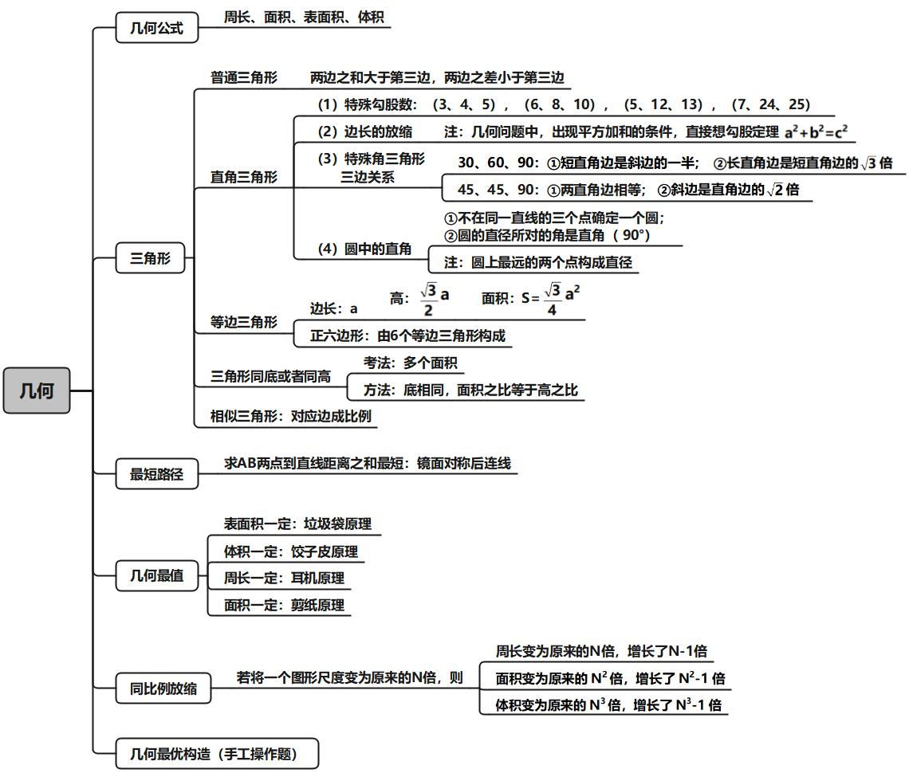
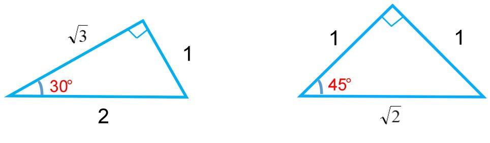
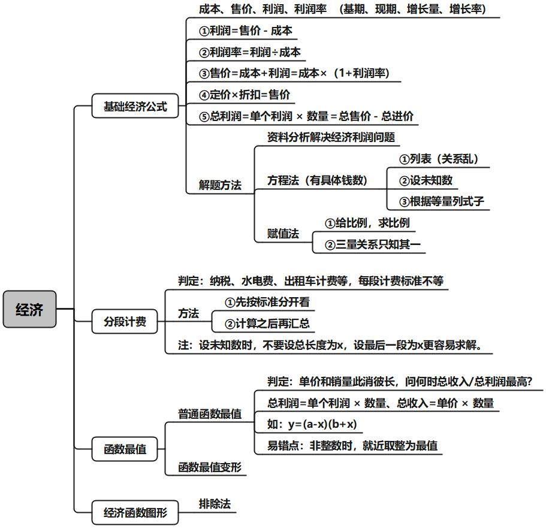
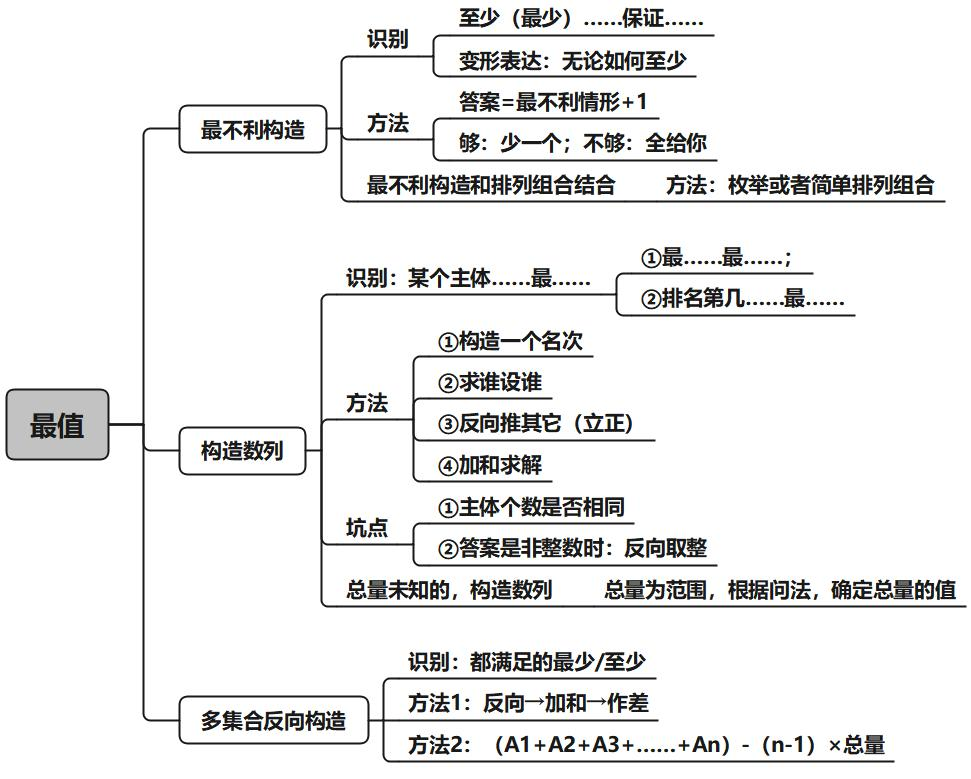

# 第一章  倍数特性

## 1.整除

**如果，$\mathbf{A}=\mathbf{B}\times \mathbf{C}$（$\mathbf{B、C}$ 均为整数），那么，$\mathbf{A}$ 能被 $\mathbf{B}$ 整除，且 $\mathbf{A}$ 能被 $\mathbf{C}$ 整除。** 

（1）口诀法（常用于 $\mathbf{3、4、5、9}$）:    

**$\mathbf{3/9}$ 看各位数字之和，$\mathbf{5}$ 看末位，$\mathbf{4}$看末两位。**

> $\mathbf{3/9}$     →  看各位数字之和能否被 $\mathbf{3/9}$ 整除；
> $\mathbf{2/5}$     →  看数字末一位能否被 $\mathbf{2/5}$ 整除；
> $\mathbf{4/25}$   →  看数字末两位能否被 $\mathbf{4/25}$ 整除 ；
> $\mathbf{8/125}$ →  看数字末三位能否被 $\mathbf{8/125}$ 整除。

（2）拆分法（没口诀，常用于 $\mathbf{7、11、13}$）

一个数=接近且明显能被整除的数±零头，只看零头。

> 623÷7 把 623 拆成 7 的倍数±零头，只看零头能否被 7 整除。

(3）因式分解（复杂倍数，常用于 $\mathbf{6、12、18、24}$  等）   

因式分解成两个互质（**互质指两数没有公约数**）的数，同时满足能被这两个数整除。  

> 24=3×8

## 2.余数

余数型（公务员思想： 均分思想 、多退少补）  

（1）特性：每人、均分、多几个、少几个；
（2）若 ${总数}= {ax}+ {b}$，则 ${ ({总数} -{b})}$ 能被 ${a}$ 整除。（${a、x}$ 均为整数）。

## 3.比例

**比例型适用于：**  

1、题干特征：分数、比例、百分数、倍数  
2、对象特征：描述对象为不可分割的整体，整数才有意义。人、车、年龄等  
	核心：问题和分子、分母的关系。  

> 已知某班：$\dfrac{\textbf{男}}{\textbf{女}}=\dfrac {\mathbf{m}} {\mathbf{n}}$  
>
> （最简分数），问：  
> 	① 男生人数是 $\mathbf{m}$ 的倍数。  
> 	② 女生人数是 $\mathbf{n}$ 的倍数。   
> 	③ 全班人数是 $(\mathbf{m}+\mathbf{n})$ 的倍数。  
> 	④ 男女生人数差是 $(\mathbf{m}-\mathbf{n})$ 的倍数。  
> 表达方式：  
> 	① 男员工是女员工的 $\dfrac 35$（分数）；  
> 	② 男员工与女员工之比 $3:5$（比例）；  
> 	③ 男员工是女员工的 $60\%$（百分数）；  
> 	④ 男员工是女员工的 $0.6$ 倍（倍数）。  

3.延伸考法

（1）考法一： 

​	$\dfrac{\textbf{男}}{\textbf {女}}=\dfrac {\mathbf{m}} {\mathbf{n}}$  

（2）考法二：  

​	$\dfrac{\textbf{男}-2}{\textbf{女}}=\dfrac {\mathbf{m}} {\mathbf{n}}$  

（3）考法三（A与非A思想）：  

​	$\dfrac{\textbf{甲}}{\textbf{其它}}=\dfrac {\mathbf{m}} {\mathbf{n}}$  

## 4.倍数特性之增长率型（用资料解决数量）

充分利用已学过的资料分析来解决数量问题。

（1）分析关系：基期、现期、增长量、增长率。
（2）结合选项，做猜结合。    

## 5.倍数特性之 $A=B\times C$（ 用资料解决数量）

1.形式：$\mathbf{A}=\mathbf{B} \times \mathbf{C}$，给单个量。

2.方法：赋值 。

​	公倍数求法：短除法  

> **最小公倍数数求法**：
>
> 
>
> 最小公倍数为 $\underline {10}\times \underline {5} \times \underline {3} \times 5 \times 9 = 6750$

# 第二章  方程问题

## 1.普通方程：一个未知数（x）

## 2.普通方程组：多个未知数（设 x、y、z）

## 3.不定方程

## 4.不定方程

# 第三章  周期问题

### 一、周期余数

1.**题型特征**：出现循环或周期，问 ？个，往往数据很多，或者数字很大，找规律即可。 

2.**解题思路**：  

（1）找周期：确定周期的起点和长度。 
（2）算余数：$\textbf{总数 ÷ 周期长度 = 多个周期…余数（n）}$ 
（3）做等价：第 $\mathbf n$ 个：余几数几（无余数，周期最后一个）

3.一串数字，一定枚举找规律。

### 二、周期相遇

1.**题型特征**：出现多个小周期，求再次相遇；

2.**方法**：最小公倍数相遇 ；

3.注（题目坑）：$\textbf{每隔 }\mathbf n \textbf{ 天}=\textbf{每 } \mathbf {n+1} \textbf{ 天}$

### 三、星期日期问题  

星期日期判断：

大月与小月：一三五七八十腊，三十一天永不差。 
	大月 31 天 (1、3、5、7、8、10、12) 
	小月 30 天 (4、6、9、11) 
	2 月 28（29） 天

注：  

（1）每个月都必然有完整的 4 周
（2）鉴于“一个自然月内最多有……”应将这个自然月按照大月 31 天计算。    

12 生肖：

子鼠、丑牛、寅虎、卯兔、辰龙、巳蛇、午马、未羊、申猴、酉鸡、戌狗、亥猪。
注意：本命年以 12 为周期  

1.**题型特征**：给出一段时间内有若干个周几，推算某一天为周几。

2.**常用结论**：    

（1）每连续 7 天，必有周一到周日各 1 天
（2）每连续 28 天，必有周一到周日各 4 天  

3.**解题思路**：每个月都必然有 4 周，取连续 28 天

4.**结论**：**平年+1，闰年+2，大月+3，小月+2。**
	平闰年判定：平年 365 天（2 月 28 天），闰年 366 天（2 月 29 天）
	下半年固定为184 天
	==年份数能被 $\mathbf 4$ 整除的为闰年，否则为平年；整百的年份需要被 $\mathbf {400}$ 整除。==
	==整年推断：过一个平年星期数 $\mathbf +1$，过一个闰年星期数 $\mathbf +2$==。 
	注：可以简记为==52周零1天（闰年零2天）。==  

5.技巧：前 = 后（余数）

> 即余数为几，则取周期排列的前几天
>
> 如 $\dfrac{30}7 = 4……2$
>
> $\boxed{六日}一二三四五|六日一二三四五|六日一二三四五|\boxed{六日}$

如何求分数的最小公倍数： 

​	$分数的最小公倍数\begin{cases}	\mathbf{（1）分母通分}\\	\mathbf{（2）求分子最小公倍数}\\	\mathbf{（3）\dfrac{分子最小公倍数}{分母}	}\end{cases}$

> 求：10、$\dfrac{25}4$、$\dfrac {25}6$ 的最小公倍数

注意：对日期和星期对应题，或者复杂相遇问题，直接枚举即可。  

# 第四章  工程问题

## 一、具体单位型

==特征：有具体的效率或者总量。==

方法：列方程，根据问题求解。  

## 二、完工时间型

### 1.普通完工时间型

完工时间型
==特征：多个主体的完工时间==
方法：
$\textbf{总量 =  效率} \times \textbf{时间}$ 
第一步：赋值总量（公倍数） 
第二步：求效率
第三步：列表或列方程求解    

### 2.工程费用

特征：有工期时间的限制。

费用最小：让便宜的工作最久。

### 3.周期循环工程（确定周期）   

方法：确定周期

### 4.复杂方程的完工时间型  

方法：不会解，不想解，就==代入==。    

$$
\mathbf{\frac{4}{x}+ \frac{4}{x+15}=1\qquad {x}=?}
$$

### 5.多个工程的完工时间型  

特征：多个工程的完工时间型
方法：列多个工程 
计算：==好算为原则==    

## 三、效率比例型  

1.直接给：$\mathbf {甲:乙=3:4}$；甲的效率是乙的 $\mathbf {2.5}$ 倍；甲的效率比乙高 $\mathbf {25\%}$。

2.间接给：工作量相等，以工作量推效率关系   

（1）甲 $\mathbf 4$ 天的工作量等于乙 $\mathbf 3$ 天的工作量（==坑点==） 

$\mathbf{4甲 = 3 乙 \quad \rightarrow \quad \dfrac 甲乙 = \dfrac 34}$ 

（2）甲、乙两个工程队合作完成某工程需 $\mathbf {36}$ 天，若甲工程队先做 $\mathbf {10}$ 天，剩下的工程再由两队合作 $\mathbf {30}$ 天完成。

> $总 = 36(甲+乙) = 10甲 + 30(甲 + 乙)$
>
> $\to\dfrac 甲乙 = \dfrac 32$

3.给具体人数或机器数：

​	$\mathbf {50}$ 个工人修路，$\mathbf {80}$ 台挖掘机；
​	赋值每个人 / 每台机器效率为 $\mathbf 1$。  

## 四、统筹工程问题

方法：擅长的人干擅长的事。

## 五、工程图形问题

研究：时间的关系、效率的关系
做题方法：排除法

## 六、牛吃草问题

$$
牛吃草考法
\begin{cases}
纯牛问题(牛吃草、羊吃草) \quad \mathbf{y=(N-x)×T}\\
牛吃草变形
{\begin{cases}
	变形1:牛羊吃草，转换为羊(或牛)单独吃草\\
	变形2:给单个牛的效率，效率就是 \quad \mathbf {n \times 效率}\\
	变形3:氧气瓶漏气 \quad \mathbf {y= (N+x)\times  T}\\
	变形4:牛的效率变化\\
	\end{cases}}\\

资源类消耗
	{\begin{cases}
	草场 \\
	森林 \\
	水管进出水
		{\begin{cases}
		宏观:水库 \\
		微观:泳池 
		\end{cases}}
	\end{cases}}\\
服务类:窗口办理业务
\end{cases}
$$

### （1）普通牛吃草

基本公式 $\mathbf{y=(N-x)×T}$   
$\mathbf y$：代表原有存量的消耗量 （比如：原有草量吃完啦）
$\mathbf N$：促使原有存量消耗的变量 （比如：牛数）
$\mathbf x$ ：存量的自然生长速度 （比如：草长速度）
$\mathbf T$：时间  

> 【考法合集：充分认知】
>
> 一片草地每天都以平均速度生长，已知这片草地可以供 $\mathbf{25}$ 头牛吃 $\mathbf {12}$ 天，或者供 $\mathbf {40}$ 头牛吃 $\mathbf 6$ 天。 
> $\mathbf{y=(N-x)×T = (25 - x)\times 12 = (40-x) \times 6}$ 
> $\rightarrow \mathbf {x = 10,\quad y = 180}$ 
> 问题1：草生长速度是多少？ 
> $\mathbf {10}$ 
> 问题2：这片草地原有多少草量？ 
> $\mathbf {180}$ 
> 问题3：这片草地可以供 $\mathbf {30}$ 头牛吃多少天？ 
> $\mathbf {180 = (30-10)\times T}$ 
> $\rightarrow \mathbf {T = 9}$ 
> 问题4：草地上有 $\mathbf {28}$ 头牛，需要多少天，原有草地还剩 $\mathbf {40\%}$ ？ 
> $\mathbf {180 \times 60\% = (28-10)\times T}$ 
> $\rightarrow \mathbf {T = 6}$ 
> 问题5：要想可持续发展（草永远吃不完），每天最多放多少头牛？ 
> $\mathbf {N=x}$ 时，可持续最多  

### （2）牛吃草变形

变形 1：牛羊吃草，转换为羊(或牛)单独吃草
变形 2：给单个牛的效率，效率就是 $\mathbf {n \times 效率}$
变形 3：氧气瓶漏气 $\mathbf {y= (N+x)\times  T}$
变形 4：牛的效率变化

# 第五章  几何问题

情：超级高频题型
特点：技巧性特别强：做、量、猜
最佳策略：识别、记忆
需要图形意识，图形意识，学会画图，建立图形意识。

## 一、几何公式

**✓ 周长类**
$$
\mathbf {\textbf {正方形周长}=4a \qquad \textbf {长方形周长}=2(a+b) \qquad \textbf {圆形周长}=2 \pi r \qquad \textbf {弧长} =\dfrac{\mathbf{n^{\circ}}}{360^{\circ}}2\pi\mathbf{r}}
$$
**✓ 面积类**  
$$
\begin{aligned}&\textbf{正方形面积}\mathbf{=a}^2&&\textbf{长方形面积=}\mathbf{ab}&&\textbf{平行四边形面积=底}\times\textbf{高}\\&\textbf{三角形面积=}\mathbf {\frac12}\textbf{底}\times\textbf{高}&&\textbf{圆形面积=}\pi \mathbf{r^2}&&\textbf{扇形面积=}\frac{\mathbf{n^{\circ}}}{360^{\circ}}\pi\mathbf{r^{2}}\\&\textbf{梯形面积=}\mathbf {\frac12}\mathbf{~(a+b)\times h}&&\textbf{菱形面积=}\mathbf{\frac12}\textbf{对角线乘积}\end{aligned}
$$
**✓ 表面积类**  
$$
\begin{aligned}&\textbf{正方体表面积=6}\mathbf{a}^2&&\textbf{长方体表面积}=\mathbf {2(ab+bc+ac)}\\&\textbf{圆柱体表面积}\mathbf{=2}\pi\mathbf{R^2+2}\pi\mathbf{R}\mathbf{h}&&\textbf{球体表面积}\mathbf {=4}\pi\mathbf{R}^2\end{aligned}
$$

**✓ 体积类** 
$$
\begin{aligned}&\textbf{正方体体积=}\mathbf {a^3}&&\textbf{长方体体积}= \mathbf {abc}&&\textbf{长方体体对角线=}\mathbf {\sqrt{a^2+b^2+c^2}}\\&\textbf{柱体体积}=\mathbf{Sh}&&\textbf{锥体体积=}\mathbf{\frac13 Sh}&&\textbf{球体体积=}\frac43\pi\mathbf{R}^3\\&&&\textbf{锥体侧面积=}\pi\mathbf{rl}&&\textbf{圆台侧面积=}\pi(\mathbf {r_1+r_2)l}\end{aligned}
$$

**✓ 其他**

$\textbf{锥体侧面积=}\mathbf {\dfrac 12 \cdot 2 \pi rl} = \pi\mathbf{rl}$ （类三角形）

$\textbf{圆台侧面积=}\mathbf {\dfrac 12 (2\pi r_1 + 2 \pi r_2)l }= \pi(\mathbf {r_1+r_2)l}$ （类梯形）

$\textbf{多边形内角和=}\mathbf{(n-2)\times 180^{\circ}}$ 

常考根号：$\mathbf {\sqrt{2}\approx1.414、\sqrt{3}\approx1.732、\sqrt{5}\approx2.236}$

## 二、三角形  

**1、普通三角形** 

​	两边之和大于第三边
​	两边之差小于第三边   

**2、特殊三角形：直角三角形、等边三角形**   

常考点 $\mathbf {a^2+b^2=c^2}$、特殊角三角形三边关系；

（1）特殊勾股数：$\mathbf {(3、4、5)}$、$\mathbf {(6、8、10)}$、$\mathbf {(5、12、13)}$ 、$\mathbf {(7、24、25)}$
（2）边长的放缩
	注：几何问题中，出现平方加和的条件，直接想勾股定理（$\mathbf {a^2+b^2=c^2}$）
（3）特殊角三角形三边关系。

​	$\mathbf {30、60、90}$ 
​	① 短直角边是斜边的一半
​	② 长直角边是短直角边的 $\mathbf {\sqrt 3}$ 倍  

​	$\mathbf {45、45、90}$ （等腰直角三角形） 
​	① 直角边相等 
​	② 斜边是直角边的 $\mathbf {\sqrt 2}$ 倍  

**4.等边三角形** 

​	边长： $\mathbf a$          高：$\mathbf {\dfrac{\sqrt{3}}2a}$           面积: $\mathbf {S=\dfrac{\sqrt{3}}{4}a^{2}}$  

**5.正六边形:** 

​	由 6 个等边三角形构成  

**6.圆中的直角** 

（1）不在同一直线的三个点确定一个圆；
（2）圆的直径所对的角是直角（ $\mathbf {90°}$）。

注：圆上最远的两个点构成直径。  

**7.三角形同底或者同高** 

考法：多个面积 
方法：底相同，面积之比等于高之比  

### （1）直角三角形

### （2）正六边形

### （3）坐标构造

### （4）三角形同底或者同高

考法：多个面积   
方法：底相同，面积之比等于高之比

### （5）相似三角形

两个角相等，三角形相似。

对应边成比例。

## 三、最短路径

1.考查方式：求AB两点到直线距离之和最短  
2.解题原理：两点之间，线段最短  
3.解题技巧：  
（1）两点异侧，直接连线  
（2）两点同侧，到直线的最短，镜面对称后连线  

## 四、几何最值

1、立体最值    

（1）立体图形中，若==表面积一定，越接近于球，体积越大。（垃圾袋原理）==       
（2）立体图形中，若==体积一定，越接近于球，表面积越小。（饺子皮原理）==      

2、平面最值

（1）平面图形中，==周长一定，越接近于圆，面积越大==
（2）平面图形中，==面积一定，越接近于圆，周长越小==       

3、长方形最值       

（1）四边形==周长一定时，正方形面积最大==     
（2）四边形==面积一定时，正方形周长最小==    

## 五、等比例放缩

若将一个图形尺度变为原来的 $\mathbf N$ 倍，则  

1、对应角度不变 
2、周长变为原来的 $\mathbf N$    倍，增长了 $\mathbf {N-1}$   倍 
3、面积变为原来的 $\mathbf {N^2}$ 倍，增长了 $\mathbf {N^2-1}$ 倍 
4、体积变为原来的 $\mathbf {N^3}$ 倍，增长了 $\mathbf {N^3-1}$ 倍  

|  尺度  |                比例                 |               增长了                |
| :----: | :---------------------------------: | :---------------------------------: |
| 长度比 |  $\mathbf {1:N}$ $\Downarrow$  |  $\mathbf {N-1}$ $\Downarrow$  |
| 面积比 | $\mathbf {1:N^2}$ $\Downarrow$ | $\mathbf {N^2-1}$ $\Downarrow$ |
| 体积比 |          $\mathbf {1:N^3}$          |          $\mathbf {N^3-1}$          |

# 第六章  经济问题

## 1.基础经济

1.识别特征：

……进价……利润（利润率）……，销售价……

2.常用公式（基期、现期、增长量、增长率）

（1）$\textbf {进价（成本）+利润=售价}$
（2）$\textbf {利润率}=\dfrac {\textbf{利润}}{\textbf {成本}}$ 
（3）$\textbf{进价}\times(\mathbf 1+\textbf{利润率})=\textbf{售价}$
（4）$\textbf {总价=单价×数量}$ 
（5）$\textbf {定价×折扣=售价}$

注：$定价的 9 折=定价×0.9$

$\textbf {总利润} = \textbf{单利} \times \textbf{数量 = 总收入- 总成本}$

3.解题思路：根据等量列等式

（1）若只有单价商品，优先切入点为进价；
若出现多件商品，优先切入点为商品数量
（2）若出现折扣，一定要注意区分价格

### （1）资料分析解决经济利润问题

（1）利用：基期、现期、增长量、增长率关系

（2）线段法混合思想：$\textbf{利润率}=\dfrac{\textbf{利润}}{\textbf{成本}}$

（3）连续涨价（或跌价）： 

正向：$\mathbf {r_\text{\tiny{\textbf 间}}=r_1+ r_2+ r_1\times r_2}$ 
反向：$\mathbf {r_2 = \dfrac {r_\text{\tiny{\textbf 间}} -r_1}{1+r_1}}$ 

（4）$\mathbf {A=B \times C}$  解题法

### （2）方程法

特征：有具体钱数
（1）列表（关系乱）
（2）设未知数
（3）根据等量列式子

### （3）赋值法

赋值法：

① 给比例，求比例

② 三量关系只知其一

（$\textbf {总价=单价×数量}$）
（总量＝效率×时间）
（路程＝速度×时间）

操作方式：

① 根据条件对成本或者售价进行赋值即可
② 商品数量有比例，优先赋值数量的个数（5、10）
难点：赋值谁——变化谁，赋值谁

## 2.分段计费

1.识别特征（计费规则达到分段点后变为不同费用） 

例：……规定为：……1300元（含）以内的部分……，超出1300元部分…… 

2.解题方法：先分段，再汇总 

注：先定位分段点，讨论费用涉及哪几个分段（不重不漏）  

注：设未知数时，不要设总长度为 $x$，设最后一段为 $x$ 更容易求解。

## 3.函数最值

题型判定：$\textbf {总利润=单利×数量}$  
判定：单价和销量此消彼长，问何时总收入/总利润最高？

计算方法（两点式）：
如：$\mathbf {y=(a-x)(b+x)}$

① 设次数，根据问法列方程，写成两括号相乘的形式
② 求出使方程等于 $\mathbf 0$，解得 $\mathbf{x}_{1}, \mathbf{x}_{2}$
③ 求出两个 $\mathbf x$ 的平均值 $\mathbf{x}={\dfrac{\mathbf{x}_{1}+\mathbf{x}_{2}}{2}}$ 时，此时 $\mathbf y$ 最值

## 4 .经济函数图形

函数最值变形：属于图形分析。

方法：排除法

# 第七章  最值问题

## 1.最不利构造

（1）普通最不利构造  

特征：至少……保证、无论如何至少 
方法：==$\textbf {答案=最不利情形+1}$==

> 【引例1】袋子中装有 5 个红球，8 个白球，10 个黄球。
> ① 至少取出 $8+10 + 1=19$ 个，才能保证有红球
> ② 至少取出 $2 + 2 + 2 + 1=7$ 个，才能保证至少有3个同色的球
> ③ 至少取出 $5+7 + 7  + 1=20$ 个，才能保证至少有8个同色的球  

注意：==够了少一个，不够全给==。 

方法：要保证同种情况至少 $\mathbf n$ 个，应每种情况各取 $\mathbf {(n－1)}$个（如果有不够 $\mathbf {n－1}$ 的有多少取多少）， 最后再加 $\mathbf 1$。  

（2）最不利构造和排列组合结合（枚举或者简单排列组合）  

方法：枚举或者简单排列组合  
枚举：等差，加和  

> 1、行测考试有言语、判断、资料、数量、常识五个科目，每名同学选一科学习。若要保证至少有 5 名同学学习 的科目完全相同，至少需要多少人？
>
> $4+4+4+4+1= 21$
>
> 2、行测考试有言语、判断、资料、数量、常识五个科目，每名同学选两科学习。若要保证至少有 5 名同学学习 的科目完全相同，至少需要多少人？
>
> 选择的情况：$C^{2}_{5} =10$。
> $4\times 10+1 = 41$
>
> 3、行测考试有言语、判断、资料、数量、常识五个科目，每名同学选一科或者两科学习。若要保证至少有 5 名 同学学习的科目完全相同，至少需要多少人？
>
> 选一科：$5$ 种
> 选两科：$C^{2}_{5} =10$ 种|
> 共 15 种
> $15\times 4+1=61$
>
> 

## 2.构造数列

（1）普通构造数列

特征：某个主体……最……（1、最……最……；2、排名第几……最……）

方法：
① 构造一个名次
② 求谁设谁
③ 反向推其它（立正）
④ 加和求解

坑点：
① 主体个数是否相同
② 答案是非整数时：==反向取整==

​	某个主体……最多……，向下取整 
​	某个主体……最少……，向上取整

> 19.2 至少  19

（2）总量未知的，构造数列

总量为范围，根据问法，确定总量的值
常识思维：
① 求某个主体最多，总量尽量多。
② 求某个主体最少，总量尽量少。

## 3.多集合反向构造

1.题型特征：**都满足的最少/至少**
2.
方法 1：反向→加和→作差  

（1）反向 
（2）加和 
（3）作差  

> 【引例】有100人，行测学习中：学习言语90人，学习判断88人，学习资料92人，学习常识80人，学习数量60人，问“都学”的至少有多少人？
>
> |                                            |                   言语 90                   |  判断 88  | 资料 92 | 常识 80 | 数量 60 |
> | :----------------------------------------- | :-----------------------------------------: | :-------: | :-----: | :-----: | :-----: |
> | 1.反向：不学                               |                     10                      |    12     |    8    |   20    |   40    |
> | 2.加和：不学最多 (分散开，人数尽量多) |           10+20+8+20+40 =90            |           |         |         |         |
> | 3.做差                                     | 总  - 不学(最多)= 都学(至少) 100-90=10 | 100-90=10 |         |         |         |

方法 2：$\mathrm{(A_1+A_2+A_3+......+A_n)-(n-1)\times}\text{总量}$  

> 1.反向   100-90   A2 = 100-80   100-90   100-80   100-60
>
> 2.加和   c = 5*100 -  （A1-……-A5)
>
> 3.做差   100 - c = $\mathrm{(A_1+A_2+A_3+......+A_5)-4\times}100$ 

注：==加和最多，分散不重叠，没有什么都不学的前提下==

# 第八章  容斥原理

## 1.两集合

## 2.三集合

## 3.画图法

## 4.容斥原理结合不定方程

## 5.容斥原理和周期结合

# 第九章  等差数列和等比数列

## 1.等差数列

## 2.等比数列

# 第十章  行程问题

## 1.基础行程

## 2.相对行程

## 3.比例行程

# 第十一章  排列组合

## 1.基础概念

## 2.分类思想

## 3.枚举

## 4.捆绑法

## 5.插空法

## 6.插板法

## 7.错位排列

## 8.环形排列

# 第十二章  概率问题

## 1.给情况求概率

## 2.给概率求概率

## 3.分类思想：正反向思维

## 4.几何概率

## 5.跟屁虫问题

## 6.比赛类概率

## 7.抓阄密码类

## 8.骰子问题

# 第十三章  年龄问题

## 1.年龄特性解题和方程法解题

## 2.年龄和不定方程结合

## 3.年龄和年龄的平方

## 4.属相和本命年

# 第十四章  溶液问题

## 1.溶液公式

## 2.等量变化：蒸发稀释

## 3.反复操作

# 第十五章  计数问题：平方数、植树和方阵问题

## 1.平方数

## 2.植树问题

## 3.方阵问题

# 第十六章  数量易拿分小题型

## 1.钟表问题

## 2.标 1 法

## 3.空瓶换酒公式

## 4.货物集中—— 统筹运输问题

## 5.线切面问题

## 6.时间统筹

## 7.爬楼问题

## 8.网状图

## 9.脑筋急转弯—— 天平问题
