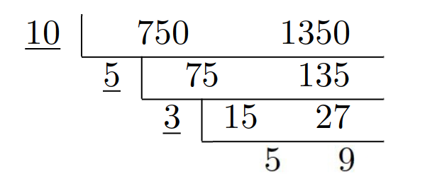
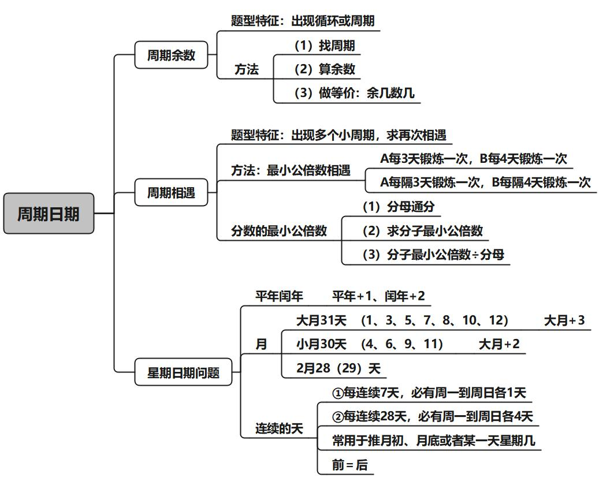
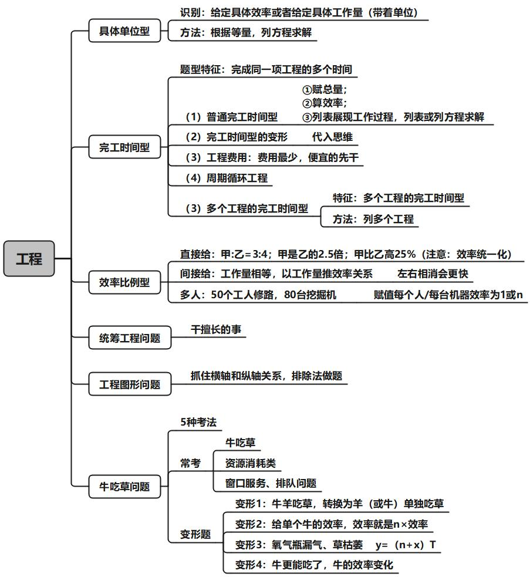

# 第一章  倍数特性

## 1.整除

**如果，$\mathbf{A}=\mathbf{B}\times \mathbf{C}$（$\mathbf{B、C}$ 均为整数），那么，$\mathbf{A}$ 能被 $\mathbf{B}$ 整除，且 $\mathbf{A}$ 能被 $\mathbf{C}$ 整除。** 

（1）口诀法（常用于 $\mathbf{3、4、5、9}$）:    

**$\mathbf{3/9}$ 看各位数字之和，$\mathbf{5}$ 看末位，$\mathbf{4}$看末两位。**

> $\mathbf{3/9}$     →  看各位数字之和能否被 $\mathbf{3/9}$ 整除；
> $\mathbf{2/5}$     →  看数字末一位能否被 $\mathbf{2/5}$ 整除；
> $\mathbf{4/25}$   →  看数字末两位能否被 $\mathbf{4/25}$ 整除 ；
> $\mathbf{8/125}$ →  看数字末三位能否被 $\mathbf{8/125}$ 整除。

（2）拆分法（没口诀，常用于 $\mathbf{7、11、13}$）

一个数=接近且明显能被整除的数±零头，只看零头。

> 623÷7 把 623 拆成 7 的倍数±零头，只看零头能否被 7 整除。

(3）因式分解（复杂倍数，常用于 $\mathbf{6、12、18、24}$  等）   

因式分解成两个互质（**互质指两数没有公约数**）的数，同时满足能被这两个数整除。  

> 24=3×8

## 2.余数

余数型（公务员思想： 均分思想 、多退少补）  

（1）特性：每人、均分、多几个、少几个；
（2）若 ${总数}= {ax}+ {b}$，则 ${ ({总数} -{b})}$ 能被 ${a}$ 整除。（${a、x}$ 均为整数）。

## 3.比例

**比例型适用于：**  

1、题干特征：分数、比例、百分数、倍数  
2、对象特征：描述对象为不可分割的整体，整数才有意义。人、车、年龄等  
	核心：问题和分子、分母的关系。  

> 已知某班：$\dfrac{\textbf{男}}{\textbf{女}}=\dfrac {\mathbf{m}} {\mathbf{n}}$  
>
> （最简分数），问：  
> 	① 男生人数是 $\mathbf{m}$ 的倍数。  
> 	② 女生人数是 $\mathbf{n}$ 的倍数。   
> 	③ 全班人数是 $(\mathbf{m}+\mathbf{n})$ 的倍数。  
> 	④ 男女生人数差是 $(\mathbf{m}-\mathbf{n})$ 的倍数。  
> 表达方式：  
> 	① 男员工是女员工的 $\dfrac 35$（分数）；  
> 	② 男员工与女员工之比 $3:5$（比例）；  
> 	③ 男员工是女员工的 $60\%$（百分数）；  
> 	④ 男员工是女员工的 $0.6$ 倍（倍数）。  

3.延伸考法

（1）考法一： 

​	$\dfrac{\textbf{男}}{\textbf {女}}=\dfrac {\mathbf{m}} {\mathbf{n}}$  

（2）考法二：  

​	$\dfrac{\textbf{男}-2}{\textbf{女}}=\dfrac {\mathbf{m}} {\mathbf{n}}$  

（3）考法三（A与非A思想）：  

​	$\dfrac{\textbf{甲}}{\textbf{其它}}=\dfrac {\mathbf{m}} {\mathbf{n}}$  

## 4.倍数特性之增长率型（用资料解决数量）

充分利用已学过的资料分析来解决数量问题。

（1）分析关系：基期、现期、增长量、增长率。
（2）结合选项，做猜结合。    

## 5.倍数特性之 $A=B\times C$（ 用资料解决数量）

1.形式：$\mathbf{A}=\mathbf{B} \times \mathbf{C}$，给单个量。

2.方法：赋值 。

​	公倍数求法：短除法  

> **最小公倍数数求法**：
>
> 
>
> 最小公倍数为 $\underline {10}\times \underline {5} \times \underline {3} \times 5 \times 9 = 6750$

# 第二章  方程问题

## 1.普通方程：一个未知数（x）

## 2.普通方程组：多个未知数（设 x、y、z）

## 3.不定方程

## 4.不定方程

# 第三章  周期问题

### 一、周期余数

1.**题型特征**：出现循环或周期，问 ？个，往往数据很多，或者数字很大，找规律即可。 

2.**解题思路**：  

（1）找周期：确定周期的起点和长度。 
（2）算余数：$\textbf{总数 ÷ 周期长度 = 多个周期…余数（n）}$ 
（3）做等价：第 $\mathbf n$ 个：余几数几（无余数，周期最后一个）

3.一串数字，一定枚举找规律。

### 二、周期相遇

1.**题型特征**：出现多个小周期，求再次相遇；

2.**方法**：最小公倍数相遇 ；

3.注（题目坑）：$\textbf{每隔 }\mathbf n \textbf{ 天}=\textbf{每 } \mathbf {n+1} \textbf{ 天}$

### 三、星期日期问题  

星期日期判断：

大月与小月：一三五七八十腊，三十一天永不差。 
	大月 31 天 (1、3、5、7、8、10、12) 
	小月 30 天 (4、6、9、11) 
	2 月 28（29） 天

注：  

（1）每个月都必然有完整的 4 周
（2）鉴于“一个自然月内最多有……”应将这个自然月按照大月 31 天计算。    

12 生肖：

子鼠、丑牛、寅虎、卯兔、辰龙、巳蛇、午马、未羊、申猴、酉鸡、戌狗、亥猪。
注意：本命年以 12 为周期  

1.**题型特征**：给出一段时间内有若干个周几，推算某一天为周几。

2.**常用结论**：    

（1）每连续 7 天，必有周一到周日各 1 天
（2）每连续 28 天，必有周一到周日各 4 天  

3.**解题思路**：每个月都必然有 4 周，取连续 28 天

4.**结论**：**平年+1，闰年+2，大月+3，小月+2。**
	平闰年判定：平年 365 天（2 月 28 天），闰年 366 天（2 月 29 天）
	下半年固定为184 天
	==年份数能被 $\mathbf 4$ 整除的为闰年，否则为平年；整百的年份需要被 $\mathbf {400}$ 整除。==
	==整年推断：过一个平年星期数 $\mathbf +1$，过一个闰年星期数 $\mathbf +2$==。 
	注：可以简记为==52周零1天（闰年零2天）。==  

5.技巧：前 = 后（余数）

> 即余数为几，则取周期排列的前几天
>
> 如 $\dfrac{30}7 = 4……2$
>
> $\boxed{六日}一二三四五|六日一二三四五|六日一二三四五|\boxed{六日}$

如何求分数的最小公倍数： 

​	$	分数的最小公倍数\begin{cases}	\mathbf{（1）分母通分}\\	\mathbf{（2）求分子最小公倍数}\\	\mathbf{（3）\dfrac{分子最小公倍数}{分母}	}\end{cases}$

> 求：10、$\dfrac{25}4$、$\dfrac {25}6$ 的最小公倍数

注意：对日期和星期对应题，或者复杂相遇问题，直接枚举即可。  

# 第四章  工程问题

## 1.具体单位

## 2.完工时间

## 3.效率比例型

## 4 .统筹工程问题

## 5 . 工程图形问题

## 6 . 牛吃草问题

# 第五章  几何问题

## 1 .几何公式

## 2 .三角形

## 3 .最短路径

## 4 .几何最值

## 5 . 同比例放缩

## 6 . 几何最优构造（手工操作题）

# 第六章  经济问题

## 1.基础经济

## 2.分段收费

## 3.经济函数最值

## 4.经济函数图形

# 第七章  最值问题

## 1 .最不利构造

## 2.构造数列

## 3.多集合反向构造

# 第八章  容斥原理

## 1.两集合

## 2.三集合

## 3.画图法

## 4.容斥原理结合不定方程

## 5.容斥原理和周期结合

# 第九章  等差数列和等比数列

## 1.等差数列

## 2.等比数列

# 第十章  行程问题

## 1.基础行程

## 2.相对行程

## 3.比例行程

# 第十一章  排列组合

## 1.基础概念

## 2.分类思想

## 3.枚举

## 4.捆绑法

## 5.插空法

## 6.插板法

## 7.错位排列

## 8.环形排列

# 第十二章  概率问题

## 1.给情况求概率

## 2.给概率求概率

## 3.分类思想：正反向思维

## 4.几何概率

## 5.跟屁虫问题

## 6.比赛类概率

## 7.抓阄密码类

## 8.骰子问题

# 第十三章  年龄问题

## 1.年龄特性解题和方程法解题

## 2.年龄和不定方程结合

## 3.年龄和年龄的平方

## 4.属相和本命年

# 第十四章  溶液问题

## 1.溶液公式

## 2.等量变化：蒸发稀释

## 3.反复操作

# 第十五章  计数问题：平方数、植树和方阵问题

## 1.平方数

## 2.植树问题

## 3.方阵问题

# 第十六章  数量易拿分小题型

## 1.钟表问题

## 2.标 1 法

## 3.空瓶换酒公式

## 4.货物集中—— 统筹运输问题

## 5.线切面问题

## 6.时间统筹

## 7.爬楼问题

## 8.网状图

## 9.脑筋急转弯—— 天平问题
