[toc]

# 第一章  速算技巧

$$
{\large\text{速算技巧} }
\begin{cases} 
    \text{加、减法} \begin{cases} 
        \text{尾数法} \begin{cases} 
            \text{何时用：加、减法，精算，尾数不同} \\ 
            \text{怎么用：尾数进行加减，观察选项} 
        \end{cases} \\ 
        \text{高位叠加} \begin{cases} 
            \text{何时用：多个数加和，精算、估算} \\ 
            \text{怎么用：从高位加起，精算，一加到底，估算，两加一估} 
        \end{cases} \\ 
        \text{划线减法} \begin{cases} 
            \text{临界值：插入临界值} \\ 
            \text{普通数值：划线，以好算、少借位为前提} 
        \end{cases} 
    \end{cases} \\ \\ 
    \text{乘法} \begin{cases} 
        \text{高位乘法} \begin{cases} 
            \text{何时用：多位数}\times\text{一位数} \\ 
            \text{怎么用：高位乘起，最后叠加} 
        \end{cases} \\ 
        \text{拆分法} \begin{cases} 
            \text{何时用：多位数}\times\text{多位数，保留两位，且有一个数接近整十} \\ 
            \text{怎么用：先按整十计算，再分析误差} 
        \end{cases} \\ 
        \text{口诀法} \begin{cases} 
            \text{何时用：多位数}\times\text{多位数，保留两位，不接近整十} \\ 
            \text{怎么用：前前后后，里里外外} 
        \end{cases} \\ 
        \text{特殊数字} \begin{cases} 
            \text{技巧1：一个数}\times 1.5\text{，等于这个数}+\text{本身的一半} \\ 
            \text{技巧2：一个数}\times 1.1\text{，等于这个数错位相加} \\ 
            \text{技巧3：一个数}\times 0.9\text{，等于这个数错位相减} \\ 
            \text{技巧4：百化分，CP法辅助记忆} 
        \end{cases} 
    \end{cases} \\ \\ 
    \text{分数拆分} \begin{cases} 
        \text{何时用：分数在1、50\%左右} \\ 
        \text{怎么用：化1法、化半法} 
    \end{cases} \\ \\ 
    \text{截位直除} \begin{cases} 
        \text{何时用：除法估算} \\ 
        \text{怎么用} \begin{cases} 
            \text{看选项} \begin{cases} 
                \text{差距大，保留两位} \begin{cases} 
                    \text{首位均不同} \\ 
                    \text{首位相同，第二位不同，第二位差} > \text{首位} 
                \end{cases} \\ 
                \text{差距小，保留三位} \begin{cases} 
                    \text{首位均不同，但为临界值，例如：59与61} \\ 
                    \text{首位相同，第二位不同，第二位差} \le \text{首位} 
                \end{cases} \\ 
                \text{差距极小，保留四位 —— 前两位相同} 
            \end{cases} \\ 
            \text{看式子} \begin{cases} 
                \text{一步除法，截分母，厂除} \\ 
                \text{多步除法，截分子、分母，约分} 
            \end{cases} \\ 
            \text{看量级} \begin{cases} 
                \text{选项之间位数相同，无需考虑量级，计算有效数字即可} \\ 
                \text{选项之间存在约10、100倍的关系，先看量级，再计算} 
            \end{cases} 
        \end{cases} 
    \end{cases} \\ \\ 
    \text{等比修正} \begin{cases} 
        \text{何时用：复杂除法（主要用于基期差值、基期比例，选项差距小）} \\ 
        \text{怎么用} \begin{cases} 
            \text{估倍数：大致估算分子、分母间倍数} \\ 
            \text{同加减：分子、分母原来几倍，其加上或减去的数也为几倍} 
        \end{cases} 
    \end{cases} \\ \\ 
    \text{分数比较} \begin{cases} 
        \text{何时用：分数比较} \\ 
        \text{怎么用} \begin{cases} 
            \text{先分析：分子大，分母小，分数大} \\ 
            \text{再比较：竖着直接除，横着看倍数} 
        \end{cases} 
    \end{cases} 
\end{cases}
$$

## 〇、速算技巧概述

速算技巧分为加减法、乘法和除法，其中加减法包括尾数法、高位叠加法等，乘法涵盖拆分与口诀法，除法新增等比例修正内容。

## 一、加、减法

### 1.尾数法

1）何时用：加、减法，精算，尾数不同（精确度一致）；
2）怎么用：尾数进行加减，观察选项。

- 通过定位主体与尾数法快速求和，避免无效列式。
- 关键点：精确度一致指选项与题干数值单位相同，未进行近似处理。

### 2.加法：高位叠

（1）何时用：多个数加和，精算、估算；
（2）怎么用：从高位加起，精算：一加到底，估算：两加一估。
两加一估原则：前两位精确相加，第三位预估，结合选项排除干扰项。

- 核心技巧：数据有效性决定高位数字优先级，十位数相加总和必小于位数×100。

### 3.减法：划线减法

（一）临界值：（插入临界值）

临界值减法原理：

- 数轴分割法：将被减数与减数差值分解为临界值两侧部分和。

    > - 示例1：714-688=26（700右侧14+左侧12）
    > - 示例2：613-587=26（600右侧13+左侧13）
    > - 示例3：423-389=34（400右侧23+左侧11）

- 计算要点：

    - 临界值选择：优先取整百/整千等易计算数值；
    - 误差控制：确保两侧部分和计算准确；
    - 适用范围：特别适用于连续借位的减法运算。

（二）普通数值（划线方法，以好算、少借位为前提）

- 划线减法适用于避免借位的常规数值计算，核心原则为以少借位为前提。

    > - 示例1：814-634划线为81-63（得18）与6-4（得2），结果为182。
    > - 示例2：974-546划线为9-5（得4）与74-46（得28），结果为428。
    > - 示例3：697-516划线为69-51（得18）与7-6（得1），结果为181。

- 关键点：划线需对齐位数，补零防止错位（如56-47得09而非9）。
- 注意事项：小数点对齐与位数补零为易错点。

## 二、乘法

### 1.高位乘法

（1）何时用：多位数×一位数；
（2）怎么用：高位乘起，最后叠加。

高位乘法适用于多位数乘一位数，从最高位逐位计算并叠加结果，降低中间步骤错误率。

> - 例1：92×4的高位乘法
> - 步骤：90×4=360，2×4=8，叠加得368。
> - 例2：65×7的高位乘法与验证
> - 步骤：60×7=420，5×7=35，叠加得455。

### 2.拆分法

（1）何时用：多位数×多位数，保留两位，且有一个数接近整十；
（2）怎么用：先按整十计算，再分析误差。

- 整十拆分：接近整十的数可拆分为 $X0±Y$（如 $53×21=53×(20+1)=53×20+53×1=1113$）。
- 适用范围：两位数乘法，精算需求时需结合其他方法。

### 3.口诀法

（1）何时用：多位数×多位数，保留两位，不接近整十；
（2）怎么用：前前后后，里里外外。

> - 口诀“前前后后，里里外外”解释
> - 口诀应用：56×36分解为：
>   - 前前（5×3=15（50×30=1500））
>   - 后后（6×6=36）
>   - 里里（6×3=18）
>   - 外外（5×6=30）
> - 结果：叠加得2016，与传统竖式一致，适合清晰展示计算过程。
>
> $$
> \begin{array}{rcccc}  & 1 & 5 & 3 & 6 \\  &   & 1 & 8 &   \\ + &   & 3 & 0 &   \\ \hline  & 2 & 0 & 1 & 6 \end{array}
> $$

### 4.特殊数字

技巧1：$一个数×1.5$，等于这个数+本身的一半；

技巧2：$一个数×1.1$，等于这个数错位相加|；

技巧3：$一个数×0.9$，等于这个数错位相减；

技巧4：百化分。
$$
\begin{gather}
&\frac{1}{2}&=&50\%&\qquad \quad&\frac{1}{3}&=&33.3\%&\qquad \quad&\frac{1}{4}&=&25\%\\
&\frac{1}{5}&=&20\%&\qquad \quad&\frac{1}{6}&=&16.7\%&\qquad \quad&\frac{1}{7}&=&14.3\%\\
&\frac{1}{8}&=&12.5\%&\qquad \quad&\frac{1}{9}&=&11.1\%&\qquad \quad&\frac{1}{10}&=&10\%\\
&\frac{1}{11}&=&9.1\%&\qquad \quad&\frac{1}{12}&=&8.3\%&\qquad \quad&\frac{1}{13}&=&7.7\%\\
&\frac{1}{14}&=&7.1\% &\qquad \quad &\frac{1}{15}&=&6.7\%&\qquad \quad&\frac{1}{16}&=&6.25\% \\
& \frac{1}{17}&=&5.9\% & \qquad \quad &\frac{1}{18}&=&5.6\%& \qquad \quad&
\frac{1}{19}&=&5.3\%
\end{gather}
$$
① 不用背，我也会 

> $50\%=\dfrac 12、33.3\%=\dfrac 13 、25\%= \dfrac 14、20\%= \dfrac 15、10\%= \dfrac 1{10}$ 

② 记住（ $\dfrac 18$ ~ $\dfrac 1{13}$），加和为 $20$ （整数部分+分母）

> $12.5\%=\dfrac 18、11.1\%=\dfrac 19、9.1\%=\dfrac 1{11}、8.3\%=\dfrac 1{12}、7.7\%=\dfrac {1}{13}$ 

③ 记住（$16、6$）和（$14、7$）互换的两对

> $16.7\%=\dfrac 16、6.25\%=\dfrac 1{16}、14.3\%=\dfrac 17、7.1\%=\dfrac 1{14}$ 

④ 记住（$17、18、19$），$5.963$ 

> $5.9\%=\dfrac {1}{17}、5.6\%=\dfrac {1}{18}、5.3\%=\dfrac {1}{19}$ 

⑤ 就记住 $6.7\%=\dfrac 1{15}$   

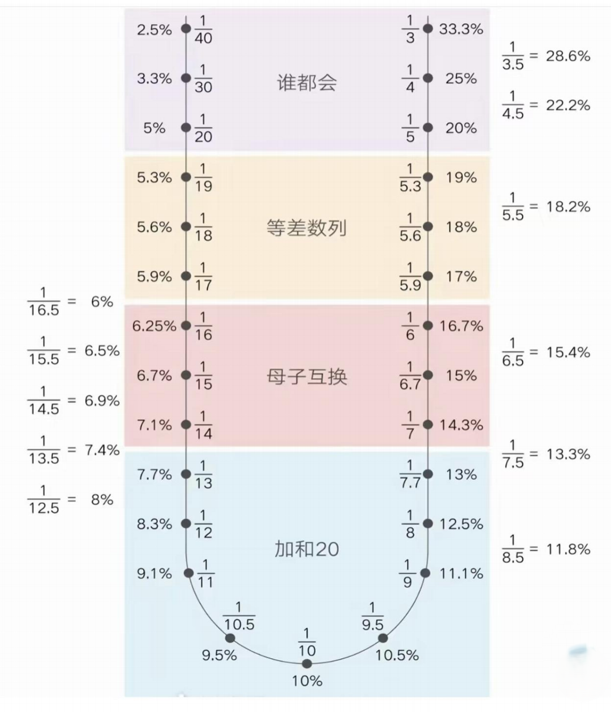

## 三、除法

### 1.分数除法：化 1 法、化半法

何时用：选项接近，都在1、50%附近

（1）化1法

$$
\frac{145}{142} = \frac{142 + 3}{142} = \frac{142}{142} + \frac{3}{142} = 1 + 2\%
$$

（2）化半法
$$
\frac{74}{142} = \frac{71 + 3}{142} = \frac{71}{142} + \frac{3}{142} = 50\% + 2^+\%
$$

### 2.截尾直除

截位直除法需解决三个问题：

- 截位定义：从左侧第一个非零数字开始保留指定位数，下一位四舍五入。

  > 17258 保留两位有效数字为 17（第三位舍去）；
  > 17258保留三位有效数字为 173（第四位五入）。
- 截位对象：一步除法仅截分母，多步除法需截分子与分母。
- 截位位数：由选项差距决定。

截几位？

看选项差距

（1）选项差距大（截两位）

① 首位均不同；
② 首位相同，第二位不同，第二位差＞首位。

（2）选项差距小（截三位）

首位相同，第二位不同，第二位差≤ 首位；

> 例：46与48，差2≤4

3.注意：

① 选项为某整数的左右邻居，选项差距小，截三位（如：59、61）；
② 选项差距极小：首位相同，第二位也相同（需要精算，截四位）。

> 多步除法：速算本身是有灵魂的
>
> 差距大，截 2 位 → 因为差距大，还有估算的空间，+1、-1 进行微调，方便约分；
> 差距小，截 3 位 → 因为差距小，为了避免犯错，严谨计算，老老实实算吧。
> （特定题型有特定解决）
> 注：＞10 的数才可微调，尽量调 1。

#### （1）一步除法：只截分母

常见形式： $\dfrac{\mathrm{A}}{\mathrm{B}},\dfrac{\mathrm{A+B}}{\mathrm{C}},\dfrac{\mathrm{A}}{\mathrm{B+C}}$  

#### （2）多步除法：分子分母都截（截完约分）

常见形式 $\dfrac{\mathrm{A}}{\mathrm{B}}\times\dfrac{\mathrm{C}}{\mathrm{D}}\quad\mathrm{、}\dfrac{\mathrm{A}}{\mathrm{B}}÷\mathrm{C}$  

#### （3）量级分析

① 看量级：选项之间位数相同，无需考虑量级，计算有效数字即可；
② 选项之间存在约 10、100 倍的关系，先看量级，再计算。
③ 方法：
包子法：分母划线，两位即是%（哪两位：十位个位）
数值量级：

- 截位（（组与组的差距）截两位、截三位）
- 保留量级（（组内关系）小数点位置：决定是几十还是几百）

### 3.等比修正

（1）原理：基于同浓度溶液混合

（2）何时用：复杂除法（主要用于基期差值、基期比例，选项差距小）

（3）怎么用：

- 估倍数：大致估算分子、分母间倍数；

- 同加减：分子、分母原来几倍，其加上或减去的数也为几倍。

  > - 基础模型：100 克咖啡与 100 克水混合成 200 克 50% 浓度溶液，追加同浓度溶液时比例不变
  > - 修正规则：
  >     - 分子分母同步缩放：100:200 比例下，分子+1需分母+2
  >     - 倍数关系应用：200 斤与 100 斤体重按 2:1 比例分配调整量
  > - 计算要点：估算分子分母倍数关系后，按比例同步增减数值
  >
  > $$
  > \dfrac{100}{200} = \dfrac{100+1}{200+2}
  > $$
  >
  > 

### 4.分数比较

（1）一大一小：直接看，分子大的分数大

（2）同大同小：

- 竖着直接除：一眼能瞄就竖着
- 横着看倍数、速度：
  - 分子快，则分子大的分数大
  - 分母快，则分母大的分数小

（3）四个分数比较的策略

多分数比较需建立双重标准（极值筛选法、基准比较法）：

- 最大化分子值：选择分子最大的候选分数。
- 最小化分母值：在分子较大的分数中筛选分母最小者。
- 先验分析原则：通过预判分子分母的极值（如3800/40000 vs 3700/30000）可快速锁定目标，避免逐对比较。

# 第二章  基期量

$$
\text{基期} \begin{cases} 
\text{计算} \begin{cases} 
    \text{识别：问过去的量是多少？} \\
    \text{给现期、变化量，高减低加} \begin{cases} 
        \text{基期 = 现期 - 增长量} \\ 
        \text{基期 = 现期 + 减少量} 
    \end{cases} \\
    \text{给增长量、增长率} \begin{cases} 
        \text{基期 = 增长量} \div \text{增长率} \\ 
        \text{考得少，棉花种植类材料可能考} 
    \end{cases} \\
    \text{给现期、增长率} \begin{cases} 
        \text{基期} = \dfrac{\text{现期}}{1 + \text{增长率}} \begin{cases} 
            \text{差距大，厂除两位} \\ 
            \text{差距小，厂除三位，} |r| \le 5\% \text{时，可化除为乘} \\ 
            \text{差距极小（前两位相同），厂除四位} 
        \end{cases} \\
        \text{基期和差} = \dfrac{A}{1+a} \pm \dfrac{B}{1+b} \begin{cases} 
            \text{方法一：算一半，看一半} \\ 
            \text{方法二：能瞪则瞪，不列式厂除，或者等比修正，分母化同} 
        \end{cases} \\
        \text{复杂类} \begin{cases} 
            \text{识别：算基期，数不够，存在总分结构，给比重} \\ 
            \text{情况一：给所求主体的增长率} \begin{cases} 
                \text{基期} = \dfrac{\text{现期}}{1 + \text{增长率}} \\ 
                \text{分子需要转化} \begin{cases} \text{部分 = 总体} \times \text{比重} \\ \text{总体 = 部分} \div \text{比重} \end{cases} 
            \end{cases} \\ 
            \text{情况二：不给所求主体的增长率} \begin{cases} 
                \text{部分基期 = 总体基期} \times \text{基期比重} \\ 
                \text{总体基期 = 部分基期} \div \text{基期比重} 
            \end{cases} 
        \end{cases} 
    \end{cases} 
\end{cases} \\
\\
\text{比较} \begin{cases} 
    \text{识别：问过去的量谁大谁小？} \\ 
    \text{给现期、变化量，高减低加，对比排除} \\ 
    \text{给现期、增长率} \begin{cases} 
        \text{基期} = \dfrac{\text{现期}}{1 + \text{增长率}} \\ 
        \text{先分析：现期大，增长率小，基期大} \\ 
        \text{再比较：分数比较} 
    \end{cases} 
\end{cases} 
\end{cases}
$$

### 0.解题三步曲：问题三步走

​		$\large\begin{cases}	圈时间\\	判题型\\	定主体	\end{cases}$

核心方法为“问题三步走”：

- 圈时间：明确题目要求的时间范围（如基期或现期）；
- 判题型：通过关键词识别题型（如“增长量”对应数值增减，“增长率”对应百分比变化，“比重”对应占比关系）；
- 定主体：采用首字定位或关键词定位快速锁定题干对象。

注意事项：

- 首次定位需避免反复浏览材料
- 主体过长时可提取核心字词简化处理

### 1.现期、基期、增长量、增长率

作为对比参照的是基期，而相对于基期比较的是现期；

增长量是增长的绝对量，增长率是增长的相对量。

### 2 . 同比与环比

同比：与上年同期相比；

环比：与紧紧相邻的上一统计周期相比（月环比、季度环比）；

区分口诀：同比看头，环比看尾。

### 3 . 基期的公式

公式一：基期=现期-增长量

公式二：$基期=\dfrac{增长量}{r}$

公式三：$基期= \dfrac {现期}{1+r}$

## 一、基期计算

### 1.给现期、变化量

高减低加：

$基期=现期-增长量$
$基期=现期+减少量$

### 2.给增长量、增长率

公式：$基期=\dfrac{增长量}{r}$

速算：截位直除、特殊数字

注：增长量和增长率，同号（同正负）

### 3.给现期、增长率

#### 考法一：求基期

公式：$基期=\dfrac{现期}{1+r}$

速算：截位直除、化除为乘、特殊数字

##### 速算技巧：化除为乘

（1）应用环境：求基期，差距小，$|\mathrm{r}|\leq5\%$；

（2）技巧：先变正负，再拆括弧。

​	$\mathbf {\dfrac{{A}}{1+{r}}}\approx\mathrm{A}\times (1-\mathrm{r}) =\mathbf{A}-\mathbf{A}\times\mathbf{r}$   

​	$\mathbf{\dfrac{A}{1-r}}\approx\mathrm{ A\times (1+r) =\mathbf {A+A\times r}}$  

> 化除为乘不可用：
>
> （1）**选项首位相同，第二位也相同** 且（2）$\mathbf{4\%≤|r|≤5\%}$。

#### 考法二：基期和差

（1）公式：

​	$\mathbf {\dfrac{\mathrm{A}}{1+a}+\dfrac{B}{1+b}\qquad \qquad\dfrac{A}{1+a}-\dfrac{B}{1+b}}$     

（2）速算：能瞪则瞪，不列式厂除，或者等比修正，分母化同

#### 考法三：复杂类（与比重结合)

（1）识别：算基期，数不够，存在总分结构，给比重

- 情况一：给所求主体的增长率，$基期=\dfrac{现期}{1+增长率}$，分子需要转化

- 情况二：不给所求主题的增长率，

  - $部分基期=总体基期 \times 基期比重$

  - $总体基期=部分基期 \div 基期比重$

① 给增长率
② 不给增长率

## 二、基期比较

### 1.给现期、变化量

高减低加：

基期=现期-增长量
基期=现期+减少量

### 2.给现期、增长率

公式：$基期=\dfrac{现期}{1 +增长率}$

先分析：现期大，增长率小，基期大

再比较：分数比较

# 第三章  现期量

$$
\text{现期} 
\begin{cases} 
    \text{追赶} 
    \begin{cases} 
        \text{识别：若保持增长量 / 增长率不变，哪年 A 超过 B？} \\
        \text{保持增长量不变} 
        \begin{cases} 
            \text{第一步：找差距} \\
            \text{第二步：补差距} \\
            \text{第三步：算年份} 
        \end{cases} \\
        \text{保持增长率不变} 
        \begin{cases} 
            \text{第一步：算总增长率} \\
            \text{第二步：“西瓜 + 芝麻”分析} 
        \end{cases}
    \end{cases} \\
    \\
    \text{计算} 
    \begin{cases} 
        \text{识别：若保持增长量 / 增长率不变，算以后为多少？} \\
        \text{保持增长量不变：现期 = 基期 + 增长量} \times \text{年份差} \\
        \text{保持增长率不变} 
        \begin{cases} 
            \text{给增长率：现期 = 基期} \times (1 + \text{增长率}) \quad \text{差距小时，拆分计算} \\
            \text{不给增长率} 
            \begin{cases} 
                \text{现期与基期倍数好算，算倍数，乘倍数} \\
                \text{现期与基期倍数不好算，算增长量，} \\ \text{按增长量推算，结果偏小选大} 
                \begin{cases} 
                    \text{经验：选略大} \\ 
                    \text{精算：利滚利} 
                \end{cases}
            \end{cases}
        \end{cases}
    \end{cases} \\
    \\
    \text{按去年价格购买今年商品} 
    \begin{cases} 
        \text{名义增长率 - 实际增长率} \approx \text{CPI增长率} \quad 
        \begin{matrix} 
            \text{名义增长率大于实际增长率，说明居民消费价格（物价）上涨} 
        \end{matrix} \\
        \text{所求现期} = \dfrac{\text{已给现期}}{1 + \text{名义增长率}} \times (1 + \text{实际增长率}) \quad \text{经验：选略小} 
    \end{cases}
\end{cases}
$$

现期的公式：

1.识别：给基期量，求后面某个时期的量

2.公式：（$n$ 为年份差）

（1）保持增长量：

- 1 年：$\text{现期} = \text{基期} + \text{增长量}$

- $n$ 年：$\text{现期} = \text{基期} + \text{增长量} \times n$

（2）保持增长率：

- 1 年：$\text{现期} = \text{基期} \times (1 + \text{增长率})$

- $n$ 年：$\text{现期} = \text{基期} \times (1 + \text{增长率})^n$

## 一、现期追赶

### 1.保持增长量不变

1.识别：若保持增长量不变，哪年A 超过B?

2.技巧：代入选项更快

3.考法

考法一：追定量

（1）问法：小追大，追上，问几年

（2）方法：找差距，补差距，算年份

考法二：追变量

（1）问法：小追大，追不上，问差距

​	方法：找差距，补差距

（2）问法：大追小，到几倍。

​	方法：找差距，加差距

考法三：大追小，到几倍

### 2.保持增长率不变

1.识别：若保持增长率不变，哪年  A 超过 B？

2.方法：算总增长率， “西瓜+芝麻”分析

## 二、现期计算

### 1 .保持增长量不变

1.识别：若保持增长量不变，算以后为多少？

2.公式：

$\text{现期} = \text{基期} + \text{增长量}$

$\text{现期} = \text{基期} + \text{增长量} \times \text{年份差}$

### 2.保持增长率不变

#### 考法一：给增长率

1.公式：$现期=基期\times(1+增长率)$

2.速算：特殊数字，差距小时，拆分计算

- 估算：$3224 \times (1 + 12.6\%) \approx 3224 + 3224 \times 12.5\% = 3224 + 3224 \times \dfrac{1}{8}$
- 精算：$3224 \times (1 + 12.6\%) = 3224 + 3224 \times (12.5\% + 0.1\%) = 3224 + 3224 \times (\dfrac{1}{8} + 0.1\%)$

#### 考法二：不给增长率

（1）现期、基期倍数关系好算，算倍数，乘倍数；

（2）现期、基期倍数关系不好算，算增长量，按增长量推算，结果偏小选大，利滚利分析。

方法一：$r > 0$，增长量变大。 

方法二：大精小估，利滚利思想（正向：计算出具体值、反向：选项排除）。

①现期、基期倍数关系明显

②现期、基期倍数关系不明显

## 三、名义增长率和实际增长率

1.名义增长率：没有扣除价格因素影响得到的增长率。

2.实际增长率（按可比价格计算）：扣除价格因素影响得到的增长率。

公式一： $(1+名义增长率)= (1+实际增长率)\times (1+CPI增长率)$ 
化简公式：$r\_{\text{名义}} = r\_{\text{实际}} + r\_{CPI} + r\_{CPI} \times r\_{\text{实际}}$
公式二：按去年价格购买今年商品，所求 $\text{现期} = \dfrac{\text{现期}}{1 + r\_{\text{名义}}} \times (1 + r\_{\text{实际}})$

> 注：名义增长率大于实际增长率，说明居民消费价格（物价）上涨

# 第四章  增长量

$$
\text{增长量} \begin{cases} 
\text{计算} \begin{cases} 
\text{识别：问增长的具体值为多少？} \\
\text{给现期、基期} \begin{cases} 
\text{增长量 = 现期 - 基期} \\
\text{主体为多个数加和} \begin{cases} \text{方法一：抵消思维，先减再加} \\ \text{方法二：凑整加和，先加再减} \end{cases} \\
\text{特定增长量：易错点：时间段中第一年的增长量有数据一定要验证} \\
\text{年均增长量} \begin{cases} \text{年均增长量 = } \dfrac{\text{现期 - 基期}}{\text{年份差}} \\ \text{除江苏以外的考试} \begin{cases} \text{普通表述，不论前一年是否给出，基期都不前推} \\ \text{限定表述，五年计划，年均增长问题，年份差为 5，基期前推一年} \end{cases} \\ \text{江苏考试，年均增长问题，基期都往前推一年} \end{cases}
\end{cases} \\
\text{给现期、增长率} \begin{cases} 
\text{增长量 = } \dfrac{\text{现期}}{1 + \text{增长率}} \times \text{增长率} \begin{cases} \text{百分化} \begin{cases} \text{第一步：}|r| = 1/N \\ \text{第二步：增长量 = 现期} \div (N+1)、\text{减少量 = 现期} \div (N-1) \end{cases} \\ \text{估算：}|r| \le 5\%, \text{且选项差距大，} \begin{cases} \text{求增长量，结果偏大} \\ \text{求减少量，结果偏小} \end{cases} \\ \text{增长量} \approx \text{现期} \times \text{增长率} \\ \text{误差分析：误差} \approx \text{基期} \times \text{增长率偏差值，一般用现期替代基期估算} \end{cases} \\
\text{混合增长量} \begin{cases} \text{总体增长量 = 部分增长量 + 部分增长量 + ......} \\ \text{有升有降，先抵消，再分析、计算} \end{cases} \\
\text{增长量倍数} \begin{cases} \text{增长率差距} \le 10 \text{ 个百分点，A 增长量} \div \text{B 增长量} \approx (A \div B) \times (a \div b) \\ \text{增长率差距} > 10 \text{ 个百分点，分别百分化，求增长量，再求倍数} \end{cases}
\end{cases} \\
\text{给基期、增长率：增长量 = 基期} \times \text{增长率} \\
\text{每增长 N 个百分点，对应的增长量} \begin{cases} \text{第一步：求基期} \\ \text{第二步：增长量 = 现期} \times N\% \end{cases}
\end{cases} \\
\text{比较} \begin{cases} 
\text{识别：问增长的最多或最少？} \\
\text{给现期、基期} \begin{cases} \text{增长量 = 现期 - 基期} \\ \text{材料为柱状图，看高度差} \\ \text{材料为折线图，看斜率} \\ \text{材料为文字或表格，对比排除} \end{cases} \\
\text{给现期、增长率} \begin{cases} \text{大大则大：现期大，增长率大，增长量大} \\ \text{一大一小} \begin{cases} \text{严谨：百分化，求增长量，再比较} \\ \text{经验：现期倍数与增长率倍数差异大，看倍数，谁的倍数大，听谁的} \end{cases} \\ \text{易错点} \begin{cases} \text{比较增长量，下降越多，增长量越小} \\ \text{比较变化量，看增长量的绝对值} \end{cases} \\ \text{隐藏问法} \begin{cases} \text{增长贡献率 = 部分增长量} \div \text{总体增长量 \quad 在相同总体中，直接比较部分增长量} \\ \text{拉动增长率 = 部分增长量} \div \text{总体基期} \end{cases} \\ \text{差值变化判断} \begin{cases} \text{前增长量 > 后增长量，差值扩大} \\ \text{前增长量 < 后增长量，差值缩小} \end{cases} \end{cases}
\end{cases}
\end{cases}
$$

### 1.增长量的识别

关键词：增长+单位、增长最多/少
例：
2025年照照的工资比2024年增长了多少元？

### 2 .增长量的公式

公式一：增长量=现期-基期
公式二：增长量=基期x增长率 公式三：增长量= 现期 X增长率
1 +增长率
3 .增长量比较的易错点
①增长量比较带符号，正大于负，下降越多，增长量越小
②变化量比较带绝对值
                        
照照工的资增长10元，超超的工资下降5元，志志的工资下降20元
照照的工资增长量最大
志志的工资增长量最小
志志的工资变化量最大
超超的工资变化量最小

## 一、增长量计算

### 1.给现期、基期

#### 考法一：主体为多个数加和

公式：增长量=现期-基期
方法一：抵消思维，先减再加
方法二：凑整加和，先加再减

#### 考法二：特定增长量

识别：判断增长量大于某一数值的有几个
方法一：现期-基期〉特定增长量
方法二：基期+特定增长量v 现期 易错点：时间段中第一年的增长量有数据一定要验证

#### 考法三：年均增长量

公式：年均增长量=现期一基期
年份差
江苏考试，年均增长问题，基期都往前推一年。
除江苏以外的考试，普通表述，不论前一年是否给出，基期都不前推。
限定表述，五年计划，年均增长问题，年份差为5 ,基期前推一年。

### 2.给现期、增长率

#### 考法一：求增长量

公式：$\text{增长量} = \dfrac{\text{现期}}{1 + \text{增长率}} \times \text{增长率}$
方法：

第一步：$|r| = \dfrac{1}{n}$

第二步：$\text{增长量} = \dfrac{\text{现期}}{n + 1}$、$\text{减少量} = \dfrac{\text{现期}}{n - 1}$。
估算：$|r| \le 5\%$，且选项差距大，$\text{增长量} \approx \text{现期} \times \text{增长率}$。

误差分析：$\text{误差} \approx \text{基期} \times \text{增长率差值}$，一般用现期替代基期估算 

#### 考法二：混合增长量

方法：总体增长量=部分增长量+部分增长量+……
有升有降，先抵消，再分析、计算

#### 考法三：增长量倍数

方法：

$\text{增长率差距} \le 10 \text{个百分点，} \text{A 增长量} \div \text{B 增长量} \approx (A \div B) \times (a \div b)$

$\text{增长率差距} > 10 \text{个百分点}$，分别百化分，求增长量，再求倍数

### 3.给基期、增长率

公式：$\text{公式：增长量} = \text{基期} \times \text{增长率}$ 

每增长 $N$ 个百分点，对应的增长量
第一步：求基期
第二步：$\text{增长量} = \text{基期} \times N\%$

## 二、增长量比较

### 1 .给现期、基期

公式：$\text{增长量}=\text{现期}-\text{基期}$

方法：
材料为柱状图，看高度差
材料为折线图，看斜率
材料为文字或表格，对比排除

### 2 .给现期、增长率

公式：$\text{增长量} = \dfrac{\text{现期}}{1 + \text{增长率}} \times \text{增长率}$

方法：大大则大：现期大，增长率大，增长量大
一大一小，严谨：百化分，求增长量，再比较
经验：现期倍数与增长率倍数差异大，看倍数，谁的倍数大，听谁的

### 3.变型问法

#### 考法一：增长贡献率

$\text{增长贡献率} = \dfrac{\text{部分增长量}}{\text{总体增长量}}$，在相同总体中，直接比较部分增长量

#### 考法二：拉动增长率

$\text{拉动增长率} = \dfrac{\text{部分增长量}}{\text{总体基期}}$

#### 考法三：差值变化的判断

前增长量 > 后增长量，差值扩大
前增长量 < 后增长量，差值缩小

# 第五章  一般增长率

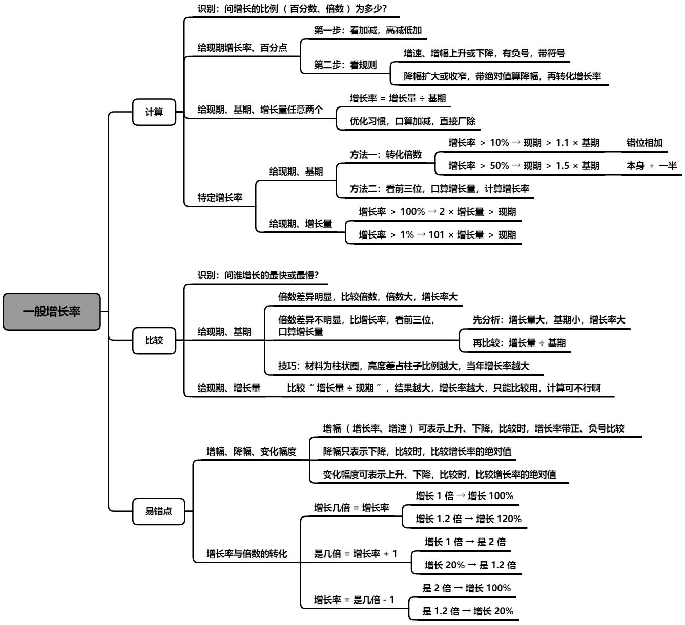

定义：增长率指的是现期量与基期量的差值（即增长量）与基期量之间的比较，即指在基期的基础上增长了多大的幅度。  

> 增长率又称增速、增幅或者增长幅度、增值率等。
>
> 增长率有正有负，增长率为负时表示下降。   

$\text{增长率}(r) = \dfrac{\text{增长量}}{\text{基期量}}$

**易错点**：  

一、“百分数”与“百分点”  

（1）百分数表示两个量的比例关系，用除法计算；
（2）百分点表示百分数的变化，用加减法计算。

二、“增长率”与“倍数”

（1） $\mathbf A$ 是 $\mathbf B$ = 的……倍：$\mathbf {\dfrac AB}$ 
（2） $\mathbf A$ 比 $\mathbf B$ 增长……倍     /    $\mathbf A$ 比 $\mathbf B$ 多……倍
	$\mathbf r=\dfrac{\mathbf{A-B}}{\mathbf{B}}=\dfrac{\mathbf{A}}{\mathbf{B}}-\mathbf{1}$  

​	$\begin{cases}	\text{增长倍数 }=\mathbf{r}\\	\text{倍数 }=\text{增长倍数}+\mathbf{1}=增长率+\mathbf{1}	\end{cases}$

（3）疑难答疑：分数很接近，怎么进行比较。
	横向看速度：倍数明显看倍数，==倍数不明显看增长速度==。 

​		分子快，则分子大的分数大
​		分母快，则分母大的分数小

三、成数与翻番

（1）成数：几成相当于十分之几（如：30% 就是三成）
（2）翻番：翻一番为原来的 $2$ 倍；翻两番为原来的 $4$ 倍；依此类推，翻 $n$ 番为原来的 $2^n$ 倍。

四、“增幅”、“降幅”、“变化幅度”

（1）增长率（增幅，增长幅度，增速）带着正负号比。
（2）降幅必须为负，比较绝对值。 
（3）变化幅度可正可负，比较绝对值。  

## 一、增长率计算

1.给百分点

例：哪一个增幅最大？   A. $40\%$   B. $20\%$   C. $5\%$   D. $-10\%$

降幅只表示下降，比较时，比较增长率的绝对值。

例：哪一个降幅最大？   A. $-40\%$   B. $-30\%$   C. $-20\%$   D. $10\%$

变化幅度可表示上升、下降，比较时，比较增长率的绝对值。

例：哪一个变化幅度最大？   A. $-40\%$   B. $-30\%$   C. $5\%$   D. $10\%$

---

给现期增长率、百分点，求基期增长率

方法：

第一步：看加减，高减低加

第二步：

​	看规则，增速、增幅上升或下降，有负号，带符号

​	降幅扩大或收窄，带绝对值算降幅，再转化增长率

口诀：“增速”→ 高减低加（带正负号计算）

口诀：“降幅”→ —（绝对值的高减低加），整体增加“负号”代表降

考法一：增速上升或下降

考法二：降幅扩大或收窄

考法三：给基期增长率、百分点，求现期增长率

公式：$\text{增长率} = \dfrac{\text{增长量}}{\text{基期}} = \dfrac{\text{增长量}}{\text{现期} - \text{增长量}} = \dfrac{\text{现期} - \text{基期}}{\text{基期}} = \dfrac{\text{现期}}{\text{基期}} - 1$ 

习惯：口算加减，直接厂除

速算：截位直除

考法一：给增长量、基期

考法二：给增长量、现期

考法三：给现期、基期

3 .特定增长率

考法一：给现期、基期

方法一：转化倍数 

① 方法：  
	$\mathbf {10\%：现期 > 基期 \cdot 1.1}$ （错位相加）    
	$\mathbf {{20\%}：现期 > 基期 \cdot 1.2}$ （错位 $\mathbf 2$ 倍，进位）  
	$\mathbf {{50\%}：现期 > 基期 \cdot 1.5}$ （本身一半）  
	$\mathbf {{5\%}：现期 > 基期 \cdot 1.05}$ （$\mathbf {5\%}$ 是 $\mathbf {10\%}$ 的一半，错位的一半）  
	$\mathbf {{15\%}：现期 > 基期 \cdot 1.15}$ （$\mathbf {10\% + 5\%}$）  
② 变形：  
	$\mathbf{-10\%}\begin{cases}方法一:现期 < 基期 \cdot \mathbf {0.9} (错位相减) \\方法二:增长率计算(\text{更直接，推荐})\end{cases}$

方法二：看前三位，口算增长量，计算增长率

考法二：给现期、增长量

公式：$(n+1)\text{增长量} > \text{现期}$ 

方法：

$\text{增长率} > 100\% \rightarrow 2 \times \text{增长量} > \text{现期}$ 

$\text{增长率} > 1\% \rightarrow 101 \times \text{增长量} > \text{现期}$

## 二、增长率比较

1.给现期、基期   

（1）识别：增速最快/最慢，增长幅度最大/最小
（2）已知：现期、基期，比较增长率 $\to \mathbf {r=\dfrac{\text{现期}-\text{基期}}{\text{基期}}=\dfrac{\textbf{现期}}{\textbf{基期}}-1}$
（3）方法：看现期与基期的倍数关系是否明显
	① 当 $\mathbf {\dfrac{\text{现期}}{\text{基期}}=2^+}$ 明显，用 $\dfrac {\textbf {现期}}{\textbf{基期}}$ 比较
	② 当 $\mathbf {\dfrac{\text{现期}}{\text{基期}}=1^+}$ 不明显，用 $\dfrac {\textbf {增长量}}{\textbf {基期}}$ 比较
		原理：$\mathbf {r = \textbf {倍数} - 1}$
（4）小技巧：  
	① $\dfrac {增长量}{基期} = \mathbf r$，增长量变小，基期量变大， $\mathbf r$ 变小    
	② 常考 $\mathbf {1.5}$ 倍、$\mathbf {1.1}$ 倍  
（5）**增长率折线图、增长率排序**    
	① 本质：先排再列   
	② 技巧：  
		a. 最值  
		b. 选项  
（6）易错点：增长率、降幅  
2.给现期、增长量   
（1）方法：给现期量和增长量，直接比较大小
（2）注：$\dfrac {\textbf {增长量}}{\textbf {现期量}}$ 不是增长率（%）的具体值，只是代替比较  

> 推导：  
> $\mathbf {r=\dfrac{\text{增长量}}{\text{现期量-增长量}} = \dfrac 1{\dfrac {\textbf{现期量}}{\textbf{增长量}}-1}}$，则 $\mathbf r$ 与 $\dfrac {\textbf {现期量}}{\textbf {增长量}}$ 成反比，即 $\mathbf r$ 与  $\dfrac {\textbf {增长量}}{\textbf {现期量}}$ 成正比。

（3）特定增长率比较（给现期、基期  $10\%、20\%、50\%、5\%、15\%、-10\%$）  
	① 方法：  
		$\mathbf {10\%：现期 > 基期 \cdot 1.1}$ （错位相加）    
		$\mathbf {{20\%}：现期 > 基期 \cdot 1.2}$ （错位 $\mathbf 2$ 倍，进位）  
		$\mathbf {{50\%}：现期 > 基期 \cdot 1.5}$ （本身一半）  
   		$\mathbf {{5\%}：现期 > 基期 \cdot 1.05}$ （$\mathbf {5\%}$ 是 $\mathbf {10\%}$ 的一半，错位的一半）  
		$\mathbf {{15\%}：现期 > 基期 \cdot 1.15}$ （$\mathbf {10\% + 5\%}$）  
	② 变形：  
		$\mathbf{-10\%}\begin{cases}方法一:现期 < 基期 \cdot \mathbf {0.9} (错位相减) \\方法二:增长率计算(\text{更直接，推荐})\end{cases}$

# 第六章  间隔增长率

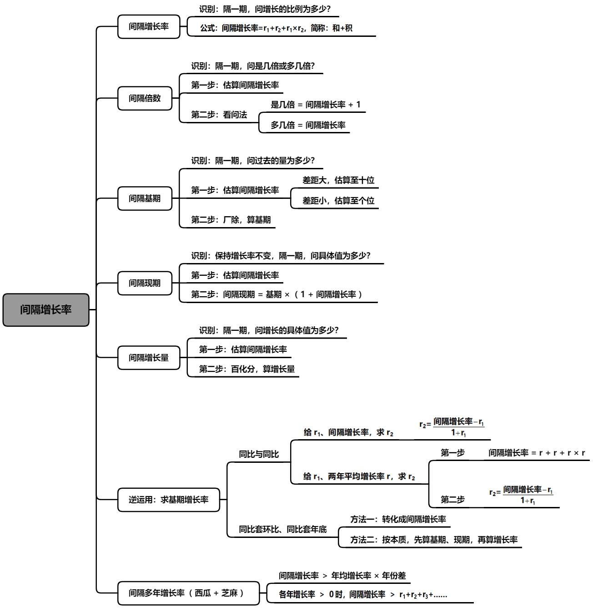

## 1 .间隔增长率

1.识别：隔一期，问增长的比例为多少？

2.公式：$r\_{间隔}=r\_1+r\_2+r\_1 \times r\_2$，简称：和+积

3.计算技巧：

① $r\_1$、$r\_2$ 的绝对值均 $<10\%$，$r\_1+r\_2$与选项差一个百分点（$1\%$）以上，$r\_1 \times r\_2$可以忽略（$10\% \times 10\%=1\%$）。

② 化成分数；化成小数。

> $\mathbf {48\%+25\%+48\%\times25\%\approx 73\% + 48\% \times \dfrac 14 \approx 73\% +  12\% \approx 85\%}$   
> $\mathbf {30\%+15\%+30\%\times15\%\approx 30\%+15\%+0.3\times15\%\approx  45\%+4.5\%\approx 49.5\%}$

③ 结合选项看答案。

## 2.间隔倍数

1.识别：隔一期，问是几倍或多几倍？

2.方法：两步走

第一步：估算间隔增长率

第二步：看问法，

是几倍=间隔增长率+1
多几倍=间隔增长率

## 3.间隔基期

1.识别：隔一期，问过去的量是多少？

2.方法：

第一步: 估算间隔增长率，

差距大，估算至十位
差距小，估算至个位

第二步: 厂除，算基期

## 4.间隔现期

识别：保持增长率不变，隔一期，问具体值是多少？

方法：第一步：估算间隔增长率

第二步：$间隔现期 =基期 \times (1 + 间隔增长率 )$

## 5.间隔增长量

识别：隔一期，问增长的具体值是多少?
方法：第一步：估算间隔增长率
第二步：百化分，算增长量

## 6.间隔增长率逆向运用：求基期增长率

### 考法一：同比和同比

识别：隔一期，问是几倍或多几倍？

方法：第一步：估算间隔增长率

第二步：看问法，是几倍 = 间隔增长率 + 1

多几倍 $=$ 间隔增长率 

---

识别：保持增长率不变，隔一期，问具体值是多少？

方法：第一步：估算间隔增长率

第二步：$间隔现期 = 基期 \times (1 + 间隔增长率 )$

---

情况一：给 $r\_1$、间隔增长率，求 $r\_2$，$r\_2 = \dfrac{r\_{间隔} - r\_1}{1 + r\_1}$

情况二：给 $r\_1$、两年平均增长率 $r$，

第一步：间隔增长率 $= r + r + r \times r$

第二步：$r\_2 = \dfrac{r\_{间隔} - r\_1}{1 + r\_1}$

注：当间隔增长率 $> r\_1$ 时，则 $r\_2 > 0$

当间隔增长率 $< r\_1$ 时，则 $r\_2 < 0$。

### 考法二：同比套环比、同比套年底

方法一：转化成间隔增长率
方法二：按本质，先算基期、现期，再算增长率

## 7.间隔多年增长率

方法：西瓜+芝麻 

结论一：间隔增长率 $>$ 年均增长率 $\times$ 年份差 

结论二：各年增长率 $> 0$ 时，间隔增长率 $> r\_1 + r\_2 + r\_3 + \cdots \cdots$

# 第七章  年均增长率

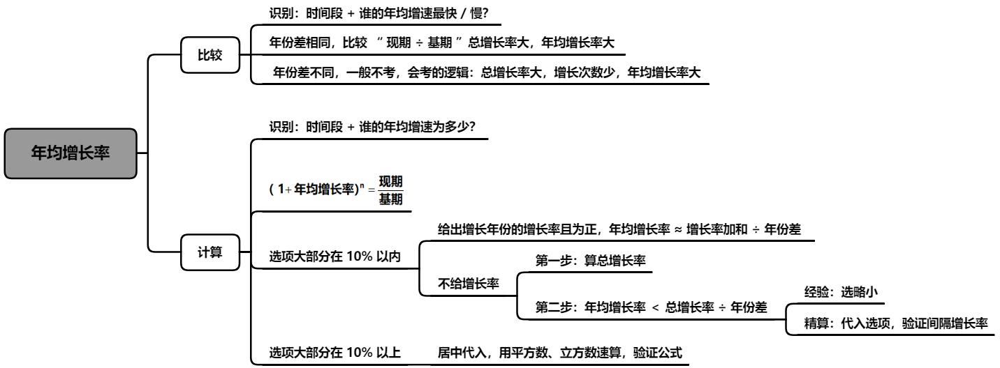

## 一、年均增长率比较

识别：时间段+谁的年均增速最快/慢？

$$(1+r)^n = \dfrac{现期}{基期}$$        $$r = \sqrt[n]{\dfrac{现期}{基期}} - 1$$

方法：年份差相同，比较“$\dfrac{现期}{基期}$”，总增长率大，年均增长率大

$n$：为年份差

注意： 

（1）现期 $>$ 基期，代表上升，年均增长率为正。直接比较 $\dfrac{现期}{基期}$ 

（2）现期 $<$ 基期，代表下降，年均增长率为负。直接比较 $\dfrac{现期}{基期}$

## 二、年均增长率计算

1. $r < 10\%$（估算、间隔思维代入）

识别：时间段 + 谁的年均增速为多少？

方法：

（1）给出增长年份的增长率且为正，年均增长率 $\approx \dfrac{增长率加和}{年份差}$

（2）不给增长率，

第一步：算总增长率

第二步：$r\_{年均} \le \dfrac{r\_{总}}{n\_{年}}$

经验：选略小

精算：代入选项，验证间隔增长率（西瓜芝麻思维）

考法一：给增长率

考法二：不给增长率

2. $r > 10\%$ 识别：时间段+谁的年均增速为多少？ 情况二：选项大部分在 $10\%$ 以上 公式：$(1+r)^n = \dfrac{现期}{基期}$ 

   方法：居中代入，用平方数、立方数速算，验证公式

> **常见平方数：**
> $$
> \begin{aligned} 11^ 2= 121 && 12^2= 144 && 13^2 = 169 \\ 14^2 = 196 && 15^2 = 225 && 16^2 = 256 \\ 17^2 = 289 && 18^2 = 324 &&19^2 = 361 \end{aligned}
> $$
>
> $$
> \begin{gathered} 21^{2} =441 && 29^{2} =841 \\ 22^{2} =484 && 28^2=784 \\ 23^{2} =529 && 27^2=729 \\ 24^{2} =576 && 26^2=676 \\ &25^2= \text{625} \end{gathered}
> $$
>
>   **年均增长率最常考三（四）次方** $\mathbf {172227 \qquad \qquad 202938}$
>
> $$
> \begin{gathered} 1.2^3\approx1.7 && 1.2^4\approx2.0\\ 1.3^3\approx2.2 && 1.3^4\approx2.9\\ 1.4^3\approx2.7 && 1.4^4\approx3.8 \end{gathered}
> $$

# 第八章  乘积增长率

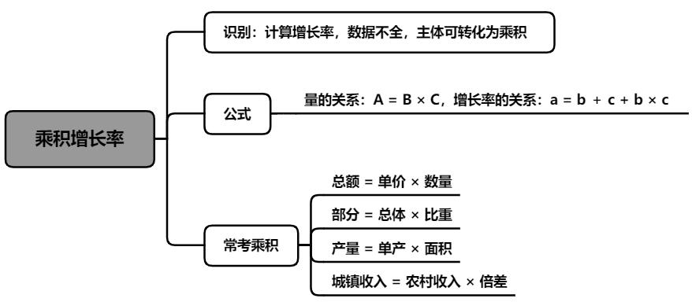

识别：计算增长率，数据不全，主体可转化为乘积

量的关系：$A = B \times C$

增长率的关系：$r\_a = r\_b + r\_c + r\_b \times r\_c$

常考乘积：总额 = 单价 $\times$ 数量

　　　　　产量 = 单产 $\times$ 面积

　　　　　城镇收入 = 农村收入 $\times$ 倍差

　　　　　部分 = 总体 $\times$ 比重

> 推导1：模仿间隔
>
> 量的关系：$A = B \times C$ 
> 增长率关系：$r\_A = r\_B + r\_C + r\_B \times r\_C$
>
> 
>
> 推导2：增长率定义
>
> 量的关系：$A = B \times C$ 
> 增长率关系：$r\_A = r\_B + r\_C + r\_B \times r\_C$
>
> 
>
> 推导3：几何角度推导
>
> 

## 一、总额 = 单价 $\times$ 数量

判定：总额 = 单价 $\times$ 数量 增长 $+$ $\%$ （求总额增长率）

公式：$r\_A = r\_B + r\_C + r\_B \times r\_C$

**常考乘积** $\begin{cases} 总额 = 单价 \times 数量 \\ 产量 = 单产 \times 面积 \\ 城镇收入 = 农村收入 \times 倍差 \end{cases}$

## 二、部分=整体 $\times$ 比重

判定：部分 = 整体 × 比重 增长 + % (求部分的增长率)

公式：$r\_A = r\_B + r\_C + r\_B \times r\_C$  $\begin{cases} (1) \text{ 部分增长率} \\ (2) \text{ 整体增长率} \end{cases}$

**常考乘积：**部分 = 总体 × 比重

## 三、棉花专题——材料的特色考法

判定：部分 = 整体 × 比重 增长 + % (求部分的增长率)

公式：$r\_A = r\_B + r\_C + r\_B \times r\_C$ $\begin{cases} (1) \text{ 部分增长率} \\ (2) \text{ 整体增长率} \end{cases}$

**常考乘积：**部分 = 总体 × 比重

---

考法一：乘积增长率（总产量 = 面积 × 单产）

---

考法二：求基期量（$基期量 = \dfrac{增长量}{r}$）

---

考法三：A + 非A = 总量的应用 $\begin{cases} A + 非A = 总量 \\ A增长量 + 非A增长量 = 总量增长量 \end{cases}$

# 第九章  混合增长率

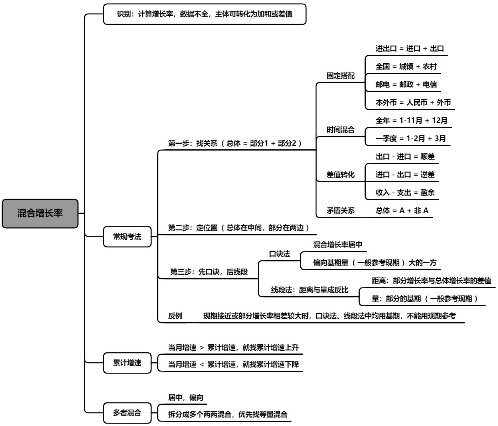

常考混合关系：

1.固定搭配

进出口=进口+出口

全国=城镇+农村

邮电=邮政+电信

本外币=人民币+外币

2.时间混合

全年=1-11 月+12 月

一季度=1-2 月+3 月

3.差值转化

出口-进口=顺差→出口=进口+顺差

进口-出口=逆差→进口=出口+逆差

收入-支出=盈余→收入=支出+盈余

4.矛盾关系

总体=A+非 A

**具体判定**：明显有部分混合得到整体的关系（求增长率，难以直接求解）  
$\textbf{部分1+部分2=整体}$  

## 一、口诀法

1.居中

部分 1 的增长率 < 总体的增长率 < 部分 2 的增长率

2.偏向

混合增长率偏向基期量（一般参考现期）大的一方

3.差值转化

出口 $-$ 进口 $=$ 顺差 $\rightarrow$ 出口 $=$ 进口 $+$ 顺差

进口 $-$ 出口 $=$ 逆差 $\rightarrow$ 进口 $=$ 出口 $+$ 逆差

收入 $-$ 支出 $=$ 盈余 $\rightarrow$ 收入 $=$ 支出 $+$ 盈余

4.当月增速与当月累计增速

当月增速 $>$ 累计增速，就找累计增速上升；

当月增速 $<$ 累计增速，就找累计增速下降。

## 二、线段法

线段法：距离与量成反比
距离：部分增长率与总体增长率的差值
量：部分的基期（一般参考现期）

线段法引入：线段法的==本质就是混合原理==  
**线段法口诀**： 

1、部分写两边，整体写中间。 
2、距离和量成反比  

> 【引例】浓度为 14% 的溶液 A 克与浓度为 22% 的溶液 B 克，混合后的浓度为 17%。 
> $$
> 14\% A + 22\% B = (A + B) 17\%
> $$
>
> $$
> (22\% - 17\%) B = (17\% - 14\%) A
> $$
>
>
> 练习1.浓度为 14%的溶液450克与浓度为22%的溶液B克，混合后的浓度为16%。  
>
> 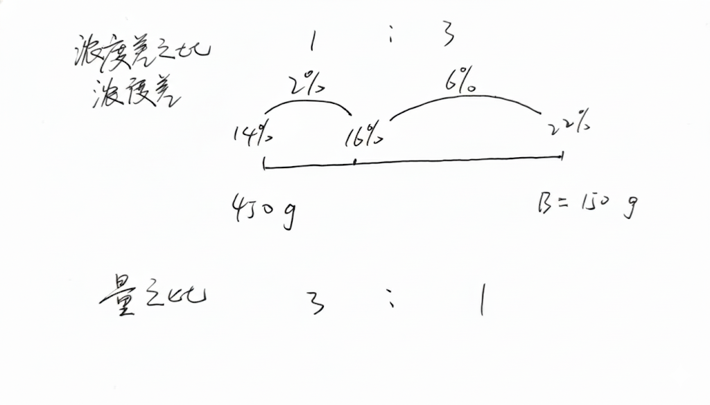
>
> 练习2.浓度为 14%的溶液500克与浓度为22%的溶液 300克，混合后的浓度为？%。
>
> 练习3.浓度为 14%的溶液A克与浓度为22%的溶液150克，混合后的浓度为20%。  

具体一点的判定：求增长率，量存在加和关系，则考虑是否为混合。 

**根据选项进行计算**：

（1）==混合居中==
（2）==从正中间偏向基期量较大的==（跷跷板原理，从正中间向胖的偏）
（3）==偏向搞不定，线段法精算==

注：求混合增长率，==做题时无基期量，一般用现期量近似代替基期量==    

## 三、变型

1.反例

现期接近或部分增长率相差较大时，口诀法、线段法中均用基期，不能用现期参考。

混合：居中，偏向基期量大的。（多数情况（99.9%）用现期代替基期计算）
注：当两个部分的增长率相差很大（通常差20个百分点甚至更多）时，可能存在叛逃情况，需警惕反例
操作：发现 $r$ 相差很大，不偷懒，直接估算基期，看偏向即可出答案。

公式：$\text{浓度}=\dfrac{\text{溶质}}{\text{溶液}}\qquad\mathbf{r}=\dfrac{\text{增长量}}{\text{基期}}$ 
原理：量是分母，混合增长率的量是基期量 
混合：居中，偏向基期量大的。（多数情况（99.9%）用现期代替基期计算）  
注：==当两个部分的增长率相差很大（通常差几十个百分点甚至更多）==时，可能存在叛逃情况，需警惕反例  
**操作**：发现 $\mathbf r$ 相差很大，不偷懒，直接估算基期，尽量精算。  

2.多者混合

居中：最小的增长率 $<$ 总体的增长率 $<$ 最大的增长率 

拆分成多个两两混合，优先找等量混合

注：多者混合，计算量大，往往考的就是大小居中思维。

月产量 = 日均产量 $\times$ 天数

$浓度 = \dfrac{溶质}{溶液}$

$增长率 = \dfrac{增长量}{基期量}（资料）$

# 第十章  比重

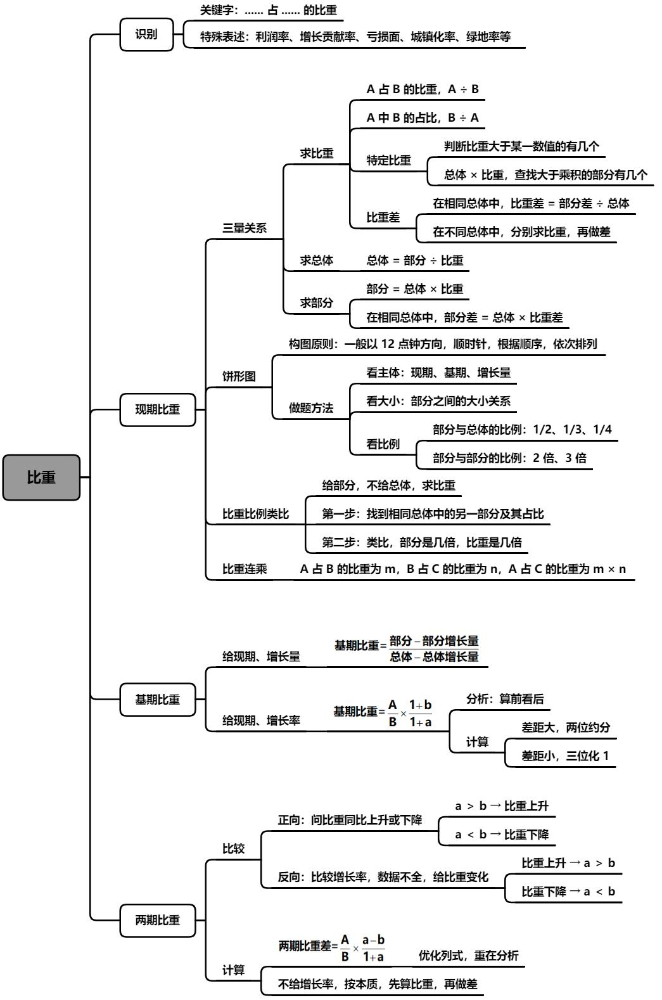

基础概念：

**比重：** 部分占总体中的比例，识别关键词：占

**公式：**  $比重 =\dfrac{\text{部分}}{\text{总体}} \rightarrow \text{部分} = \text{总体} \times \text{比重} \rightarrow \text{总体} = \dfrac{\text{部分}}{\text{比重}}$

---

特殊表述：

利润率：

* 在资料分析中，利润率 = $\dfrac{\text{利润}}{\text{收入}}$ ；
* 在数量关系中，利润率 = $\dfrac{\text{利润}}{\text{成本}}$

 增长贡献率：部分对总体增长的贡献比例

$增长贡献率 =\dfrac{\text{部分增长量}}{\text{总体增长量}}$

亏损面：在特定行业或范围内，发生亏损的企业数量占总企业数量的比率

$亏损面 = \dfrac{\text{亏损企业}}{\text{全部企业}}$

产销率：

$产销率 = \dfrac{\text{销量}}{\text{产量}}$

## 1.现期比重

### 1.三量关系

#### 考法一：比重计算

问法一：A 占 B 的比重 $\rightarrow A \div B$ （占前 $\div$ 占后） 

问法二：A 中 B 的占比 $\rightarrow B \div A$

#### 考法二：比重比较

识别：问谁的比重最高或最低

方法：分数比较，注意量级

分数比较 $\rightarrow$ 先估算范围，再精细比较

注意量级 $\rightarrow \dfrac{\text{小}}{\text{大}}$ 不好看量级，可 $\dfrac{\text{大}}{\text{小}}$ 比较（倒数越大，分数越小）

#### 考法三：特定比重

识别：判断比重高于或低于某一数值的有几个

**方法：**

* 第一步： 总体 $\times$ 特定比重
* 第二步：部分 $>$ 乘积，占比 $>$ 特定比重
    * 部分 $<$ 乘积，占比 $<$ 特定比重

#### 考法四：现期比重差

识别：现期 + 两个占比相差多少个百分点（不严谨时，也可能是百分数）

**方法：**

* **在相同总体中：** 比重差 = $\dfrac{\text{部分差}}{\text{总体}}$ （ $\dfrac{\blacktriangle - \blacktriangle}{\blacktriangle}$ ）
* **在不同总体中：** 分别求比重，再做差 （ $\dfrac{\blacktriangle}{\blacktriangle} - \dfrac{\blacktriangle}{\blacktriangle}$ ），计算量一般不大，别怕 

#### 考法五：计算总体

公式：

$\text{总体} = \dfrac{\text{部分}}{\text{比重}}$

---

速算：

* 截位直除
* 特殊数字

#### 考法六：计算部分

公式：

* $\text{部分} = \text{总体} \times \text{比重}$
* **在相同总体中：** $\text{部分差} = \text{总体} \times \text{比重差}$

---

速算：

* 拆分法
* 口诀法
* 特殊数字

## 2.饼形图

构图原则：一般以12点钟方向，顺时针，根据顺序，依次排列

注：也有不按顺序的非常规考查，重点观察比例，对比排除

* **看主体：** 明确题目要求的是 **现期**、**基期** 还是 **增长量**。
* **看大小：** 注意 **部分之间** 的大小关系。
* **看比例：**
    * **部分与总体的比例：** 如 $\dfrac{1}{2}$、$\dfrac{1}{3}$、$\dfrac{1}{4}$ 等。
    * **部分与部分的比例：** 如 2 倍、3 倍等。

考法一：常规考查

一般以 12 点钟方向，顺时针，根据顺序，依次排列

考法二：非常规考查

## 3 .比重比例类比

识别：给部分，不给总体，求比重

**方法：**

* **第一步：** 找到相同总体中的另一部分及其占比
* **第二步：** 类比，部分是几倍，比重就是几倍

### 4.比重连乘

识别：小占中，中占大，问小占大

> 给出 $\dfrac{小}{中}、\dfrac{中}{大}$，则 $\dfrac{小}{中} \times \dfrac{中}{大} = \dfrac{小}{大}$

方法：A 占 B 的比重为 $m$，B 占 C 的比重为 $n$，则 A 占 C 的比重为 $m \times n$

## 二、基期比重

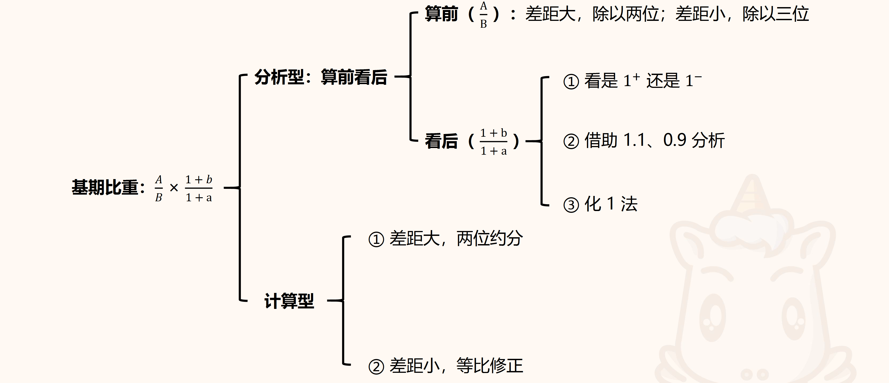

1.给现期、增长量，求基期比重

### 识别：基期 + 占比

**公式：**
基期比重 = $\dfrac{\text{部分} - \text{部分增长量}}{\text{总体} - \text{总体增长量}}$

2.给现期、增长率，求基期比重

识别：基期 + 占比

**公式：**
$$\text{基期比重} = \dfrac{A}{B} \times \dfrac{1+b}{1+a}$$

* **A：** 部分的现期
* **a：** 部分的增长率
* **B：** 总体的现期
* **b：** 总体的增长率

列式辅助记忆：先写现期比重，再乘个“ 1 + 增长率 ”的小尾巴，增长率交叉对应

速算一：分析类（算前看后）

**第一步：** 根据选项差距截位直除 $\dfrac{A}{B}$

**第二步：** 再根据 $\dfrac{1+b}{1+a}$ 与 1 的关系进行分析（$b > a \rightarrow 1^{+}$、$b < a \rightarrow 1^{-}$）

* 选项唯一，直接选
* 选项不唯一，借助 1.1 与 0.9 分析、化 1 法

---

**化 1 法：** $\dfrac{1+b}{1+a} = \dfrac{1+a+b-a}{1+a} = \dfrac{1+a}{1+a} + \dfrac{b-a}{1+a} \approx 1 + (b-a)$

#### 速算二：计算类

* 选项差距大，两位约分
* 选项差距小，等比修正，三位化 1

## 三、两期比重

1.两期比重比较

考法一：两期比重升降

识别：问比重同比上升或下降

**方法：**

* $a > b \rightarrow$ 比重上升
* $a < b \rightarrow$ 比重下降

> **注：** 一定要注意增长率的正负
>
> 原理：
>
> 现期比重：$\dfrac{A}{B}$
>
> 基期比重：$\dfrac{A}{B}\cdot\dfrac{1+b}{1+a}$
>
> 两期比重差为：$\dfrac{A}{B}-\dfrac{A}{B}\cdot\dfrac{1+b}{1+a} = \dfrac{A}{B}\left(1-\left(1-\dfrac{1+b}{1+a}\right) \right)= \dfrac{A}{B} \cdot \dfrac{a-b}{1+a}$

考法二：连续多年比重比较

$a > b \rightarrow$ 比重上升；$a < b \rightarrow$ 比重下降

给具体量 → 先看比例，再看增速

考法三：逆运用：通过比重变化，比较增速大小

识别：比较增长率，数据不全，给比重变化

**方法：**

* 比重上升 $\rightarrow a > b$
* 比重下降 $\rightarrow a < b$

2.两期比重计算：两期比重差

识别：两个时间 + 占比 + 上升下降多少个百分点（不严谨时，也可能是百分数）

**公式：**
$$\text{两期比重差} = \dfrac{A}{B} \times \dfrac{a-b}{1+a}$$

* **A：** 部分的现期
* **a：** 部分的增长率
* **B：** 总体的现期
* **b：** 总体的增长率

**识别：** 两个时间 + 占比 + 上升/下降多少个百分点（不严谨时，也可能是百分数）

**公式：** $\dfrac{A}{B} \times \dfrac{a-b}{1+a}$

---

代公式步骤：

* **① $a - b$：** 口算结果判升降。
    * **例：** $23\% - 17\% = 6$ 个百分点。
    * 结果为 **正 $\rightarrow$ 上升**；结果为 **负 $\rightarrow$ 下降**。
* **② $\dfrac{A}{B}$：** 写成 “$0.X$” 或分数。
    * 选项差距大时，保留两位即可。
    * **例：** $\dfrac{37}{109} \rightarrow 0.3$。
* **③ $1 + a$：**
    * 当 $a > 0$ 时，写成 “$1.X$”。**例：** $1 + 23\% \rightarrow 1.2$。
    * 当 $a < 0$ 时，写成 “$0.X$”。**例：** $1 - 23\% \rightarrow 0.8$。

考法一：给 $a$、$b$

**公式：** 两期比重差 $= \dfrac{A}{B} \times \dfrac{a-b}{1+a}$

方法：优化列式，重在分析

* **$a-b \rightarrow$** 决定升降及差值的绝对值大小
* **$\dfrac{A}{B} \rightarrow$** 现期比重
* **$1+a \rightarrow$** 通常对结果影响较小，但在精确计算时需考虑

---

考法二：$a$、$b$ 只给一个

考法三：$a$、$b$ 都不给

# 第十一章  平均数

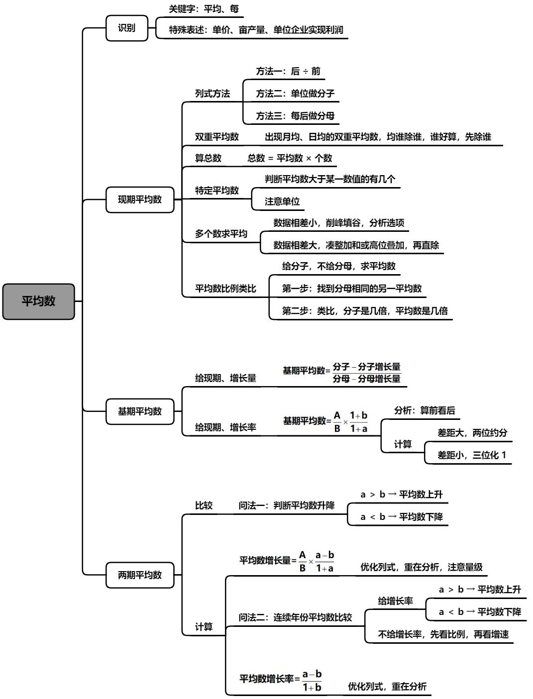

基础概念：

识别关键词：均、每、单位面积、单价

列式方法：

方法一：后 $\div$ 前（标准问法）

人均收入$=\dfrac{收入}{人数}$

每亩产量$=\dfrac{产量}{亩数}$

单位企业实现利润$=\dfrac{利润}{企业数}$

方法二：单位

km/h

吨/公顷

方法三：常识定义

谁是 1 谁就是分母（每后为分母）

## 一、现期平均数

### 考法一：平均数计算

方法一：$\dfrac{后} {前}$

方法二：单位做分子

方法三：每后做分母

### 考法二：平均数比较

识别：问谁的平均数最高或最低
方法：

分数比较 → 先估算范围，再精细比较
注意量级

### 考法三：双重平均数（ 有两个“ 均 ”，需要除两次 ）

方法：出现月均、日均的双重平均数，均谁除谁，优先除时间

### 考法四：算总数

公式：

总数 $=$ 平均数 $\times$ 个数

总收入 $=$ 月均收入 $\times$ 月份数

总产量 $=$ 亩产量 $\times$ 亩数

> 天数
>
> 全年：闰年 366 天，平年 365 天，其中，下半年 184 天，上半年：闰年 182 天、平年 181 天
>
> 大月 31 天：1月、3月、5月、7月、8月、10月、12月
>
> 小月 30 天：4月、6月、9月、11月
>
> 2月：闰年 29 天，平年 28 天
>
> 闰年年份能被 4 整除，平年不能，整百年，需被 400 整除
> 简言之：四年一闰，百年不闰，四百年再闰

### 考法五：特定平均数

识别：判断平均数高于或低于某一数值的有几个
方法：注意单位，

一般不同年份的相同数据，量级不会有明显差异，

相同年份的不同数据，需要特别注意量级

### 考法六：多个数求平均

方法：数据相差小，削峰填谷
数据相差大，高位叠加或凑整加和，直除

### 考法七：平均数比例类比

识别：给分子，不给分母，求平均数
方法：

第一步：找到分母相同的另一平均数
第二步：类比，分子是几倍，平均数是几倍

## 二、基期平均数

### 1.给现期、增长量

识别：基期 + 平均数

公式：基期平均数 $=\dfrac{分子 - 分子增长量}{分母 - 分母增长量}$

### 2 .给现期、增长率

识别：基期+均、每

公式：基期平均数 $=\dfrac{A}{B} \times \dfrac{1+b}{1+a}$

> $A$：分子的现期
> $a$：分子的增长率
> $B$：分母的现期
> $b$：分母的增长率
>
> 列式辅助记忆：先写现期平均数，再乘个“ 1 + 增长率 ”的小尾巴，增长率交叉对应

速算一：分析类（算前看后）

第一步：根据选项差距截位直除 $\dfrac{A}{B}$

第二步：再根据 $\dfrac{1+b}{1+a}$ 与 $1$ 的关系进行分析（$b$ 大 $\to 1^+$、$b$ 小 $\to 1^-$）

选项唯一，直接选

选项不唯一，借助 $1.1$ 与 $0.9$ 分析、化 $1$ 法

速算二：计算类

选项差距大，两位约分
选项差距小，等比修正，三位化 $1$

## 三、两期平均数

### 1.两期平均数比较

考法一：两期平均数升降

识别：问平均数同比上升或下降 

方法：$a > b \to$ 平均数上升 

$a < b \to$ 平均数下降 

注：一定要注意增长率的正负

考法二：连续多年平均数比较

给增长率 $\to a > b \to$ 平均数上升；$a < b \to$ 平均数下降

给具体量 $→$ 先看比例，再看增速

### 2 .两期平均数计算

考法一：平均数增长量

识别：所求增长量的主体是平均数（平均数+增长量）

公式：平均数增长量 $= \dfrac{A}{B} \times \dfrac{a - b}{1 + a}$

> $A$：分子的现期
> $a$：分子的增长率
> $B$：分母的现期
> $b$：分母的增长率

方法：优化列式，重在分析，注意量级

代公式：

① $a - b$：口算出两位，根据结果判升降，

正 $\to$ 上升

负 $\to$ 下降

② $\dfrac{A}{B}$：差距大，保留两位

③ $1 + a$：

当 $a > 0$，写成 “$1.X$”，例：$1 + 23\% \to 1.2$

当 $a < 0$，写成 “$0.X$”，例：$1 - 23\% \to 0.8$

> 注意：是否要看量级

考法二：平均数增长率

识别：所求增长率的主体是平均数（平均数+增长率）

公式：平均数增长率 $= \dfrac{a - b}{1 + b}$

> $a$：分子的增长率
> $b$：分母的增长率

方法：优化列式，重在分析

代公式：

① $a - b$：口算出两位，根据结果判升降，

正 $\to$ 上升，

负 $\to$ 下降

② $1 + b$：

当 $b > 0$，写成 “$1.X$”，例：$1 + 23\% \to 1.2$

当 $b < 0$，写成 “$0.X$”，例：$1 - 23\% \to 0.8$

|                  |                  现期                  |                  基期                  |                    两期比较                    |                 增长量                 |       增长率       |
| :--------------- | :------------------------------------: | :------------------------------------: | :--------------------------------------------: | :------------------------------------: | :----------------: |
| **比重（占）**   | $\dfrac{A}{B}$（$\dfrac{部分}{总体}$） | $\dfrac{A}{B} \times \dfrac{1+b}{1+a}$ |   $a > b$，比重上升； $a < b$，比重下降   | $\dfrac{A}{B} \times \dfrac{a-b}{1+a}$ |                    |
| **平均数（均）** |   $\dfrac{A}{B}$（$\dfrac{后}{前}$）   | $\dfrac{A}{B} \times \dfrac{1+b}{1+a}$ | $a > b$，平均数上升； $a < b$，平均数下降 | $\dfrac{A}{B} \times \dfrac{a-b}{1+a}$ | $\dfrac{a-b}{1+b}$ |

# 第十二章  倍数与比例

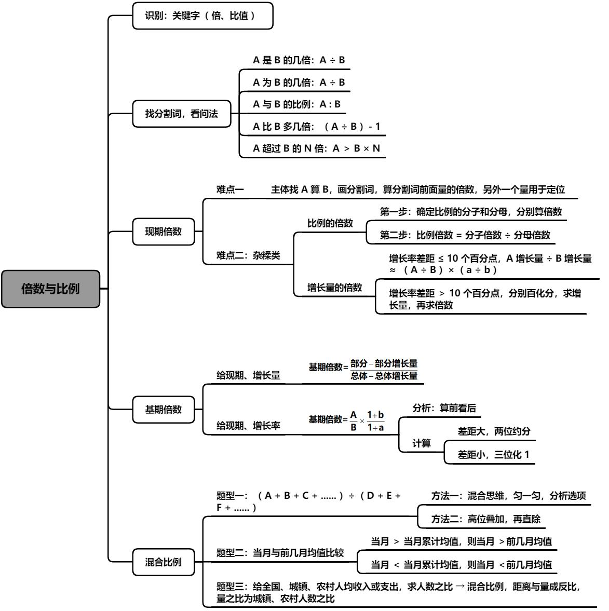

## 一、现期倍数

基础概念：

识别关键词：是几倍、多几倍、超过几倍、比值

> $A$ 是 $B$ 的几倍 $\to A \div B$
>
> $A$ 为 $B$ 的几倍 $\to A \div B$
>
> $A$ 与 $B$ 的比例 $\to A : B$
>
> $A$ 比 $B$ 多几倍 $\to \dfrac{A}{B} - 1$
>
> $A$ 超过 $B$ 的 $N$ 倍 $\to A > B \times N \to \dfrac{A}{B} > N$

方法：找分割词，看问法，注意“比”、“超过”的问法

>  “比”考“多几倍”，除完不要忘记减 $1$
>
> “超过”几倍，就和几倍去比，不要和“多几倍”混淆

考法一：是几倍

考法二：多几倍

考法三：特定倍数

考法四：找A 算 B

方法：长题干，不要怕，分割词，画一下，时刻记住：算的是分割词前的量

考法五：平均数倍数

识别：所求倍数的主体是平均数（平均数 $+$ 倍数）

公式：$\dfrac{A}{B} \div \dfrac{C}{D} = \dfrac{A \div C}{B \div D}$

速算一：一般选项差距大，两位约分

速算二：第一步，确定分子、分母

第二步，比例倍数 $=$ 分子倍数 $\div$ 分母倍数

## 二、基期倍数

1.给现期、增长量

识别：基期 $+$ 倍

公式：基期倍数 $= \dfrac{分子 - 分子增长量}{分母 - 分母增长量}$

2 .给现期、增长率，求基期倍数

识别：基期 $+$ 倍

公式：基期倍数 $= \dfrac{A}{B} \times \dfrac{1+b}{1+a}$

> $A$：分子的现期
> $a$：分子的增长率
> $B$：分母的现期
> $b$：分母的增长率
>
> 列式辅助记忆：先写现期倍数，再乘个“ 1 + 增长率 ”的小尾巴，增长率交叉对应

速算一：分析类（算前看后）

第一步：根据选项差距截位直除 $\dfrac{A}{B}$

第二步：再根据 $\dfrac{1+b}{1+a}$ 与 $1$ 的关系进行分析（$b$ 大 $\to 1^+$、$b$ 小 $\to 1^-$）

选项唯一，直接选

选项不唯一，借助 $1.1$ 与 $0.9$ 分析、化 $1$ 法

速算二：计算类

选项差距大，两位约分

选项差距小，等比修正，三位化 $1$

## 三、混合比例

1. 居中、偏向

$A$ 溶液：200 克，浓度 10%

$B$ 溶液：100 克，浓度 18%

$C$ 溶液：3000 克，浓度 5%

$A$、$B$、$C$ 三者混合，浓度的范围：\_\_\_\_\_\_\_\_\_\_

2. 线段法，算量之比（比例的分母之比）

例 1：男生平均分为 80 分，女生平均分为 83 分，全班平均分 81 分，则男女比为：\_\_\_\_\_\_\_\_\_\_

例 2：2021 年全国居民人均可支配收入 35128 元，城镇居民人均可支配收入 47412 元，农村居民人均可支配收入 18931 元，2021 年全国城镇人口与农村居民人口约为：\_\_\_\_\_\_\_\_\_\_

例 3：男生戴眼镜占比 20%，女生戴眼镜占比 30%，全班戴眼镜占比 24%，则男生占全班总数的比重为：\_\_\_\_\_\_\_\_\_\_

考法一：混合比重

$\dfrac{A + B + C + ......}{D + E + F + ......}$

考法二：混合平均数

口诀法，居中、偏向，判范围

考法三：混合倍数

1.混合比重

考法一：混合比重

$\dfrac{A + B + C + ......}{D + E + F + ......}$

考法二：口诀法，居中、偏向，判范围

考法三：线段法，计算具体数值
方法：距离（ 部分比重与混合比重的差值 ）与量（ 比重的分母，即总体 ）成反比

2.混合平均数

考法一：混合比重

$\dfrac{A + B + C + ......}{D + E + F + ......}$

考法二：当月与前几月均值比较

方法：当月 $>$ 当月累计均值 $\to$ 当月 $>$ 前几月均值

当月 $<$ 当月累计均值 $\to$ 当月 $<$ 前几月均值

考法三：线段法，计算具体数值
方法：距离（ 部分比重与混合比重的差值 ）与量（ 比重的分母，即总体 ）成反比

3.混合平倍数

### 牟式无脑三角杀

线段法
优点：可求比例，可求量
但需要写过程

三角杀
缺点：只能求比例，不能求量，学习过程记忆量大
但熟练后无需写过程

注：在算混合增长率时，不论哪种方法，量之比严谨是指部分基期的比
大多数我们拿现期量替代估算，当增长率相差较大时，误差较大，容易算错，要算基期的比

第一步：无脑做差（已知的两个比例做差，大 - 小）
第二步：无脑倍数（部分的具体量的倍数，大 ÷ 小）
第三步：无脑距离（大除小乘混合除以倍加一）
求大部分的增长率，差 ÷ 倍
求小部分的增长率，差 × 倍
求总体的增长率，差 ÷（倍 + 1）
求部分增长率，算的是与混合增长率之间的差距
求混合增长率，算的是与大部分增长率之间的差距

> 例 1：2025 年，志志的工资为 200 元，同比增长 3%，志志与照照工资总额为 1000 元，同比增长 7%
>
> 问：照照的工资同比增速约为多少？
>
> ---
>
> 例 2：2025 年，照照的工资为 800 元，同比增长 8%，志志与照照工资总额为 1000 元，同比增长 7%
>
> 问：志志的工资同比增速约为多少？
>
> ---
>
> 例 3：2025 年，照照的工资为 800 元，同比增长 13%，志志的工资为 200 元，同比增长 3%
>
> 问：志志与照照工资总额同比增速约为多少？

# 第十三章  A 与非A

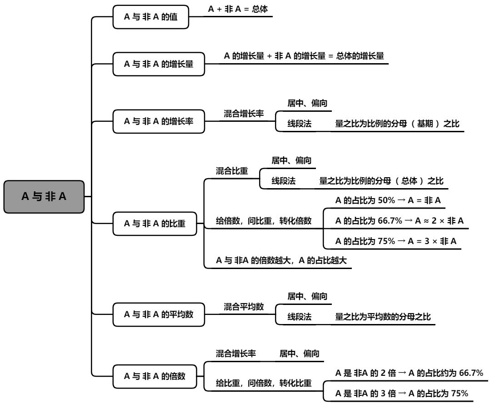

### 1. A 和非 A 的值
* **识别**：非 ......、非公有制、规模以下、除 ...... 以外
* **方法**：总数 $= A +$ 非 $A$

### 2. A 和非 A 的增长量
* **识别**：非 ......、非公有制、规模以下、除 ...... 以外
* **方法**：总数的增长量 $= A$ 的增长量 $+$ 非 $A$ 的增长量

### 3. A 和非 A 的增长率
* **量的关系**：总数 $= A +$ 非 $A$
* **率的关系**：混合增长率，居中、偏向、线段法

### 4. A 和非 A 的比重
* **考法一**：$A = B + C$，$A$ 占总体的比重为 $a$，$B$ 占总体的比重为 $b$，$C$ 占总体的比重为 $c$
    * **方法**：$a = b + c$
* **考法二**：给倍数，问比重
    * **方法**：转化倍数
    * $A$ 占总数的 $50\% \to A =$ 非 $A$
    * $A$ 占总数的 $33.3\% \to 2 \times A =$ 非 $A$
    * $A$ 占总数的 $66.7\% \to A =$ 非 $A \times 2$
    * $A$ 占总数的 $25\% \to 3 \times A =$ 非 $A$
    * $A$ 占总数的 $75\% \to A =$ 非 $A \times 3$
* **考法三**：$\dfrac{A}{非 A}$ 越大，$\dfrac{A}{总体}$ 越大

### 5. A 和非 A 的平均数
* **考法**：平均数 $= \dfrac{非 A}{非 B} = \dfrac{总体 1 - A}{总体 2 - B}$

### 6. A 和非 A 的倍数
* **考法**：给比重，问倍数
* **方法**：转化比重
    * $A =$ 非 $A \to A$ 占总体的 $50\%$
    * $A$ 是 非 $A$ 的 $2$ 倍 $\to A$ 占总体的 $66.7\%$
    * $A$ 是 非 $A$ 的 $3$ 倍 $\to A$ 占总体的 $75\%$

# 第十四章  综合分析

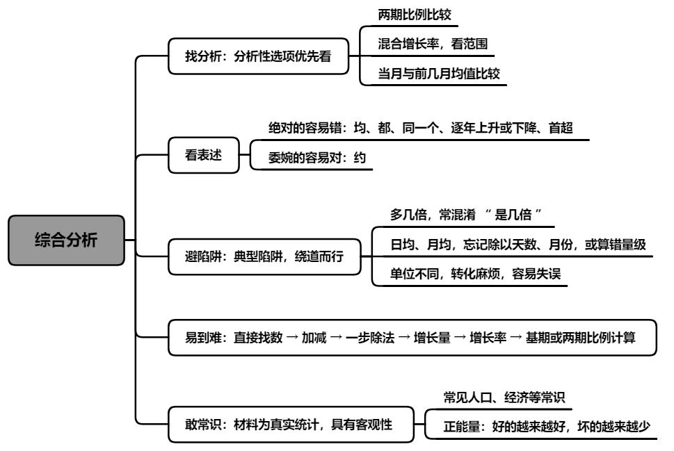

1.找分析

2.看表述

3.避陷阱

4.易到难

5.敢常识

