**材料（结构化阅读） - 题干 - 速算**  

**资料速算：直除 + 百化分 + 特定题型技巧**    

**问题三步走**：形成严谨的做题思维，提速的关键    

$$\text{问题三步走}\begin{cases}&\text{圈时间:避免时间坑}\\\\&\text{判题型:关键字}\\\\&\text{定主体:找数据}&\end{cases}$$

# 第一章  八大常用速算技巧  

## 一、4个常用速算小技巧

1.$一个数×1.5$，等于$这个数+本身的一半$  
2.
（1）$一个数×1.1$，等于$这个数错位相加$  
（2）$一个数×0.9$，等于$这个数错位相减$  
3.
	$一个数÷5$，等于$这个数×2$，小数点移一位。  
	$一个数÷25$，等于$这个数×4$，小数点移两位。  
	$一个数÷125$，等于$这个数×8$，小数点移三位。  	
4.常用分数（必须会背）
$$
\begin{gather}
&\frac{1}{2}&=&50\%&\qquad \quad&\frac{1}{3}&=&33.3\%&\qquad \quad&\frac{1}{4}&=&25\%\\
&\frac{1}{5}&=&20\%&\qquad \quad&\frac{1}{6}&=&16.7\%&\qquad \quad&\frac{1}{7}&=&14.3\%\\
&\frac{1}{8}&=&12.5\%&\qquad \quad&\frac{1}{9}&=&11.1\%&\qquad \quad&\frac{1}{10}&=&10\%\\
&\frac{1}{11}&=&9.1\%&\qquad \quad&\frac{1}{12}&=&8.3\%&\qquad \quad&\frac{1}{13}&=&7.7\%\\
&\frac{1}{14}&=&7.1\% &\qquad \quad &\frac{1}{15}&=&6.7\%&\qquad \quad&\frac{1}{16}&=&6.25\% \\
& \frac{1}{17}&=&5.9\% & \qquad \quad &\frac{1}{18}&=&5.6\%& \qquad \quad&
\frac{1}{19}&=&5.3\%
\end{gather}
$$

**高照教你百化分**   
① 不用背，我也会  
	$50\%=\dfrac 12、33.3\%=\dfrac 13 、25\%= \dfrac 14、20\%= \dfrac 15、10\%= \dfrac 1{10}$  
② 记住（ $\dfrac 18$ ~ $\dfrac 1{13}$），加和为 $20$ （整数部分+分母）  
	$12.5\%=\dfrac 18、11.1\%=\dfrac 19、9.1\%=\dfrac 1{11}、8.3\%=\dfrac 1{12}、7.7\%=\dfrac {1}{13}$  
③ 记住（$16、6$）和（$14、7$）互换的两对  
	$16.7\%=\dfrac 16、6.25\%=\dfrac 1{16}、14.3\%=\dfrac 17、7.1\%=\dfrac 1{14}$  
④ 记住（$17、18、19$），$5.963$     
	$5.9\%=\dfrac {1}{17}、5.6\%=\dfrac {1}{18}、5.3\%=\dfrac {1}{19}$  
⑤ 就记住 $6.7\%=\dfrac 1{15}$   

## 二、加法:高位叠加

两位数加减：口算      
三位数加法：高位叠加、不列式、少动笔      

## 三、减法:划线减法

（1）临界值：（插入临界值）   
（2）普通数值（划线方法，以好算、少借位为前提）   

## 四、乘法（化乘为加、凑整、百化分）

（1）两位数×个位数：化乘为加   
（2）两位数×两位数：化乘为加   
	操作方法：==前前后后，里里外外==   
（3）百化分：根据选项差距    
	① 估算：$3224×12.6\%≈3224×12.5\%=3224× \dfrac 18$    
	② 精算：$3224×12.6\%=3224×(12.5\%+0.1\%)$    

## 五、分数拆分思想：化1法、化半法、凑整法

​	$\dfrac{145}{142}=\dfrac{142+3}{142}=\dfrac{142}{142}+\dfrac{3}{142}\approx1+2$  

​	$\dfrac{74}{142}=\dfrac{71+3}{142}=\dfrac{71}{142}+\dfrac{3}{142}\approx50\%+ 2\%$

## 六、截位直除：一步除法和多步除法

**资料速算：直除+百化分+特定题型技巧**

1.什么是截位？  
	截位：从左边第一个非0的数开始截（截几位即保留几位，下一位数四舍五入）。    
2.截谁？看算式形式  
（1）一步除法：只截分母  
	常见形式： $\dfrac{\mathrm{A}}{\mathrm{B}},\dfrac{\mathrm{A+B}}{\mathrm{C}},\dfrac{\mathrm{A}}{\mathrm{B+C}}$  
（2）多步除法：分子分母都截（截完约分）  
	① 常见形式$\dfrac{\mathrm{A}}{\mathrm{B}}\times\dfrac{\mathrm{C}}{\mathrm{D}}\quad\mathrm{、}\dfrac{\mathrm{A}}{\mathrm{B}}÷\mathrm{C}$  
	② 多步除法：速算本身是有灵魂的   
		差距大，截 2 位 —— 因为差距大，还有浪的空间，==$+1、-1$进行微调==，方便约分。     
		差距小，截 3 位 —— 因为差距小，为了避免犯错，严谨计算   
	（特定题型有特定解决）。    
		注：＞ 10 的数才可微调，尽量调 1。    
3.截几位？       看选项差距  
（1）选项差距大（截两位）  
	① ==首位均不同。==  
	② ==首位相同，第二位不同，且第二位差＞首位。==  
（2）选项差距小（截三位）：  
	==首位相同，第二位不同，且第二位差≤ 首位。==  
4.注意：  
（1）选项为某整数的左右邻居，选项差距小，截三位（如：$59、61$）  
（2）选项差距极小：**首位相同，第二位也相同（需要精算，截四位）**

## 七、截位直除：量级

1.若选项之间==存在约 10、100 倍==的关系时：  
2.方法：   
（1）截位（（组与组的差距）差距大截两位、差距小截三位）    
（2）保留量级（（组内关系）小数点位置：决定是几十还是几百）    
3.**易错点**：量级牵扯到百分号（$\%$）。   
（1）方法：==分母划线，两位即是 $\%$==。       
（2）哪两位：十位个位。 

## 八、分数比较

1.==一大一小：直接比较==  
	分母与分母比较，分子与分子比较  
	$\dfrac{27}8\dfrac{小}{大}\qquad\dfrac{37}7\dfrac{大}小$
2.同大同小：  
（1）==竖着直接除==：一眼能瞄就竖着  
（2）==横着看速度==：
	分子快，则分子大的分数大   
	分母快，则分母大的分数小    
	$\dfrac{27}{8}\dfrac{小}小\qquad\dfrac{37}{14}\dfrac{大}大$  
3.常考：【比较四个分数】  
找标准：
（1）要想分数大：$\dfrac AB \qquad \dfrac 大 小$ 
（2）要想分数小：$\dfrac AB \qquad \dfrac 小 大$ 

排序题：（别硬排）    
方法：最值思维 + 选项。   
分数量级：统一分母的量级，好计算。  

# 第二章  基期量  

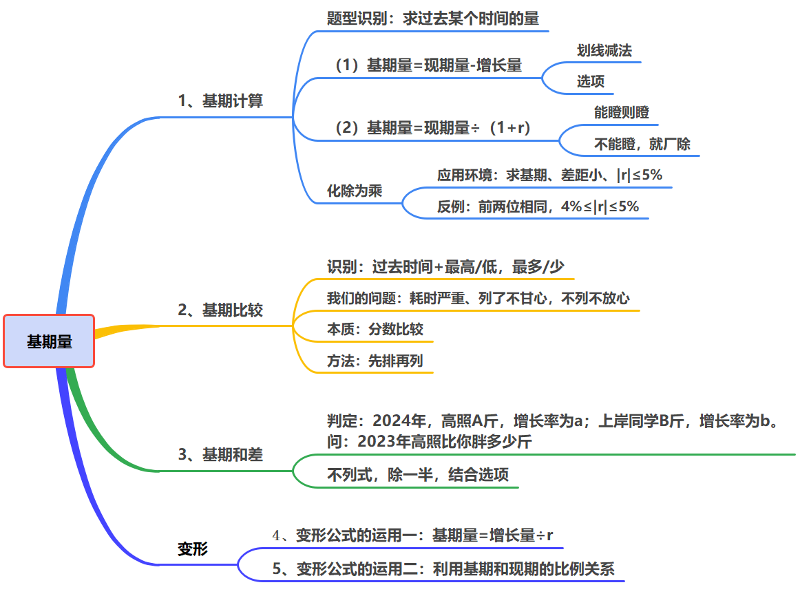

对比参照的是基期，而相对于基期比较的是现期。   
现期、基期、增长量、增长率。     

同比和环比的区分：（同比看年、环比看尾）  
	同比：与上年同期相比。   
	环比：与紧紧相邻的上一统计周期相比（月环比、季度环比）。      

## 基期量  

1.判定：求过去某个时间的量  
2.公式：  
	$\textbf{基期量 = 现期量 - 增长量} =\mathrm { \dfrac {{现期量}}{1+r}=\dfrac{{增长量}}{r}}$  
	$\textbf{现期量 = 基期量 + 增长量} =  {{基期量} \times \mathrm{(1+r)}}$    

## 一、基期计算

1.加减计算   
（1）划线减法    
（2）==尾数法==   
	==尾数不同==   
	==精确度一致==  
2.除法：$\mathrm {r>0、 r<0}$    
（1）$\textbf {基期量} = \mathbf {\dfrac {\textbf {现期量}}{1+r}}$   
（2）蹬选项，截位直除   
3.化除为乘  
（1）应用环境：**求基期，差距小，$|\mathrm{r}|\leq5\%$**   
（2）技巧：先变正负，再拆括弧   
	$\mathbf {\dfrac{{A}}{1+{r}}}\approx\mathrm{A}\times (1-\mathrm{r}) =\mathbf{A}-\mathbf{A}\times\mathbf{r}$  
	$\mathbf{\dfrac{A}{1-r}}\approx\mathrm{ A\times (1+r) =\mathbf {A+A\times r}}$  
4.化除为乘反例  
**化除为乘不可用**：  
==（1）选项首位相同，第二位也相同  且 （2）$\mathbf {4\% ≤ |r| ≤ 5\%}$==。

## 二、基期比较

1.识别：过去时间+最高/低，最多/少    
2.式子：$\mathbf{\dfrac A{1+r}\text{、}\dfrac B{1+r}\text{、}\dfrac C{1+r}\text{、}\dfrac D{1+r}}$    
3.**本质：分数比较**     
4.**方法：==先排再列==**   

## 三、基期和差

1.公式:    
	$\mathbf {\dfrac{\mathrm{A}}{1+a}+\dfrac{B}{1+b}\qquad \qquad\dfrac{A}{1+a}-\dfrac{B}{1+b}}$      
2.方法：    
（1）分母相同：分子和差     
（2）分母不同：不列式的厂除（快准狠）    

## 四、变形公式的运用一

​	$\textbf{基期=}\dfrac{\textbf {增长量}}{\mathbf r}$    

## 五、变形公式的运用二

巧妙利用：基期现期的比例关系  
$\mathbf{ \textbf{基期量=}\dfrac{\textbf{现期量}}{1+r} \qquad\textbf{ 现期量}= \textbf{基期量} \times  (1+r)}$   

# 第三章  现期量

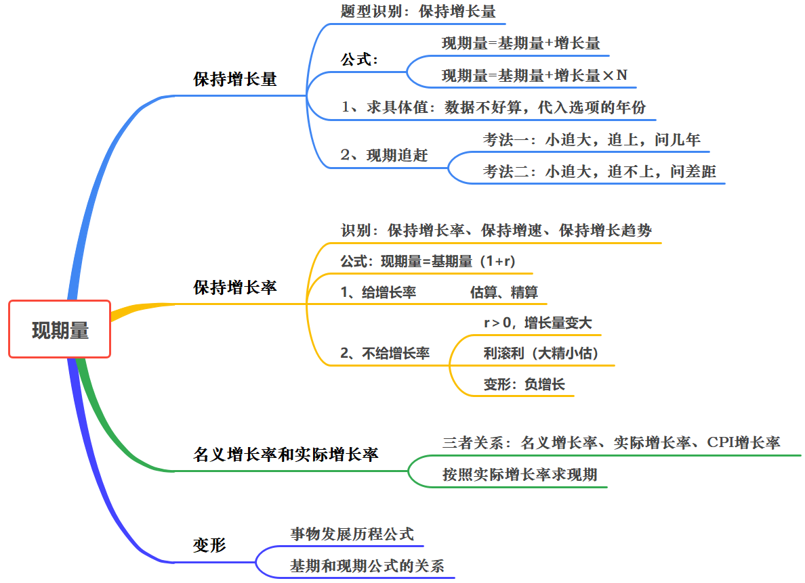

识别：给基期量，求后面某个时期的值。  

## 1、保持增长量 

$\textbf {现期量 = 基期量 + 增长量}$

### （1）求具体值

### （2）现期追赶

#### 考法一：小追大，追上，问几年

方法：==找差距，补差距==。

#### 考法二：小追大，追不上，问差距

## 2、保持增长率

$\mathbf{\textbf {现期量 = 基期量} \times (1+r)}$  

### （1）给增长率，保持增长率（拆分思想） 

看选项差距决定精算估算。

### （2）不给增长率，保持增长率 

方法一：$\mathbf{r＞0}$，增长量变大。       
方法二：大精小估，利滚利思想  
正向：计算出具体值   
反向：选项排除（更快）        
$$
\mathbf{
121
\xrightarrow 
[利息 10 ]  {r}
131
\xrightarrow 
[ {\begin{array}\text{{本金 121 \xrightarrow {÷ 12} 10 \text{（大精）}}\rightarrow 131}\\{利息 10 \xrightarrow {÷ 12} 0.8\text{（小估）}\rightarrow 10.8}\end{array}} ]  {r}

131 + 10.8 = 141.8

}
$$

### （3）变形考法：负增长   

技巧：$\mathbf{r<0}$ ，增长率为负，==减的越来越少==。（减肥原理）

## 3、按照名义增长率求现期  

名义增长率：没有扣除价格因素影响得到的增长率。    
实际增长率（按可比价格计算）：扣除价格因素影响得到的增长率。   
消费价格指数（CPI）
原理推导：$\mathbf {(1+r_{\tiny{\textbf{名义}}})=(1+r_{\tiny{\textbf{实际}}})\times(1+r_{\tiny{\mathbf{CPI}}})}$  
公式 1：$\mathbf {r_{\tiny{\textbf{名义}}}=r_{\tiny{\textbf{实际}}}+r_{\tiny{CPI}}+r_{\tiny{CPI}}\times r_{\tiny{\textbf{实际}}}}$  
速算技巧：代入排除法  
公式 2：$\textbf{现期量}=\mathbf {\dfrac{\textbf{现期量}}{1+\textbf{名义增长率}}\times(1+\textbf{实际增长率})}$  

## 4、变形考法 

# 第四章  增长率

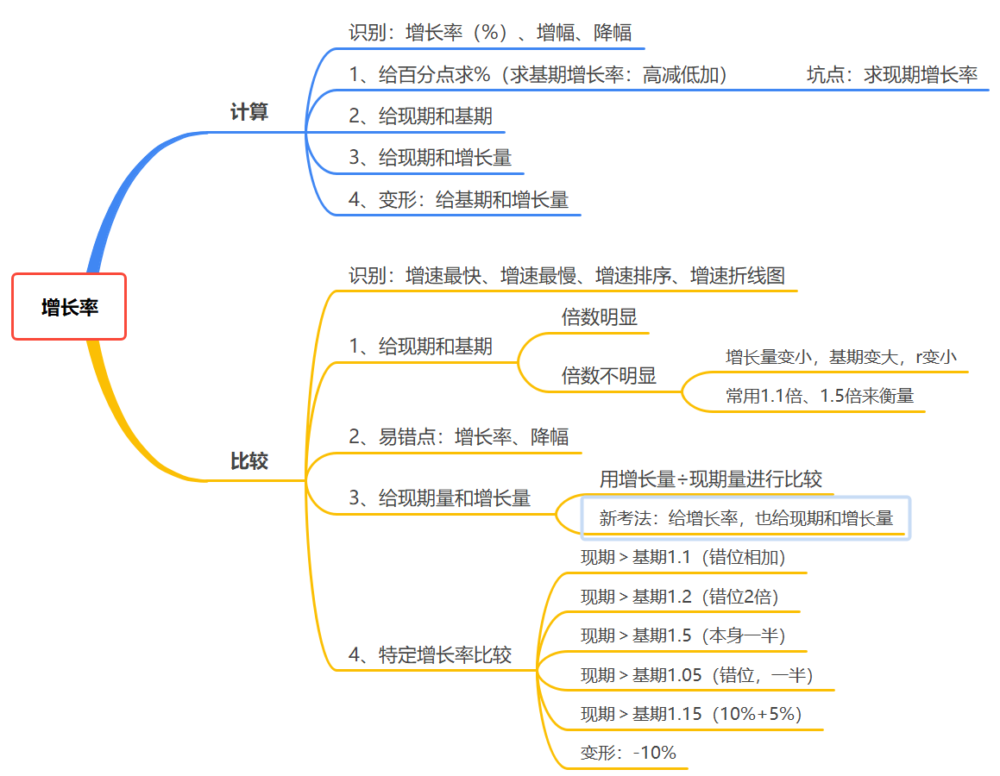

定义：增长率指的是现期量与基期量的差值（即增长量）与基期量之间的比较，即指在基期的基础上增长了多大的幅度。  
【注】：增长率又称增速、增幅或者增长幅度、增值率等。  
【注】：增长率有正有负，增长率为负时表示下降。   

易错点：  
一、“百分数”与“百分点”    
➢ 百分数表示两个量的比例关系，用除法计算  
➢ 百分点表示百分数的变化，用加减法计算  

二、“增长率”与“倍数”
① $\mathbf A$ 是 $\mathbf B$ = 的……倍：$\mathbf {\dfrac AB}$
② $\mathbf A$ 比 $\mathbf B$ 增长……倍     /    $\mathbf A$ 比 $\mathbf B$ 多……倍   
$\mathbf r=\dfrac{\mathbf{A-B}}{\mathbf{B}}=\dfrac{\mathbf{A}}{\mathbf{B}}-\mathbf{1}$
$$
\begin{cases}
\text{增长倍数 }=\mathbf{r}\\
\text{倍数 }=\text{增长倍数}+\mathbf{1}=\mathbf{r}+\mathbf{1}
\end{cases}
$$

疑难答疑：分数很接近，怎么进行比较。  
横向看速度：倍数明显看倍数，==倍数不明显看增长速度==。  

三、成数与翻番  
成数：几成相当于十分之几（如：30% 就是三成）
翻番：翻一番为原来的 $2$ 倍；翻两番为原来的 $4$ 倍；依此类推，翻 $n$ 番为原来的 $2^n$ 倍。  

四、“增幅”、“降幅”、“变化幅度”  
➢ 增长率（增幅，增长幅度，增速）带着正负号比。  
➢ 降幅必须为负，比较绝对值。   
➢ 变化幅度可正可负，比较绝对值。  

## 1、增长率计算

（1）百分点计算  
求基期增长率  
口诀：“增速”→ 高减低加（带正负号计算）  
口诀：“降幅”→ （绝对值的高减低加），整体增加“负号”代表降  

（2）变形：百分点计算  

（3）具体值  
① 给现期和基期  
② 给现期、增长量  

$\mathbf {r=\dfrac{\text{增长量}}{\text{基期量}}=\dfrac{\textbf{增长量}}{\textbf{现期量-增长量}}}$  
速算：截位直除  

③ 变形题：给基期量、增长量   
$\mathbf{r}=\dfrac{\textbf{增长量}}{\textbf{基期量}}$  
速算：截位直除  

## 2、增长率比较  

（1）给现期、基期   

识别：增速最快/最慢，增长幅度最大/最小  
已知：现期、基期，比较增长率 $\to \mathbf {r=\dfrac{\text{现期}-\text{基期}}{\text{基期}}=\dfrac{\textbf{现期}}{\textbf{基期}}-1}$
方法：看现期与基期的倍数关系是否明显    
① 当 $\mathbf {\dfrac{\text{现期}}{\text{基期}}=2^+}$ 明显，用 $\dfrac {\textbf {现期}}{\textbf{基期}}$ 比较    
② 当 $\mathbf {\dfrac{\text{现期}}{\text{基期}}=1^+}$ 不明显，用 $\dfrac {\textbf {增长量}}{\textbf {基期}}$ 比较    
原理：$\mathbf {r = \textbf {倍数} - 1}$  
小技巧：  
① $\dfrac {增长量}{基期} = \mathbf r$，增长量变小，基期量变大， $\mathbf r$ 变小    
② 常考 $\mathbf {1.5}$ 倍、$\mathbf {1.1}$ 倍  

① 最值   
② 增长率折线图、增长率排序    
本质：先排再列   
技巧：  
a. 最值  
b. 选项  

③ 易错点：增长率、降幅  

（2）给现期、增长量   
方法：给现期量和增长量，直接比较 $\dfrac {\textbf {增长量}}{\textbf {现期量}}$ 大小
注：$\dfrac {\textbf {增长量}}{\textbf {现期量}}$ 不是增长率（%）的具体值，只是代替比较  
推导：  
$\mathbf {r=\dfrac{\text{增长量}}{\text{现期量-增长量}} = \dfrac 1{\dfrac {现期量}{增长量}-1}}$

① 给现期量和增长量（减少量）  
② 变型题  

（3）特定增长率比较（给现期、基期 10%、20%、50%、5%、15%、-10%）  

方法：
$\mathbf {10\%：现期 > 基期 \cdot 1.1}$ （错位相加）    
$\mathbf {{20\%}：现期 > 基期 \cdot 1.2}$ （错位 $\mathbf 2$ 倍，进位）  
$\mathbf {{50\%}：现期 > 基期 \cdot 1.5}$ （本身一半）
$\mathbf {{5\%}：现期 > 基期 \cdot 1.05}$ （$\mathbf {10\%}$ 的一半，错位的一半）
$\mathbf {{15\%}：现期 > 基期 \cdot 1.15}$ （$\mathbf {10\% + 5\%}$）
变形：
$\mathbf{-10\%}\begin{cases}方法一:现期 < 基期 \cdot \mathbf {0.9} (错位相减) \\方法二:增长率计算(更直接，推荐)\end{cases}$

# 第五章 增长量

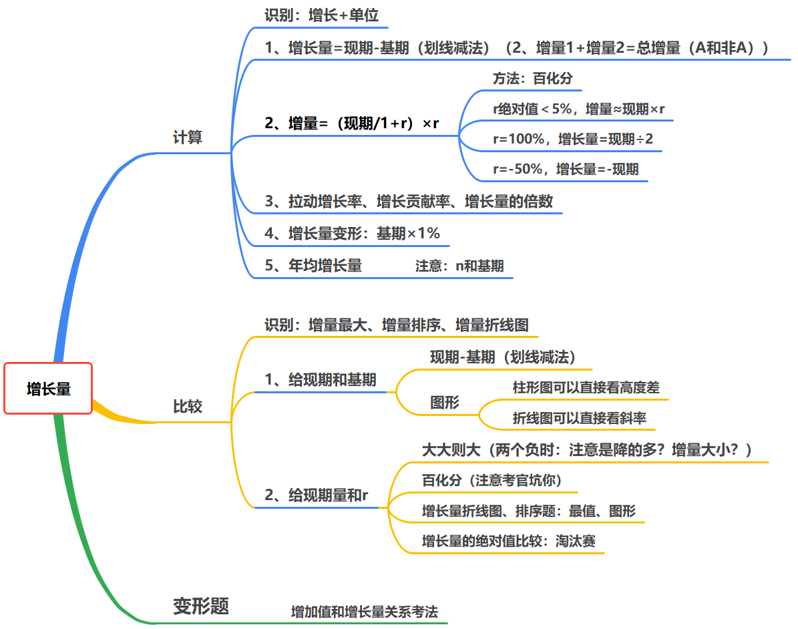

**增长量**  
判定：增长+具体单位（人/元/吨）  
公式：$\mathbf {\text{增长量=现期量-基期量=基期}\times \mathrm r= \dfrac{\textbf{现期量}}{1+ r}\times r}$  

## 1、增长量计算  

### （1）给现期、基期  

公式：$\textbf {增长量=现期-基期}$  
方法：划线减法、尾数法  

多个主体求增长量：增长量得计算小技巧   
结论：==总量的增长量等于各个部分增长量的和==  

### （2）给现期、$\mathbf r$ （百化分）  

$\mathbf {\text{增长量}=\dfrac{\text{现期}}{1+r}\times r} = \textbf {基期} \times \mathbf r$   
**增长量与增长率 $\mathbf {r}$  成正比**  

#### 考法一：直接百化分  

（1）$\mathbf {r>0:\quad r =\dfrac{1}{n}}$  

$\mathbf {\textbf{增长量}=\dfrac{\text{现期量}}{\mathrm 1+\mathrm{r}}\times\mathrm{r}=\dfrac{\textbf{现期量}}{n+1}}$  

> 推导（了解）：  
> $\text{增长量}=\dfrac{\text{现期量}}{1+\mathrm{r}}\times\mathrm{r}\xlongequal[]{r = \dfrac 1n}\dfrac{\text{现期量}}{1+\dfrac{1}{\mathrm{n}}}\times\dfrac{1}{\mathrm{n}}=\dfrac{\text{现期量}}{\dfrac{\mathrm{n}+1}{\mathrm{n}}}\times\dfrac{1}{\mathrm{n}}=\dfrac{\text{现期量}}{\mathrm{n}+1}$

（2）$\mathbf {r<0:\quad {r}= -\dfrac{1}{n}}$  
$\mathbf {\textbf{增长量}=\dfrac{\text{现期量}}{\mathrm1+\mathrm{r}}\times\mathrm{r}=-\dfrac{\textbf{现期量}}{n-1}}$   

> 推导（了解）   
> $\text{增长量}=\dfrac{\text{现期量}}{1+\mathrm{r}}\times\mathrm{r}\xlongequal[]{r = -\dfrac 1n}\dfrac{\text{现期量}}{1+(-\dfrac{1}{\mathrm{n}})}\times(-\dfrac{1}{\mathrm{n}})=\dfrac{\text{现期量}}{\dfrac{\mathrm{n}-1}{\mathrm{n}}}\times(-\dfrac{1}{\mathrm{n}})=-\dfrac{\text{现期量}}{\mathrm{n}-1}$

增长率百化分之公式法（通用）  
如果遇到百分数实在想不起来，或者你就不想背，不常考的陌生数字     
那么请记住：$\mathbf{n}=\dfrac{\mathbf {100}}{\textbf{百分号前的数字}}$（保留小数点后一位）  
**常考百划分**：   
$\mathbf {37\% = \dfrac 1{2.7}}$   
$\mathbf {42\% = \dfrac 1{2.4}}$   

#### 考法二：放缩   

方法：利用与背过的百分数的倍数关系，实现百化分

#### 考法三：取中  

如果遇到百分数左右难取舍，取中即可（**背**）  

$$
\begin{aligned}
\dfrac{1}{3.5}&\approx28.6\%&&\dfrac{1}{7.5}\approx13.3\%\\\\
\dfrac{1}{4.5}&\approx22.2\%&&\dfrac{1}{8.5}\approx11.8\%\\\\
\dfrac{1}{5.5}&\approx18.2\%&&\dfrac{1}{9.5}\approx10.5\%\\\\
\dfrac{1}{6.5}&\approx15.4\%&&\dfrac{1}{10.5}\approx9.5\%
\end{aligned}
$$

#### 考法四：$\mathbf {|r|<5\%}$ 

$\mathbf {\textbf {增长量} \approx \textbf{现期量} \times 𝐫}$    

#### 考法五：$\mathbf {r＜0}$  

$\mathbf {\text{增长量}=\dfrac{\text{现期量}}{1+\mathbf{r}}\times\mathbf{r}=-\dfrac{\textbf{现期量}}{n-1}}$ 

### （3）增长量的倍数  

增长量倍数：多步除法（除了又除），根据选项，截位列式。

### （4）增长量变形

$\mathbf {\textbf{增长量=基期} \times r}$  
==增长 $\mathrm {1\%，增长量=基期×1\%}$==   
技巧：每增长 $\mathbf {1\%}$ 或每增长 $\mathbf 1$ 个百分点，$\mathbf {\textbf {增长量=基期} \times 1\%}$  

### （5）拉动增长率、增长贡献率  

公式：  
$\textbf{拉动增长率}=\dfrac{\textbf{部分量的增长量}}{\textbf{整体量的基期量}}$
$\textbf{增长贡献率}=\dfrac{\textbf{部分量的增长量}}{\textbf{整体量的增长量}}$

### （6）年均增长量  

识别： 年均+增长+单位（每一年的增长量相同）
公式：$\mathbf {\text{年均增长量= }\dfrac{\textbf{现期量-基期量}}{{n \textbf 年}}=\dfrac{\textbf{总增长量}}{{n \textbf 年}}}$  

## 2、增长量比较    

判定：增长最多/最少、下降最多/最少  

### 考法一：给现期、基期    

公式：  
$增长量=现期-基期$    
柱形图、折线图中可以直接看高度差    
注：==斜率代表的是增长量==    

### 考法二：给现期、$\mathbf {r}$   

（1）大大则大：  
① 现大、增长率大，则增量大   
② 现大、降幅大，则减少量大  
（2）一大一小：百化分，$\dfrac{\textbf{现期量}}{\mathbf{n+1}}$ 分数比较（考官出坑的地方）  
公式解释： $\mathbf {\text{增长量}=\dfrac{\textbf{现期量}}{1+r}\times r}$  

### 考法三：增长量绝对值比较  

考法：绝对值的最值、绝对值排序  
方法：淘汰赛  

### 考法四：增长量的折线图    

最值法（最大、最小值）

## 3、增长量的变形坑点  

# 第六章 间隔增长率

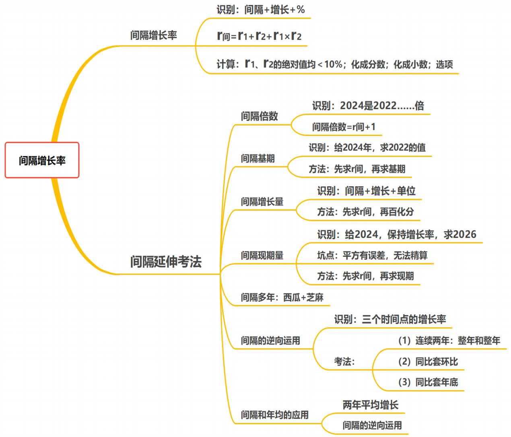

## 考法一：间隔增长率

判定：2024年比2022年增长+ % （隔一年，求增长率）
公式：$\mathbf{{r}_{\tiny{\text{间隔}}}=r_{1}+r_{2}+r_{1}\times r_{2}}$ （和 + 积）  
速算：  
① $\mathbf {r_1、r_2}$ 的绝对值均 $< \mathbf {10\%}$，==$\mathbf {r_1、r_2}$ 的和==与==选项差一个百分点（$\mathbf {1\%}$ ）以上==，$\mathbf {r_1 \times r_2}$ 可以忽略    
$\mathbf {r_{1}\times r_{2}<10\%\times10\%=1\%}$
② 化成分数或化成小数   
$\mathbf {48\%+25\%+48\%\times25\%\approx 73\% + 48\% \times \dfrac 14 \approx 73\% +  12\% \approx 85\%}$   
$\mathbf {30\%+15\%+30\%\times15\%\approx 30\%+15\%+0.3\times15\%\approx  45\%+4.5\%\approx 49.5\%}$
③ 结合==选项==看答案  

## 考法二：间隔倍数

特征：间隔一年，求倍数   
两步走： 
① 先求 $\mathbf {r_{\tiny{间}}}$    
② $\mathbf {间隔倍数=r_{\tiny{间}}+1}$   

## 考法三：间隔基期

特征：间隔一年，求基期  
两步走  
① 先求 $\mathbf {r_{\tiny间}}$    
② $\textbf {间隔基期}=\dfrac{\textbf{现期量}}{\mathbf r_{\tiny{\textbf{间}}}}$  

## 考法四：间隔增长量

特征：间隔一年，求增长量  
两步走：  
① 先求 $\mathbf {r_{\tiny 间}}$    
② 百化分，$\textbf{间隔增长量}=\dfrac{\textbf{现期量}}{\mathbf{n+1}}$  

## 考法五：间隔现期

特征：间隔一年，求现期量  
两步走：  
① 先求 $\mathbf {r_{\tiny {\text 间}}}$    
② $\textbf{间隔现期量=基期}\times\quad(1+\mathbf{r}_{\tiny{\textbf{间}}})$

## 考法六：间隔多年增长率

方法：多间隔几次。  
小技巧：==当各年 $\mathbf {r>0}$==，间隔多年增长率 $\mathbf{r}_{\tiny{\text{间}}}>\mathbf{r}_{1}+\mathbf{r}_{2}+\cdots+\mathbf{r}_{n}$  
$\mathbf {16\% \text{ 的间隔增长率为 } 34.56\%}$    

## 考法七：间隔的逆向运用  

1.识别：连续的时间，求增长率 
$\mathbf{{r}_ {\tiny{\text{间}}}=r_{1}+r_{2}+r_{1}\times r_{2}}$   
2.公式：$\mathbf{r}_2=\dfrac{\mathbf{r}_{\tiny{\textbf{间}}}{-\mathbf{{r}_1}}}{\mathbf 1+\mathbf{r}_ {\mathbf1}}$    
3.考法   
（1）连续两年：整年和整年   
（2）同比套环比   
（3）同比套年底  

## 考法八：变形：间隔逆运用和年均增长率的应用

方法：先间隔，再逆向运用  

# 第七章 乘积增长率

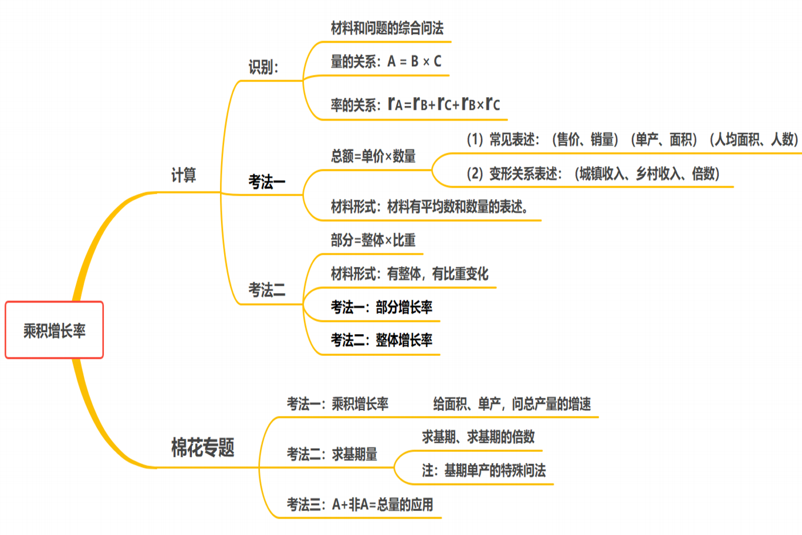

量的关系：$\mathbf {A=B\times C}$
增长率关系：$\mathbf {r_{\tiny A} = r_{\tiny B} + r_{\tiny C} + r_{\tiny B} r_{\tiny C}}$

## 1、总额=单价×数量

判定：$总额=单价 \times 数量$   增长 $\mathbf {+ \%}$ （求总额增长率）
公式：$\mathbf {r_{\tiny A} = r_{\tiny B} + r_{\tiny C} + r_{\tiny B} r_{\tiny C}}$
 计算技巧： 
① 寻找 $\mathbf {r_{\tiny B}、r_{\tiny C}}$  
② 看选项
注：$\mathbf {r_{\tiny C}=0 \quad 时,\quad r_{\tiny B} + r_{\tiny C} + r_{\tiny B} r_{\tiny C}=r_{\tiny B}}$

### 棉花专题——材料的特色考法

一、乘积增长率（$\text{总产量=面积×单产}$）    
二：求基期量（$\text{基期量}=\dfrac{\text{增长量}}{\mathbf{r}}$）（基期单产的特定问法）  
三：A+非A=总量的应用  

## 2、部分=整体×比重

判定：$部分=整体 \times 比重$ 增长+ % （求部分的增长率）
公式：$\mathbf {r_{\tiny A} = r_{\tiny B} + r_{\tiny C} + r_{\tiny B} r_{\tiny C}}$

（1）部分增长率

（2）整体增长率

# 第八章 年均增长率  

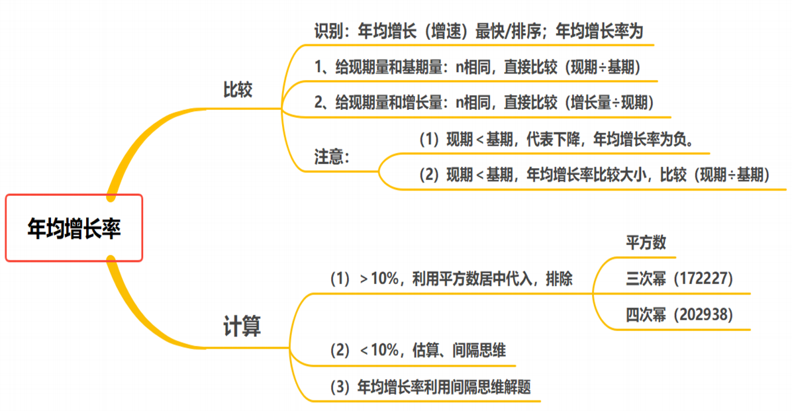

判定：年均增长（增速）最快/排序；年均增长率为
公式：$(1+\mathbf{r})^\mathbf{~n}=\dfrac{\text{现期}}{\text{基期}} \quad \rightarrow \quad \mathbf r=\sqrt[\mathbf n]{\dfrac{\text{现期}}{\text{基期}}}-\mathbf 1$

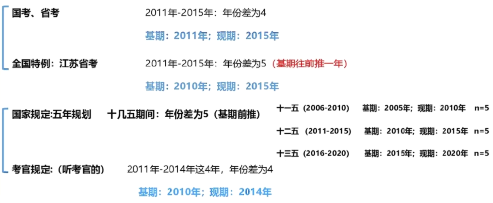

## 1、年均增长率的比较

方法：$\mathbf n$ 相同，直接比较 $\dfrac {\textbf {现期}}{\textbf {基期}}$  
注意：
（1）$现期 ＜ 基期$，代表下降，年均增长率为负。
（2）$现期 < 基期$，年均增长率比较大小，直接比较 $\dfrac {现期}{基期}$  

## 2、年均增长率的计算

（1）$\mathbf {r＜10\%}$（估算、间隔思维解题）

估算结论：$\mathbf {r_{\tiny {\text{年均}}}\leq\dfrac{r_{\tiny {总}}}{n\text{年}}}$  
注：$\mathbf r_{\tiny 总}$ 为时间段的总增长率  

>  原理：  
> $$
> \mathbf {(\mathbf{a}+\mathbf{b})^n=\mathbf{a}^n+\mathbf{C}_n^1\times\mathbf{a}^{n-1}\times\mathbf{b}^1+\mathbf{C}_n^2\times\mathbf{a}^{n-2}\times\mathbf{b}^2+......+\mathbf{b}^n}
> $$
> $$
> \mathbf{(\mathbf{1}+\mathbf{r})^n=\mathbf{1}^n+\mathbf{C}_n^1\times\mathbf{1}^{n-1}\times\mathbf{r}^1+\mathbf{C}_n^2\times\mathbf{1}^{n-2}\times\mathbf{r}^2+......+\mathbf{r}^n}
> $$
> $$
> \mathbf {1+\mathbf{nr}+......+\mathbf{r}^\mathbf{n}=\quad(1+\mathbf{r})^\mathbf{n}=\dfrac{\text{现期}}{\text{基期}} =1+r_{\tiny 总}}
> $$
> $$
> \begin{array}{rcl}\mathbf 1+\mathbf{nr}&\leq& \mathbf1+\mathbf r_{\tiny {\text{总}}}\\
> \mathbf r_{\tiny {\text{年均}}}\leq&\dfrac{\mathbf r_{\tiny{\text{总}}}}{\mathbf n年}\end{array}
> $$

（2）$\mathbf {r>10\%}$ （利用平方数居中代入，排除） 

常见平方数：
$$
\begin{aligned}
11^ 2= 121 && 12^2= 144 && 13^2 = 169 \\ 
14^2 = 196 && 15^2 = 225 && 16^2 = 256 \\
17^2 = 289 && 18^2 = 324 &&19^2 = 361
\end{aligned}
$$

$$
\begin{gathered}
21^{2} =441 && 29^{2} =841 \\
22^{2} =484 && 28^2=784 \\
23^{2} =529 && 27^2=729 \\
24^{2} =576 && 26^2=676 \\
&25^2= \text{625} 
\end{gathered}
$$

年均增长率最常考三（四）次方
三次幂 :172227  
四次幂:202938  

$$
\begin{gathered}
1.2^3\approx1.7 && 1.2^4\approx2.0\\
1.3^3\approx2.2 && 1.3^4\approx2.9\\
1.4^3\approx2.7 && 1.4^4\approx3.8
\end{gathered}
$$

# 第九章 混合增长率

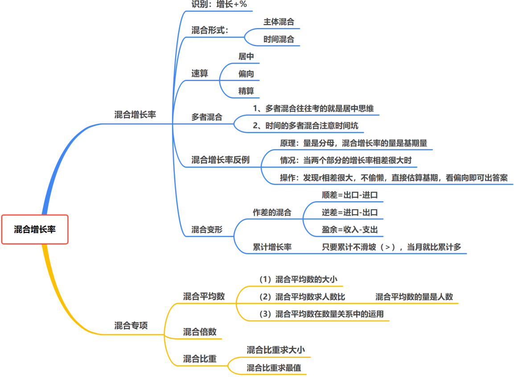

**具体判定**：明显有部分混合得到整体的关系（求增长率，难以直接求解）  
$部分1+部分2=整体$  

线段法引入：线段法的==本质就是混合原理==  
**线段法口诀**：  
1、部分写两边，整体写中间。  
2、距离和量成反比  
练习1.浓度为 14%的溶液450克与浓度为22%的溶液B克，混合后的浓度为16%。  
练习2.浓度为 14%的溶液500克与浓度为22%的溶液 300克，混合后的浓度为？%。  
练习3.浓度为 14%的溶液A克与浓度为22%的溶液150克，混合后的浓度为20%。  

**混合增长率**
量的关系：  
增长率关系：混合增长率  
常考形式：   
1.$人民币+外币=本外币$    
2.$进口+出口=进出口$    
3.$邮政+电信=邮电$    
4.$上半年+下半年=全年$    
5.$一季度+二季度=上半年$   
6.$累计增长率$    

具体一点的判定：求增长率，量存在加和关系，则考虑是否为混合。   
**根据选项进行计算**：
（1）==混合居中==   
（2）==从正中间偏向基期量较大的==（跷跷板原理，从正中间向胖的偏）   
（3）==偏向搞不定，线段法精算== 
注：求混合增长率，==做题时无基期量，一般用现期量近似代替基期量==    

## 1、居中思维（主体混合、时间混合）

## 2、偏向思维

## 3、精算思维

## 4、多者混合

多者混合，计算量大，往往考的就是大小居中思维。
注意：==时间的多者混合注意时间坑==。

## 5、混合增长率反例（量必须用基期）

公式：$\text{浓度}=\dfrac{\text{溶质}}{\text{溶液}}\qquad\mathbf{r}=\dfrac{\text{增长量}}{\text{基期}}$  
原理：量是分母，混合增长率的量是基期量  
混合：居中，偏向基期量大的。（多数情况（99.9%）用现期代替基期计算）  
注：==当两个部分的增长率相差很大（通常差几十个百分点甚至更多）==时，可能存在叛逃情况，需警惕反例  
**操作**：发现 $\mathbf r$ 相差很大，不偷懒，直接估算基期，尽量精算。  

## 6、变形：

（1）差值增长率  
方法：主体作差的混合，转化为主体加和的混合  
$盈余=收入-支出$  
$顺差=出口-进口$    
$逆差=进口-出口$    

（2）累计增速  
累计增长率：只要累计不滑坡（＞），当月就比累计多  
例子：3 月增长率 >（1-3月）累计增长率  
(1~3月) = （1~2月） + 3 月
线段法，则：
3 月 > 1~3 月 > 1~2 月

## 7、混合专项1:混合平均数

$\text{平均数}=\dfrac{\text{总量}}{\text{人数}}$  
混合平均数的量是人数  

(1)混合平均数的大小：居中思维，匀一匀  
(2)混合平均数求人数比  
(3)混合平均数百量关系中的运用  

$\text{增长率}=\dfrac{\text{增长量}}{\text{基期量}}(资料) \qquad \text{平均数}=\dfrac{\text{总量}}{\text{人数}}\text{(资料、数量)}$

重点：量是分母
(1)混合增长率的量是基期量
(2)混合平均数的量是人数

## 8、混合专项2：混合倍数

方法：居中思维，匀一匀

## 9、混合专项3：混合比重

方法：居中思维，匀一匀

# 第十章 比重

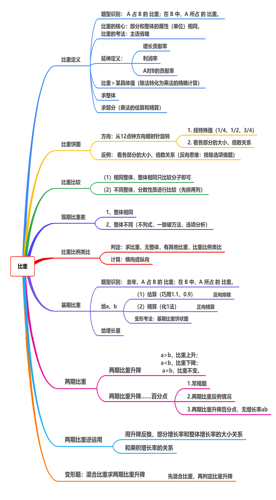

## 1.现期比重

关键字：占  
题型识别： $\mathbf A$ 占 $\mathbf B$ 的 比重；在 $\mathbf B$ 中，$\mathbf A$ 所占 的 比重。  
常用问法展示：  
（1）第三产业增加值占 GDP 的比重：
（2）在总收入中，工资收入所占的比重：
比重的核心：==部分和整体的属性（单位）相同==。
比重的考法：主语省略（为了表达简洁，故意省略其中一个相同的主语）

“$\text{比重}=\dfrac{\text{部分}}{\text{总体}}$” 的三量变化
① 求比重   $\text{比重}=\dfrac{\text{部分}}{\text{总体}}$   
② 求总体   $\text{总体}=\dfrac{\text{部分}}{\text{比重}}$    
③ 求部分   $\text{部分=总体×比重}$  

➢ 概念引申（比重的特殊表述形式）
① $\text{增长贡献率=}\dfrac{\text{部分的增长量}}{\text{整体的增长量}}$
② 利润率： 
数量关系中的 $\text{利润率}=\dfrac{\text{利润}}{\text{收入}}$
资料分析中的 $\text{利润率}=\dfrac{\text{利润}}{\text{成本}}$ 
③ A 对 B 的贡献率：相当于 A 占 B 的比重  
④ ==$\text{产销率}=\dfrac{\text{销量}}{\text{产量}}$==
注意：量级坑。  

### （1）求比重

### （2）比重＞某具体值（除法转化为乘法计算）

### （3）求整体

$\text{总体}=\dfrac{\text{部分}}{\text{比重}}$   
==技巧：百化分，直除==  
注意：整体差，$\dfrac{\text{部分}}{\text{比重}}-\dfrac{\text{部分}}{\text{比重}}$，==一般截三位计算，注意量级==。  

### （4）求部分（乘法的估算和精算）

### （5）比重饼状图

方向：从12点钟方向顺时针旋转。
做题方法：
1.找特殊值（1/4、1/2、3/4）
2.看各部分的大小、倍数关系
反例：看各部分的大小关系排除

### （6）比重比较

（1）相同整体，整体相同只比较分子即可。   
（2）不同整体，分数性质进行比较（先排再列）。    

### （7）现期比重作差

1、整体相同（$\dfrac{\Delta-\Delta}{\Delta}$）
2024年高照头重量占身体的比重比脚占身体的比重多……百分点
2、整体不同（$\dfrac\Delta\Delta-\dfrac\Delta\Delta$）（不列式，一除破万法，选项分析）
2024年高照头重量占身体的比重比上岸同学的头占身体比重多……百分点

### （8）比重比例类比

判定：==求比重，无整体，有其他比重，比重比例类比==
计算：==横向或纵向==
高照 ？斤：头，18斤，占身体比重9%，手，6斤，手占身体比重 $x$：

> 高照 ？斤：头，18斤，占身体比重9%，手，6斤，手占身体比重 $x$：
> $$
> \begin{gathered}
> \frac {18}{\tiny{\tiny{身体}} }&&& \xRightarrow []{÷ 2} &&& 9\% \\
> \Downarrow ÷ 3&&&  &&&\Downarrow ÷ 3\\
> \frac 6{\tiny{身体}} &&& \xRightarrow []{÷ 2} &&& x=3\%\\
> \end{gathered}
> $$

## 2.基期比重

题型识别：问题时间在材料之前，占、比重  
例：2024年我的家庭总收入 B 万元，同比增长率 b，2024年我个人收入 A 万，同比增长率 a。 求：2023 年我的收入占家庭总收入的比重  
计算公式：$\mathbf {\dfrac{\mathbf{A}}{\mathbf{B}}\times\dfrac{1+\mathbf{b}}{1+\mathbf{a}}}$  
$\mathbf A$：分子（部分的现期量）   
$\mathbf a$：分子的增长率     
$\mathbf B$：分母（整体的现期量）  
$\mathbf b$：分母的增长率    

➢ **速算技巧**：  
1、先判断 $\mathbf {\dfrac{1+\mathbf{b}}{1+\mathbf{a}}}$ 与 $\mathbf 1$的关系（＞，＜，=）
2、根据选项差距截位直除 $\dfrac{\mathbf{A}}{\mathbf{B}}$
3、结合选项找答案 
注：当做一步除法，根据选项差距，==只截分母==

**小专项:基期比重、基期平均、基期倍数**：$\mathbf {\dfrac{\mathbf{A}}{\mathbf{B}}\times\dfrac{1+\mathbf{b}}{1+\mathbf{a}}}$     
1、什么时候直接估：
（1）选项只有一个大于或者小于的（没得选了，不选这个你想干啥）  
（2）即使有多个，就是能看出来呢（就是这么任性：==$\mathbf {1.1、0.9}$==） 
2、什么时候精算：化 $\mathbf 1$ 法  
$\mathbf {\dfrac AB\times\dfrac{1+b}{1+a}=\dfrac AB\times\dfrac{1+a+b-a}{1+a}=\dfrac AB\times\left(1+\dfrac{b-a}{1+a}\right)}$     
选项有多个满足，选项差距小，看不出来呢（考官吓唬你）  
化 $\mathbf 1$ 法：$\mathbf {\dfrac{1+\mathbf{b}}{1+\mathbf{a}}=\dfrac{1+\mathbf{a+b-a}}{1+\mathbf{a}}=\dfrac{1+\mathbf{a}}{1+\mathbf{a}}+\dfrac{\mathbf{b-a}}{1+\mathbf{a}}}$  
（1）分子 $\mathbf {(1+b)}$ ：加一个 $\mathbf a$ 减一个 $\mathbf a$     
（2）分母 $\mathbf {(1+a)}$ 四舍五入截前两位即可   
$\mathbf {\frac AB}\begin{cases}\text{注 1：当做一步除法，根据选项差距，只截分母}\\\text {注 2：看看材料有没有已给出现期比重的值}\end{cases}$  
### （1）估算、精算（化1法）

### （2）给增长量

$\text{基期比重}=\dfrac{\text{基期部分}}{\text{基期整体}}=\dfrac{\text{现期}-\text{增量}}{\text{现期}-\text{增量}}$   

### （3）求整体的基期  

## 3.两期比重

### （1）两期比重升降

➢ 题型识别：两个时间+比重升降  
➢ 公式：$\mathbf{\text{现期比重}-\text{基期比重}=\dfrac{\mathbf{A}}{\mathbf{B}}-\dfrac{\mathbf{A}}{\mathbf{B}}\times\dfrac{1+\mathbf{b}}{1+\mathbf{a}} = \dfrac{A}{B}\times \dfrac{a-b}{1+\mathbf{a}}}$    
➢ 判断方法：   
$\mathbf {a>b}$，比重上升；    
$\mathbf {a<b}$，比重下降；    
$\mathbf {a=b}$，比重不变。   
注：   
（1）$\mathbf {a}$：分子的增长率，$\mathbf {b}$：分母的增长率    
（2）比较 $\mathbf {a、b}$ 时需带正负号比较   

### （2）连续多年的两期比重升降

连续多年的两期比重升降  
比较的是现期的增长率，来判定现期与基期的升降关系。  

### （3）两期比重升降……百分点

➢ 两期比重计算—两期比重……上升、下降多少个百分点  
➢ 公式：
$\mathbf {\text{现期比重}-\text{基期比重}=\dfrac{\mathbf{A}}{\mathbf{B}}-\dfrac{\mathbf{A}}{\mathbf{B}}\times\dfrac{1+\mathbf{b}}{1+\mathbf{a}}=\dfrac{A}{B}\times \dfrac{a-b}{1+\mathbf{a}}=\mathbf{\dfrac{\mathbf{A}}{\mathrm\\{B}}\times\dfrac{1}{1+\mathbf{a}}\times(\mathbf{a-b})<|\mathbf{a-b}|}}$  
 ➢ 做法：   
1.判定上升还是下降：（$\mathbf {a＞b}$，上升；$\mathbf {a＜b}$，下降）   
2.$\mathbf {a＞0}$，如果 $\mathbf{＜|a−b |}$  的只有 1 个，直接选这个选项；   
3.$\mathbf {a＜0}$ 时或如果 $\mathbf {＜|a− b|}$ 的有多个，代入公式 $\mathbf {\dfrac{A}{B}\times\dfrac{a-b}{1+a}}$，估算或截位计算，仅此而已。  
① 常规题  
② 两期比重反例情况   

### （4）两期比重逆运用  

==两期比重逆运用 和 乘积增长率的关系==    
 ➢ 技巧：根据两期比重升降，判定增长率的大小关系      
 ➢ 两期比重逆运用：判定的是==范围值==，属于估算   
 ➢ 乘积增长率的关系：==既可以估算，又可以精确计算具体值==。   

### （5）变形题：混合比重求两期比重升降

$混合比重 \xRightarrow []{判定}比重升降 \xRightarrow  []{判定}\begin{cases}\mathbf{a > b}\\\mathbf {a < b}\end{cases}$
$\dfrac {2021}{ \tiny{比重 10\%}} + \dfrac {新增} {\tiny{比重20\%}} =  \dfrac {2022} {\tiny{10\% < 比重 <20\%}}$

> 例：
> 2022 年末累计投运的各类电化学储能电站中，液流电池总能量占比3.7%，在新增投运的电化学储能电站中，液流电池总能量占5.6%，2022 年末累计投运电站总能量占液流电池储能电站总能量比重是否高于高于2021年末水平： 
> 22末（混合）：3.7%      
> 新增：5.6%    
> 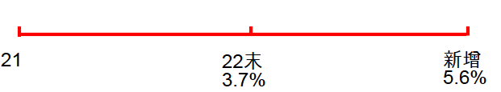

# 第十一章  平均数

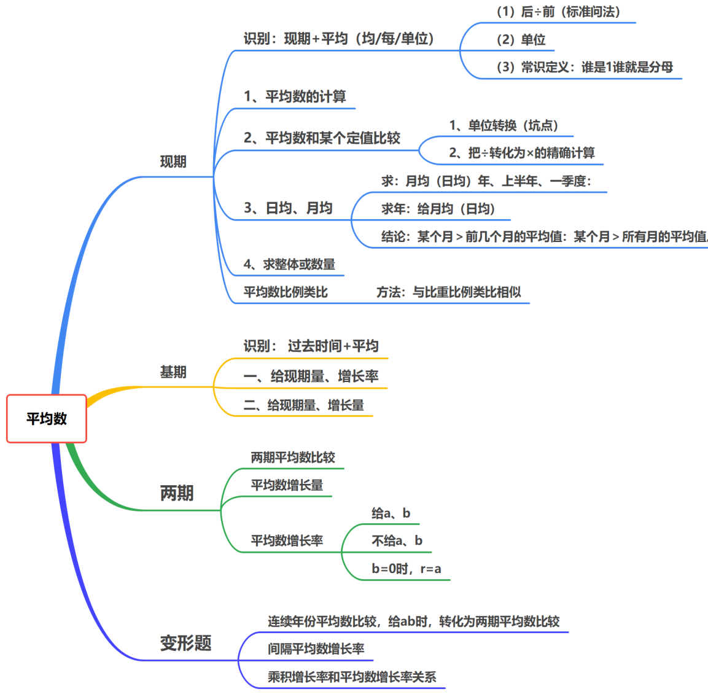

关键字：均、每、单位面积、单价
公式：$\text{平均数}=\dfrac{\text{总数}}{\text{个数}}=\dfrac{\mathbf{A}}{\mathbf{B}}$
（1）后÷前（标准问法）   
$\begin{aligned}&\text{人均收入}\frac{\text{收入}}{\text{人数}}\qquad\text{每亩产量}=\frac{\text{产量}}{\text{高数}}\qquad\text{单位面积产量 }=\frac{\text{产量}}{\text{面积}}\end{aligned}$
（2）单位
速度：km/h       单位面积产量：吨/公顷     1 公顷 = 15  亩
（3）常识定义
==谁是 1 谁就是分母==

## 1.现期平均数

### （1）平均数计算

### （2）平均数和某个定值比较

1、==单位转换==（坑点）
2、把÷转化为×的精确计算

### （3）日均、月均

$$
坑
\begin{cases}
	月均
	\begin{cases}
		年\\
		上半年\\
		一季度	
	\end{cases}\\
	日均
	\begin{cases}
		\text{大月：31 天}\\
		\text{小月：30天}\\
		\text{ 2 月：（28 或 29天）}
	
	\end{cases}
\end{cases}
$$

==结论：某个月＞前几个月的平均值：某个月＞所有月的平均值==。
例：若12月产值＞ 1-11月平均值，可推出：12月产值＞ 1-12月平均值

> 推导：
> $12 月 >\dfrac {{(1 ∼12 月)}-12 月}{11}$  
> $11 \times 12 月 > (1∼12月) - 12 月$
> $12月>\dfrac{\text{全年}}{12}$或者 $12月×12＞全年$  

例：若6月产值＞ 1-5月平均值，可推出：6月产值＞ 1-6月平均值
例：若4月产值＞ 1-3月平均值，可推出：4月产值＞ 1-4月平均值

### （4）多个数求平均数：削峰填谷、高位叠加

（1）数据相近可用削峰填谷  
①  ==定基准，算差距==  
②  汇总除以个数，再加上基准  
（2）数据不相近(高位叠加)  
（3）**技巧**：观察选项

### （5）求整体或数量

$\text{总额=平均数×数量}$  （乘法：估算、精算）
$\text{数量}=\dfrac{\text{总额}}{\text{平均数}}$        （除法：厂除、选项）  
### （6）平均数比例类比

和比重比例类比一个道题   
==求平均数，无分母，存在相同分母的平均数，比例类比==    

例：  
营业收入 18 亿，人均营业收入 9 万
利润 6 亿， 人均利润 $x$ ？
$$
\begin{gathered}
\frac {18}{\tiny{\tiny{人数}} }&&& \xRightarrow []{÷ 2} &&& 9 \\
\Downarrow ÷ 3&&&  &&&\Downarrow ÷ 3\\
\frac 6{\tiny{人数}} &&& \xRightarrow []{÷ 2} &&& x=3\\
\end{gathered}
$$
## 2.基期平均数

识别： 过去时间+平均  
一、给现期量、增长率 ：$\mathbf {\text{基期平均数}=\dfrac{A}{B}\times \dfrac{1+\mathbf{b}}{1+\mathbf{a}}}$  
二、给现期量、增长量 ：$\mathbf{\text{基期平均数}=\dfrac{\textbf{现量 }_1-\textbf{增量 }_1}{\textbf{现量 }_2-\textbf{增量 }_2}}$  

## 3.两期平均数

### （1）两期平均数比较  
平均数升降：  
题型识别：题干中涉及两个时间+平均数问法
公式：$\textbf{现期平均}-\textbf{基期平均}=\mathrm {\dfrac AB-\dfrac AB\times\dfrac{1+b}{1+a}}=\mathbf {\dfrac AB\times\dfrac{a-b}{1+a}}$
升降判断：
$$
\begin{gather}
\mathbf {a>b}\Leftrightarrow 平均数上升 \\ 
\mathbf {a<b}\Leftrightarrow 平均数下降\\
\mathbf {a=b}\Leftrightarrow 平均数不变
\end{gather}
$$

### （2）平均数增长量  
◆ 平均数的增长量  
➢ 题型特征：平均数问法+增长+具体单位  
➢ 计算公式：$\textbf {平均数的增长量}=\mathrm {\dfrac AB-\dfrac AB\times\dfrac{1+b}{1+a}}=\mathbf {\dfrac AB\times\dfrac{a-b}{1+a}}$  
➢ 速算技巧：多步除法，截位列式，约分看选项  

### （3）平均数增长率  
➢ 识别：平均数+增长……$\mathbf \%$
➢ 公式： $\mathbf{r=\dfrac{a-b}{1+b}}$（$\mathbf a$ 是分子的增长率，$\mathbf b$ 是分母的增长率）
➢ 做题方法
① 根据平均数确定分子、分母（谁除以谁）
② 代入公式：$\mathbf{r=\dfrac{a-b}{1+b}}$
③ 看选项
注：
（1）当 $\mathbf {b =0，\mathbf{r=\dfrac{a-b}{1+b}}=a}$
（2）不给 $\mathbf a$ 和 $\mathbf b$ ，注重分析选项数据

## 4.变形题  

（1）连续年份平均数比较转化为两期平均数比较   
连续年份平均数比较转化为两期平均数比较，==比较 $\mathbf {a、b}$ 即可判定==。 
（2）间隔平均数增长率   
间隔平均数增长率   
方法：==先间隔，再平均数增长率==   
（3）平均数增长率和乘积增长率   

|      |               平均数增长率÷                |                       乘积增长率×                        |
| :--: | :----------------------------------: | :-------------------------------------------------: |
| 量的关系 | $\textbf {平均数}= \mathbf {\dfrac AB}$ |             $\mathbf {A = B \times C}$              |
| 率的关系 |  $\mathbf {r = \dfrac {a-b}{1+b}}$   | $\mathbf {r_{\tiny A} = r_{\tiny B} + r_{\tiny C}}$ |
|      |                                      |                                                     |

# 第十二章 倍数

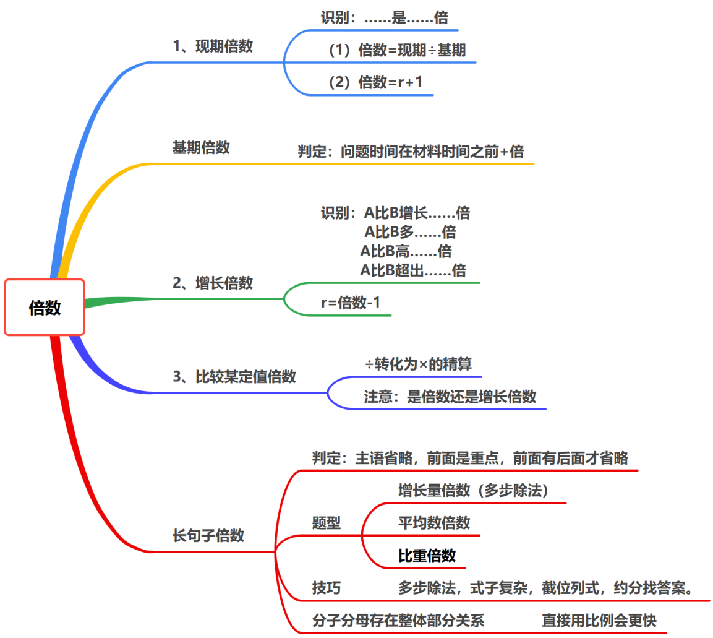

判定：问题时间与材料时间一致，$\mathbf {A}$ 是 $\mathbf B$ 的几倍
公式：$\textbf{倍数}=\dfrac {\mathbf A}{\mathbf B}$ 
倍数的表述坑
①  $\mathbf A$ 是 $\mathbf B$ 的……倍：   $\mathbf {\dfrac AB}$ 
 $\mathbf A$ 比 $\mathbf B$ 多……倍        
②  $\mathbf A$ 比 $\mathbf B$ 增长……倍     $\mathbf {\dfrac{A}{B} - 1}$ 
 $\mathbf A$ 比 $\mathbf B$ 多……倍       
 $\mathbf A$ 比 $\mathbf B$ 高……倍
 $\mathbf A$ 比 $\mathbf B$ 超出……倍
③ $\mathbf A$ 超过 $\mathbf B$ 的 $\mathbf n$ 倍：   $\mathbf {A＞B×n}$ 

## 1.现期倍数

## 2.增长倍数

## 3.比较某定值倍数

## 4. 指桑骂槐类倍数（指A 打B）

长句子专项  
题型判定：主语省略，前面是重点，前面有后面才省略  
计算方法：多步除法，截位列式 
【例13】（2024四川）2022年，东部地区软件业务收入同比增量约是西部地区的多少倍？  
【例14】（2023浙江）2021年上半年，S市批发和零售业零售额同比增量约是住宿和餐饮业的多少倍？  
【例15】（2021国考）2019年，平均每个综合类直排海污染物排口排放污水量约是工业类的多少倍？  
【例 16】（2021 国考）截至 2019 年末，全国平均每个已竣工的残疾人综合服务设施建设规模约是已竣工残疾人康复设施的多少倍？  
分子分母存在整体部分关系时  
技巧：分子分母存在比重或者比例关系，直接用比例会更快。  

## 5.平均数倍数、比重倍数、增长量倍数（多步除法）

形式：$\dfrac{\quad \dfrac AB \quad}{\dfrac CD}\quad\dfrac{A\times B}{C\times D}$  
题型判定决定技巧  
技巧：多步除法，式子复杂，截位列式，约分找答案。  

长句子专项  
题型判定：==主语省略，前面是重点，前面有后面才省略==  
计算方法：多步除法，截位列式  
【例13】（2024四川）2022年，东部地区软件业务收入同比增量约是西部地区的多少倍？  
【例14】（2023浙江）2021年上半年，S市批发和零售业零售额同比增量约是住宿和餐饮业的多少倍？  
【例15】（2021国考）2019年，平均每个综合类直排海污染物排口排放污水量约是工业类的多少倍？  
【例 16】（2021 国考）截至 2019 年末，全国平均每个已竣工的残疾人综合服务设施建设规模约是已竣工残疾人康复设施的多少倍？ 

==分子分母存在整体部分关系时==  
技巧：分子分母存在比重或者比例关系，直接用比例会更快。  

## 6. 基期倍数

判定：问题时间在材料时间之前+倍  
公式：$\textbf{基期倍数} = \dfrac{\mathbf{A}}{\mathbf{B}}\times\dfrac{\mathbf 1+\mathbf{b}}{\mathbf 1+\mathbf{a}}$  

# 第十三章    A 和非 A 思想

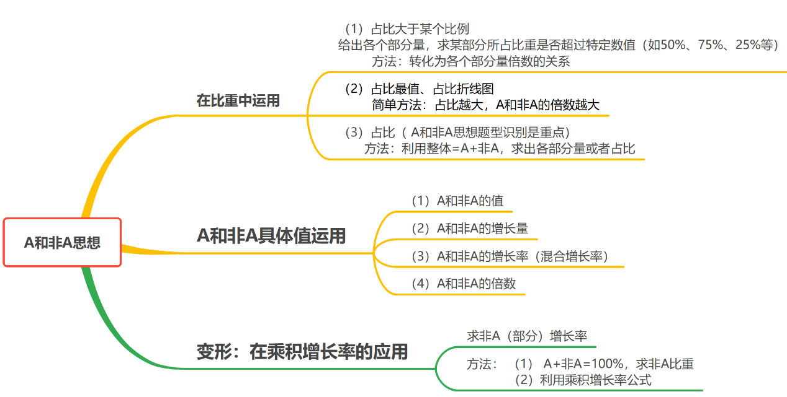

A 和非 A 思想属于一个涵盖面非常广的应用，贯穿整个资料的知识点，是正反向思想的运用。  
A和非A思想属于材料和问题的综合考法，体现了资料分析重分析的思维。  

## 1.A和非A思想在比重中运用

### （1）占比大于某个比例

**A和非A，份数思想**
给出==各个部分量==，求某部分所占比重是否超过特定数值（如50%、75%、25%等）
==方法：转化为各个部分量倍数的关系==（画图也行啊）

① $\dfrac {A}{整体} > 50\%$ ，即 $A > 非A$  
② $\dfrac {A}{整体} > 75\%$ ，即 $A > 3\cdot非A$  
③ $\dfrac {A}{整体} > 25\%$ ，即 $3\cdot A >  非A$  

>推导：
>$\dfrac{A}{A+\text{其他}}>50\%$
>
> $\dfrac A{A+\text{其他}}>\dfrac12$
>
>$\text{2A>A+其他}$
>
>$即:A>其他$

### （2）占比最大

**比例越大，比重越高**  
占比越大，A 和非A的倍数越大（风浪越大，鱼越贵）

### （3）求占比

方法：利用整体=A+非A，求出各部分量或者占比  

## 2.A 和非 A 具体值运用

（1）A和非A的值  

（2）A和非A的增长量  

$\text{A增+非A增=整体增}$  

（3）A和非A的增长率、混合增长率  
$$
人口类材料的特点
\begin{cases}
1. 总分结构 
	\begin{cases}
		(1)城乡结构（城镇+农村)\\
		(2)年龄结构(年龄段) \\
		(3)产业结构：(一二三产业)
	\end{cases}\\
2.人口数据大，增长缓慢
\end{cases}
$$
（4）A和非A的倍数  

## 3.变形题：A和非A在乘积增长率的应用

求非A（部分）增长率  
方法：   
（1） A+非 A=100%，求非A比重  
（2）利用乘积增长率公式  

# 第十四章    综合分析

1、结构阅读 + 前四个小题，熟悉材料
2、T F
$$
\textbf{选项分布}
\begin{cases}
	① 三易一难
		\begin{cases}
			3易 —— 正向\\
			1难 —— 反向
		\end{cases}\\
	②三难一易 —— 易\\
	③两易两难
		\begin{cases}
			1易 —— 正向\\
			1难 —— 50\%
		\end{cases}\\
\end{cases}
$$

**选项解题顺序——先易后难**

$$
\begin{gather}
易 &\xRightarrow [\qquad \qquad \qquad \qquad]{} &难\\
现期 & & 基期\\
单主体 & & 多主体\\
比较 & & 计算\\
技巧题 & & 其他 
\end{gather}
$$

