先读问题，再读题干
计算：约分，代入

# 第一章 倍数特性

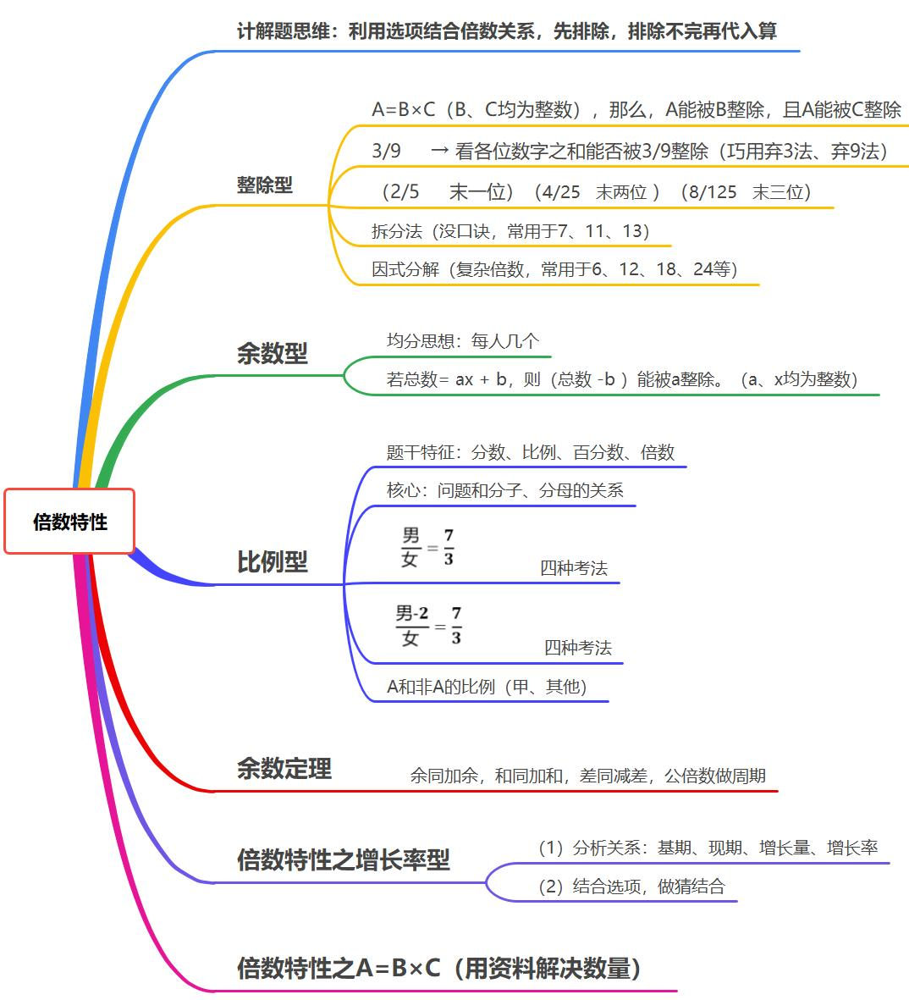

## 一、整除型

**如果，$\mathbf{A}=\mathbf{B}\times \mathbf{C}$（$\mathbf{B、C}$ 均为整数），那么，$\mathbf{A}$ 能被 $\mathbf{B}$ 整除，且 $\mathbf{A}$ 能被 $\mathbf{C}$ 整除**    
（1）口诀法（常用于 $\mathbf{3、4、5、9}$）:    
	**$\mathbf{3/9}$ 看各位数字之和，$\mathbf{5}$ 看末位，$\mathbf{4}$看末两位。**  
	$\mathbf{3/9}$     →  看各位数字之和能否被 $\mathbf{3/9}$ 整除  
	$\mathbf{2/5}$     →  看数字末一位能否被 $\mathbf{2/5}$ 整除  
	$\mathbf{4/25}$   →  看数字末两位能否被 $\mathbf{4/25}$ 整除  
	$\mathbf{8/125}$ →  看数字末三位能否被 $\mathbf{8/125}$ 整除    
（2）拆分法（没口诀，常用于 $\mathbf{7、11、13}$）     
	一个数=接近且明显能被整除的数±零头，只看零头     
		`623÷7 把 623 拆成 7 的倍数±零头，只看零头能否被 7 整除`      
(3）因式分解（复杂倍数，常用于 $\mathbf{6、12、18、24}$  等）      
	因式分解成两个互质（互质指两数没有公约数）的数，同时满足能被这两个数整除。     
		`24=3×8`     

## 二、余数型

余数型（公务员思想： 均分思想 、多退少补）  
（1）特性：每人、均分、多几个、少几个  
（2）若 $\textbf {总数}= \mathbf{ax}+ \mathbf{b}$，则 $\mathbf { (\textbf {总数} -{b})}$ 能被 $\mathbf{a}$ 整除。（$\mathbf{a、x}$ 均为整数）   

## 三、比例型

**比例型适用于：**  
1、题干特征：分数、比例、百分数、倍数  
2、对象特征：描述对象为不可分割的整体，整数才有意义。人、车、年龄等  
	核心：问题和分子、分母的关系。  

> 已知某班：$\dfrac{\textbf{男}}{\textbf{女}}=\dfrac {\mathbf{m}} {\mathbf{n}}$  
>
> （最简分数），问：  
> 	① 男生人数是 $\mathbf{m}$ 的倍数。  
> 	② 女生人数是 $\mathbf{n}$ 的倍数。   
> 	③ 全班人数是 $(\mathbf{m}+\mathbf{n})$ 的倍数。  
> 	④ 男女生人数差是 $(\mathbf{m}-\mathbf{n})$ 的倍数。  
> 表达方式：  
> 	① 男员工是女员工的 $\dfrac 35$（分数）；  
> 	② 男员工与女员工之比 $3:5$（比例）；  
> 	③ 男员工是女员工的 $60\%$（百分数）；  
> 	④ 男员工是女员工的 $0.6$ 倍（倍数）。  

3.延伸考法
考法一：
	$\dfrac{\textbf{男}}{\textbf {女}}=\dfrac {\mathbf{m}} {\mathbf{n}}$  
考法二：  
	$\dfrac{\textbf{男}-2}{\textbf{女}}=\dfrac {\mathbf{m}} {\mathbf{n}}$  
考法三（A与非A思想）：  
	$\dfrac{\textbf{甲}}{\textbf{其它}}=\dfrac {\mathbf{m}} {\mathbf{n}}$  

## 四、余数问题的三则运算

1.==**口诀：余同加余，和同加和，差同减差，公倍数做周期**==
2.解释：     
（1）余同加余   
	“一个数除以 $7$ 余 $1$，除以 $6$ 余 $1$，除以 $5$ 余 $1$”，可见，所得余数恒为 $1$，则取 $1$，被除数的表达式为 $\mathbf{210n}+\mathbf{1}$；    
（2）和同加和    
	“一个数除以 $7$ 余 $1$，除以 $6$ 余 $2$，除以 $5$ 余 $3$ ”，可见，除数与余数的和相同，取此和 $8$，被除数的表达式为 $\mathbf{210n}+\mathbf{8}$；     
（3）差同减差    
	“一个数除以 $7$ 余 $3$ ，除以 $6$  余 $2$ ，除以 $5$  余 $1$ ”，可见，除数与余数的差相同，取此差 $4$ ，被除数的表达式为 $\mathbf{210n}-\mathbf{4}$；      
	注意：前面的 $210$ 是 $5、6、7$ 的最小公倍数，此即为公倍数做周期。        
3.应用：   
（1）存在“余数问题的三则运算”求总数会更快。   
（2）用“余数问题的三则运算”表达总数进而再求其他。    

## 五、倍数特性之增长率型（用资料解决数量）

充分利用已学过的资料分析来解决数量问题。     
（1）分析关系：基期、现期、增长量、增长率。     
（2）结合选项，做猜结合。     

## 六、倍数特性之A=B×C（用资料解决数量）

1.形式：$\mathbf{A}=\mathbf{B} \times \mathbf{C}$，给单个量  
2.方法：赋值  
	公倍数求法：短除法  

> **最小公倍数数求法**：
>
> 
> 最小公倍数为 $\underline {10}\times \underline {5} \times \underline {3} \times 5 \times 9 = 6750$

# 第二章 方程问题

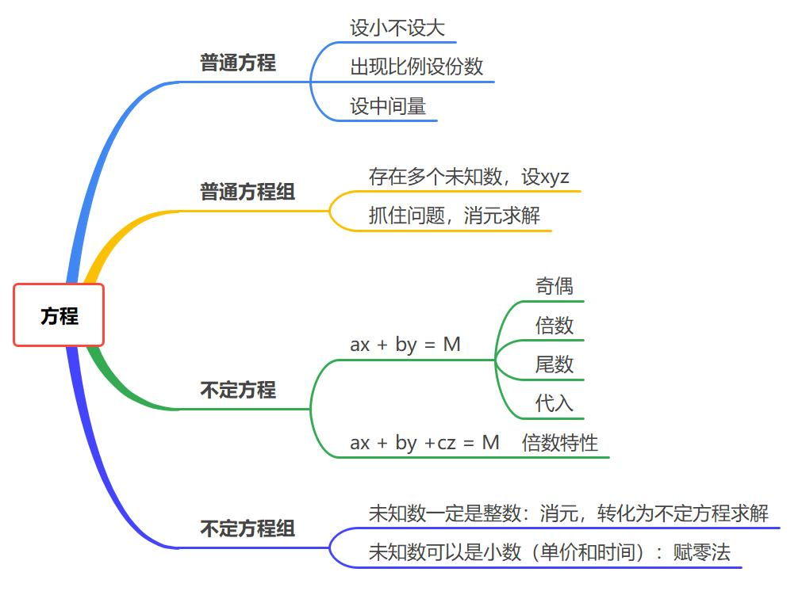

## 一、普通方程：一个未知数（x） 

**做题步骤**  
  1.设未知数  

​	$设未知数技巧\begin{cases}	(1)设小不设大  \\		(2)出现比例设份数  \\	(3)设中间量 	\end{cases}$

2.找等量关系  
3.约分  

## 二、普通方程组：多个未知数（设x、y、z）

1.存在多个未知数，设 $\mathbf{x、y、z}$  
2.抓住问题消元求解  
	小技巧：$\begin{cases}\mathbf{x+y=M}\\\mathbf{ax+by=N}\end{cases}$ ，求 $\mathbf{x-y}$，巧用等差数列中位数求解。  

## 三、不定方程

1.普通不定方程   
	$\mathbf{ax}+\mathbf{by}=\mathbf{M}$   
（1）方法：奇偶、 倍数、尾数、代入   
	① **奇偶特性**：   
		$\textbf{奇 × 奇 = 奇、奇 × 偶 = 偶、奇 + 奇 = 偶、 奇 + 偶 = 奇}$。  
	② **倍数特性**：    
		$\mathbf{ax}+\mathbf{by}=\mathbf{M}$，==当 $\mathbf{a}$ 或 $\mathbf{b}$ 与 $\mathbf{M}$ 有公因子==时，考虑倍数特性。   
	③ **尾数法**：  
		$\mathbf{ax}+\mathbf{by}=\mathbf{M}$，==当 $\mathbf{a}$ 或 $\mathbf{b}$ 尾数是 $\mathbf{0}$==时，考虑尾数。   
2.多个未知数的不定方程  
（1）形式：$\mathbf{ax+by+cz=M}$。    
（2）问：某个未知数的值。   
（3）方法：倍数特性。   

## 四、不定方程组

1.整数型  
	不定方程组：两个方程，三个未知数。  
	$\begin{cases}	\mathbf{a_1x+b_1y+c_1z={M}}\\	\mathbf{a_2x+b_2y+c_2z={N}}	\end{cases}$   
**考法一**：未知数==一定是整数==（主流考法）  
	方法：先==消元==转化为不定方程，再按不定方程求解。  
**考法二**：未知数==可以是小数==（单价和时间）  
（1）==凑系数==（高中考法，不好想）  
（2）==赋零法==：赋其中1个未知数为零，进而快速计算出其他未知数。（答案唯一）    
		赋零法是有理有据，有推有导的。  

# 第三章  等差数列和等比数列

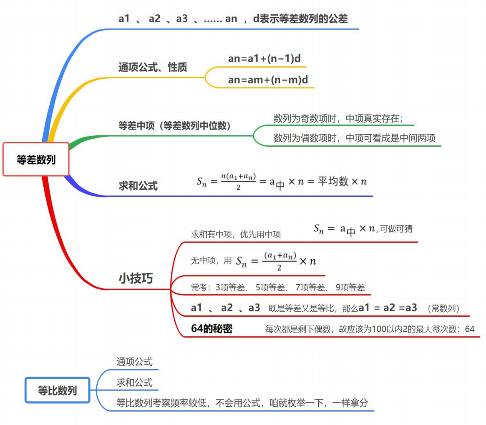

## 一、等差数列

$\mathbf{a_1\text{、}a_2\text{、}a_3\text{、...... }a_n ，d}$ 表示等差数列的公差   
通项公式：$\mathbf {a_n=a_1+(n-1)d ，d }$ 表示等差数列的公差  
注：数列为奇数项时，第 $\mathbf a_\textbf{中}$ 项真实存在；数列为偶数项时，第 $\mathbf a_\textbf{中}$ 项可看成是中间两项。  

1.等差数列性质  
	$\mathbf{a_n=a_m+(n-m)d\qquad a_n-a_m=(n-m)d}$    
2.等差数列求和  
	$\mathbf{S_n=\dfrac{n\times (a_1+a_n)}2=a_\textbf{中}\times n=\textbf{平均数}\times n}$  
小技巧：  
（1）求和有中项，优先用中项。$\mathbf{S_n=a_\textbf{中}\times n}$ ，可做可猜  
（2）无中项，用 $\mathbf{S_n=\dfrac{(a_1+a_n)}2\times n}$  
（3）常考：3 项等差、 5 项等差、 7 项等差、 9 项等差  
（4）$\mathbf{a_1\text{、}a_2\text{、}a_3}$ 既是等差又是等比，那么 $\mathbf{a_1 = a_2 = a_3}$（常数列）    
（5）顺序数列 $\mathbf{1-10，S_{10} = 55}$    
3.等差数列和时间段等差数列  
（1）各项成等差数列，可推知每个“时间段”的和也成等差数列。  
（2）常考：一个星期 7 天，十几五规划 5 年。  
4.等差数列的应用题  
（1）特定表述  
（2）既构成等差数列，又构成等比数列，此数列为常数列。  
5.等差数列巧求方程组两数差  
	小技巧：（剪刀差原理）$\begin{cases}\mathbf{x+y=M}\\\mathbf{ax+by=N}\end{cases}$，求 $\mathbf{x-y}$，巧用等差数列 $\mathbf{ab}$ 的中位数求解。   
6.64 的秘密  
（1）挑挑拣拣，剩下的数：$\mathbf{64}$  
（2）每次的都是剩下偶数，故应该为 $\mathbf{100}$ 以内 $\mathbf{2}$ 最大幂次数，即为 $\mathbf{2^6 =64}$。

## 二、等比数列

通项公式：$\mathbf{a_n=a_1\times q^{n-1} ，q }$ 表示等比数列的公比。  
求和公式：$\mathbf{S_n=a_1\times\dfrac{1-q^n}{1-q}}$。   
注：等比数列考察频率较低，不会用公式，咱就==枚举==一下，一样拿分。    

# 第四章 周期问题

## 一、周期余数

1.**题型特征**：出现循环或周期，问 ？个，往往数据很多，或者数字很大，找规律即可。  
2.**解题思路**：  
（1）找周期：确定周期的起点和长度。    
（2）算余数：$\textbf{总数 ÷ 周期长度 = 多个周期…余数（n）}$     
（3）做等价：第 $\mathbf n$ 个：余几数几（无余数，周期最后一个）

## 二、周期相遇

1.**题型特征**：出现多个小周期，求再次相遇  
2.**方法**：最小公倍数相遇  
3.注（题目坑）：$\textbf{每隔 }\mathbf n \textbf{ 天}=\textbf{每 } \mathbf {n+1} \textbf{ 天}$

## 三、星期日期问题  

大月与小月：一三五七八十腊，三十一天永不差。 
	大月 31 天 (1、3、5、7、8、10、12)    
	小月 30 天 (4、6、9、11)   
	2 月 28（29） 天    
注：  
（1）每个月都必然有完整的 4 周    
（2）鉴于“一个自然月内最多有……”应将这个自然月按照大月31天计算。    

12 生肖：  
子鼠、丑牛、寅虎、卯兔、辰龙、巳蛇、午马、未羊、申猴、酉鸡、戌狗、亥猪。  
注意：本命年以 12 为周期  

1.**题型特征**：给出一段时间内有若干个周几，推算某一天为周几。    
2.**常用结论**：    
（1）每连续 7 天，必有周一到周日各 1 天     
（2）每连续 28 天，必有周一到周日各 4 天     
3.**解题思路**：每个月都必然有 4 周，取连续 28 天。
4.**结论**：**平年+1，闰年+2，大月+3，小月+2。**   
	平闰年判定：平年 365 天（2 月 28 天），闰年 366 天（2 月 29 天）  
	==年份数能被 $\mathbf 4$ 整除的为闰年，否则为平年；整百的年份需要被 $\mathbf {400}$ 整除。==  
	==整年推断：过一个平年星期数 $\mathbf +1$，过一个闰年星期数 $\mathbf +2$==。  
	注：可以简记为==52周零1天（闰年零2天）。==  

如何求分数的最小公倍数： 

​	$	分数的最小公倍数\begin{cases}	\mathbf{（1）分母通分}\\	\mathbf{（2）求分子最小公倍数}\\	\mathbf{（3）\dfrac{分子最小公倍数}{分母}	}\end{cases}$

> 求：10、$\dfrac{25}4$、$\dfrac {25}6$ 的最小公倍数

注意：对日期和星期对应题，或者复杂相遇问题，直接枚举即可。  

# 第五章 工程问题

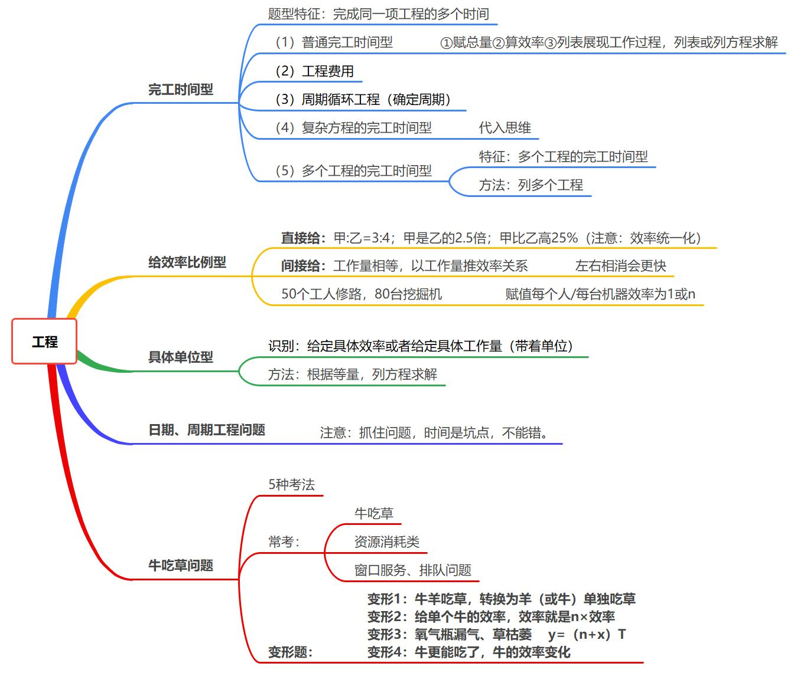

## 一、具体单位型

==特征：有具体的效率或者总量。==  
方法：列方程，根据问题求解。  

## 二、完工时间型

### 1.普通完工时间型

完工时间型  
==特征：多个主体的完工时间==   
方法：  
$\textbf{总量 =  效率} \times \textbf{时间}$   
第一步：赋值总量（公倍数）     
第二步：求效率    
第三步：列表或列方程求解    

### 2.工程费用  

### 3.周期循环工程（确定周期）   

### 4.复杂方程的完工时间型  

方法：不会解，不想解，就==代入==。    

$$
\mathbf{\frac{4}{x}+ \frac{4}{x+15}=1\qquad {x}=?}
$$

### 5.多个工程的完工时间型  

特征：多个工程的完工时间型   
方法：列多个工程   
计算：==好算为原则==    

## 三、效率比例型  

1.直接给：$\mathbf {甲:乙=3:4}$；甲的效率是乙的 $\mathbf {2.5}$ 倍；甲的效率比乙高 $\mathbf {25\%}$。   
2.间接给：工作量相等，以工作量推效率关系   
（1）甲 $\mathbf 4$ 天的工作量等于乙 $\mathbf 3$ 天的工作量（==坑点==）   
$\mathbf{4甲 = 3 乙 \quad \rightarrow \quad \dfrac 甲乙 = \dfrac 34}$   
（2）甲、乙两个工程队合作完成某工程需 $\mathbf {36}$ 天，若甲工程队先做 $\mathbf {10}$ 天，剩下的工程再由两队合作 $\mathbf {30}$ 天完成  
3.给具体人数或机器数：  
	$\mathbf {50}$ 个工人修路，$\mathbf {80}$ 台挖掘机   
	赋值每个人/每台机器效率为 $\mathbf 1$   

## 四、变形题：给定总量比和时间比，求效率比

（1）可以设未知数求解  
（2）因为是比例，会消掉，可以直接赋值求解  

## 五、牛吃草问题

$$
牛吃草考法
\begin{cases}
纯牛问题(牛吃草、羊吃草) \quad \mathbf{y=(N-x)×T}\\
牛吃草变形
{\begin{cases}
	变形1:牛羊吃草，转换为羊(或牛)单独吃草\\
	变形2:给单个牛的效率，效率就是 \quad \mathbf {n \times 效率}\\
	变形3:氧气瓶漏气 \quad \mathbf {y= (N+x)\times  T}\\
	变形4:牛的效率变化\\
	\end{cases}}\\

资源类消耗
	{\begin{cases}
	草场 \\
	森林 \\
	水管进出水
		{\begin{cases}
		宏观:水库 \\
		微观:泳池 
		\end{cases}}
	\end{cases}}\\
服务类:窗口办理业务
\end{cases}
$$

### （1）普通牛吃草

基本公式 $\mathbf{y=(N-x)×T}$   
$\mathbf y$：代表原有存量的消耗量 （比如：原有草量吃完啦）   
$\mathbf N$：促使原有存量消耗的变量 （比如：牛数）  
$\mathbf x$ ：存量的自然生长速度 （比如：草长速度）   
$\mathbf T$：时间  

> 【考法合集：充分认知】一片草地每天都以平均速度生长，已知这片草地可以供 $\mathbf{25}$ 头牛吃 $\mathbf {12}$ 天，或者供 $\mathbf {40}$ 头牛吃 $\mathbf 6$ 天。    
> $\mathbf{y=(N-x)×T = (25 - x)\times 12 = (40-x) \times 6}$      
> $\rightarrow \mathbf {x = 10,\quad y = 180}$       
> 问题1：草生长速度是多少？  
> $\mathbf {10}$   
> 问题2：这片草地原有多少草量？  
> $\mathbf {180}$    
> 问题3：这片草地可以供 $\mathbf {30}$ 头牛吃多少天？  
> $\mathbf {180 = (30-10)\times T}$  
> $\rightarrow \mathbf {T = 9}$  
> 问题4：草地上有 $\mathbf {28}$ 头牛，需要多少天，原有草地还剩 $\mathbf {40\%}$ ？  
> $\mathbf {180 \times 60\% = (28-10)\times T}$  
> $\rightarrow \mathbf {T = 6}$    
> 问题5：要想可持续发展（草永远吃不完），每天最多放多少头牛？  
> $\mathbf {N=x}$ 时，可持续最多  

# 第六章 几何问题

考情：超级高频题型  
特点：技巧性特别强：做、量、猜  
最佳策略：识别、记忆  

## 一、几何公式

**✓ 周长类**
$$
\mathbf {\textbf {正方形周长}=4a \qquad \textbf {长方形周长}=2(a+b) \qquad \textbf {圆形周长}=2 \pi r \qquad \textbf {弧长} =\dfrac{\mathbf{n^{\circ}}}{360^{\circ}}2\pi\mathbf{r}}
$$
**✓ 面积类**  
$$
\begin{aligned}&\textbf{正方形面积}\mathbf{=a}^2&&\textbf{长方形面积=}\mathbf{ab}&&\textbf{平行四边形面积=底}\times\textbf{高}\\&\textbf{三角形面积=}\mathbf {\frac12}\textbf{底}\times\textbf{高}&&\textbf{圆形面积=}\pi \mathbf{r^2}&&\textbf{扇形面积=}\frac{\mathbf{n^{\circ}}}{360^{\circ}}\pi\mathbf{r^{2}}\\&\textbf{梯形面积=}\mathbf {\frac12}\mathbf{~(a+b)\times h}&&\textbf{菱形面积=}\mathbf{\frac12}\textbf{对角线乘积}\end{aligned}
$$
**✓ 表面积类**  
$$
\begin{aligned}&\textbf{正方体表面积=6}\mathbf{a}^2&&\textbf{长方体表面积}=\mathbf {2(ab+bc+ac)}\\&\textbf{圆柱体表面积}\mathbf{=2}\pi\mathbf{R^2+2}\pi\mathbf{R}\mathbf{h}&&\textbf{球体表面积}\mathbf {=4}\pi\mathbf{R}^2\end{aligned}
$$

**✓ 体积类** 
$$
\begin{aligned}&\textbf{正方体体积=}\mathbf {a^3}&&\textbf{长方体体积}= \mathbf {abc}&&\textbf{长方体体对角线=}\mathbf {\sqrt{a^2+b^2+c^2}}\\&\textbf{柱体体积}=\mathbf{Sh}&&\textbf{锥体体积=}\mathbf{\frac13 Sh}&&\textbf{球体体积=}\frac43\pi\mathbf{R}^3\\&&&\textbf{锥体侧面积=}\pi\mathbf{rl}&&\textbf{圆台侧面积=}\pi(\mathbf {r_1+r_2)l}\end{aligned}
$$

**✓ 其他**

$\textbf{锥体侧面积=}\mathbf {\dfrac 12 \cdot 2 \pi rl} = \pi\mathbf{rl}$ （类三角形）

$\textbf{圆台侧面积=}\mathbf {\dfrac 12 (2\pi r_1 + 2 \pi r_2)l }= \pi(\mathbf {r_1+r_2)l}$ （类梯形）

$\textbf{多边形内角和=}\mathbf{(n-2)\times 180^{\circ}}$  
常考根号：$\mathbf {\sqrt{2}\approx1.414、\sqrt{3}\approx1.732、\sqrt{5}\approx2.236}$

## 二、三角形  

**1、普通三角形**   
	两边之和大于第三边   
	两边之差小于第三边   

**2、特殊三角形：直角三角形、等边三角形**   

常考点 $\mathbf {a^2+b^2=c^2}$、特殊角三角形三边关系    
（1）特殊勾股数：$\mathbf {(3、4、5)}$、$\mathbf {(6、8、10)}$、$\mathbf {(5、12、13)}$   
（2）边长的放缩  
	注：几何问题中，出现平方加和的条件，直接想勾股定理（$\mathbf {a^2+b^2=c^2}$）
（3）特殊角三角形三边关系  

​	$\mathbf {30、60、90}$   
​	① 短直角边是斜边的一半  
​	② 长直角边是短直角边的 $\mathbf {\sqrt 3}$ 倍  

$\mathbf {45、45、90}$ （等腰直角三角形）  
	① 直角边相等  
	② 斜边是直角边的 $\mathbf {\sqrt 2}$ 倍  

**4.等边三角形**  
	边长： $\mathbf a$          高：$\mathbf {\dfrac{\sqrt{3}}2a}$           面积: $\mathbf {S=\dfrac{\sqrt{3}}{4}a^{2}}$  

**5.正六边形:**  
	由 6 个等边三角形构成  

**6.圆中的直角**  
（1）不在同一直线的三个点确定一个圆  
（2）圆的直径所对的角是直角（ $\mathbf {90°}$）  
注：圆上最远的两个点构成直径。  

**7.三角形同底或者同高**  
考法：多个面积  
方法：底相同，面积之比等于高之比  

### （1）直角三角形

### （2）正六边形

### （3）坐标构造

### （4）三角形同底或者同高

考法：多个面积   
方法：底相同，面积之比等于高之比

### （5）相似三角形

对应边成比例。

## 三、最短路径

1.考查方式：求AB两点到直线距离之和最短  
2.解题原理：两点之间，线段最短  
3.解题技巧：  
（1）两点异侧，直接连线  
（2）两点同侧，到直线的最短，镜面对称后连线  

## 四、几何最值

1、立体最值    
（1）立体图形中，若==表面积一定，越接近于球，体积越大。（垃圾袋原理）==       
（2）立体图形中，若==体积一定，越接近于球，表面积越小。（饺子皮原理）==      

2、平面最值    
（1）平面图形中，==周长一定，越接近于圆，面积越大==       
（2）平面图形中，==面积一定，越接近于圆，周长越小==       

3、长方形最值       
（1）四边形==周长一定时，正方形面积最大==     
（2）四边形==面积一定时，正方形周长最小==    

## 五、等比例放缩

若将一个图形尺度变为原来的 $\mathbf N$ 倍，则  
1、对应角度不变  
2、周长变为原来的 $\mathbf N$    倍，增长了 $\mathbf {N-1}$   倍  
3、面积变为原来的 $\mathbf {N^2}$ 倍，增长了 $\mathbf {N^2-1}$ 倍   
4、体积变为原来的 $\mathbf {N^3}$ 倍，增长了 $\mathbf {N^3-1}$ 倍  

|  尺度  |                比例                 |               增长了                |
| :----: | :---------------------------------: | :---------------------------------: |
| 长度比 |  $\mathbf {1:N}$ $\Downarrow$  |  $\mathbf {N-1}$ $\Downarrow$  |
| 面积比 | $\mathbf {1:N^2}$ $\Downarrow$ | $\mathbf {N^2-1}$ $\Downarrow$ |
| 体积比 |          $\mathbf {1:N^3}$          |          $\mathbf {N^3-1}$          |

# 第七章 容斥原理问题

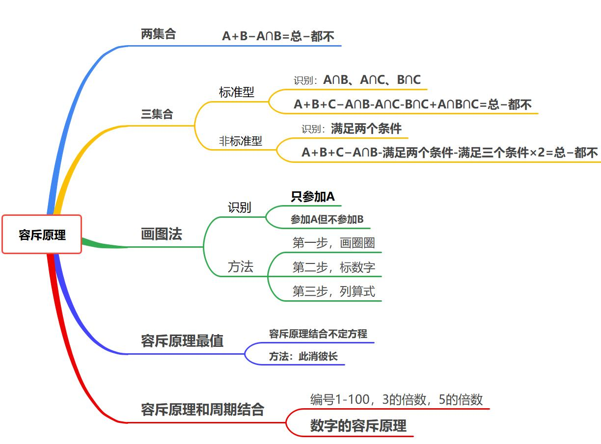

**容斥原理的方法选择**  
1.公式法：  
==题目中所给所求都是公式中的一部分==（清晰明了，快准狠）  
2.画图法：  
==题目中所给所求公式里没有，或者公式法不好用==（往往是出现只满足一个条件）  
**特征**：只参加A；参加A但不参加B ;或者缺少代公式必要的数据  
画图法：三步走  
	第一步，画圈圈  
	第二步，标数字（从里到外，注意去重）  
	第三步，列算式  

## 1.两集合   

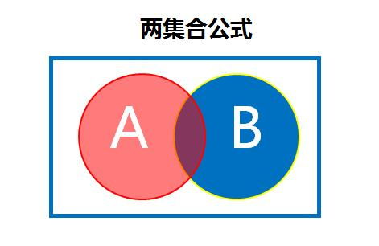
$\mathbf{A}+\mathbf{B}-\mathbf{A}\cap\mathbf{B}=\textbf{总}-\textbf{都不}$  

## 2.三集合

① 标准型：  
题型识别：出现 $\mathbf {A\cap B、A\cap C、B\cap C}$  

​	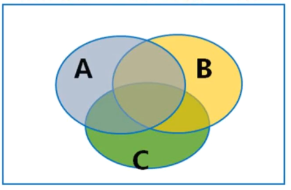

$\mathbf {A+B+C-A\cap B-B\cap C-A\cap C+A\cap B\cap C}=\textbf{总一都不}$    

② 非标准型：   
	前提：出现满足两个条件   
	注：满足两个条件=只满足两个条件   

​	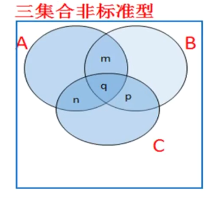

$\mathbf {A+B+C-\textbf{满足两项-满足三项}\times2=\textbf{总-都不}}$     
$q\text{  :  3 层  （满足三项）}$   
$m+n+p\text{  :  2 层（满足两项） }$   

## 3.画图法  

特征：只参加 $\mathbf A$；参加 $\mathbf A$ 但不参加 $\mathbf B$ ；或者缺少代公式必要的数据     
画图法：三步走        
	**第一步，画圈圈**       
	**第二步，标数字**（从里到外，注意去重）     
	**第三步，列算式**      

注：给比例，求比例，赋值，更直观。  

## 4.容斥原理结合不定方程（最值）

问法：求最值    
方法：此消彼长    

## 5.容斥原理和周期结合

方法：  
（1）求 $\mathbf{A、B、A \cap B}$     
（2）容斥原理公式   

# 第八章 最值问题

## 1.最不利构造

（1）普通最不利构造  

特征：至少……保证、无论如何至少  
方法：==$\textbf {答案=最不利情形+1}$==

> 【引例1】袋子中装有5个红球，8个白球，10个黄球。  
> ① 至少取出 $8+10 + 1=19$ 个，才能保证有红球  
> ② 至少取出 $2 + 2 + 2 + 1=7$ 个，才能保证至少有3个同色的球  
> ③ 至少取出 $5+7 + 7  + 1=20$ 个，才能保证至少有8个同色的球  

注意：==够了少一个，不够全给==。   
要保证同种情况至少 $\mathbf n$ 个，应每种情况各取 $\mathbf {(n－1)}$个（如果有不够 $\mathbf {n－1}$ 的有多少取多少）， 最后再加 $\mathbf 1$。  

（2）最不利构造和排列组合结合（枚举或者简单排列组合）  

方法：枚举或者简单排列组合  
枚举：等差，加和  

> 1、行测考试有言语、判断、资料、数量、常识五个科目，每名同学选一科学习。若要保证至少有 5 名同学学习 的科目完全相同，至少需要多少人？
>
> $4+4+4+4+1= 21$
>
> 2、行测考试有言语、判断、资料、数量、常识五个科目，每名同学选两科学习。若要保证至少有 5 名同学学习 的科目完全相同，至少需要多少人？
>
> 选择的情况：$C^{2}_{5} =10$。
> $4\times 10+1 = 41$
>
> 3、行测考试有言语、判断、资料、数量、常识五个科目，每名同学选一科或者两科学习。若要保证至少有 5 名 同学学习的科目完全相同，至少需要多少人？
>
> ​	选一科：$5$ 种
> ​	选两科：$C^{2}_{5} =10$ 种|
> ​	共 15 种
> ​	$15\times 4+1=61$

## 2.构造数列

（1）普通构造数列

特征：某个主体……最……（1、最……最……；2、排名第几……最……）
方法：
1、构造一个名次
2、求谁设谁
3、反向推其它（立正）
4、加和求解
坑点：
1、主体个数是否相同
2、答案是非整数时：==反向取整==
	某个主体……最多……，向下取整 
	某个主体……最少……，向上取整

> 19.2 至少  19

（2）总量未知的，构造数列
总量为范围，根据问法，确定总量的值
常识思维：
(1)求某个主体最多，总量尽量多。
(2)求某个主体最少，总量尽量少。

## 3.多集合反向构造

1.题型特征：**都满足的最少/至少**  
2.
方法 1：反向→加和→作差  

（1）反向  
（2）加和  
（3）作差  

> 【引例】有100人，行测学习中：学习言语90人，学习判断88人，学习资料92人，学习常识80人，学习数量60人，问“都学”的至少有多少人？
>
> |                                            |                   言语 90                   |  判断 88  | 资料 92 | 常识 80 | 数量 60 |
> | :----------------------------------------- | :-----------------------------------------: | :-------: | :-----: | :-----: | :-----: |
> | 1.反向：不学                               |                     10                      |    12     |    8    |   20    |   40    |
> | 2.加和：不学最多 (分散开，人数尽量多) |           10+20+8+20+40 =90            |           |         |         |         |
> | 3.做差                                     | 总  - 不学(最多)= 都学(至少) 100-90=10 | 100-90=10 |         |         |         |

方法 2：$\mathrm{(A_1+A_2+A_3+......+A_n)-(n-1)\times}\text{总量}$  

> 1.反向   100-90   A2 = 100-80   100-90   100-80   100-60
>
> 2.加和   c = 5*100 -  （A1-……-A5)
>
> 3.做差   100 - c = $\mathrm{(A_1+A_2+A_3+......+A_5)-4\times}100$ 

注：==加和最多，分散不重叠，没有什么都不学的前提下==

# 第九章 年龄问题

年龄问题知识点：  
1.**每过 $\mathbf N$ 年都长 $\mathbf N$ 岁**   
2.**年龄差不变**  
3.**年龄倍数越来越小**  

注：
（1）年龄为周岁，整数  
（2）年龄差不变，问**年龄差**，结合==选项倍数特性解题==  
（3）宝宝出生当年（按0岁计算）母亲25岁   
（4）考出生不考死亡，年龄为负数代表为出生  

解题方法：**列表法**  
（1）代入选项，代入年龄，条件清晰、信息充分  
（2）不好代入就设未知数列方程  
（3）年龄问题属于生活题，常识思维，做猜结合  

## 1.年龄特性解题和方程法结题

## 2.年龄和不定方程结合

年龄和日期均为整数，利用==不定方程特性==求解。

> 不定方程特性：奇偶、倍数、尾数、代入。

**方程与问题关系**
$$
\text{方程} \xrightarrow [ ]{} \text{问题} \\

1)加和关系
\begin{cases}
&\dfrac{a+b}{2}+c=39\\
&\dfrac{a+c}{2}+b=52\\
&\dfrac{b+c}{2}+a=53
\end{cases}
\quad \xRightarrow [\frac {去分母}{\frac{a+b}{n}同理}]{\times2} \quad 
\begin{aligned}&(a+b+c)+c=39\times2\\&(a+b+c)+b=52\times2\\&(a+b+c)+a=53\times2\end{aligned} \\
\quad \\
2)乘积关系
\begin{cases}
xz+y=85 \qquad ①  \\x+yz=86 \qquad ②
\end{cases}
\quad \xRightarrow [②-①]{\text{"做差"或"加和"}} \quad 
\begin{align}
(x-xz)+(yz-y)&=1\\x(1-z)+y(z-1)&=1\\
-x(z-1)+y(z-1)&=1\\
(y-x)(z-1)&=1\\
(x-xz)+(yz-y)&=1\\
x(1-z)+y(z-1)&=1\\
(y-x)(z-1)&=1\\
\end{align}\\
$$

$$
\begin{align}
\xRightarrow [(一般x、y、z为整数)]{即}
&\begin{cases}
	z-1 = 1\\
	y-x=1
\end{cases}\\
\xRightarrow []{即}
&\begin{cases}
	z=2\\
	y-x=1 \rightarrow y = x+1
\end{cases}\\
\xRightarrow []{则原方程}
&\begin{cases}
	2x+y = 85\\
	y=x+1(x、y 连续)
\end{cases} \rightarrow 3x = 84 \\

\xRightarrow []{解得}
&\begin{cases}
	x=28\\
	y=29\\
	z=2
\end{cases}\\
\end{align}
$$

## 3.年龄和年龄的平方

1、世纪和年代  
198?   20 世纪八十年代  
199?   20 世纪九十年代  
202?   21 世纪  
2、识别：==平方数等于那一年的年份==  
例：有一个20世纪八九十年代出生的人，在21世纪，恰好有一年，他年龄的平方数等于那一年的年份  
3、方法：**出生+年龄=年份=平方数**
（1）$1892+44=1936=44^2$（44 的平方）
（2）$1980+45=2025=45^2$（45 的平方）
（3）$2070+46=2116=46^2$（46 的平方）

## 4.属相和本命年

**12 生肖**：  
子鼠、丑牛、寅虎、卯兔、辰龙、巳蛇、午马、未羊、申猴、酉鸡、戌狗、亥猪。  
注意：本命年以12为周期。  
属相相同：年龄差为 12 倍数。  

# 第十章 溶液问题

## 1.溶液公式

$$
\begin{align}
\text{溶液}&=\text{溶质+溶剂}\\\text{浓度}&=\frac{\text{溶质}}{\text{溶液}}\\\text{溶质}&=\text{溶液}\times  {浓度}
\end{align}
$$

**线段法**：
1、部分写两边，整体写中间。
2、距离和量成反比。

**解题步骤**  
第一步：画线段，标浓度的数据   
第二步：做差值，得到两条线段的长度 $c-a、b-c$     
第三步：反比例，$\dfrac AB = \dfrac {b-c}{c-a}$    
注意：混合浓度 $c\%$ 给定时，用线段法计算量少，不好混合直接用公式。 

技巧：
（1）==等量溶液混合，浓度居中==（两浓度的平均值）
（2）==等浓度的溶液混合，浓度不变==。

（1）两者混合

（2）多者混合

1、公式法

2、三者混合：两  两  混合
两两混合：两（$A + B$）两（$(A+B)+C$）混合 

## 2.等量变化：蒸发稀释类

识别：**溶质不变**  
（1）溶液…… $\mathbf {n\%}$，加一定量的水，浓度变为 $\mathbf {m\%}$，再加入等量的水。     
（2）溶液…… $\mathbf {n\%}$，蒸发一定量的水，浓度变为 $\mathbf {m\%}$，再蒸发等量的水。     
方法：  
（1）**列表**（$\textbf {溶质=溶液×浓度}$）  
（2）**赋值溶质**（==浓度的公倍数==即可）  
（3）**求加入、蒸发水的量**  

（1）稀释  

（2）蒸发

## 3.反复操作

识别：  
溶液浓度为 $\mathbf {n\%}$，倒出比例 $\mathbf a$，水加满，再倒出比例 $\mathbf b$，水加满，再倒出比例 $\mathbf c$，水加满。  
最后浓度为（本质：抓住最后的溶质）：$\mathbf {n\%\times(1-a)\times(1-b)\times(1-c)}$  

# 第十一章 植树和方阵问题

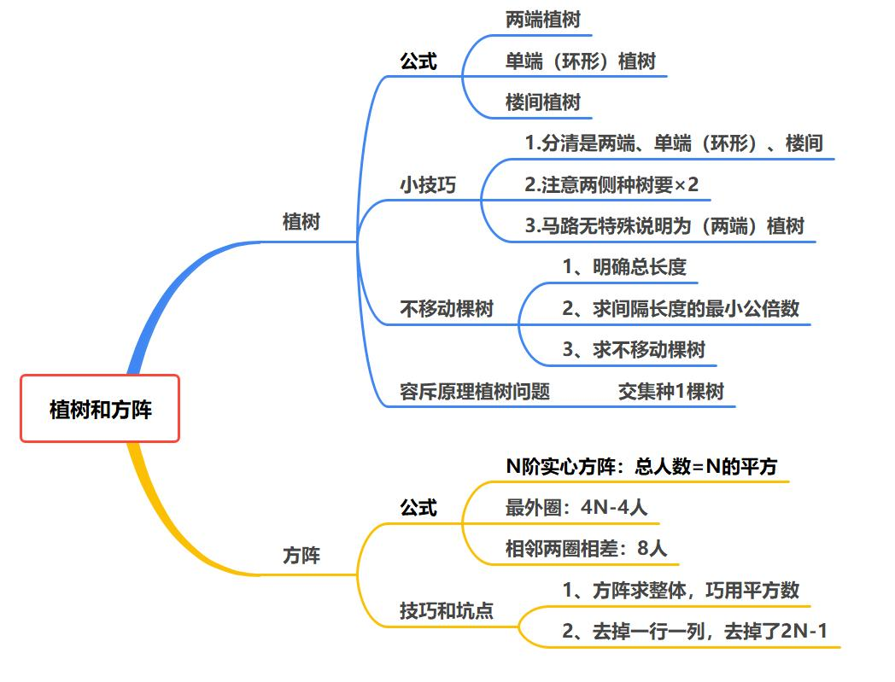

## 1.植树问题

### （1）两端、单端（环形）、楼间植树  

两端植树：$\textbf{棵数}=\dfrac{\textbf{路长}}{\textbf{间隔}}+\mathbf 1 = \textbf{段数} + \mathbf 1$  
单端（环形）植树：$\textbf{棵数}=\dfrac{\textbf{路长}}{\textbf{间隔}} =\textbf{段数}$  
楼间植树：$\textbf{棵数}=\dfrac{\textbf{路长}}{\textbf{间隔}}-\mathbf 1 = \textbf{段数} - \mathbf 1$  

注意：  
1.分清是两端、单端（环形）、楼间。    
2.注意两侧种树要×2。    
3.环形——闭环：方形、圆环
4.==等间距种树，拐角种树，**间隔长度为长度的公约数（短除法左边数乘积）**==。   

> **最大公约数求法**：
>
> 
>
> 即最大公约数为 $\underline {10}\times \underline {5} \times \underline {3} = 150$   
> 最大公倍数为 $\underline {10}\times \underline {5} \times \underline {3} \times 5 \times 9 = 6750$

### （2）不移动植树  

方法：（**最小公倍数不移动**）  
1、明确总长度  
2、求间隔长度的最小公倍数  
3、求不移动棵树（反向问法：再挖几个坑？）
（1）$\textbf {两端不移动棵树} = \dfrac {\mathbf S}{\textbf {最小公倍数}} + \mathbf 1$  
（2）$\textbf{环形不移动棵树} =  \dfrac {\mathbf S}{\textbf {最小公倍数}}$ 

> 例子：长 144 米公路的一侧从一端到另一端每隔 3 米植一棵树，现在要改成每隔 4 米植一棵树，有多少不需要移动？
>
> （1）明确总长度  
> 	144 米
> （2）求间隔长度的最小公倍数  
> 	3，4最小公倍数为 12 
> （3）求不移动棵树
> 	$\dfrac {144}{12} + 1 = 12 + 1 = 13$ 棵
>
> 拓展：
>
> （1）"A" 3 米/棵： $\dfrac {144}3 + 1  = 48 + 1 = 49$ 棵
> （2）"B" 4 米/棵： $\dfrac {144}3 + 1 = 36 + 1 = 37$ 棵  
> （3）"$A \cap B$" 3，4 （12 米/棵）： $\dfrac {144}{12} + 1 = 12 + 1 = 13$ 棵  
> （4）"$\bar A$ " 再种棵数：$37 - 13 = 24$ 棵
> 

###   （3）容斥原理植树问题  

容斥原理和植树问题结合  
方法：求棵数+容斥原理公式运用  
坑点：
楼间植树（头尾不种），当
（1）整除，减一
（2）有余数，不减一

## 2.方阵问题  

N阶实心方阵：$\textbf {总数}=  \mathbf {N^2}$ 
最外圈：$\mathbf {4N-4}$ （$N+ N+N+N-4(重复端点)$）   
相邻两圈相差：$\mathbf 8$    
注：   
1、方阵求整体，巧用平方数   
2、去掉一行一列，去掉了 $\mathbf {2N-1}$（$N + N - 1(重复端点)$）    
3、
（1）猜：平方数
（2）两个实心方阵组成的实心方阵，$\mathbf {a^2 + b^2 = c^2}$  
`平方数相差28（64-36）`

# 第十二章 经济利润问题

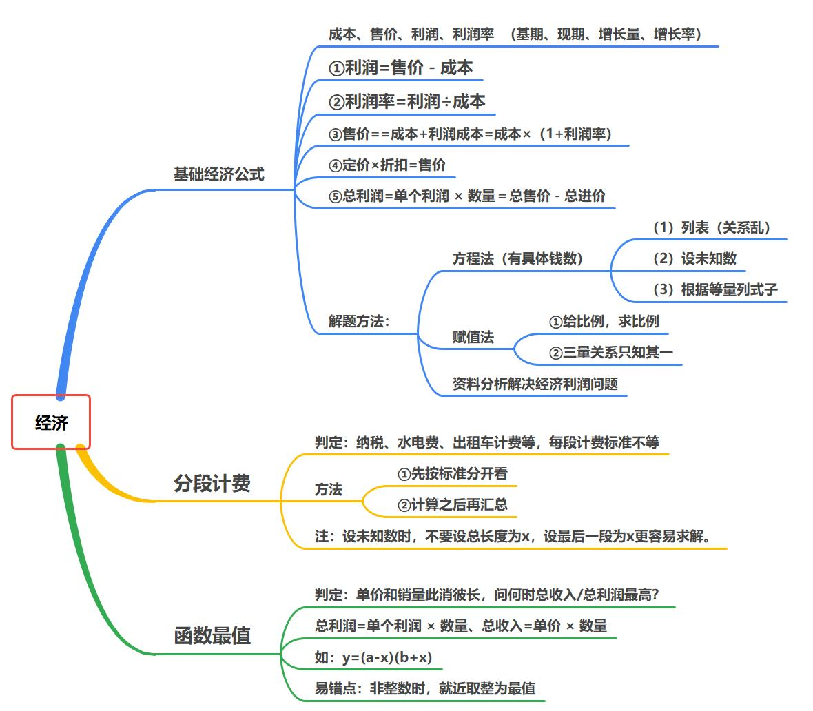

## 1.基础经济

1.识别特征：
……进价……利润（利润率）……，销售价……
2.常用公式（基期、现期、增长量、增长率）
（1）$\textbf {进价（成本）+利润=售价}$  
（2）$\textbf {利润率}=\dfrac {\textbf{利润}}{\textbf {成本}}$ 
（3）$\textbf{进价}\times(\mathbf 1+\textbf{利润率})=\textbf{售价}$
（4）$\textbf {总价=单价×数量}$ 
（5）$\textbf {定价×折扣=售价}$ 
注：定价的 9 折=定价×0.9
$\textbf {总利润} = \textbf{单利} \times \textbf{数量 = 总收入- 总成本}$
3.解题思路：根据等量列等式
（1）若只有单价商品，优先切入点为进价；
若出现多件商品，优先切入点为商品数量
（2）若出现折扣，一定要注意区分价格

### （1）资料分析解决经济利润问题

（1）利用：基期、现期、增长量、增长率关系
（2）线段法混合思想：$\textbf{利润率}=\dfrac{\textbf{利润}}{\textbf{成本}}$  
（3）连续涨价（或跌价）：  
正向：$\mathbf {r_\text{\tiny{\textbf 间}}=r_1+ r_2+ r_1\times r_2}$  
反向：$\mathbf {r_2 = \dfrac {r_\text{\tiny{\textbf 间}} -r_1}{1+r_1}}$  
（4）$\mathbf {A=B \times C}$  解题法

### （2）方程法

方程法：有具体钱数
（1）列表（关系乱）
（2）设未知数
（3）根据等量列式子

### （3）赋值法

赋值法：
① 给比例，求比例
② 三量关系只知其一
（$\textbf {总价=单价×数量}$）
（总量＝效率×时间）
（路程＝速度×时间）
操作方式：
（1）根据条件对成本或者售价进行赋值即可
（2）商品数量有比例，优先赋值数量的个数（5、10）
难点：赋值谁——变化谁，赋值谁

## 2.分段计费

1.识别特征（计费规则达到分段点后变为不同费用） 
例：……规定为：……1300元（含）以内的部分……，超出1300元部分……  
2.解题方法：先分段，再汇总  
注：先定位分段点，讨论费用涉及哪几个分段（不重不漏）  

## 3.函数最值

题型判定：$\textbf {总利润=单利×数量}$  
单价和销量此消彼长，问何时总收入/总利润最高？
计算方法（两点式）：
如：$\mathbf {y=(a-x)(b+x)}$
① 设次数，根据问法列方程，写成两括号相乘的形式
② 求出使方程等于 $\mathbf 0$，解得 $\mathbf{x}_{1}, \mathbf{x}_{2}$
③ 求出两个 $\mathbf x$ 的平均值 $\mathbf{x}={\dfrac{\mathbf{x}_{1}+\mathbf{x}_{2}}{2}}$ 时，此时 $\mathbf y$ 最值

# 第十三章 行程问题

## 1.基础行程

### （1）普通行程

$\textbf {路程=速度×时间  }$   
$\mathbf {S=V×T}$  
方法：画图展现行程过程，列式子求解。    
地点写两侧，人物写上下。  
注：    
（1）单位换算：1 米/秒=3.6 千米/时    
（2）只给时间或者给定速度比例可赋值（类似工程问题给定时间型和给定效率比例型）  

### （2）火车过桥

火车过桥（从开始进入隧道（桥）到车身完全驶出）  
公式：$\mathbf {S_{\textbf{{路程}}}=S_{\textbf{{桥}}}+S_{\textbf{{车}}}}$    

火车在桥（车尾进入到车头未露出，完全在隧道（桥）上）  
公式：$\mathbf {S_{\textbf{{路程}}}=S_{\textbf{{桥}}}-S_{\textbf{{车}}}}$  

### （3）匀加速（新型热门考法）  
识别：匀减速、匀加速  
匀变速运动的平均速度公式为：$\overline{\mathbf{V}}=\dfrac{\mathbf{V}_{\textbf{初速度}}+\mathbf{V}_{\textbf{末速度}}}{2}$  
问比例——赋值

### （4）等距离平均速度

判定：等距离
等距离平均速度公式：$\mathbf {\dfrac{2{V}_{1}{V}_{2}}{{V}_{1}+{V}_{2}}}$

> 推导（了解）
> $$
> \begin{align}
> \bar V = \frac {\text{总路程}}{\text {总时间}} &= \dfrac {2S}{\frac{S}{V_1}+\frac {S}{V_2}}\\
> &=\dfrac {2}{\frac{1}{V_1}+\frac {1}{V_2}}\\
> &=\dfrac {2}{\frac{V_1+V_2}{V_1V_2}}\\
> &=\dfrac{2{V}_{1}{V}_{2}}{{V}_{1}+{V}_{2}}
> \end{align}
> $$
>
>  
>
> 

常适用于：（等距离、多个不同速度）  
（1）直线等距离  
（2）直线往返  
（3）上下坡往返（上下坡的等距离）  
小技巧：平路 + 上下坡     

## 2.相对行程
### （1）相遇和追及

直线相遇：同时相向而行    
公式：$\mathbf{{S}_{\textbf{相遇}}=\mathbf{S}_{\textbf{和}}=\textbf{(}\mathbf{V}_{1}+\mathbf{V}_{2}) \times\mathbf{T}=\mathbf{V}_{\textbf{和}}\times\mathbf{t}}$  
$\mathbf{S}_{\textbf{相遇}}$ 就是两人走的路程之和    

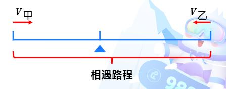

直线追及：同时同向而行   
公式：$\mathbf{{S}_{\textbf{追及}}=\mathbf{S}_{\textbf{差}}=(\mathbf{V}_{1}-\mathbf{V}_{2}) \times\mathbf{t}=\mathbf{V}_{\text{差}}\times\mathbf{t}}$  
$\mathbf{S}_{\textbf{追及}}$ 追及刚开始时两人相差的距离（多跑的距离）      

### （2）环形相遇和追及

环形相遇（同点相向出发）  
$\mathbf{S}_{_{\textbf{和}}}=\mathbf{V}_{_{\textbf {和}}}\times\mathbf{T}_{_{\textbf {遇}}}$  
相遇 $\mathbf 1$ 次，${\mathbf S_{_{\textbf{和}}}=\mathbf 1 \textbf 圈}$  
……
相遇 $\mathbf N$ 次，$\mathbf S_{_{\textbf{和}}}=\mathbf{N}\textbf{ 圈}$    

**本质**：==每一次相遇到下一次相遇期间，两人走的路程和是一圈==。 

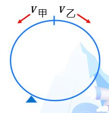

环形追及：（同点同向出发）  
$\mathbf{S}_{_{n}}=\mathbf{V}_{_{n}}\times\mathbf{T}_{_{n}}$
相遇 1 次，${S_{差}=1 圈}$
……
相遇 N 次，$\mathbf{S}_{差}=\mathbf{N}\text{ 圈}$
**本质**：==每一次追上到下一次追上期间，两人走的路程差是一圈==。（套了一圈）

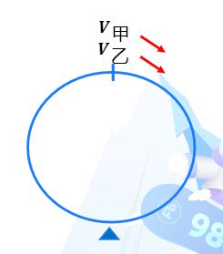

### （3）多次相遇

两端出发，多次相遇  
第一次相遇，共走 $\mathbf {1S}$  
第二次相遇，共走 $\mathbf {3S}$  
第 $\mathbf n$ 次相遇，共走 $\mathbf{(2\mathbf{n}-\mathbf{1})\mathbf{S}=(\mathbf{V}_{1}+\mathbf{V}_{2})\times\mathbf{t}}$  

同端出发，多次相遇  
第一次相遇，共走 $\mathbf {2S}$   
第二次相遇，共走 $\mathbf {4S}$   
第 $\mathbf n$ 次相遇，共走 $\mathbf {2\mathbf{nS}=(\mathbf{V}_{1}+\mathbf{V}_{2})\times\mathbf{t}}$  

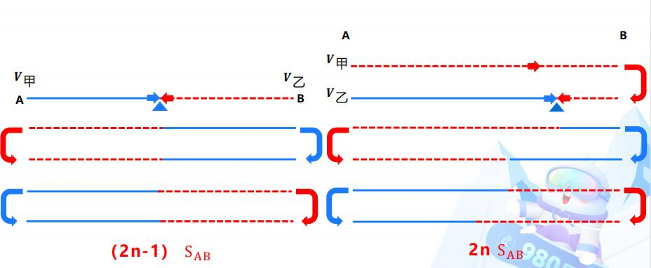

### （4）流水行船

$$
\begin{align}
\begin{aligned}\mathbf{V}_\textbf{顺}=\mathbf{V}_\textbf{船}+\mathbf{V}_\textbf{水}\quad & \quad\mathbf{V}_\textbf{船}=\frac{\mathbf{V}_\textbf{顺}+\mathbf{V}_\textbf{逆}}2\\\mathbf{V}_\textbf{逆}=\mathbf{V}_\textbf{船}-\mathbf{V}_\textbf{水} \quad & \quad\mathbf{V}_\textbf{水}=\frac{\mathbf{V}_\textbf{顺}-\mathbf{V}_\textbf{逆}}2\end{aligned}
\end{align}
$$

注：  
（1）在静水的速度为 ${V}_\text{船}$  
（2）漂流速度为 ${V}_\text{水}$  

## 3.比例行程

$\mathbf {S=V\times T}$  
==找相等的量，看比例，找份数==  
（1）$\mathbf S$ 相等，$\mathbf {VT}$ 成反比   
（2）$\mathbf V$ 相等，$\mathbf {ST}$ 成正比  
（3）$\mathbf T$ 相等，$\mathbf {SV}$ 成正比     

# 第十四章 排列组合问题

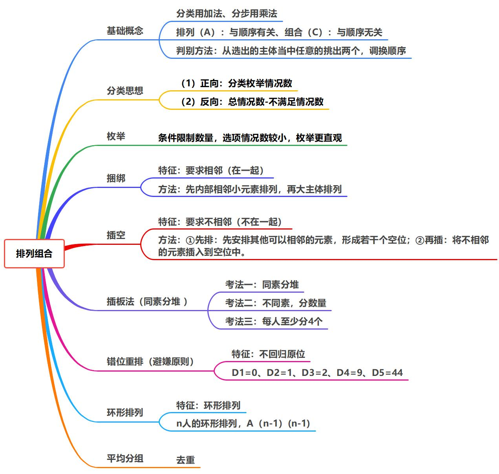

排列组合思维逻辑三步走  
1.**目标**是什么？  
2.**如何完成**目标？（是分类还是分步）  
3.**排列还是组合**？ 
$打乱顺序\begin{cases}对结果\textbf{有影响：排列}\\对结果\textbf{无影响：组合}\end{cases}$  

## 1.基础概念 

分类与分步    
分类：用加法（要么…要么…）（==“或”的关系；多者选其一==）   
**相加→一步到位，拿出来哪一个都好使**   
分步：用乘法 （**先…后…**./既…又…. ） (==“且”的关系；同时满足==)     
**相乘→一步不好使，必须都完成**   

排列与组合   
==排列：**与顺序有关**==   
==组合：**与顺序无关**==   
【**判定标准**】从**选出**的主体当中任意的挑出**两个**，调换顺序     
对结果有影响，与顺序有关（$\mathbf A$）     
$\mathbf {A_n^m=\text{\textbf{从 }}n\textbf{ 开始往下乘 }m\textbf{ 个数} =\underbrace{n\left(n-1\right)\left(n-2\right)\cdots\left(n-m+1\right)}_{m\textbf{ 个因子}}}$
对结果无影响，与顺序无关（$\mathbf C$）   
$\mathbf {C_n^m=\dfrac{\textbf{从 }n\textbf{ 开始往下乘 }m\textbf{ 个数}}{\textbf{从 }m\textbf{ 开始往下乘 }m\textbf{ 个数}}=\dfrac{A_{n}^{m}}{A_{m}^{m}}}$
排列与组合的计算：   
排列（$\mathbf A$）：与顺序有关  
组合（$\mathbf C$）：   
常用：凑 $\mathbf {12}$ 法。     
$\begin{aligned}\mathbf{12^2=144\qquad 12^3=1728}\end{aligned}$

>例：
>$\begin{align}A_{5}^{5}\times A_{4}^{4}\times A_{3}^{3}\times A_{2}^{2}&=5 \times 4 \times 3 \times 2 \quad \times 4 \times 3 \times 2 \quad \times 3 \times 2 \quad \times 2\\ &=5 \times 12 \times 2 \times 12 \times 2 \times 12 \\ &= 1728 \times 20\\ &= 34560\end{align}$

排列组合就是生活中的事，如何做事。    

## 2.分类思想

识别：至少……   
方法：   
（1）==正向思维==：分类枚举情况数   
（2）==反向思维==：总情况数-不满足情况数   
注：正向和反向哪种情况数少，就选择哪种方法   

>  例子：A 类水果（4种），B 类干果（3种），上岸想吃4种，每类至少吃一种。   
>
> 正向：   
> ​	水果（4）	干果（3）  
> ​	1				3		$C_{4}^{1}\times C_{3}^{3}=4\times1=4$  
> ​	2				2		$C_{4}^{2}\times C_{3}^{2}=6\times3=18$  
> ​	3				1		$C_{4}^{3}\times C_{3}^{1}=4\times3=12$  
> ​	$4 +18+12 = 34$  
>
> 反向：$总-不满足 = C_{7}^{4}- C_{4}^{4}=35 - 1=34$

## 3.枚举

**限制了条件，选项数据小，一一枚举，不重不漏**。  
注：枚举属于分类思想，这里选项数据小，枚举更直观。  

## 4.捆绑法

捆绑法（相邻）：题目要求一部分主体必须在一起，需要**先将要求在一起的部分排列，然后视为一个主体**，和其他主体排列。  
特征：要求相邻（在一起）  
方法：==先内部相邻小元素排列，再大主体排列==。  

## 5.插空法

特征：要求不相邻（不在一起）  
思路：（有空插空）  
① 先排：==先安排其他可以相邻的元素==，形成若干个空位；  
② 再插：==将不相邻的元素插入到空位中==。  

> 【示例】A、B、C、D、E 五个人站成一排照相，其中 A、B 不能相邻  
>
> 先 CDE，$A_3^3$，形成四个空  
> 插 AB ，$A_4^2$

## 6.插板法

插板法（同素分堆 ）：
① 每人至少一个  
② 分法是因为数量的多少引起的差别  
方法：空里插刀  

> 
>
> [例1] 7个相同的苹果分给唐僧和悟空，每人至少分一个，有多少种分法?    
>
> ​	6 个空，切 1 刀， $C_6^1=6$  
>
> [例2] 7个相同的苹果分给唐僧、悟空和八戒，每人至少分一个，有多少种分法?  
>
> ​	6 个空，切 2刀， $C_6^2=15$  
>
> [例3] 7个相同的苹果分给唐僧、悟空、八戒、沙和尚，每人至少分一个，有多少种分法?
>
> ​	6 个空，切 3刀， $C_6^3=20$

考法：  
考法一：同素分堆  
考法二：不同素，分数量    
考法三：每人至少分 $\mathbf 4$ 个，每人 $\mathbf {(n-1)}$ 个     

> ［引例］20个相同的苹果分给三个小盆友，每人至少分4个, 有多少种分法？
>
> ​	$至少 4 个\begin{cases}每人 3 个(3人\times 3 个 = 9 个)\\至少1个(剩下 11  个\xRightarrow []{3人\rightarrow 2 刀} 10 空\quad C_{10}^2)\end{cases}$  
>
> 
>
> （2024全国事业单位联考）某单位将11本《党员学习手册》分发给甲、乙、丙共3个党支部。已知甲支部至少分得3本，乙支部至少分得2本，丙支部至少分得4本，问一共有多少种不同的分配方式？
>
> ​	$\begin{cases}甲(2本)\quad 乙(1本)\quad 丙(3本)\\剩下每支部至少 1本(剩下 5  本\xRightarrow []{3人\rightarrow 2 刀} 4 空\quad C_{4}^2=6)\end{cases}$ 

## 7.错位排列

错位重排（避嫌原则）  
特征：**不回归原位**  
方法：  

|  D1  |  D2  |  D3  |  D4  |  D5  |  D6  |
| :--: | :--: | :--: | :--: | :--: | :--: |
|  0   |  1   |  2   |  9   |  44  | 265  |

$D_n$：$n$ 为元素数量 

$\begin{aligned}(D_1+D_2)\times2&=D_3\\(D_2+D_3)\times3&=D_4\\(D_3+D_4)\times4&=D_5\\(D_4+D_5)\times5&=D_6\\\end{aligned}$

## 8.环形排列

$\mathbf n$ 个人进行环形排列，有 $\mathbf {A_{n-1}^{n-1}}$ 种排法。

## 9.平均分组

存在重复情况
方法：**$\mathbf n$ 组相同，$÷\mathbf {A_n^n}$**

> （1）4人平均分成两组。只分组不干活，有重复，所以去重
>
> ​	a	b	c	d
>
> ​		① ab	cd 
>
> ​		② cd	ab 重复
>
> ​	$\dfrac{C_4^2\times C_2^2}{A_2^2}=\dfrac{6\times1}{2}=3$
>
> （2）现有8人，从中挑选4人平均分成两组。
>
> ​	$\dfrac{C_8^4\times C_4^2\times C_2^2}{A_2^2}$
>
> （3）现有8人，从中挑选4人平均分成两组，分别参加甲、乙两个活动。
>
> ​	法一：先选人，在干活   
> ​		$\dfrac{C_8^4\times C_4^2\times C_2^2}{A_2^2}\times A_{2}^{2}=420$
>
> ​	法二：生活思维  
> ​		$C_8^4\times C_4^2=420$	（先选 4 人，再在 4 人中选 2 人去甲，剩余 2 人只能去乙）			
>
> 

# 第十五章 概率问题（做猜结合）  

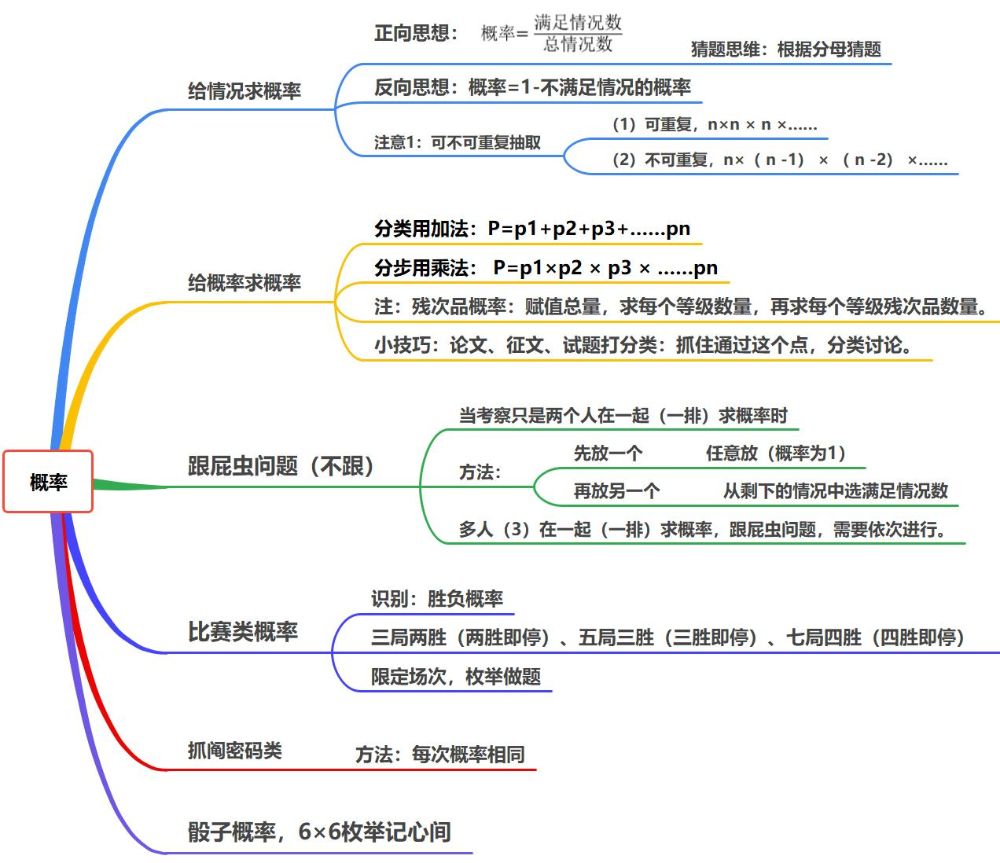

## 1.给情况求概率

正向思想：

$\textbf{概率}=\dfrac{\textbf{满足情况数}}{\textbf{总情况数}}$

反向思想：$\textbf{概率=1-不满足情况的概率}$

（1）正向思维

（2）反向思维（**分类**）  

## 2.给概率求概率  

分类用加法：$\mathbf {P=p_1+p_2+p_3+......p_n}$   
分步用乘法：$\mathbf {P=p_1\times p_2\times p_3\times......p_n}$     
小技巧：     
论文、征文、试题打分类：     
抓住通过这个点，分类讨论。   

注：残次品概率：赋值总量，求每个等级数量，再求每个等级残次品数量。  
给比例，求比例  $\rightarrow$ 赋值 1000（**坑点：注意问法**）

> 【例7】（2021四川）甲、乙、丙、丁四个车间生产相同的产品，生产效率之比为4: 3: 2: 1，产品不合格率分别为2%、3%、4%、5%,质检人员从这4个车间某小时内生产的所有产品中随机抽取1件，友现该产品不合格，该产品是乙车间生产的概率为：
>
> 合格率：给比例，求比例  $\rightarrow$ 赋值
>
> ​	总量 1000：		
>
> |        | 甲   | 乙   | 丙   | 丁   |
> | ------ | ---- | ---- | ---- | ---- |
> |        | 400  | 300  | 200  | 100  |
> | 不合格 | 8    | 9    | 8    | 5    |
>
> ​			$P=\dfrac{不合格}{不合格总数}=\dfrac {9}{8+9+8+5=30\%}$
>
> **坑点：注意问法**

## 3.跟屁虫问题

(不)跟屁虫问题：   
求两个主体在同一排 / 列 / 同一辆车的概率：**先放一个，再放另一个**。    

> （2018国考）某单位的会议室有5排共40个座位，每排座位数相同。小张和小李随机入座，则他们坐在同一排的概率：  
>
> 
>
> ​		先放一个（任意放）：$P_1 = \dfrac {40}{40}= 1$  
> ​		再放另一个：$P_2=\dfrac{7}{39}$  
> ​		分步：$P = P_1 \times P_2= \dfrac {7}{39}$

## 4.比赛类概率

（1）胜利即止：  
识别：胜负概率  
常考题型：  
三局两胜（两胜即停）  
五局三胜（三胜即停）  
七局四胜（四胜即停）  
（2）限定场次，枚举做题  

## 5.抓阄密码类

等可能性概率问题，
方法：每次概率相同。  
猜题思维：分母很规整。很少乱七八糟的数。  

## 6.骰子问题

骰子概率，6×6枚举记心间

|       | 1     | 2     | 3     | 4     | 5     | 6     |
| ----- | ----- | ----- | ----- | ----- | ----- | ----- |
| **1** | （1，1） | （1，2） | （1，3） | （1，4） | （1，5） | （1，6） |
| **2** | （2，1） | （2，2） | （2，3） | （2，4） | （2，5） | （2，6） |
| **3** | （3，1） | （3，2） | （3，3） | （3，4） | （3，5） | （3，6） |
| **4** | （4，1） | （4，2） | （4，3） | （4，4） | （4，5） | （4，6） |
| **5** | （5，1） | （5，2） | （5，3） | （5，4） | （5，5） | （5，6） |
| **6** | （6，1） | （6，2） | （6，3） | （6，4） | （6，5） | （6，6） |

和为 7 的个数为 6，两侧依次递减

# 第十六章 数量易拿分小题型

## 1.标 1 法

题型识别：给定几何图，==规定方向==或者==最短路径==，到目的地有多少种走法
方法：标 $\mathbf 1$，路口加和

## 2.空瓶换酒公式

$\mathbf M$ 个空瓶换 $\mathbf N$ 瓶酒，$\mathbf x$ 个空瓶最多可以喝 $\mathbf {\dfrac {xN}{M-N}}$ 瓶酒

> 【例】如果 4 个汽水空瓶可以换 1 瓶汽水，现有 12 个汽水空瓶，不交钱最多可以喝多少瓶汽水
>
> ​	4 空瓶 $\rightarrow$ 1 瓶酒 + 1 空瓶（酒喝完后）  $\xRightarrow []{即最多}$ 3 空瓶 $\rightarrow$ 1 瓶酒  
> ​		${\dfrac {xN}{M-N}} = \dfrac {12\times1}{4-1}=\dfrac {12}3=4$

## 3.货物集中——统筹运输问题

典型特征：货物集中到哪，成本最低。
解题方法：==先中间分开，轻的向重的方向移动==
不看长度，只比重量；偏向思维，轻的流向重的  
① 划线 
② 求和 
③ 轻 $\rightarrow$ 重

## 4.线切面问题

识别：用直线切割一个有限平面，后一条直线与此刖每条直线都要产生新的交点，第1条直线将平面分成2块，第2条直线将平面分成4块，第3条直线将平面分成7块……  

| 直线数 |  1   |  2   |  3   |  4   |  5   |  6   |  7   |  8   |  9   |
| :----: | :--: | :--: | :--: | :--: | :--: | :--: | :--: | :--: | :--: |
|  面数  |  2   |  4   |  7   |  11  |  16  |  22  |  29  |  37  |  46  |

记忆：**5 线 16 面**

## 5.时间统筹：见缝插针

识别：同时进行多项工作，时间最少    
方法：见缝插针     

## 6.爬楼问题

思维误区   
知识点：从 $\mathbf 1$ 楼爬到 $\mathbf N$ 楼，实际爬了 $\mathbf {N-1}$ 楼，休息了 $\mathbf {N-2}$ 次    

> 例子：从1楼爬到6楼，实际爬了（5）楼，休息了（4）次。

## 7.网状图

方法：找最短，生活思维  

## 8.脑筋急转弯——天平问题

**小秘密：3** 
考法：  
（1）天平称重    
（2）天平找假币   
根据”天平找假币“固定结论，使用 $\mathbf n$ 次天平最多可判断 $\mathbf {3^n}$ 几个球。（当有 $\mathbf x$ 个球，$\mathbf {3^{n-1}<x\leq3^n}$ 次天平找出）  

   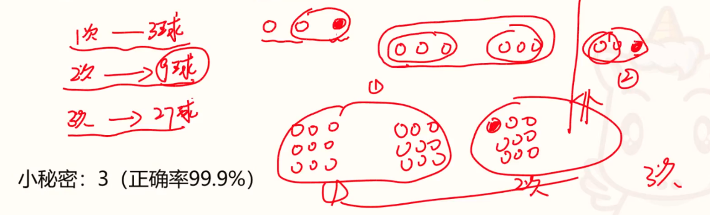

1.讲义：  
（1）每天  10-15 题    
（2）至少 3 - 4 遍    
2.
专项题  
3.数量超大杯 
