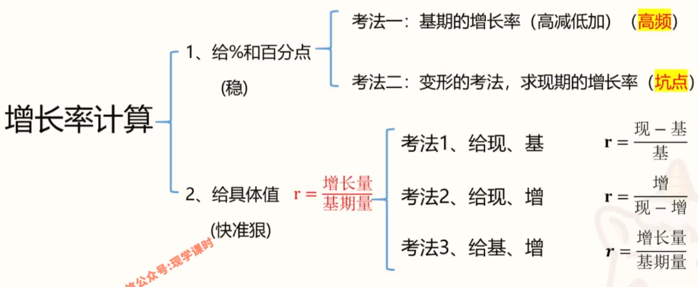
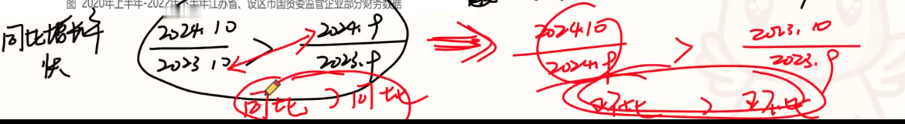
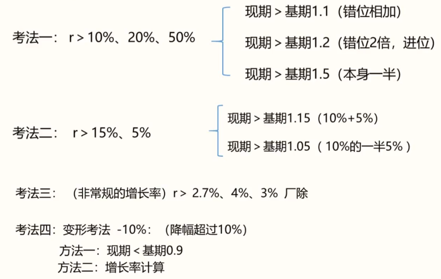
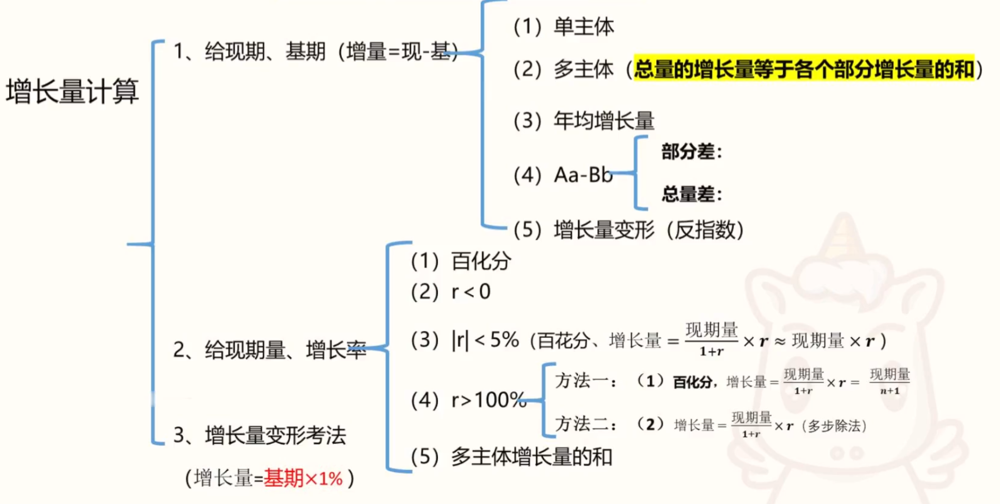
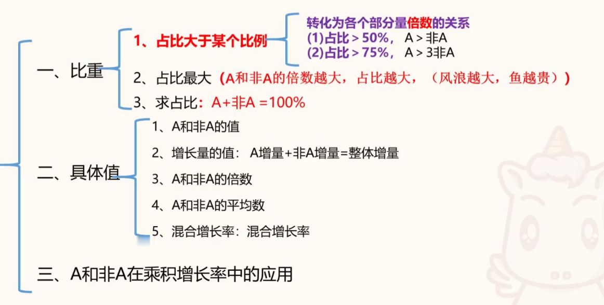

# 第一节增长率拔高专项  

## 一、增长率计算  

### 1、给 ％ 和百分点  

（1） 基期的增长率（高减低加），注意降幅的表述  
（2） 增长率作差，单位应该百分点  
（3） 人口增长率，往往为 $\perthousand$ 。  

排序题：
最值思维，结合选项，边做边排除  

### 2、给具体值

$\mathbf{r}=\dfrac{\textbf{增长量}}{\textbf{基期量}}$  
考法1：给现期、基期 

$\mathbf{r}=\dfrac{\text{现}-\text{基}}{\text{基}} = \dfrac {现期}{基期}-1$

考法2：给现期、增长量 

$\mathbf{r}=\dfrac{\text{增长量}}{\text{现期}-\text{增长量}}$

考法3：给基期、增长量  

$\mathbf r=\dfrac{\text{增长量}}{\text{基期量}}$  
截位直除  

### 3、基期增长率（基期增长=基期倍数-1）

此题型难度较高，近两年考的多，式子复杂，选项分析更重要。 

## 二、增长率比较

1、概念的考查:  
（ 1） 增长：现期＞基期、r＞ 0,增长量＞ 0 
（2） 增长率、降幅、变化幅度  
2、给现期、基期  
（1）当 $\mathbf {\dfrac{\text{现期}}{\text{基期}}=2^+}$ 明显，用 $\dfrac {\textbf {现期}}{\textbf{基期}}$ 比较  
（2） 当 $\mathbf {\dfrac{\text{现期}}{\text{基期}}=1^+}$ 不明显，用 $\dfrac {\textbf {增长量}}{\textbf {基期}}$ 比较  
3 、给现期量和增长量，直接比较 $\dfrac{\text{增长量}}{\text{现期量}}$ 大小   
注： $\dfrac{\text{增长量}}{\text{现期量}}$ 不是增长率（%）的具体值，只是代替比较  

### 1、易错点：增速、降幅、变化幅度     

### 2、倍数明显     

### 3、倍数不明显    

（1） 用 1.1、1.5倍来衡量。（瞪，少动笔）   
（2）小技巧：$\mathbf r = \dfrac {\textbf {增长量}}{\textbf {基期量}}$，==连续年份，增长量变小，基期变大，增长率变小==
（3） 分数比较

==同比快，环比也快，反之亦然==。

### 4、给现期量、增长量  
（1）给现期量和增长量，增长率比较，用 $\dfrac{\text{增长量}}{\text{现期量}}$ 代替增长率进行比较。  
（2）==既有增长率，又有现期量和增长量，只能用增长率的值来比较==   
（3）降幅比较，注意方向  

### 5、特定增长率比较：给现期和基期

$\mathbf {10\%：现期 > 基期 \cdot 1.1}$ （错位相加）    
$\mathbf {{20\%}：现期 > 基期 \cdot 1.2}$ （错位 $\mathbf 2$ 倍，进位）  
$\mathbf {{50\%}：现期 > 基期 \cdot 1.5}$ （本身一半）
$\mathbf {{5\%}：现期 > 基期 \cdot 1.05}$ （$\mathbf {10\%}$ 的一半，错位的一半）
$\mathbf {{15\%}：现期 > 基期 \cdot 1.15}$ （$\mathbf {10\% + 5\%}$）
变形：
$\mathbf{-10\%}\begin{cases}方法一:现期 < 基期 \cdot \mathbf {0.9} \text{ (错位相减)} \\方法二:增长率计算\text { (更直接，推荐)}\end{cases}$

### 6、特定增长率比较：给现期和增长量

给现期量和增长量，r＞...％    
方法：(n + 1)增长量 > 现期    
1%： 101增长量>现期   
100%： 2 增长量>现期    
25% ：5 增长量>现期   

### 7、给基期和增长量10%

### 8、增长率的折线图、增长率的排序题

1、最值思维
2、选项排除

# 第二节  间隔增长率拔高专项

## 一、间隔增长率

判定：2024 年比 2022 年 增 长 + % （隔一年，求增长率）
公式：$\mathbf{{r}_{\tiny{\textbf{间隔}}}=r_{1}+r_{2}+r_{1}\times r_{2}}$ 
速算：
①  $\mathrm {r_1、r_2}$ 的绝对值均 $＜\quad 10\%$，$\mathrm {r_1、r_2}$ 的和与选项差一个百分点以上，$\mathrm {r_1 \times r_2}$可以忽略（$10\%x10\%=1\%$）
② 化成分数；化成小数
③结合选项看答案	

1、给 $\mathrm {r_2}$

2、不给 $\mathrm {r_2}$（需要通过高减低加，求基期增长率 $\mathrm r_{2}$）

## 二、间隔倍数

特征：间隔一年，求倍数
两步走：
① 先求  $\mathbf r_{\tiny {间}}$ 
② ${间隔倍数=\mathbf r_{\tiny {间}}+\mathbf 1}$
快速方法：
$选项 -1$，转化为求 $\mathbf r_{\tiny {间}}$

## 三、间隔基期量

特征：间隔一年，求基期
两步走：
① 先求 $\mathbf r_{\tiny {间}}$ 
② $\text{间隔基期}=\dfrac{\text{现期量}}{1+\mathbf{r}_{\tiny{\text{间}}}}$
注：综合分析中的数据，相对来说是好的整数，反向求会更快。

## 四、间隔增长量

特征：间隔一年，求增长量
两步走：
① 先求 $\mathbf r_{\tiny {间}}$ 
② 百化分，$\text{间隔增长量}=\dfrac{\text{现期量}}{\mathbf {n+1}}$

## 五、间隔现期量

$间隔现期量=基期\times (1 + \mathbf r_{\tiny {间}})$   
方法一：利用熟知的平方数  
方法二：平方数不能用，差距小，用间隔现期  

## 六、间隔多年增长率

方法：多间隔几次。  
小技巧：当各年 $\mathbf {r > 0}$ ，间隔多年增长率 $\mathbf {r_{\tiny {间}}> r_{\tiny 1} + r_{\tiny 2} + ... + r_{\tiny n}}$  
$16\%$ 连续两年间隔 $34.56\%$，连续三年间隔 $56\%$  

## 七 、间隔混合增长率

先间隔再混合，更精准  

## 八、间隔基期比重

先间隔，再基期比重，分析选项和现期比重的关系。  

## 九、间隔平均数增长率

先间隔，再平均数增长率。  
$\mathbf {{r}=\dfrac{a_{\tiny {\text{间}}}-b_{\tiny {\text{间}}}}{1+b_{\tiny {\text{间}}}}}$
不要过度计算，选项分析。

## 十、间隔基期平均数

## 十一、间隔增长率的逆向运用

识别：连续的时间，求增长率
$\mathbf{{r}_{\tiny{\text{间隔}}}=r_{1}+r_{2}+r_{1}\times r_{2}}$
公式：$\mathbf{r}_2=\dfrac{\mathbf{r}_{\tiny{\text{间}}}{-\mathbf{{r}_1}}}{\mathbf 1+\mathbf{r}_ {\mathbf1}}$  
考法一：连续两年：整年和整年        2019        2020         2021
考法二：同比套环比                        2020.7     2021.6       2021.7
考法三：同比套年底                        2020.7     2020.12     2021.7

## 十二、间隔增长率和年均增长率的应用

间隔增长率 $\mathbf r$ $\xLeftrightarrow{\qquad \qquad }$ 年均增长率 $\mathbf r$  
技巧：年均增长率属一个虚数，==先利用年均增长率求间隔增长率==。   
示例：  
2021年上半年，S市工业战略性新兴产业总产值7164.68亿元，比去年同期增长19.6%,两年平均增长12.3%。  
2021年前三季度，苏州农村居民人均可支配收入31205元，同比增长11.05%,两年平均增长8.5%。  
2021年1~2月，全国网上零售额17587亿元，同比增长32.5%,两年平均增长13.3%。  

## 十三、间隔巧解年均问题

# 第三节  乘积增长率和年均增长率拔高专项

## 一、乘积增长率（三量关系：A=BxC ） 

量的关系：$\mathbf {A=B\times C}$  
增长率关系：$\mathbf {r_{\tiny A} = r_{\tiny B} + r_{\tiny C} + r_{\tiny B} r_{\tiny C}}$

### 考法一：$\textbf{总额=单价}\times\textbf{数量}$ 

判定：$总额=单价\times数量$ 增长+% （求总额增长率）
公式：$\mathbf {r_{\tiny{\text{总额}}}{=r_{\tiny{\text{单价}}}+r_{\tiny {\text{数量}}}+r_{\tiny{\text{单价}}}\times r_{\tiny{\text{数量}}}}}$     
材料类型：材料有==平均数和数量==的表述 
（1）常见表述：（售价、销量）（单产、面积）（人均面积、人数）  
（2）变形关系表述：（倍数：城镇收入、乡村收入、倍数）  

### 2、$\textbf{部分=整体}\times{\textbf {比重}}$

判定：$\textbf {部分=整体} \times \textbf {比重}$ 增 长 +% （求部分的增长率）
公式： $\mathbf {r_{\tiny {\textbf{部分}}} = r_{\tiny {\textbf{整体}}} + r_{\tiny {\textbf{比重}}} + r_{\tiny {\textbf{整体}}} r_{\tiny {\textbf{比重}}}}$  
材料形式：==有整体，有比重变化==  
**注意**：
$比重变化\begin{cases}①2023年50\%, 2024年60\% \rightarrow r = \dfrac {60\% - 50\%}{50\%} = 20\%\\②2024年60\%,\textbf {比上年提升了 10个百分点} \rightarrow r = \dfrac {10\%}{60\%-10\%} = 20\%\end{cases}$ 
考法：  

（ 1） 部分增长率  

（2） 整体增长率（乘积增长率(分析）和平均数增长率（直观）的关系）  

### 3、乘积增长率比较

## 二、年均增长率

判定：年均增长（增速）最快/排序；年均增长率为
公式：$(1+\mathbf{r})^\mathbf{~n}=\dfrac{\text{现期}}{\text{基期}} \quad \rightarrow \quad \mathbf r=\sqrt[\mathbf n]{\dfrac{\text{现期}}{\text{基期}}}-\mathbf 1$

1、年均增长率比较
年均增长率的比较：
方法：$\mathbf n$ 相同，直接比较 $\dfrac {\textbf {现期}}{\textbf {基期}}$  
注意：
（1）$\textbf {现期 ＜ 基期}$，代表下降，年均增长率为负。
（2）$\textbf{现期 < 基期}$，年均增长率比较大小，直接比较 $\dfrac {\textbf{现期}}{\textbf{基期}}$  

2、年均增长率计算  

（1）$\mathbf {r＜10\%}$，估算、间隔思维  

估算结论：$\mathbf {r_{\tiny {\textbf{年均}}}\leq\dfrac{r_{\tiny {\textbf {总}}}}{n\textbf{年}}}$   
（2）$\mathbf {r>10\%}$ ，平方数   
常见平方数：  
$$
\begin{aligned}
11^ 2= 121 && 12^2= 144 && 13^2 = 169 \\ 
14^2 = 196 && 15^2 = 225 && 16^2 = 256 \\
17^2 = 289 && 18^2 = 324 &&19^2 = 361
\end{aligned}
$$

$$
\begin{gathered}
21^{2} =441 && 29^{2} =841 \\
22^{2} =484 && 28^2=784 \\
23^{2} =529 && 27^2=729 \\
24^{2} =576 && 26^2=676 \\
&25^2= \text{625} 
\end{gathered}
$$

年均增长率最常考三（四）次方  
三次幂：172227    
四次幂：202938    

$$
\begin{gathered}
1.2^3\approx1.7 && 1.2^4\approx2.0\\
1.3^3\approx2.2 && 1.3^4\approx2.9\\
1.4^3\approx2.7 && 1.4^4\approx3.8
\end{gathered}
$$

# 第四节  混合增长率拔高专项

量的关系：$部分1+部分2=整体$
增长率关系：混合增长率
常考关系：
1.$人民币+外币=本外币$    
2.$进口+出口=进出口$    
3.$邮政+电信=邮电$    
4.$上半年+下半年=全年$    
5.$一季度+二季度=上半年$   
6.$累计增长率$   
根据**选项**进行计算：
（1） ==混合居中==
（2）==从正中间偏向基期量较大的==（跷跷板原理，从正中间向胖的偏）
（3） 偏向搞不定，线段法精算

## 一、居中（两者或多者混合）

遇强则强，遇弱则弱  
$10\% + 20\% \rightarrow >10\%$  
$10\% + 5\% \rightarrow <10\%$  

## 二、偏向

## 三 、精算

## 四、量必须用基期

公式：$\text{浓度}=\dfrac{\text{溶质}}{\text{溶液}}\qquad\mathbf{r}=\dfrac{\text{增长量}}{\text{基期}}$  
原理：量是分母，混合增长率的量是基期量  
混合：居中，偏向基期量大的。（多数情况（99.9%）用现期代替基期计算）  
注：==当两个部分的增长率相差很大（通常差几十个百分点甚至更多）==时，可能存在叛逃情况，需警惕反例  
**操作**：发现 $\mathbf r$ 相差很大，不偷懒，直接估算基期，尽量精算。  

## 五、混合增长率的应用

### 1、上半年等于下半年

### 2、当月同比增速 >累计增速

累计增长率：只要累计不滑坡（＞），当月就比累计多  
例子：3 月增长率 >（1-3月）累计增长率  
(1~3月) = （1~2月） + 3 月
线段法，则：
3 月 > 1~3 月 > 1~2 月

### 3、混合基期比重

## 六、混合增长率变形：差值增长率

方法：转化为加和的增长率
盈余=收入-支出  
顺差=出口-进口  
逆差=进口-出口  

## 七、混合比重考法

### 1、混合比重

### 2、变形题：混合比重求两期比重升降

## 八、混合平均数

### 1、数量考法

### 2、资料考法

## 九、混合倍数

# 第五节  增长量拔高专项

## 一、增长量计算

### 1、给现期、基 期 （$\textbf {增长量=现期-基期}$）

（1） 单主体

（2） 多主体
多个主体求增长量：增长量得计算小技巧   
结论：==总量的增长量等于各个部分增长量的和== 

（3）年均增长量
识别： 年均+增长+单位（每一年的增长量相同）
公式：$\mathbf {\text{年均增长量= }\dfrac{\textbf{现期量-基期量}}{{n \textbf 年}}=\dfrac{\textbf{总增长量}}{{n \textbf 年}}}$  

（4）$\mathbf {Aa-Bb}$  (拆分思想)
部分差：$\mathbf {\textbf{整体}_1 \times \textbf {比重}_1 - \textbf{整体}_2 \times \textbf{比重}_2}$  
总量差：$\mathbf{\textbf{平均数}_1 \times \textbf {数量}_1 - \textbf{平均数}_2 \times \textbf {数量}_2}$  

（5）增长量变形（反指数）

2、给现期量、增长率

（1）百化分
#### 考法一：直接百化分  

> ① 不用背，我也会  
> $50\%=\dfrac 12、33.3\%=\dfrac 13 、25\%= \dfrac 14、20\%= \dfrac 15、10\%= \dfrac 1{10}$  
> ② 记住（ $\dfrac 18$ ~ $\dfrac 1{13}$），加和为 $20$ （整数部分+分母）  
> $12.5\%=\dfrac 18、11.1\%=\dfrac 19、9.1\%=\dfrac 1{11}、8.3\%=\dfrac 1{12}、7.7\%=\dfrac {1}{13}$  
> ③ 记住（$16、6$）和（$14、7$）互换的两对  
> $16.7\%=\dfrac 16、6.25\%=\dfrac 1{16}、14.3\%=\dfrac 17、7.1\%=\dfrac 1{14}$  
> ④ 记住（$17、18、19$），$5.963$     
> $5.9\%=\dfrac {1}{17}、5.6\%=\dfrac {1}{18}、5.3\%=\dfrac {1}{19}$  
> ⑤ 就记住 $6.7\%=\dfrac 1{15}$   
> **特殊百划分**：   
> $\mathbf {37\% = \dfrac 1{2.7}}$     $\mathbf {42\% = \dfrac 1{2.4}}$   

（1）$\mathbf {r>0:\quad r =\dfrac{1}{n}}$  

$\mathbf {\textbf{增长量}=\dfrac{\text{现期量}}{\mathrm 1+\mathrm{r}}\times\mathrm{r}=\dfrac{\textbf{现期量}}{n+1}}$  

> 推导（了解）：  
> $\text{增长量}=\dfrac{\text{现期量}}{1+\mathrm{r}}\times\mathrm{r}\xlongequal[]{r = \dfrac 1n}\dfrac{\text{现期量}}{1+\dfrac{1}{\mathrm{n}}}\times\dfrac{1}{\mathrm{n}}=\dfrac{\text{现期量}}{\dfrac{\mathrm{n}+1}{\mathrm{n}}}\times\dfrac{1}{\mathrm{n}}=\dfrac{\text{现期量}}{\mathrm{n}+1}$

（2）$\mathbf {r<0:\quad {r}= -\dfrac{1}{n}}$  
$\mathbf {\textbf{增长量}=\dfrac{\text{现期量}}{\mathrm1+\mathrm{r}}\times\mathrm{r}=-\dfrac{\textbf{现期量}}{n-1}}$   

> 推导（了解）   
> $\text{增长量}=\dfrac{\text{现期量}}{1+\mathrm{r}}\times\mathrm{r}\xlongequal[]{r = -\dfrac 1n}\dfrac{\text{现期量}}{1+(-\dfrac{1}{\mathrm{n}})}\times(-\dfrac{1}{\mathrm{n}})=\dfrac{\text{现期量}}{\dfrac{\mathrm{n}-1}{\mathrm{n}}}\times(-\dfrac{1}{\mathrm{n}})=-\dfrac{\text{现期量}}{\mathrm{n}-1}$

增长率百化分之公式法（通用）   
如果遇到百分数实在想不起来，或者你就不想背，不常考的陌生数字      
那么请记住：$\mathbf{n}=\dfrac{\mathbf {100}}{\textbf{百分号前的数字}}$（保留小数点后一位）   

#### 考法二：放缩   

方法：利用与背过的百分数的倍数关系，实现百化分  

#### 考法三：取中  

如果遇到百分数左右难取舍，取中即可（**背**）  

$$
\begin{aligned}
\dfrac{1}{3.5}&\approx28.6\%&&\dfrac{1}{7.5}\approx13.3\%\\\\
\dfrac{1}{4.5}&\approx22.2\%&&\dfrac{1}{8.5}\approx11.8\%\\\\
\dfrac{1}{5.5}&\approx18.2\%&&\dfrac{1}{9.5}\approx10.5\%\\\\
\dfrac{1}{6.5}&\approx15.4\%&&\dfrac{1}{10.5}\approx9.5\%
\end{aligned}
$$

（2） r< 0

$\mathbf {\textbf{增长量}=\dfrac{\text{现期量}}{\mathrm1+\mathrm{r}}\times\mathrm{r}=-\dfrac{\textbf{现期量}}{n-1}}$ 

（ 3） |r|<5%
|r|<5% （$\textbf{增长量}=\dfrac{\text{现期量}}{\mathrm{1+r}}\times \mathrm r\approx\textbf{现期量}\times \mathbf r$ ）

（ 4） r>100% （$\mathbf {\text{增长量}=\dfrac{\text{现期量}}{1+\mathbf{r}}\times\mathbf{r}}$ ）
百划分：$\mathbf {\textbf{增长量}=\dfrac{\text{现期量}}{\mathrm 1+\mathrm{r}}\times\mathrm{r}=\dfrac{\textbf{现期量}}{n+1}}$  
多步除法：$\mathbf {\text{增长量}=\dfrac{\text{现期量}}{1+\mathbf{r}}\times\mathbf{r}}$

（5） 多主体增长量的和

3、增长量变形考法

$\mathbf {\textbf{增长量=基期} \times r}$  
==增长 $\mathrm {1\%，增长量=基期×1\%}$== 
技巧：每增长 $\mathbf {1\%}$ 或每增长 $\mathbf 1$ 个百分点，$\mathbf {\textbf {增长量=基期} \times 1\%}$  

## 二、增长量比较

### 1、增长量=现期量-基期量

(1 )增长量超过某定值问法

（2） 增长量比较（图形：高度差、斜率、增长量=现期量-基期量）

$增长量=现期-基期$    
柱形图、折线图中可以直接看高度差    
注：==斜率代表的是增长量==    

2、给现期、增长率

（1）大大则大：  
① 现大、增长率大，则增量大   
② 现大、降幅大，则减少量大  
（2）一大一小：百化分，$\dfrac{\textbf{现期量}}{\mathbf{n+1}}$ 分数比较（考官出坑的地方）  
公式解释： $\mathbf {\text{增长量}=\dfrac{\textbf{现期量}}{1+r}\times r}$  
灵魂是什么：先排再列，利用大大则大排除，再列百化分

3、增长量绝对值、变化量

考法：绝对值的最值、绝对值排序  
方法：淘汰赛  
注意：
① 先选项分析，排除
② 正正比，负负比，再正负最值比

4、增长量折线图

==选项分析，排除做题==
（1）==正负==
（2）==大小==

# 第六节 基期量拔高专项
## 一、基期计算

1、给现期、增长量（$\textbf{基期量=现期量-增长量}$）

2、给现期、$\mathbf r$ （$\textbf {基期量} = \mathbf {\dfrac {\textbf {现期量}}{1+r}}$）

（1）$\mathbf {r>0}$

（2）$\mathbf {r<0}$

3、化除为乘和化除为乘的反例
（1）化除为乘
$化除为乘\begin{cases}{	r>0,能瞪则瞪，瞪不出来厂除更精更快}\\	r<0,特别好用\end{cases}$
应用环境：**求基期，差距小，$|\mathrm{r}|\leq5\%$**   
技巧：先变正负，再拆括弧   
$\mathbf {\dfrac{{A}}{1+{r}}}\approx\mathrm{A}\times (1-\mathrm{r}) =\mathbf{A}-\mathbf{A}\times\mathbf{r}$  
$\mathbf{\dfrac{A}{1-r}}\approx\mathrm{ A\times (1+r) =\mathbf {A+A\times r}}$  

（2）反例

**化除为乘不可用**：  
（1）==选项首位相同，第二位也相同  且 （2）$\mathbf {4\% ≤ |r| ≤ 5\%}$==。

4、给增长量和增长率（$\textbf {基期量} = \mathbf {\dfrac {\textbf {增长量}}{r}}$）

## 二、基期比较：先排再列

识别：过去时间+最高/低，最多/少  
我们的问题：耗时严重、列了不甘心，不列不放心  
本质：分数比较  
方法：**先排，再列**  

1、给现期量、增长量  

2、给现期量、$\mathbf r$   

基期常识题  

## 三、基期和差

公式：    
$\mathbf {\dfrac{\mathrm{A}}{1+a}+\dfrac{B}{1+b}\qquad \qquad\dfrac{A}{1+a}-\dfrac{B}{1+b}}$    
方法：    
(1)分母相同：分子和差     
(2)分母不同：不列式的厂除(快准狠)    

## 四、基期变形

## 五、综合分析中的基期问题

# 第七节  现期量拔高专项

## 一、保持增长量
1、保持增长量达到某个目标（代入更快）

2、保持增长量计算具体值
年均增长量：2011 - 2016 年  年均增长量 
	$\dfrac {2016-2011}5$
增长量的平均值：2011 - 2016 年，增长量的平均值  **易错，重点理解**
	$\begin{align}&\dfrac {2011增+2012增+2013增+2014增+2015增+2016增}6\\&=\dfrac{ (\underline{2011}-{2010})+(\underline{2012}-\underline{2011})+(\underline{2013}-\underline{2012})+(\underline{2014}-\underline{2013})+(\underline{2015}-\underline{2014}) + ({2016}-\underline{2015})}6 \\&=\mathbf{\dfrac{2016-2010}6} \\&=\dfrac {总增长量}{年份差+1} \end{align}$
3、保持增长量现期追赶
考法一：小追大，追上，问几年。
方法：找差距，补差距。
考法二：小追大，追不上，问差距。

（ 1） 追得上

（2） 追不上，问差距

## 二、保持增长率

1、保持增长率，给增长率r

2、保持增长率，不给增长率r
方法一：r> 0 ,增长量变大。 
方法二：大精小估，利滚利思想（正向：计算出具体值、反向：选项排除）

3、变形考法：负增长

## 三、名义增长率和扣除价格因素实际增长

名义增长率：没有扣除价格因素影响得到的增长率
实际增长率（按可比价格计算）：扣除价格因素影响得到的增长率
注：资料分析的增长率，默认是名义增长率，若用实际增长率考官一定会标注清楚。

## 四、（按照给定公式）求现期量

上年末企业数十本年内新增企业数- 本年内注销企业数= 本年末企业数
去年在校人数+今年招生人数-今年毕业人数=今年在校人数
上月月末库存量+本月产量-本月销量=本月月末库存量
考法一：求当年的值
考法二：求多年以后

## 五、现期变形

# 第八节  比重拔高专项

题型识别：$\mathbf A$ 占 $\mathbf B$ 的比重；在 $\mathbf B$ 中，$\mathbf A$ 所占的比重。

## 一、现期比重

### 1、求比重

（1）单主体（$\mathbf {\dfrac AB}$） —— 厂除

（2） 多主体（ $\mathbf {\dfrac {A_1 + A_2 + A_3}B 、\dfrac {A_1}{A_1+A_2 + A_3}}$）  

法一：比重和（差距小，厂除；差距大，拆项）    
$\mathbf {\dfrac {A_1 + A_2 + A_3}B = \dfrac {A_1}B + \dfrac {A_2}B + \dfrac {A_3}B}$ 
法二：厂除    

（3） 大于某比重  

### 2、求整体  

$总体 = \dfrac {部分}{比重}$  
技巧：百划分、直除
注意：
（1）整体差，$\dfrac {部分}{比重}-\dfrac {部分}{比重}$，**一般截三位计算，注意量级**
（2）定主体：整体一般在首段，或者前两句话

### 3、求部分（估算和精算）  

### 4、比重饼状图  

做题方法：    
1.找特殊值 （$\dfrac 14、\dfrac 12、\dfrac 34$）    
2.看各部分的大小、倍数关系    

### 5、比重比较

（1）相同整体：整体相同只比较分子即可。   
（2）不同整体：分数性质进行比较（先排再列）。    
（3）连续的比重比较，可以按照两期比重比较。

### 6、现期比重作差

1、整体相同（$\dfrac{\Delta-\Delta}{\Delta}$）—— 分子做差，厂除  
2024年高照头重量占身体的比重比脚占身体的比重多……百分点  
2、整体不同（$\dfrac\Delta\Delta-\dfrac\Delta\Delta$）—— 不列式厂除，选项分析  
2024年高照头重量占身体的比重比上岸同学的头占身体比重多……百分点 

（1） 相同整体，分母相同

（2） 不同整体，分母不同

### 7、特殊比重(利润率、增长贡献率、贡献率)

（1）在资料分析中，$利润率 = \dfrac {利润}{收入}$  
（2）增长贡献率：$增长贡献率 = \dfrac {部分的增长量}{整体的增长量}$    
考法一：增长贡献率比较，分母相同，只比较分子，转化为增长量的比较  
考法二：求增长贡献率    
考法三：利用增长贡献率求增长量    
（3）贡献率：$\mathbf A$ 对 $\mathbf B$ 的贡献率：相当于 $\mathbf A$ 占 $\mathbf B$ 的比重  
（4）$产销率= \dfrac {销量}{产量}$  
（5）思考：$\dfrac {\textbf {拉动增长率}}{\textbf {增长贡献率}} = \textbf {整体增长率}$   

> $\dfrac { {拉动增长率}}{ {增长贡献率}} =\dfrac { \dfrac {部分增长量}{基期量} }{\dfrac {部分增长量}{整体增长量}}= \dfrac {部分增长量}{基期量}\times  \dfrac {整体增长量}{部分增长量}= 整体增长率$ 

### 8、比重比例类比（含平均数比例类比）
求比重，无整体，有比重，比重比例类比  

（ 1） 比例类比求比例  

判定：==求比重，无整体，有其他比重，比重比例类比 ==  
计算：==横向或纵向==  

> 高照 ？斤：头，18斤，占身体比重 9%，手，6 斤，手占身体比重 $x$：
> $$
> \begin{gathered}
> \frac {18}{\tiny{\tiny{身体}} }&&& \xRightarrow []{÷ 2} &&& 9\% \\
> \Downarrow ÷ 3&&&  &&&\Downarrow ÷ 3\\
> \frac 6{\tiny{身体}} &&& \xRightarrow []{÷ 2} &&& x=3\%\\
> \end{gathered}
> $$

（ 2） 比例类比求量  

## 二、基期比重
1、给 $\mathbf {ab}$ （$\mathbf {\dfrac{\mathbf{A}}{\mathbf{B}}\times\dfrac{1+\mathbf{b}}{1+\mathbf{a}}}$）  

➢ **速算技巧**：  
1、先判断 $\mathbf {\dfrac{1+\mathbf{b}}{1+\mathbf{a}}}$ 与 $\mathbf 1$的关系（＞，＜，=）
2、根据选项差距截位直除 $\dfrac{\mathbf{A}}{\mathbf{B}}$
3、结合选项找答案 

估算：
（1） 选项只有一个大于或者小于的（没得选了，不选这个你想干啥）
（2） 即使有多个，就是能看出来呢（就是这么任性）

精算：化 1 法
（1） 分子（$\mathbf{1+b}$） ：加一个减一个
（2） 分母（$\mathbf {1+a}$）：四舍五入截前两位即可

2、不给ab （给增长量）

3、基期饼图

4、整体的基期

## 三、两期比重比较升降
1、直接给ab

2、不给ab,混合求a或b
衣着，1365元 占 比

## 四、两期比重升降百分点
1、a>0, <|a-b|只有一个

2、两期比重反例： $\mathbf {<|a-b|}$ 有多个或 $\mathbf {a<0} $
\考法一：考量级，注重分析 $\mathbf {\dfrac AB}$
考法二：考首位、次位，截两位列式

3、两期比重逆运用
部分增长率比较、部分增长率和整体增长率比较
技巧：根据两期比重升降，判定增长率的大小关系

# 第十一节  A 和非A 思想拔高专项

(1)材料的考法：总分结构
(2)题干的考法：A和三四、除……外、其他
(3)贯穿资料考点

## 一、比重

1、占比大于某个比例
给出各个部分量，求某部分所占比重是否超过特定数值（如 50%、75%、25%等）
方法：转化为各个部分总倍数的关系

2、占比最大
A 和非A 的倍数越大，占比越大，（风浪越大，鱼越贵）

3、求占比

## 二、具体值

1、A 和非A 的值

2、增长量的值

3、A 和非A 的倍数

4、A 和非A 的平均数

## 三、A 和非A 在乘积增长率中的应用

# 第十二节  常考易错小知识点小结

## 1、坑点1 : 民航单位坑

## 2、坑点2：地理考查

（1）我 国 5 个自治区分别为内蒙古、广西、西藏、宁夏、新疆
（2） 我国现有北京市、天津市、上海市、重庆市4 个直辖市。

## 3、坑点3：中位数

## 4、坑点4：顺差、逆差

（ 1） 顺差、逆差
（2） 净出口、净进口

## 5、坑点5：汇率

## 6、坑点6：容斥原理(江苏特色)

考法一：有没有？
	方法一：A+B>100%, 一定有
	方法二：最值思维
考法二：有多少
(1) 至少 $A\cap B=A+B-100\%$ 
( 2 ) 在 A 中的占比，先求$A\cap B$，再“$A\cap  B$" / “A ”
