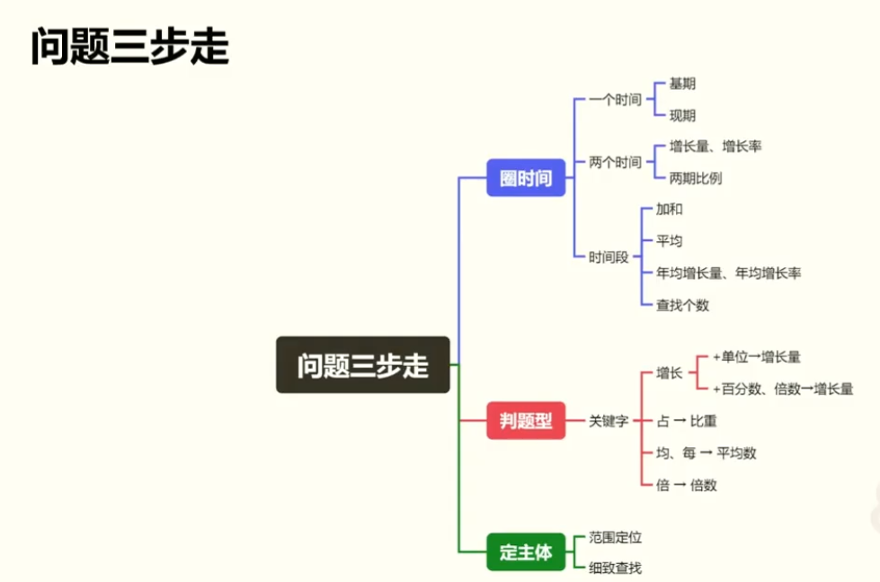

结构阅读
看差异：找文字、图表之间的主体差异，根据差异快速锁定数据所在范围
找结构：找总分结构，方便分析题干
做预判：根据各种类型材料的结构，预判常考题型

多个数加和(A+B+C+D+E+......)
**凑整计算** $\Rightarrow$ 凑整十、整百、整千、整万
**分析选项** $\Rightarrow$ 削峰填谷
**高位叠加** $\Rightarrow$ 高位加起，不进位顺写,进位叠加（例：3456+2189）
	情况一：计算加和，有选项，两加一估
	情况二：计算差幅或比例，两加
	情况三：需要精算，一加到底

> 

精简列式
不写原始列式，根据选项差距、计算精度抄数列式，一步到位
注：列式中的加减计算，要求口算出结果

$$
\Bigl((x+1)(x-1)\Bigr)^{2}
\bigl( \Bigl( \biggl( \Biggl( \quad \bigr\} \Bigr\} \biggr\} \Biggr\} \quad \big\| \Big\| \bigg\| \Bigg\| \quad \big\Downarrow \Big\Downarrow \bigg\Downarrow \Bigg\Downarrow
$$
$$
\underbrace{
\overbrace{(a+b+c)}^6  \cdot  \overbrace{(d+e+f)}^7
}_\text{meaning of life}
$$
