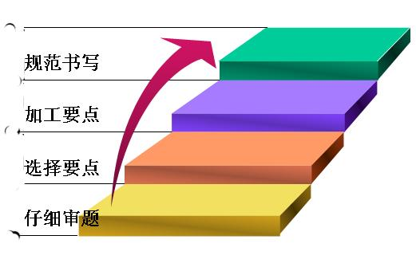
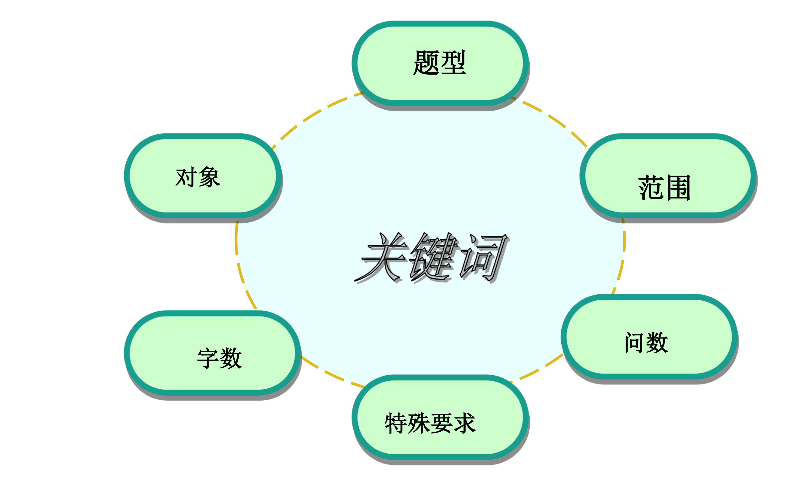

# 01  认识申论

## 一、申而论之

通用释义：“申论”简言之“申而论之”。从字面来理解，“申”为引申、申述，“论”为议论、论证，“申论”则指针对特定话题提出自己观点，并展开论述。是国家公务员考试科目中必考的一门科目。

（一）客观题是否需要把材料中的表述引申为规范词？

标题模板：

做好行政执法这篇大文章
——由“力”“理”“利”想到的
答好形成执法这道题
——由“力”“理”“利”想到的
行政执法的“同音字”
——对“力”“理”“利”的思考
谱写为民办事新篇章
——由办好事、好办事、事办好想到的
书写为民办事新答卷
——由办好事、好办事、事办好想到的
为民办事的“三字经”
——对办好事、好办事、事办好的思考

## 二、应试文体

申论是指针对给定材料，按照题干要求，熟练使用指定的语种，运用说明、陈述、议论等方式，准确规范、简明畅达地表述思想观点，对事件、观点进行准确合理的说明、陈述或阐释。

阅读理解能力：要求全面把握给定资料的内容，准确理解给定资料的含义，准确提炼事实所包含的观点，并揭示所反映的本质问题。

阅读理解能力——要求能够理解给定资料的主要内容，把握给定资料各部分之间的关系，对给定资料所涉及的观点、事实作出恰当的解释。

阅读理解能力：
1、读懂题干、领会命题人意图
2、读懂材料、提料判分点

综合分析：要求对给定资料的全部或部分的内容、观点或问题进行分析和归纳，多角度地思考资料内容，作出合理的推断或评价。

贯彻执行能力：要求能够准确理解工作目标和组织意图，遵循依法行政的原则，根据客观实际情况，及时有效的完成任务。

提出和解决问题的能力：要求借助自身的实践经验或生活体验，在对给定资料理解分析的基础上，发现和界定问题，作出评估或者权衡，提出解决问题的方案或者措施.

解决问题能力——要求运用自身已有的知识经验，对具体问题作出正确的分析判断，提出切实可行的措施或办法。

文字表达能力：要求熟练使用指定的语种，运用说明、陈述、议论等方式，准确规范、简明畅达地表述思想观点.

文字表达能力——要求熟练使用指定的语种，对事件、观点进行准确合理的说明、陈述或阐释。

### 申论考察题型

1、归纳概括           10分
2、提出对策           10-20分
3、贯彻执行           20分
4、综合分析           10-20分
5、申发论述           40分

### 申论根本应答原则

1.阅卷的基本规则

双人阅卷

踩点给分

一、按点或者按词给分

二、按意思给分

三、按结构给分

四、按逻辑关系给分

2.答题原则
材料为王
政府角度

# 02  申论应答方法

### 申论根本应答方法

关键环节：

仔细审题和规范书写。

过度加工要点易导致答案冗长，无关信息不扣分但挤占答题空间。

### 仔细审题

1.题型判断：

申论考试主要分为五大题型——概括题、对策题、综合分析题、应用文写作题和作文题。当前题型界限逐渐模糊。

2.作答对象：明确题干核心问题。

3.作答范围：

- 若题干指定“根据给定材料一”，则答案范围限定于材料一； 
- 若题干要求“对某句话的理解”但未限定材料，则需结合全部材料分析（但 国考/联考通常答案仍集中于指定材料）。

4.字数与排版：

- 150字对应6行，通常需分5条作答（每行1条）； 
- 350字对应14行，建议分7个得分点（每2行1点）。

5.特殊要求：

- 对策题可能要求“问题与对策一一对应”； 
- 应用文题需注意“对象明确”“语言生动”等附加条件。 

6.题目逻辑关系：

自主命题省份（如山东、江苏）需关注题目间的关联性，例如作文题可参考前几题题干的核心主题。

> 尽管预判了答案结构，仍需严格依据材料调整答案，避免主观臆断。
>
> 多问题型要点底线：两问或三问题型的要点总数不低于 6 个。

## 选择要点

### 借助行测提升申论采点能力

一、意图推断

二、同义替换

三、高频词、中心词

选择要点的原则
紧扣题目
立足材料
阅读方法

加工要点

1、总分（总）加工法

归纳概括作答思路：总分
提出对策作答思路：总分
综合分析作答思路：总分总
申发论述作答思路：总分总

3、递进式加工法 归纳概括常规型材料的主要内容的要素：
好现象+问题+影响+原因+对策
观点+意义+问题+对策
观点+问题+原因+对策

4、转折式加工法 

（1）归纳概括争议型材料主要内容=好现象+问题+正方观点+ 反方观点+其他（有的情况下）
（2）分析/概括原因：主观、客观
（3）分析/概括影响：积极、消极

二、内容加工
1、同义法：正、反
2、同范围法
时间划分：过去、现在、未来
空间划分：国内、国外
政策范畴：政治、经济、文化、生态、社会（民生、社会管理） 领域划分：商业、医学、科技
3、主体合并法：个人、政府、社会、国家

### 规范书写

（一）卷面（干净、不允许涂改）

清爽干净，少涂少画 

字迹工整，大小一致 

排版合理，布局清晰

（二）语言（规范、简洁、流畅）

凝练、质朴、精辟、生动
符合题目要求，与考官产生共鸣

（三）格式：

规范：符合题目要求，符合题型答题思路
例：归纳概括题：总分形式=总括句十分要点

贯彻执行提：应用文固定格式
综合分析：总分总=总括句+分要点+总括句 
申发论述：总论点+分论点+总结

客观题：每段话第一句空两格书写
主观题：作文标题居中或前空四格
			副标题一在主标题空两格后书写

公文格式
标题+主送机关+正文+落款+日期
标题:居中写；
主送机关:顶格书写；
正文:每一段的第一句话要空两格书写；
发文机关和年月日:二者不是右对齐，而是中间对齐。

# 03  透视申论材料

## 第一节  材料类型

### 一、观点型材料

主要是指对事实做出评判的材料，一般是人物的发言或者一些政策文件以及议论性材料。

阅读的核心要素是：

主体、对象、观点、理由、结论
其中尤其要注意人物的身份、会议的名称、文件的名称

### 二、案例型材料

主要是指讲述事实的材料，里面会夹杂观点，但还是以陈述事实为主。

阅读的核心要素是：
主体、处境、做法、结果、启示

### 三、数据型材料

是一种特殊的案例材料，主要借助数据来表述事实

## 第二节  材料段落逻辑

一、并列关系：段落间明显是并列关系
二、递进关系：成绩、问题、原因、对策
三、因果关系：先因后果
四、转折关系：正反转折
五、总分（总）关系：一般是总分关系

## 第三节  材料阅读

### 一、带着问题阅读

一、勾画直接要点

（一）标注核心词

表示问题的：困境、问题、瓶颈、难题、现状、目前、具体表现、弊端、尴尬、软肋、缺失、不足等。
表示影响的：影响、导致、由此、有利（助）于、推动、造成、实现、意义、价值、作用等
表示原因的：由于、因为、因素、由……引起、由……导致、因为……所以……等
表示对策的：针对……要……、建议、提议、方案、思路、要….、应该、必须、措施、务必、将要，为……将……、加强等
表示观点的：针对...，对于...，应当...，表示...，认为....，说....，称....等

（二）关联词

转折关联词：①虽然……但是……②尽管……还（还是）……③其实……实际上（事实上）……④然而……固然……⑤但是……⑥但……⑦却……⑧仍然（依旧）……
因果关联词：①只要……就……②无论……都……③不管……总……④因为……所以……⑤既然……就……⑥之所以……是因为……⑦……因而……
并列关联词：①既……又……”②“不是……而是……”③“一边……一边……”④“一面……一面……”⑤“又……又……”⑥“一那么……那么……”⑦“是……也是……”⑧“一会……一会……”⑨“一方面……一方面……”⑩同时

递进关联词：①不但……而且……②不光（不仅）……还……③不仅……也……④不仅……而且……⑤不但……还……⑥更；不但……；甚至……；加之……
条件关联词：①只要……就……②无论……都……③不管……总……④只有……才……⑤除非……才……⑥凡是……都……
假设关联词：①如果……就……②即使……也……③哪怕……也……④就是……还……

（三）勾画核心句

1、首尾句

2、段中句

# 04  题型详解

## 第五节  申发论述

高分标准

**卷面干净**不连笔
**立意准确**不跑题
**要点清晰**不短缺

搭建框架找要点（重点，核心，根本）

- 总论点

- 分论点

  > 总论点与分论点的逻辑构建是基础；
  >
  > 得分关键仍在于材料要点的精准提取。
  >
  > - 注重要点间的逻辑关系（并列、递进等） 
  > - 必须结合材料主题

内容填充（次要）

> 优先掌握应试套路（如段落逻辑分层、中心句定 位、高频词识别等）
>
> 

展开思考需多角度分析问题

写作依据：严格遵循题干与材料

结合材料定义：引用材料话题（如制造业）

递进关系可通过字数分配体现：

- 分论点字数逐段增加（如第一段200字，第二段250字）。 
- 重要论点篇幅更长（如“长远之势”写两段，“眼前之形”写一段）。 

- 材料结合是区分原创与模板的关键。

模板化写作需预留空间嵌入材料话题与案例，材料占比需自然且可识别。

标题应简洁直白

改写材料关键要素（如人名、地名）但保留事件逻辑，避免显性抄袭痕迹。

### 一、题型判断

### 二、评分标准

| 档次项目 | 内容                                                         | 语言                                                         | 结构                                       | 卷面                                                         | 分数     |
| :------: | ------------------------------------------------------------ | ------------------------------------------------------------ | ------------------------------------------ | ------------------------------------------------------------ | -------- |
|  一类文  | 观点鲜明准确，见解新颖独到、思想深刻，逻辑严谨，充分联系实际和给定资料，论述详实，分析详细，对策合理且具有较强的可行性，字数符合题目要求。 | 语言简洁、流畅、得体、规范、生动，运用多种表达方式且运用恰当，无语病。 | 结构完整，条理清晰，详略得当。             | 书写规范、工整，格式标准，无错别字，标点正确，卷面整洁、美观。 | 31—40分  |
|  二类文  | 观点明确、合理，见解比较深刻，符合内在逻辑，能够联系实际和给定资料，论述分析有理有据，对策合理，字数符合题目要求。 | 语言通畅，运用两种以上表达方式且运用得当，语病较少。         | 结构完整，条理清楚。                       | 书写规范、工整，格式正确，基本无错别字和标点错误，卷面干净整洁。 | 21—30分  |
|  三类文  | 有观点且观点正确，未偏离给定资料主题，有分析，有对策，字数与题目要求相差不超过5%。 | 语言欠通顺，表达方式运用单一但得当，有明显语病且较多。       | 文章有题目、有开头、有结尾。               | 书写可以辨认，文面错误较少。                                 | 11—20分  |
|  四类文  | 脱离材料另起炉灶，难以找到文章观点，有观点但无解释分析，背诵事先预备的范文，大量摘抄原文，字数与题目要求相差超过5%。(凡符合其中任意一项者，均在本等级记分) | 语句基本不通，不知所云。                                     | 缺少题目或结尾，结构混乱，不分段落或标点。 | 字迹潦草、难以辨认，卷面修改、涂抹较严重。                   | 10分以下 |

材料结合方法：

-  **引用材料话题**，而非直接复制具体事例。 
- **案例改编示例**：将原文中的“S省”改为“江苏省”，保留事件描述。 

阅卷标准解读：

（一）立意

立意准确 = 中心思想 = 总论点（对全文的一句话概括）

立意 = 题干要求 + 材料主题

> 题干指令优先级高于材料主题，以**题干**为根本依据，材料主题仅作背景参考；
>
> 背景化处理：材料主题可转化为论证背景，但总论点需严格对应题干关键词。

（二）标题

准确传达立意：标题是立意的简化
语言力求简洁

（三）论点

（四）内容

（五）结构

（六）语言

（七）卷面

### 三、解题关键

（一）立意与标题

1.选择立意的标准

2.选择立意的方法

（三）标题命制

1.基本要求

2.常规写法

3.优化写法

（二）思路与结构

1.常规型

2.关系型

3.综合性型

（四）开篇点题 

1.归纳概括式

2.设问式 

3.引言式 

（五）分论点提炼

1.要求

2.分论点提炼

3.分论点书写

（六）主体论证 

1.引证法 

2.例证法 

3.理证法

（七）结尾升华 

1.要求 

2.写作方法

# 05  真题解析