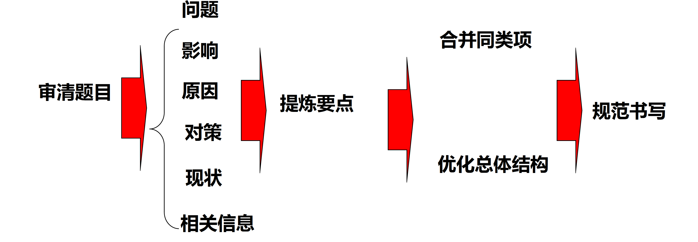
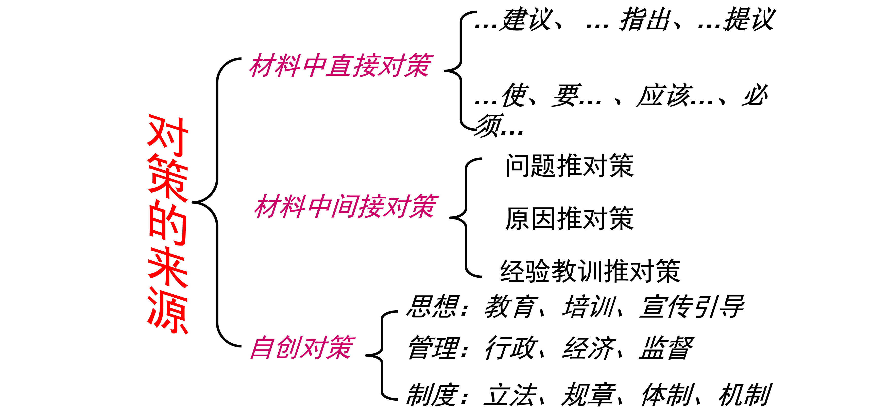

# 01  认识申论

## 一、申而论之

通用释义：“申论”简言之“申而论之”。从字面来理解，“申”为引申、申述，“论”为议论、论证，“申论”则指针对特定话题提出自己观点，并展开论述。是国家公务员考试科目中必考的一门科目。

（一）客观题是否需要把材料中的表述引申为规范词？

> 规范词源自材料。

（二）作文题是否需要引申升华主题

得分概率大的前置，得分概率小的后置。

标题模板：

做好行政执法这篇大文章
——由“力”“理”“利”想到的
答好形成执法这道题
——由“力”“理”“利”想到的
行政执法的“同音字”
——对“力”“理”“利”的思考
谱写为民办事新篇章
——由办好事、好办事、事办好想到的
书写为民办事新答卷
——由办好事、好办事、事办好想到的
为民办事的“三字经”
——对办好事、好办事、事办好的思考

## 二、应试文体

申论是指针对给定材料，按照题干要求，熟练使用指定的语种，运用说明、陈述、议论等方式，准确规范、简明畅达地表述思想观点，对事件、观点进行准确合理的说明、陈述或阐释。

阅读理解能力：要求全面把握给定资料的内容，准确理解给定资料的含义，准确提炼事实所包含的观点，并揭示所反映的本质问题。

阅读理解能力——要求能够理解给定资料的主要内容，把握给定资料各部分之间的关系，对给定资料所涉及的观点、事实作出恰当的解释。

阅读理解能力：
1、读懂题干、领会命题人意图
2、读懂材料、提料判分点

综合分析：要求对给定资料的全部或部分的内容、观点或问题进行分析和归纳，多角度地思考资料内容，作出合理的推断或评价。

贯彻执行能力：要求能够准确理解工作目标和组织意图，遵循依法行政的原则，根据客观实际情况，及时有效的完成任务。

提出和解决问题的能力：要求借助自身的实践经验或生活体验，在对给定资料理解分析的基础上，发现和界定问题，作出评估或者权衡，提出解决问题的方案或者措施.

解决问题能力——要求运用自身已有的知识经验，对具体问题作出正确的分析判断，提出切实可行的措施或办法。

文字表达能力：要求熟练使用指定的语种，运用说明、陈述、议论等方式，准确规范、简明畅达地表述思想观点.

文字表达能力——要求熟练使用指定的语种，对事件、观点进行准确合理的说明、陈述或阐释。

### 申论考察题型

1、归纳概括           10分
2、提出对策           10-20分
3、贯彻执行           20分
4、综合分析           10-20分
5、申发论述           40分

## 申论根本应答原则

### 1.阅卷的基本规则

双人阅卷，踩点给分

一、按点或者按词给分

二、按意思给分

三、按结构给分

> 主要针对公文题。

四、按逻辑关系给分

> 主要针对作文题。

### 2.答题原则

材料为王
政府角度

课程总结：

1、申论的重点在阅读，阅读在于精读，平时务必养成阅读习惯。
2、申论的核心在卷面，卷面要追求简洁明了、重点突出，客观题绝不写废话，作文题绝对不连笔。
3、所有申论方法都在大纲里，对于大纲要求要足够熟悉。
4、申论阅卷标准就在题干里。
5、申论不要追求满分。尽可能用材料里的词，如果材料里没有词可以用, 意思差不多就得分。

# 02  申论应答方法

### 申论根本应答方法

关键环节：

**仔细审题**和**规范书写**。

过度加工要点易导致答案冗长，无关信息不扣分但挤占答题空间。

### 仔细审题

1.题型判断：

申论考试主要分为五大题型——概括题、对策题、综合分析题、应用文写作题和作文题。

当前题型界限逐渐模糊。

2.作答对象：明确题干核心问题。

3.作答范围：

- 若题干指定“根据给定材料一”，则答案范围限定于材料一； 
- 若题干要求“对某句话的理解”但未限定材料，则需结合全部材料分析（但 国考/联考通常答案仍集中于指定材料）。

4.字数与排版：

- 150 字对应 6 行，通常需分 5 条作答（每行 1 条）； 
- 350 字对应 14 行，建议分 7 个得分点（每 2 行 1 点）。

5.特殊要求：

- 对策题可能要求“问题与对策一一对应”； 
- 应用文题需注意“对象明确”“语言生动”等附加条件。 

6.题目逻辑关系：

自主命题省份（如山东、江苏）需关注题目间的关联性，例如作文题可参考前几题题干的核心主题。

> 尽管预判了答案结构，仍需严格依据材料调整答案，避免主观臆断。
>
> 多问题型要点底线：两问或三问题型的要点总数不低于 6 个。

## 选择要点

### 借助行测提升申论采点能力

一、意图推断

二、同义替换

三、高频词、中心词

选择要点的原则
紧扣题目
立足材料
阅读方法

加工要点

1、总分（总）加工法

归纳概括作答思路：总分
提出对策作答思路：总分
综合分析作答思路：总分总
申发论述作答思路：总分总

3、递进式加工法 归纳概括常规型材料的主要内容的要素：
好现象+问题+影响+原因+对策
观点+意义+问题+对策
观点+问题+原因+对策

4、转折式加工法 

（1）归纳概括争议型材料主要内容=好现象+问题+正方观点+ 反方观点+其他（有的情况下）
（2）分析/概括原因：主观、客观
（3）分析/概括影响：积极、消极

二、内容加工
1、同义法：正、反
2、同范围法
时间划分：过去、现在、未来
空间划分：国内、国外
政策范畴：政治、经济、文化、生态、社会（民生、社会管理） 领域划分：商业、医学、科技
3、主体合并法：个人、政府、社会、国家

### 规范书写

（一）卷面（干净、不允许涂改）

清爽干净，少涂少画 

字迹工整，大小一致 

排版合理，布局清晰

（二）语言（规范、简洁、流畅）

凝练、质朴、精辟、生动
符合题目要求，与考官产生共鸣

（三）格式：

规范：符合题目要求，符合题型答题思路
例：归纳概括题：总分形式=总括句十分要点

贯彻执行提：应用文固定格式
综合分析：总分总=总括句+分要点+总括句 
申发论述：总论点+分论点+总结

客观题：每段话第一句空两格书写
主观题：作文标题居中或前空四格
			副标题一在主标题空两格后书写

公文格式
标题+主送机关+正文+落款+日期
标题:居中写；
主送机关:顶格书写；
正文:每一段的第一句话要空两格书写；
发文机关和年月日:二者不是右对齐，而是中间对齐。

# 03  透视申论材料

## 第一节  材料类型

### 一、观点型材料

主要是指对事实做出评判的材料，一般是人物的发言或者一些政策文件以及议论性材料。

阅读的核心要素是：

主体、对象、观点、理由、结论
其中尤其要注意人物的身份、会议的名称、文件的名称

### 二、案例型材料

主要是指讲述事实的材料，里面会夹杂观点，但还是以陈述事实为主。

阅读的核心要素是：
主体、处境、做法、结果、启示

### 三、数据型材料

是一种特殊的案例材料，主要借助数据来表述事实

## 第二节  材料段落逻辑

一、并列关系：段落间明显是并列关系
二、递进关系：成绩、问题、原因、对策
三、因果关系：先因后果
四、转折关系：正反转折
五、总分（总）关系：一般是总分关系

## 第三节  材料阅读

### 一、带着问题阅读

一、勾画直接要点

（一）标注核心词

表示问题的：困境、问题、瓶颈、难题、现状、目前、具体表现、弊端、尴尬、软肋、缺失、不足等。
表示影响的：影响、导致、由此、有利（助）于、推动、造成、实现、意义、价值、作用等
表示原因的：由于、因为、因素、由……引起、由……导致、因为……所以……等
表示对策的：针对……要……、建议、提议、方案、思路、要….、应该、必须、措施、务必、将要，为……将……、加强等
表示观点的：针对...，对于...，应当...，表示...，认为....，说....，称....等

（二）关联词

转折关联词：

① 虽然……但是……
② 尽管……还（还是）……
③ 其实……实际上（事实上）……
④ 然而……固然……
⑤ 但是……
⑥ 但……
⑦ 却……
⑧ 仍然（依旧）……

因果关联词：

① 只要……就……
② 无论……都……
③ 不管……总……
④ 因为……所以……
⑤ 既然……就……
⑥ 之所以……是因为……
⑦ ……因而……

并列关联词：

① 既……又……”
② “不是……而是……”
③ “一边……一边……”
④ “一面……一面……”
⑤ “又……又……”
⑥ “一那么……那么……”
⑦ “是……也是……”
⑧ “一会……一会……”
⑨ “一方面……一方面……”
⑩ 同时

递进关联词：

① 不但……而且……
② 不光（不仅）……还……
③ 不仅……也……
④ 不仅……而且……
⑤ 不但……还……
⑥ 更；不但……；甚至……；加之……

条件关联词：

① 只要……就……
② 无论……都……
③ 不管……总……
④ 只有……才……
⑤ 除非……才……
⑥ 凡是……都……

假设关联词：

① 如果……就……
② 即使……也……
③ 哪怕……也……
④ 就是……还……

（三）勾画核心句

1、首尾句

2、段中句

# 04  题型详解

## 第一节 归纳概括

申论考试要求考生在规定时间内，能够准确、全面、有条理地把材料的**内容要点予以梳理**并书写出来，这就需要考生具备较强的归纳概括能力。能力要求一般是全面、准确、客观、简洁以及条理性、恰当提炼。

在申论考试中，归纳概括能力的重要性不言而喻。因此，提高归纳概括能力，要重点从以下几个方面着手练习：

一是注意把握材料段落之间、段落内部的逻辑关系，善于进行逻辑上的层次划分。
二是掌握归纳概括技巧方法。如何达到归纳概括的基本要求，善于找出**高频、高档、高度概括词**，善于分析**关联词**前后的语句，对**要点词**有敏感性。
三是加强归纳概括实战演练。实践是检验真理的唯一标准，反复练习真题，一道题目**至少做四遍**，善于自我批改。

一、题型判断

1.题干标志性词汇

归纳、概括、概述、总结

2.要求标志性词汇

全面、准确、客观、简洁
有条理（条理清楚、有逻辑）、前挡提炼、分类正确

3.要素（对象）标志性词汇

问题、原因、影响、做法、变化、特征、缺失、优势等。

二、题型特点

三、作答方法

一、审题环节

**审清题干——明确关键词、尤其是作答对象**。

标志性词汇：简述、概括、概述、整理情况反应、述要等等。

二、提炼要点

题目要求 + 材料内容；
相关要点（关键词和对象）。

加工要点

合并同类项

- 主体合并与内容合并（同意法和同范围法）；
- 重点掌握合并高频同近义词。

优化总体结构

​	并列、递进、转折

规范书写

## 第二节  提出对策

一、题型判断：

（一）题干：思路、解决方案、如何、怎么做、对策、建议、锦囊妙计等
（二）要求：针对性、可行性、操作性、具体可行

 二、题型分类：

（一）常规型
（二）特殊型

（一）抓准作答对象

（二）明确作答身份和情景

1、公务员的身份：无身份限定、公务员、某类公务员
2、非公务员：乡村支教人员、普查员、高校学术委员会负责人
（权利范围）

（三）明确作答要求

1、可行性
• 政治可行性（不越权、不违法、不反动）
• 技术可行性
• 经济可行性
• 伦理可行性（主流道德、公序良俗）

2、操作性=具体可行、先后有序
（1）考虑要点的时间顺序=事先、事中、事后

（2）主体+客体+内容+手段+目的

3、针对性

针对材料
针对题目要求
针对身份

 直接对策

问题推对策

由原因推对策

由成功经验推

逻辑调整
思想、监管、制度、利益 

按照对策实施的前后顺序进行排列。

要点之间如果没有逻辑关系按以下顺序调整：直 接对策，间接对策，自创对策。

对策题的三个变形：

1、直接考察概括题

2、考察启示题

3、考察应用文题

## 第四节  应用文写作

一、题型判断：

（一） 题干：归纳整理、提纲、写成一份材料、写一篇报道、短评等，呈送领导参考。
（二）要求：层次分明、对象明确、切合主题、符合实际、语言得体、有逻辑性等。

贯彻执行能力：要求能够准确理解工作目标和组织意图，遵循依法行政的原则，根据客观实际情况，及时有效的完成任务。

一、审清题目：
1、文种
2、主题
3、工作目标与组织意图
4、身份
5、对象

一、直接给出写作结构

二、间接给出写作结构

三、没有给出写作结构

格式
凡题目未明确要求不必写成规范格式的，就一 定要写成规范格式。
什么情况下不必写成规范格式：
作答要求中出现一下几类词语时：
1.列一个《\*\*\*\*》的内容要点；
2.列一个《\*\*\*》的提纲；
3.请提纲挈领的写出《\*\*\*\*》的
4.不必写成文章/不必考虑行文格式要点

• 标题写法：
• 1、发文机关+关于+内容+文种
• 例：团中央关于向沈浩同志学习的通知
• 2、关于+内容+文种
• 3、文种
• 4、题干标题

二、选择要点
• 围绕主题选择要点——实质是概括材料主要内容

## 第五节  申发论述

高分标准

**卷面干净**不连笔
**立意准确**不跑题
**要点清晰**不短缺

搭建框架找要点（重点，核心，根本）

- 总论点

- 分论点

  > 总论点与分论点的逻辑构建是基础；
  >
  > 得分关键仍在于材料要点的精准提取。
  >
  > - 注重要点间的逻辑关系（并列、递进等） 
  > - 必须结合材料主题

内容填充，扩充框架（次要）

> 优先掌握应试套路（如段落逻辑分层、中心句定 位、高频词识别等）
>
> 

展开思考需多角度分析问题

写作依据：严格遵循题干与材料

结合材料定义：引用材料话题（如制造业）

递进关系可通过字数分配体现：

- 分论点字数逐段增加（如第一段200字，第二段250字）。 
- 重要论点篇幅更长（如“长远之势”写两段，“眼前之形”写一段）。 

- 材料结合是区分原创与模板的关键。

模板化写作需预留空间嵌入材料话题与案例，材料占比需自然且可识别。

标题应简洁直白

改写材料关键要素（如人名、地名）但保留事件逻辑，避免显性抄袭痕迹。

### 一、题型判断

### 二、评分标准

| 档次项目 | 内容                                                         | 语言                                                         | 结构                                       | 卷面                                                         | 分数     |
| :------: | ------------------------------------------------------------ | ------------------------------------------------------------ | ------------------------------------------ | ------------------------------------------------------------ | -------- |
|  一类文  | 观点鲜明准确，见解新颖独到、思想深刻，逻辑严谨，充分联系实际和给定资料，论述详实，分析详细，对策合理且具有较强的可行性，字数符合题目要求。 | 语言简洁、流畅、得体、规范、生动，运用多种表达方式且运用恰当，无语病。 | 结构完整，条理清晰，详略得当。             | 书写规范、工整，格式标准，无错别字，标点正确，卷面整洁、美观。 | 31—40分  |
|  二类文  | 观点明确、合理，见解比较深刻，符合内在逻辑，能够联系实际和给定资料，论述分析有理有据，对策合理，字数符合题目要求。 | 语言通畅，运用两种以上表达方式且运用得当，语病较少。         | 结构完整，条理清楚。                       | 书写规范、工整，格式正确，基本无错别字和标点错误，卷面干净整洁。 | 21—30分  |
|  三类文  | 有观点且观点正确，未偏离给定资料主题，有分析，有对策，字数与题目要求相差不超过5%。 | 语言欠通顺，表达方式运用单一但得当，有明显语病且较多。       | 文章有题目、有开头、有结尾。               | 书写可以辨认，文面错误较少。                                 | 11—20分  |
|  四类文  | 脱离材料另起炉灶，难以找到文章观点，有观点但无解释分析，背诵事先预备的范文，大量摘抄原文，字数与题目要求相差超过5%。(凡符合其中任意一项者，均在本等级记分) | 语句基本不通，不知所云。                                     | 缺少题目或结尾，结构混乱，不分段落或标点。 | 字迹潦草、难以辨认，卷面修改、涂抹较严重。                   | 10分以下 |

材料结合方法：

-  **引用材料话题**，而非直接复制具体事例。 
- **案例改编示例**：将原文中的“S省”改为“江苏省”，保留事件描述。 

阅卷标准解读：

（一）立意

立意准确 = 中心思想 = 总论点（对全文的一句话概括）

立意 = 题干要求 + 材料主题

> 题干指令优先级高于材料主题，以**题干**为根本依据，材料主题仅作背景参考；
>
> 背景化处理：材料主题可转化为论证背景，但总论点需严格对应题干关键词。
>
> 以题干要求为核心，结合和参考材料主题。

（二）标题

准确传达立意：标题是立意的简化

语言力求简洁

（三）结构（从题干得来）

结构完整：

- 总分总
- 层层递进

清晰了然：重点突出、便于阅卷人快速获得信息

（四）论点

1、总论点 = 标题 = 立意。

2、分论点 = 分段段首句，总括该段大意。

- 分论点要牢牢围绕总论点展开，是对总论点的阐述。
- 分论点要取自于给定材料，保证客观准确。

（五）内容

短——开头结尾要简短有力，段首句要言简意赅

> 开门见山、引出观点

实——分论点论证要充实

> 分段在 7-9 行之间，200字左右

新——举例要新

> 案例结合材料

（六）语言

善用修辞，重点在排比、比喻。

善用符号，主题词可以加引号强调，关键词后加破折号解释，或者增加数据材料。

> 例：年轻干部应该成为基层党建的排头兵，领民致富的带头人，政策下乡的宣传员。
> 年轻干部应该成为基层党建的〃排头兵〃；领民致富的“带头人〃；政策下乡的“宣传员〃。
>
> 准备几个亮点语句，让其在开头结尾恰当出现

（七）卷面

## 二、作答方法

（一）作答流程

### 1、确定立意

（1）立意的定义 = 中心思想 = 总论点；

（2）立意的标准：正确（题干 + 材料）、明确（标题、开头、结尾）；

（3）选择立意的方法。 

> 题干要求重要，材料作为背景和辅助
>
> 那种情况要以材料为主体：题干要求没有要求，只划定了材料。

- A.题目关键词

  - 命题方式
    - a.命题式作文——规定标题：理解标题中的核心内容；
    
      > “给定资料6”中的题字“岁月失语，惟石能言”能触发人们许多思考和感悟，请参考“给定资料”，以“岁月失语，惟石能言”为题，写一篇文章。
    
    - b.结合对材料中的某句话——理解这句话的核心内容；
    
      > “给定资料4”中提到：“从某种意义上说，好的政策不仅仅是对公民意愿的满足，更是对公民理性乃至德性的滋养。”请你从对这句话引发的思考说开去，写一篇文章。（40分）
      >
      > “给定资料7”的画线部分写道：“有位知识分子说，‘我已经无家可归’‘我在城市是寓公，在家乡成了异客’。这样，无论在乡村少年身上，还是在农民工那里，以及这些出身农村的知识分子的群落里，我们都发现了‘失根’的危机。”请结合你对这段话的思考，参考“给定资料”，自拟题目，写一篇文章。（40分）
      >
      > > 破解失根危机，建设精神家园。
    
    - c.围绕……/以……为主题——文章的主题；
    
      > 结合给定资料，围绕“当前新型城镇化的核心”写一篇文章。(40分)
    
    - d.结合给定材料的内容，自拟题目，自选角度一材料的主旨和精神；
    
      > 胡锦涛总书记到河南、安徽考察，引发我们许多思考。请联系“给定资料”，整理自己的思考，自拟题目，写一篇文章。（40分）
      >
      > 请你深入思考“给定资料5”中这位学者文章的有关内容，参考给定资料，联系实际，自选角度，自拟题目，写一篇文章。
    
    - e.半命题作文：补充标题；
    
      > 请以“让……大放异彩”为题，写一篇内容充实的文章
      >
      > 要求：用恰当的文字替换“让……大放异彩”中的省略号部分，使之构成一个完整具体的文章标题。
    
    - f.以故事为话题。
    
      > “给定资料7”中讲述了农妇刘女士和李老太太家人之间发生的一段感人故事，请你以这个故事为话题，自拟题目，写一篇文章。（40分）

- B.材料总体逻辑

  - 回归客观题

  - 材料高档词汇

  - 材料逻辑

    > “给定资料7”中讲述了农妇刘女士和李老太太家人之间发生的一段感人故事，请你以这个故事为话题，自拟题目，写一篇文章。（40分）
    >
    > 要求：
    >
    > （1）结合“给定资料”，并注意联系当前社会实际和自身体会；
    > （2）观点明确，内容充实，层次清楚，语言流畅；
    > （3）总字数800～1000字。
    >
    > > 社会实际和自身体会：指联系材料。
    > >
    > > 立意：学好人、办好事、有好报，发挥榜样作用，建设美德中国
    > >
    > > 标题：
    > > 学好人 办好事 得好报
    > >
    > > 副标题：
    > > 由刘女士和李老太故事想到的
    > > 或者：
    > > 发挥榜样作用，建设美德中国
    >
    > 类似题：逻辑和结构类似
    >
    > 请你对“给定资料5”中提到的“为群众**办好事**”“让群众感到好办事”“把群众的**事办好**”进行深入系统的思考，联系实际，自拟题目，写一篇文章。（35分）
    >
    > 
    >
    > “给定资料5”中提到：“投入自己的领域，不断‘打磨’、不断‘修补’，为人们温暖笃定的生活秩序默默付出，稳步前行。”请根据对这句话的理解，参考给定资料，联系实际，自选角度，自拟题目，写一篇文章。（35分）
    >
    > 标题中重要的是需要体现题目中的关键词
    >
    > 投入自身领域，不断提升自己
    >
    > —— 为生活奉献实干
    >
    > 立意：投入自身领域 承担共同责任
    > 或者：自身尽责 相互负责
    > 或者：人人为我 我为人人
    >
    > ——论尽责的意义与做法
    >
    > 副标题怎样拟：
    >
    > 

### 2.结构布局

a、以对策为主

文章主要分论点是围绕总论点谈对策，

> P1：引出总论点
> P2：谈现状问题，或者分析意义
> P3：对策一
> P4：对策二
> P5：对策三
> P6：结语
>
> > 1、请结合对全部“给定资料”的理解与思考，围绕“资源型城市”的转型发展问题，以《谈“发展”》为题，写一篇文章。(40分)
> > 要求：观点鲜明，内容充实，结构完整，语言流畅，900字左右。
> >
> > 2、请结合你对“给定资料7”中划线句子“是故事者生于虑，成于务，失于傲”的理解，参考“给定资料”，联系实际，自拟题目，写一篇文章。（40分）
> > 要求：观点明确，内容充实；思路清晰，语言流畅；参考给定资料，但不拘泥于给定资料；字数1000-1200字。

b、以分析为主

文章以分析总论点的原因或者意义为主，

> P1：引出总论点
> P2：影响一（原因一）
> P3：影响二
> P4：影响三
> P5：现状问题（可有可无）
> P6：对策
> P7：结尾
>
> > 1、航班延误造成旅客、航空、机场等多方“委屈”的现象，请结合对全部给定资料的理解与思考以《“委屈”的背后》为题，自选角度，写一篇文章。(40分)
> > 要求：(1)观点明确，联系实际;(2)内容充实，论述深刻;(3)结构完整，语言流畅;(4)1000~1200字。。
> >
> > 2、“给定资料4”中提到：“从某种意义上说，好的政策不仅仅是对公民意愿的满足，更是对公民理性乃至德性的滋养。”请你从对这句话引发的思考说开去，写一篇文章。（40分）
> > 要求：（1） 自选角度，自拟题目，见解明确、深刻；（2） 思路明晰，语言流畅；（3） 参考“给定资料”，但不拘泥于“给定资料”；（4） 总字数800——1000字。

c、综合式

分析和对策兼而有之，各一半，主要针对题干无要求且材料中意义、对策比重相当时，

> P1：引出总论点
> P2：分析一
> P3：分析二（分析问题或意义引出对策，起过度作用）
> P4：对策一
> P5：对策二
> P6：对策三
> P7：结尾
> 或者分析多、对策少

d、A、B 关系型
以“敬业与乐业”为题时，写两者关系，既立意是两个关键词

> P1：引出总论点（总关系）
> P2：解释A和B含义
> P3：分析相互关系
> P4：对策一
> P5：对策二
> P6：结尾
>
> > 1、参考给定资料，围绕“海洋的保护与开发”，自选角度，自拟题目，写一篇文章。（40分）
> > 要求：（1）思想深刻，观点明确；（2）内容充实，结构完整，语言畅达；（3）总字数900~1100字。
> >
> > 2、请结合对全部给定资料的理解和思考，以“‘红线’与‘红利’”为题，写一篇文章。（40分）
> > 要求：（1）观点明确，联系实际；（2）内容充实，论述深刻；（3）结构完整，语言流畅；（4）总字数1000~1200字
> >
> > 3、“给定资料4”中提到“把握好这少和多，是对管理者的重大考验”。请深入思考这句话，参考给定资料，联系实际，自选角度，自拟题目，写一篇文章。（40分）
> > 要求：（1）观点明确，见解深刻；（2）参考给定资料，但不拘泥于给定资料；（3）思路清晰，语言流畅；（4）总字数1000字左右。

e、层层递进式

> 具体写作为：
>
> 第一自然段：点出观点
> 第二自然段：从是什么层面阐释中心观点
> 第三自然段：从为什么层面阐释中心观点
> 第四自然段：提出具体的对策
> 第五自然地：进行总结

e、驳论文
题干明确要求反驳某种观点时

> d、驳论
> P1：错误观点
> P2：立论
> P3：对策一
> P4：对策二
> P5：对策三
> P6：结尾

### 3.标题

A、基本要求

1.形式要求：以简洁凝练为美；
2.内容要求：观点明确 = 主题词 + 观点

B、具体写法

1.单标题

做好……这篇大文章
谱写……新篇章
下好……这盘棋
让……大放异彩
按下……的快捷键
让……蔚然成风
……永远在路上

2、对仗式

主题词+意义
对策+主题词
加强环境整治建设美丽中国
坚持多措并举推进环境整治 

3、主副标题

主标题：核心得分点；抽象名词（有寓意）
副标题：体现总论点或分论点

> 顺民意滋理性养德行
> —论好政策的三重意义
>
> 做好追寻长期价值这篇大文章
> —四方携手齐心协力谱新篇

4、开头

A、基本要求

a、形式上：

短：150字左右，控制在200字以内
快：切题要快（快速的亮明文章的观点）
美：语言表述上要有亮点

b、内容上：

逻辑要严谨：主要指文章观点的得出要自然
避免大篇幅抄袭材料

B、具体写法：

a、归纳概括式 = 概括问题/影响/案例+ （分析）+观点

> 随着市场经济的进一步深入，资源型城市面临着诸多问题，表现在：矿
> 产资源掠夺式开发，发展后劲严重不足；经济发展粗放式运行，城市转型举
> 步维艰；高污高排项目众多，生态环境不容乐观；社会问题井喷式爆发，民
> 生问题亟待解决。为此，必须把转方式调结构作为加快科学发展的主攻方向，
> 着力推进资源型城市转型，实现区域经济跨越发展。
>
> 保障教育公平，有利于每位群众享受到高质量的教育资源，有利于改变
> 贫困地区和农村地区人才缺乏的问题，有利于推动社会公平的发展。可以说，
> 没有教育公平，就没有中国可持续发展的后劲，更没有创新型国家发展的基
> 础。因此，教育公平必须受到重视。
>
> 主体排比式（三个句子，分析主题对不同主体的意义）——个人；社
> 会；国家；企业；政府
> 一个人如果缺失了基本的道德素养，那么就会丧失立身之本；一个社
> 会如果缺失了基本的道德风气，那么就会迷失发展之路；一个国家如果缺失
> 了基本的道德建设，那么就会撼动立国之本。可见，道德建设是立身、立国
> 之根本。

b、设问式

围绕主题设置问题+不是（不仅是）……+不是（不仅是）……而是（更是） +提出观点

> 学术和科研的出发点是什么?不是为了评职称或做宣传，获得眼前微薄的
> 利益；也不是为了研发出大量的理论性成果展示能力；最重要的是让这些成
> 果能够实实在在的服务于社会、服务于百姓。因此，学术科研必须深入基层，
> 了解群众的困难、市场的需求，才能接地气、有灵气。

c.转折递进式：

好的方面（主题的意义或好的背景）+然而+引出问题+ 分析问题的具体表现+提出总论点

> 农村是国家发展的重要阵地，基层干部更是新农村建设的排头兵、领头
> 雁。然而现实中，不少基层干部却染上了“作风病”，小官巨腐、走读干部、
> 奢侈浪费等现象频发，如何才能营造风清气正的社会环境呢？需要找准干部
> 角色定位，干劲干部作风。

d、引言式 = 引用名言+ （解释名言）+概括主题的问题+分析+提出观点

“知政失者在草野，知经误者在诸子“。科研和学术的成果需要经得起基 层群众和市场的检验。但是，当前我国的学术科研严重脱离实践，停留在理 论阶段，难以产生实际的效益。因此，要实现科研学术的华丽转身，需要研 究者深入基层，让.....

> “知政失者在草野，知经误者在诸子”。科研和学术的成果需要经得起基
> 层群众和市场的检验。但是，当前我国的学术科研严重脱离实践，停留在理
> 论阶段，难以产生实际的效益。因此，要实现科研学术的华丽转身，需要研
> 究者深入基层，让…………。

比较万能的五种引言：

1、大道至简
2、苟日新
3、民之所望，政之所向
4、理一分殊
5、兴一利必生一弊
6、价值观类

5、分论点

A、要求

1、分论点的逻辑是并列或递进的；
2、分论点的内容不能假大空；
3、分论点的形式要句式要尽量对称、简洁明了。

B、分论点的提炼

1、题干中给出完整分论点；
2、题干中给出思路，需要结合材料得出分论点；
3、题干中没有任何线索，完全立足材料得出分论点。

C、分论点本身的写法

（1）总论点引导分论点，实现形式的工整

> 分论点：
> 总：实施人才强国战略 打赢全球智力战争
> 分：
> 分析：实施人才强国战略有利于培养人才。
> 实施人才强国战略有利于激励人才。
> 实施人才强国战略有利于延揽人才。
> 对策：实施人才强国战略，打赢全球智力战争，需要有完善的人才选拔制度
> 实施人才强国战略，打赢全球智力战争，需要有健全的人才培养制度
> 实施人才强国战略，打赢全球智力战争，需要有有效的人才激励制度

（2）每一分论点的表述使用关键词，体现分论点之间的逻辑关系和分论点的作用

> 总：实施人才强国战略 打赢全球智力战争
> 分：
> 完善的人才选拔制度是实施人才强国战略的基础
> 健全的人才培养制度是实施人才强国战略的保障
> 有效的人才激励制度是实施人才强国战略的关键

两个字：手段、目的、前提、基础、抓手、根本、关键、保障
三个字：稳定剂、驱动力、新引擎、着力点、突破口
四个字：重要保证、基本前提、必要途径、如虎添翼、灵丹妙药、主攻方向、关键环节、根本
出路、有力保障、战略重点

（3）使用比喻的修辞手法

> 总：实施人才强国战略 打赢全球智力战争
> 分：
> 用完善的人才选拔制度为实施人才强国战略打开”一扇门“
> 用健全的人才培养制度为实施人才强国战略撑起”一把伞“
> 用有效的人才激励制度为实施人才强国战略编织”一张网“

牵引器、稳定器、助推器、保鲜器

（4）尽可能对仗，重点前置

> 扎根基层需要树立远大志向
> 扎根基层需要艰苦奋斗、脚踏实地
> 扎根基层需要全心全意为人民服务
> 建议优化为：
> 立志——树立远大志向是扎根基层的“基石”
> 奋斗——脚踏实地、艰苦拼搏是扎根基层的“动力”
> 为民——全心全意服务群众是扎根基层的“归宿”

D、分论点扩充：

a、一般扩充 是什么（解释分论点核心词+现状）、为什么（重要性）、怎么办（对策）

> 践行敬业精神需要勤学苦练。所谓勤学，就是勤于学习工作所需各种知识；所谓苦练，
> 就是将所学所得用于工作实践中。“吾生也有涯，而知也无涯”，这说明任何时候都不能放弃
> 学习。尤其是在知识飞速更新的今天，如果不能与时俱进地更新知识，就很难适应新的工作内
> 容与工作情况；同样的，“纸上得来终觉浅，绝知此事要躬行”，光说不练依然是假把式，纸
> 上谈兵，空谈空想只能变为绣花枕头。多思、多想、多做，不负工作也不负自己。我们不能光
> 说不练、不能光学不做，我们要勤于读书、勤于学习、勤于利用网络新平台，更新知识，跟上
> 发展，并把学到的知识应用于工作中，不断完善工作方式，创新工作方法。敬业要求我们把勤
> 学苦练当作工作的主要方式。
>
> A需要B。所谓A需要B就是要认识到做好B是实现A的强劲动力、源头活水，这是被实践反复证明的，比如……，古人云：问渠那得清如许，为有源头活水来。如果把A比作一条河流，A的源头活水有很多，其中B就是其中最重要的一个。如果A脱离B，将犹如无源之水，无本之木。A不但不能奔腾不息，还会反其道而行之。因此，求木之长者必固其根本，欲流之远者必浚其泉源。为发挥B对于A的源头作用要做好两个“深入”，深入实施开源工程，思想高度重视B，行动上切入落实B；深入开展疏浚引流工程，打通B工作中的堵点、痛点、难点，发挥B工作的传导作用，将B的成效传导到A的进程中。只有做好这两方面的工作，才能让A始终牢牢把握时代的脉搏，让A成果来源于B，又服务于B。

b、例证法：摆事实讲道理，扩充分论点 典型案例扩充分论点
以往的典型事迹
自创数据

一个例子=主体+处境+做法+结果
两个例子正反对比
三个例子形成排比句：假如……，就不会……

c.引证法 

1、分论点
2、引用名言、政策、原理
3、概括材料中相关现象
4、用名言、政策、原理分析现象
5、提对策，升华主题

> 原理：
> 蝴蝶效应——初始的微小的破坏力，如果没有得到及时的制止，就会产生更严重的后果。
> 蒲公英效应——每一颗微小的种子；都能够随风飘扬，所到之处落地生根，由一株盆景发
> 展成一片引人入胜的风景。道德榜样的力量
> 青蛙效应——一只青蛙放在温水中煮，随着温度的慢慢增加，青蛙在高温中渐渐被煮死。
> 告诉我们要有忧患意识。——坚持学习、刻苦钻研
> 木桶法则——木桶中最短的那块木板决定了水的容量，所以做事情要先补短板。
>
> a需要b，或者b有助于a的扩充方法。 a需要b。如果把a看成一个系统工程，那么b就是撬动这个系统工程的 杠杆和支点，换言之，b对于a具有强大的“撬动效应”，在b工作上的精准 发力可以“撬动”a取得更大的成效。所以今后要切实发挥b的“撬动效 应”，在“撬”字上狠下功夫，找准支点，压实杠杆，持续用力，统筹推进
> b这一a工作的重要支点和关键环节取得重大突破，不断放大b对a的牵引作 用。

## 三、解题关键

（一）立意与标题

1.选择立意的标准

2.选择立意的方法

（三）标题命制

1.基本要求

2.常规写法

3.优化写法

（二）思路与结构

1.常规型

2.关系型

3.综合性型

（四）开篇点题 

1.归纳概括式

2.设问式 

3.引言式 

（五）分论点提炼

1.要求

2.分论点提炼

3.分论点书写

（六）主体论证 

1.引证法 

2.例证法 

3.理证法

（七）结尾升华 

1.要求 

2.写作方法

# 05  真题解析