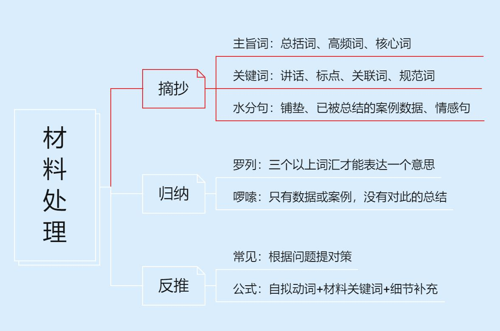

[toc]

# 第一章  申论基础

$$
\huge \text{申论基础}\begin{cases} 
\text{申论试卷} \text{ —— 给我题干，给我材料} \\
\text{申论题型} \text{ —— 单一，综合，公文，作文} \\
\text{做题步骤} \begin{cases} 
\text{审题（范围、题型、要求）} \\
\text{勾画（定大框架，找小要点）} \\
\text{组织（格子纸里，规范书写）}
\end{cases}
\end{cases}
$$

## 〇、考试大纲

申论试卷由“注意事项”“给定资料”“作答要求”三部分组成。

“注意事项”是对申论试卷作答提出的重要指导性建议，包括试卷构成、作答时间、作答时需要特别注意的事项等。考试时，报考者应仔细阅读“注意事项”，遵守相关要求，合理把握作答时间，正确填写填涂姓名、准考证号等信息，使用现代汉语在答题卡上正确的位置作答。

“给定资料”是需要报考者阅读的有关材料，是完成“作答要求”的基础。“给定资料”所反映的是经济社会发展中的某些事例，对经济、政治、文化、社会、生态等方面都有可能涉及。“作答要求”是报考者在阅读“给定资料”的基础上需要完成的若干任务。作答时要一格一字，不得超出每道题目的作答字数限制。

申论试卷按照中央机关及其省级直属机构综合管理类、市（地）级及以下直属机构综合管理类和行政执法类三类职位，分别命制试题。 

（一）中央机关及其省级直属机构综合管理类职位。主要测查报考者的阅读理解能力、综合分析能力、提出和解决问题能力、文字表达能力。

**阅读理解能力**——全面把握给定资料的相关内容，准确理解给定资料的含义，准确提炼事实所包含的观点，并揭示所反映的本质问题。

**综合分析能力**——对给定资料的全部或部分的内容、观点或问题进行分析和归纳，多角度地思考资料内容，作出合理的推断或评价。

**提出和解决问题能力**——准确理解把握给定资料所反映的问题，提出解决问题的措施或办法。 

**文字表达能力**——熟练使用指定的语种，运用说明、陈述、议论等方式，准确规范、简明畅达地表述思想观点。

（二）市（地）级及以下直属机构综合管理类职位。主要测查报考者的阅读理解能力、贯彻执行能力、解决问题能力和文字表达能力。

**阅读理解能力**——能够理解给定资料的主要内容，把握给定资料各部分之间的关系，对给定资料所涉及的观点、事实作出恰当的解释。

**贯彻执行能力**——能够准确理解工作目标和组织意图，遵循依法行政的原则，根据客观实际情况，及时有效地完成任务。

**解决问题能力**——对给定资料所反映的问题进行分析，并提出解决的措施或办法。 

**文字表达能力**——熟练使用指定的语种，对事件、观点进行准确合理的说明、陈述或阐释。

（三）行政执法类职位。主要测查报考者的阅读理解能力、依法办事能力、公共服务能力和文字表达能力。

**阅读理解能力**——准确理解归纳给定资料的主要内容，对所涉及的观点和事实进行恰当的解释，并作出合理的推断。

**依法办事能力**——遵循依法行政的原则，综合运用恰当有效的方法完成任务、解决问题、实现目标。

**公共服务能力**——能够全面准确了解公众需求和愿望，灵活运用各种措施和办法为公众提供优质、高效、便捷的服务。

**文字表达能力**——熟练使用指定的语种，对事件、观点进行准确合理的说明、陈述或阐释。

## 一、申论基本题型

$\large {\text{申论四大题型} \begin{cases} 
\text{单一题} \\
\text{综合题} \\
\text{公文题} \\
\text{作文题}
\end{cases}}$

## 二、申论答题步骤

### 步骤1：全面审题

1.审题干；

2.审要求。

### 步骤2：勾画材料

#### （一）梳理资料逻辑（定大框架）

#### （二）确定具体要点（找小要点）

1.直接摘抄

（1）什么叫做直接摘抄？

原文怎么说，我们怎么写   

（2）抄什么样的词？

符合题干，表达规范（就是看起来高大上，很简短）

2.概括归纳

（1）什么叫做概括归纳？把啰嗦的内容简洁表达，把模糊的内容清晰表达。
（2）怎么概括归纳？事例型资料、数据型资料。

- 事例型资料——需要积累；
- 数据型资料——概括为“多少、大小、高低、快慢、增减、比重”等。

3.分析推导：要找的东西找不到

> 1.摘抄：
>
> （1）总括词：一般出现在段首、段尾处，做题需要优先关注，属于主要关键词。
> （2）高频词：反复出现的词。
> （3）核心词：附近一般有指示代词提示，如“这、都、其本质、其核心、根本上”等。
>
> 2.关键词：围绕核心词的小词，如有人讲话（专家领导）、标点符号（双引号）、关联词（转折后）、规范词（表述规范）。
>
> 3.水分句：材料提取关键信息之后，其余内容是无用信息。
>
> ① 情感句：此处没有得分要点，需要注意。
> ② 已被总结的案例数据：我国经济稳定，国家GDP增加……，国内生产总值、对外出口量……，此表述为证明经济稳定，注意数据不要体现在单一题之中，并非重点。
> ③ 答疑：此处不是缩句，而是提炼材料的关键内容。
> ④ 铺垫：背景。
>
> 4.归纳：啰嗦内容简单写，不明确/模糊内容明确写。

### 步骤3：答案组织

> 关于序号、符号占格：
>
> 

# 第二章  单一题

**高分秘诀：顺着材料的逻辑抄**

1.不要交叉——根据材料定框架；
2.要点全面——穷尽材料关键词；
3.写成总分——单一题不要强求；
4.字迹清晰——清晰即可不求美。

**单一题得分关键**

1.逻辑：按照材料顺序//

（前置词=中心主旨：高频词、核心词、总括词）

2.要点

（要点=关键词（摘抄+归纳+反推）：规范摘抄；啰唆归纳；没有就反推）

> 申论重要的是“客观”。
>
> 注意前置词的位置不重要，但前置词（关键点）需要体现在答案之中。

**逻辑：转换话题**

**前置词：摘抄+归纳**

（总括词、高频词、核心词）

**单一题什么时候必写前置词**

1.题干问“哪些方面”“哪些角度”等

2.要求“观点明确”

3.答案给了答题框架，如在XX上……

## 一、对策

1 . 常见问法

表示对策的常见词汇：对策、措施、举措、建议、意见、做法、解决方法、经验、启示等。

2 .考查题型及答题技巧

（ 1） 概括措施类。

① 题型识别。

概括措施——围绕“主题”的已有的做法（客观还原）；
直接摘抄：材料中出现**对策标志性动词**时，该处往往有得分点；
常见的动词有：建立、健全、统筹、创新、规范、整顿、打击、扶持、规划、设置等。

② 答题技巧。

（2）经验启示类。

① 题型识别。

② 答题技巧。

从其他主体（如其他地区、国家、企业等）的成功经验中借鉴。
通常而言，借鉴而来的经验要具有普遍适用性，即“普适性”原则。
普适性程度需要结合题干表述确定。
阅卷以**对策为主、意义为辅**，没有意义不能证明经验。

3）提出对策类。

① 题型识别。

② 答题技巧。

A.直接摘抄或归纳概括。
B.借鉴他人的做法。
C.通过问题反推。解决资料中的现有问题，提出对策基本要求为：
具有针对性；具有可行性/可操作性；建议合理等。

> $$
> \large \text{提对策}  \begin{cases}     \text{得分重点}     \begin{cases}         \text{公式：自拟动词+材料关键词} \\         \text{注意：材料关键词准、具体}     \end{cases} \\     \\    \text{补充内容}     \begin{cases}         \text{宣传教育引导}         \begin{cases}             \text{适用范围：思想、风气、观念} \\             \text{具体对策}             \begin{cases}                 \text{宣传：入户讲解、发放传单等} \\                 \text{教育：培训、讲堂、家风家训} \\                 \text{引导：赏罚制度（激励）、比赛、评选}             \end{cases}         \end{cases} \\        \\        \text{资金、技术、人才}         \begin{cases}             \text{适用范围：某地区或者行业发展滞后} \\             \text{具体对策}             \begin{cases}                 \text{资金：金融贷款、融资渠道、财政投入} \\                 \text{技术：平台、氛围、产学研用一体化} \\                 \text{政策：减费降税、保障政策}             \end{cases}         \end{cases} \\        \\        \text{法律、政策、机制}         \begin{cases}             \text{适用范围：体制机制不完善} \\             \text{具体对策}             \begin{cases}                 \text{完善（ ）方面机制、政策、法规} \\                 \text{创新机制，探索路径、学习其他地区或行业}             \end{cases}         \end{cases} \\        \\        \text{监督、落实、管理}         \begin{cases}             \text{适用范围：管理混乱、推诿扯皮、监督真空} \\             \text{具体对策}             \begin{cases}                 \text{明确权责、明确各主体具体任务、责任到人} \\                 \text{统筹协调、加强合作、沟通协调} \\                 \text{加强监督：自律、举报热线}             \end{cases}         \end{cases}     \end{cases}  \end{cases}
> $$
>
> 
>
> 一、提问问题并提出对策（要求问题全面）
>
> 问题 1+对策 1           问题：123
>问题 2+对策 2           对策：123
> 
> 二、提问请提出对策/建议
>
> 对策 123
>即可解决xx问题
> 
> > 针对问题提出对策：优先书写对策，若一道题目400字，书写完对策只有370 字，剩余字数需要补充问题

## 二、影响

影响大致可以分成正面影响和负面影响两类。在近几年的申论考试中，影响类题目出现频次更多的为正面影响。

1.常见问法

（1）正面影响的常见问法：意义、效果、成果、积极作用等；

（2）负面影响的常见问法：危害、后果等；

（3）在近几年的申论考试中，影响类题目出现频次更多的为“意义”。

2.答题技巧

（1）影响是由主题带来的改变，寻找要点时要以主题为参照系，时刻关注主题之后的要点信息。“影响”这一要素的信息表达形式是
灵活的，因此在阅读资料时，不要只关注结果性的表达。

（2）正面影响。

① 直接摘抄：了、着，使、让、能、于；

> 如激发、促进、实现、提升、倒逼……；有利于、有助于、感动着、推动了、巩固了……

② 通过问题进行推导：资料中想通过某项举措去解决问题，或者问题已经被措施解决了，可以将问题推导为意义；
③ 通过目的进行推导：资料中出现表示目的或目标的信息时，可推导为意义。

（3）负面影响。

一些标志性词汇构成的词组往往是影响的得分词。常见的表负面影响的词汇：

引发、导致、造成、危及、损害；消解着、割裂着、破坏了、阻碍了、致使；等等。

3.意义的来源

（1）直接摘抄；
（2）解决问题（材料里只有问题没有意义）；
（3）实现目的（材料里只有目的没有意义）；
（4）对策分不清时写上。

4.对策分不清要写上

> 例子：请指出你父母对你的意义。
> A，我父母让我有了一份好工作
> B，我父母供我上大学，让我有能力找一份好工作

## 三、原因

1.常见问法

表示原因的常见词汇：原因、动因、成因、理由、依据、根源等。

2.答题技巧

原因，简单理解，就是引发“主题”的条件。严格意义上说，原因并非一种独立的要素，其构成也并不“固定”。答题时要依据因果关系来判断具体要点。

（1）当主题为正面事物时，它的原因通常指向反映积极感情色彩的要点，可能会包括意义、优势、对策等。

（2）当主题为负面事物时，它的原因通常指向反映消极感情色彩的要点，一般在资料中以问题的形式呈现。

（3）寻找表示因果的标志性词汇：因为、根源在于、究其原因、背后、来自、这就有了；与……有关、……带来、……使得、……将会、……源自、……的根本、如果……就……、随着等。

# 第三章  综合题

## 一、词句解释题

词句解释题即针对一个或多个词汇、短语或句子进行理解和分析的题目。在近几年的申论考试中，主要以考查句子解释题为主。

1.题型判断

谈……的 含义；对……进行解释；谈对……的理解。

2.常规思路

（1）总体释义。

结合资料和题目给定词语或句子的字面意思去解释。

（2）展开解释。

依据题干和资料确定所需展开解释的要素，如问题、意义、危害等。

（3）总结。

一般为对策，资料中有则摘抄；资料中没有，字数允许则补充。

3.答题技巧

要关注题干围绕的核心话题，即主题信息，继而通过分析题干中指向的重点作答内容，预判相关要素。

## 二、观点现象分析题

观点现象分析题，即针对观点或现象进行分析评价的题目。

1.题型判断

（1）题干中出现：对……观点/ 现象的见解 / 看法 / 评价 / 评析 /认识。

（2）要求中出现：观点明确、分析透彻、论证充分、有理有据、论据充实等。

2.常规思路
（1）解释抽象的观点、现象并表态。

① 当题干给出的观点或现象较为抽象，资料中有相应释义时，可以根据资料内容对其进行解释。
② 表态要依据题干和资料，而非个人主观判断，当资料中出现体现态度的信息时，要优先采用资料原词。

（2）分析论证。

围绕主题，写出资料中能够支撑态度的各种要素，如问题、意义、危害等。

（3）总结。

一般为对策，资料中有则摘抄；资料中没有，字数允许则补充。

3.高分技巧

（1）表态的方法及常用表态词汇。

① 赞同的：正确的、科学的、合理的、全面的等。
② 反对的：不科学的、不合理的、不支持的、错误的、偏颇的、偏激的、绝对的、片面的等。
③ 辩证看待、未知的：有积极方面、也有消极方面，有利有弊，有待考证，有待观察，尚未定论等。

（2）注意特殊要求。

有理有据，论据充实（答案中要有例证）。

# 第四章  公文题

## 一、典型例题

## 二、阅卷要求

格式分：标题、称谓（主送机关）、落款。
内容分：问题、危害、意义、对策等。
语言分：通俗易懂、表达生动、有感染力、有号召力、态度诚恳、建议口吻等。

## 三、格式

### （一 ）具体格式

1.标题

（1）一般写法。

（发文机关）+“关于”+事由+“的”+文种。

> 例如：（国务院）关于坚决稳定市场物价的通知。 

（2）书写格式。

标题要居中书写（不带书名号）。

2.称谓或主送机关

（1）称谓（对象为人物）。

> 例如：尊敬的与会嘉宾、广大家长朋友等。

（2）主送机关（对象为单位）。

> 例如：各社区、各街道办等。

（3）书写格式。

顶格书写。

2.落款

（1）单位（个人）。

> 例如：某企业工会（写在时间上一行）。

（2）时间。

> 例如：2025年××月××日或者××××年××月××日。

（3）书写格式。

落款位于正文右下方，日期右空四字，发文者以日期为准上方居中。

### （二 ）公文有无格式对应表

|        格式        |                   文种                   |
| :----------------: | :--------------------------------------: |
| 标题 + 称谓 + 落款 |          通知、倡议书、公开信等          |
|    标题 + 称谓     |             发言稿、讲话稿等             |
|        标题        |               时评、网评等               |
|         无         | 提纲以及明确要求不考虑公文格式的命题方式 |

## 四、公文类别

### ( 一) 分类的标准

根据身份、对象和目的意图的不同，公文在内容要点的侧重点、语言表达和书写格式等方面略有不同。按不同目的意图，公文大致分为四类：方案类、总结类、宣传类、评论类。

### (二 )具体类别

1.方案类

（1）行文目的。

方案类公文主要是为某个或者某些对象能够更好地完成工作或任务而进行的规划，一般侧重对策、建议、具体做法。

（2）典型的方案类公文。

指导意见、建议、活动方案等。

（3）方案类公文写作框架。
$$
\boxed{
\begin{aligned}
&\qquad \qquad \qquad \qquad \qquad\qquad\qquad\qquad \text{标题} \\
&\text{主送机关或称谓：} \\
&\qquad \text{开头：交代背景（问题、意义等）+ 过渡句（引出下文）} \qquad\qquad\qquad\qquad\\
&\qquad \text{主体：具体对策} \\
&\qquad \text{结尾：根据行文方向确定表达，如“以上建议请审阅。”} \\
&\qquad \qquad \qquad \qquad \qquad \qquad \qquad\qquad \qquad\qquad\qquad\qquad\qquad\qquad \text{发文者} \\
&\qquad \qquad \qquad \qquad \qquad \qquad\qquad\qquad\qquad\qquad\qquad \text{× × × × 年 × × 月 × × 日}
\end{aligned}
}
$$
2.总结类

（1）行文目的。

总结类公文的主要目的是把具体情况告知或汇报给某个或者某些对象（其中具体情况中的要素要根据给定资料来确定）。

（2）典型的总结类公文。

汇报（提纲）、简报、调查报告、编者按等。

（3）总结类公文写作框架。
$$
\boxed{
\begin{aligned}
&\qquad \qquad \qquad \qquad \qquad \qquad\qquad\qquad \text{标题} \\
&\text{主送机关或称谓：} \\
&\qquad \text{开头：交代背景 + 过渡句} \\
&\qquad \text{主体：根据题干信息，呈现与主题相关的要素（问题、危害、意义、对策等）} \\
&\qquad \text{结尾：根据行文场景补充结语，如“以上是经验汇报的全部内容，感谢大家。”} \\
&\qquad \qquad \qquad \qquad \qquad \qquad \qquad \qquad \qquad \qquad \qquad \text{发文者} \\
&\qquad \qquad \qquad\qquad  \qquad \qquad \qquad \qquad \qquad \text{× × × × 年 × × 月 × × 日}
\end{aligned}
}
$$
3.宣传类

（1）行文目的。

宣传类公文的主要目的是通过说服或宣传某种特定内容等转变他人的认知、看法，增长知识，进而倡导宣传对象采取某些行动或者措施。

（2）典型的宣传类公文。

公开信、倡议书、宣传稿等。

（3）宣传类公文写作框架。
$$
\boxed{
\begin{aligned}
&\qquad \qquad \qquad \qquad \qquad\qquad \qquad \qquad \text{标题} \\
&\text{主送机关或称谓：} \\
&\qquad \text{开头：交代背景 + 过渡句} \\
&\qquad \text{主体：宣传题干指定的特定内容（知识、理念等）或劝服（谈利弊）+ 倡议} \\
&\text{（根据题干和资料具体内容确定是否写对策，非必需）} \\
&\qquad \text{结尾：呼吁号召，如“让我们携手并进，为实现 × × × 而不懈奋斗！”} \\
&\qquad \qquad \qquad \qquad \qquad \qquad\qquad \qquad \qquad \qquad  \qquad \qquad \qquad\qquad\qquad \text{发文者} \\
&\qquad \qquad \qquad \qquad \qquad \qquad \qquad \qquad \qquad  \qquad\qquad\qquad  \text{× × × × 年 × × 月 × × 日}
\end{aligned}
}
$$
4.评论类

（1）行文目的。

评论类公文的目的是对某些现象或观点进行评价。

（2）典型的评论类公文。

时评、评论文等。

（3）评论类公文的写作框架。
$$
\boxed{
\begin{aligned}
&\qquad\qquad  \qquad \qquad \qquad\qquad\qquad\qquad\qquad \text{标题} \\
&\qquad \text{开头：介绍评论对象（含义、表现等）+ 表明观点} \\
&\qquad \text{主体：评析论证（根据题干倾向确定内容，结合资料丰富完善）}  \qquad \qquad \qquad \qquad \qquad\\
&\qquad \text{结尾：对策、升华等}
\end{aligned}
}
$$
（备注：评论类公文的标题一般不按照“发文机关+‘关于’+事由+‘的’+文种”的格式来写，也不重视文种的表达，而重视观点的体现。例如：告别“跟风”　走向成熟。）

# 第五章  文章写作题

## 一、作文的阅卷标准

阅卷标准：

一类文（35～40分），必须符合以下几个条件。

（1）文章思路必须围绕“变”“守”“望”展开。

（2）文章须紧扣主题，观点鲜明，说理充分，语言规范。文章要有强烈的情感及忧患意识，为变好而感到欣慰、为变坏而充满忧虑。文章要提出我们应回望过去、展望未来，守住土地之根和农村精神之根。

（3）思路十分正确、语言十分规范的给38分以上，但不能给满分。

二类文（28～34分），必须符合以下几个条件。

（1）文章能够扣住主题，观点比较明确，说理比较充分，语言规范。

（2）满足一类文要求，但错别字比较多。

（3）满足一类文要求，字数在650～800，语言很规范。

4）满足一类文要求，文章某个部分以“1、2、3”结构写作，写得很好的可以归为二类文。

三类文（16～27分），必须符合以下几个条件。

（1）文章没有紧扣主题，观点不明确，说理不充分，语言不规范，散文化严重。

（2）字数在650字以下，文章跑题、与题目无关或大段照抄资料。

（3）文章各个部分以“1、2、3”结构写作，比如“问题1、2、3”“原因1、2、3”“对策1、2、3”。

四类文（0～15分），必须符合以下几个条件。

（1）文章立场错误，思路混乱，语言表达极差。

（2）只有一个标题、几行字，一般只给2分。

## 二、作文的主题与观点

### （一）主题与观点

文章的主题，即议论对象、写作对象；文章的观点，即在文章写作过程中，希望考生表达出来的所有重要信息。实际考试中，在找准主题后，可以从阐释含义，分析原因或意义、危害，提出对策等角度切入展开主题。围绕一个特定主题，从关系、问题、原因、意义、危害、对策等角度提出观点，并结合资料内容和社会实际展开论述。

### （二）如何确定作文的主题与观点

第一步：剖析题干，梳理写作方向。

第二步：梳理资料，挖掘观点，形成文章框架。

资料阅读顺序优先级：
指定资料—小题未涉及资料—主题与文章话题一致的已用资料
（阅读小题的题干及答案）。

## 三、文章结构

何谓文章结构？文章结构是文章的谋篇布局。形式上，一般而言包括标题、开头、分析论证、结尾等基本构成部分。内容上，有以对策为主的文章结构，也有以分析内涵、原因、意义等为主的文章结构。文章没有固定套路模式，即文无定式，要根据具体文章确定。

### （一）如何写好标题

好的标题应该起到画龙点睛的作用。一般而言，完整的标题应该
包含文章的主题和主要写作角度，如《安全生产重在防患于未然》，
其中“安全生产”为文章的主题，“防患于未然”指明主要写作角度。
常见的标题形式有以下几种。

1.常规型标题

【例】
把简政放权做实做好（把××做实做好）
加强信用体系建设势在必行（××势在必行）

2.比喻式标题

【例】
勇做创新前行“拓荒牛”
紧握生态环保“绿钥匙”

3.对称式标题

【例】
传承千年文化瑰宝　共绘民族复兴蓝图
扬帆创新之路　共筑梦想未来

4.主副式标题

【例】
试谈“有”与“无”
——城市建设理念的辩证法
不患寡而患不均
——扶贫工作要注重公平

### （二）如何写好开头

文章开头需要突出文章主题，引出观点。文章开头大致可以分解为几个部分：背景铺垫、引出主题，阐释或简要论述主题，引出文章后续观点。

文章开头可以是一个段落，也可根据实际的情况拆分为两个段落。

### （三）论证的结构与方法

1.论证结构

论证是阐述自己的观点后，通过举例子、讲道理等手段对观点加以证明，使观点获得支撑的过程，即“论证=观点+论据”。

2.论证的方法

论证是用论据证明观点的过程。

3.论证的形态

论证是多种论证方法的组合，一般来说，一个论证段可以同时包括多种论据形态。

### （四）如何结尾

文章结尾的作用就是收束全文，体现出文章结构的紧凑、完整，回扣、突出文章的主题。篇幅不宜过长，语言要干脆有力，富有总结性或鼓舞性。

1.总结式

【例】重视绿色发展之路，既需政府高瞻远瞩，完善顶层设计，强化宣传引导，构筑坚实基石；又需企业勇立潮头，转型升级，锐意创新，贡献磅礴力量；更需民众携手同行，心向绿色，行践环保，共绘斑斓画卷。

2.展望式

【例】在践行长期主义的路上，我们与时间成为朋友，相伴而行，我们不断调整、不断提升、不断成长，终有一日，云海荡朝日，春色任天涯。

3.呼吁号召式

【例】让我们携手并进，以“长风破浪会有时，直挂云帆济沧海”之壮志，扬帆起航，砥砺前行，奔赴星辰大海，书写不朽篇章！